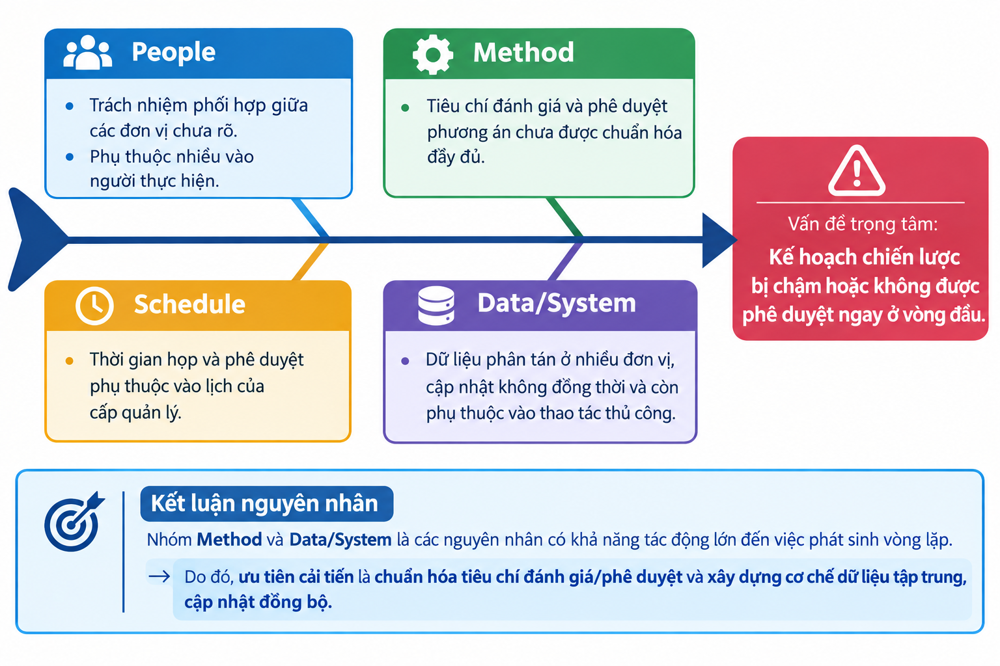

# 3.6. Quy trình quản lý: Hoạch định chiến lược kinh doanh

## 3.6.1. Mô tả quy trình

### 3.6.1.1. Mục tiêu

Quy trình hoạch định chiến lược kinh doanh nhằm chuyển hóa các thông tin và tín hiệu từ thị trường thành định hướng, mục tiêu và kế hoạch kinh doanh trung và dài hạn của doanh nghiệp. Kết quả của quy trình là kế hoạch chiến lược được Ban Điều hành và Hội đồng quản trị phê duyệt, sau đó được phân bổ thành các chỉ tiêu và kế hoạch hành động cho các Khối/Chi nhánh.

Quy trình có sự phối hợp giữa các đơn vị kinh doanh, marketing, kỹ thuật – hạ tầng, tài chính – kế toán, Ban Điều hành, Hội đồng quản trị và các Khối/Chi nhánh.

### 3.6.1.2. Các bước thực hiện

| STT | Bước thực hiện | Nội dung |
|---:|---|---|
| 1 | Xác định nhu cầu hoạch định chiến lược | Xác định thời điểm, phạm vi và nhu cầu xây dựng/cập nhật chiến lược kinh doanh dựa trên định hướng của doanh nghiệp và biến động của môi trường kinh doanh. |
| 2 | Thu thập dữ liệu thị trường viễn thông | Thu thập dữ liệu về nhu cầu thị trường, khách hàng, xu hướng ngành, chính sách và các yếu tố bên ngoài có liên quan. |
| 3 | Phân tích đối thủ cạnh tranh | Phân tích thị phần, sản phẩm/dịch vụ, chính sách giá, hoạt động kinh doanh và lợi thế cạnh tranh của các đối thủ. |
| 4 | Cung cấp dữ liệu năng lực hạ tầng | Khối Kỹ thuật & Hạ tầng cung cấp thông tin về năng lực mạng lưới, phạm vi phủ sóng, khả năng mở rộng và các giới hạn về hạ tầng. Bước này do một actor khác thực hiện nên chạy **song song** với chuỗi bước 2→3 (cùng thuộc Khối KD & Marketing, thực hiện tuần tự). Sau khi cả hai nhánh hoàn tất, dữ liệu được đối chiếu độ tin cậy (**GW0**) trước khi chuyển sang bước 5. |
| 5 | Phân tích nội bộ – SWOT | Tổng hợp dữ liệu bên ngoài và nội bộ để xác định điểm mạnh, điểm yếu, cơ hội và thách thức của doanh nghiệp. |
| 6 | Xây dựng phương án chiến lược | Xây dựng các phương án về mục tiêu, thị trường, sản phẩm/dịch vụ, tăng trưởng và định hướng nguồn lực phù hợp với kết quả phân tích. Sau khi hoàn tất, phương án được đối chiếu với năng lực hạ tầng thực tế (**GW-Hạ tầng**) trước khi chuyển sang thẩm định tài chính. |
| 7 | Thẩm định tính khả thi tài chính | Đánh giá nhu cầu nguồn lực, doanh thu, chi phí, hiệu quả và khả năng cân đối tài chính của các phương án chiến lược. |
| 8 | Hoàn thiện dự thảo kế hoạch trình Ban Điều hành | Tổng hợp các nội dung đã phân tích, hoàn thiện dự thảo kế hoạch chiến lược và chuẩn bị hồ sơ trình Ban Điều hành. |
| 9 | Ban Điều hành xem xét, góp ý, phê duyệt sơ bộ | Ban Điều hành đánh giá tính phù hợp, khả thi và nhất quán của dự thảo; trường hợp cần điều chỉnh, hồ sơ được trả lại để hoàn thiện. |
| 10 | Trình HĐQT phê duyệt chính thức | Hồ sơ sau khi được Ban Điều hành phê duyệt sơ bộ được trình Hội đồng quản trị để xem xét và phê duyệt chính thức. Nếu chưa được phê duyệt, phương án được điều chỉnh và trình lại theo yêu cầu. |
| 11 | Phân bổ chỉ tiêu xuống Khối/Chi nhánh | Sau khi chiến lược được phê duyệt chính thức, các mục tiêu và chỉ tiêu được phân bổ cho các Khối/Chi nhánh. Trước khi triển khai, ghi nhận phản hồi của các đơn vị về tính khả thi của chỉ tiêu (**GW4**). |
| 12 | Xây dựng kế hoạch hành động và theo dõi triển khai | Các Khối/Chi nhánh cụ thể hóa chỉ tiêu thành kế hoạch hành động, tổ chức triển khai và thực hiện theo dõi, báo cáo định kỳ. |

### 3.6.1.3. Tác nhân tham gia

| Tác nhân | Vai trò |
|---|---|
| Ban Điều hành | Chỉ đạo, xem xét, góp ý và phê duyệt sơ bộ kế hoạch chiến lược. |
| Khối Kinh doanh & Marketing | Chủ trì thu thập dữ liệu thị trường, phân tích đối thủ, xây dựng phương án chiến lược và tổng hợp dự thảo. |
| Khối Kỹ thuật & Hạ tầng | Cung cấp dữ liệu về năng lực và khả năng đáp ứng của hạ tầng. |
| Khối Tài chính – Kế toán | Thẩm định tính khả thi về tài chính và hiệu quả của phương án. |
| HĐQT | Xem xét và phê duyệt chính thức chiến lược kinh doanh. |
| Các Khối/Chi nhánh | Tiếp nhận chỉ tiêu, xây dựng kế hoạch hành động và triển khai thực hiện. |

### 3.6.1.4. Đối tượng nhận kết quả

Các đối tượng sử dụng kết quả trực tiếp của quy trình gồm:

- **Hội đồng quản trị:** sử dụng kế hoạch chiến lược làm cơ sở định hướng và giám sát.
- **Ban Điều hành:** sử dụng kế hoạch để điều hành và phân bổ nguồn lực.
- **Các Khối/Chi nhánh:** sử dụng chỉ tiêu và định hướng chiến lược để xây dựng kế hoạch hành động.

### 3.6.1.5. Kết quả và các trường hợp ngoại lệ

**Kịch bản thành công:**

1. Dữ liệu đầu vào đầy đủ và có độ tin cậy phù hợp.
2. Các phương án chiến lược được xây dựng dựa trên kết quả phân tích.
3. Phương án đáp ứng yêu cầu về năng lực hạ tầng và tài chính.
4. Ban Điều hành và HĐQT phê duyệt.
5. Chỉ tiêu được phân bổ rõ ràng cho các đơn vị.
6. Các Khối/Chi nhánh xây dựng kế hoạch hành động và triển khai theo dõi.

**Kịch bản ngoại lệ:**

- Dữ liệu thị trường chưa đầy đủ hoặc không đáng tin cậy → bổ sung/kiểm tra lại dữ liệu.
- Dữ liệu năng lực hạ tầng chưa đáp ứng yêu cầu → bổ sung dữ liệu từ Khối Kỹ thuật & Hạ tầng.
- Phương án không đáp ứng yêu cầu tài chính → điều chỉnh phương án chiến lược.
- Ban Điều hành yêu cầu chỉnh sửa → hoàn thiện lại dự thảo.
- HĐQT không phê duyệt hoặc yêu cầu điều chỉnh → phương án được điều chỉnh theo ý kiến phê duyệt và thực hiện lại các bước thẩm định liên quan.
- Các Khối/Chi nhánh phản hồi về tính khả thi của chỉ tiêu → xem xét và điều chỉnh việc phân bổ trước khi triển khai.

Các điểm quyết định chính của quy trình gồm:

- **Đánh giá độ tin cậy của dữ liệu.**
- **Đánh giá khả năng đáp ứng về hạ tầng.**
- **Thẩm định tính khả thi tài chính.**
- **Phê duyệt sơ bộ của Ban Điều hành.**
- **Phê duyệt chính thức của HĐQT.**
- **Đánh giá phản hồi từ các Khối/Chi nhánh.**

---

## 3.6.2. Mô hình BPMN As-is


### 3.6.2.1. Các Swimlane

Mô hình BPMN gồm 6 Swimlane:

1. **Khối/Chi nhánh**
2. **Khối Kỹ thuật & Hạ tầng**
3. **Khối Tài chính – Kế toán**
4. **Khối Kinh doanh & Marketing**
5. **Ban Điều hành**
6. **HĐQT**

### 3.6.2.2. Các hoạt động chính

BPMN thể hiện 12 hoạt động tương ứng với quy trình nghiệp vụ:

1. Xác định nhu cầu hoạch định chiến lược.
2. Thu thập dữ liệu thị trường viễn thông.
3. Phân tích đối thủ cạnh tranh.
4. Cung cấp dữ liệu năng lực hạ tầng.
5. Phân tích nội bộ – SWOT.
6. Xây dựng phương án chiến lược.
7. Thẩm định tính khả thi tài chính.
8. Hoàn thiện dự thảo kế hoạch.
9. Ban Điều hành xem xét, góp ý, phê duyệt sơ bộ.
10. HĐQT xem xét và phê duyệt chính thức.
11. Phân bổ chỉ tiêu xuống Khối/Chi nhánh.
12. Xây dựng kế hoạch hành động và theo dõi triển khai.

### 3.6.2.3. Các Gateway

Mô hình có 6 Gateway chính:

| Gateway | Điều kiện kiểm tra | Nhánh xử lý khi không đạt |
|---|---|---|
| GW0 | Dữ liệu đầu vào có đủ độ tin cậy? | Quay lại bước 2 để bổ sung/kiểm tra dữ liệu. |
| GW-Hạ tầng | Năng lực hạ tầng có đáp ứng phương án? | Quay lại bước 4 để bổ sung hoặc cập nhật dữ liệu hạ tầng. |
| GW1 | Phương án có khả thi về tài chính? | Quay lại bước 6 để điều chỉnh phương án chiến lược. |
| GW2 | Ban Điều hành có phê duyệt sơ bộ? | Quay lại bước 8 để hoàn thiện dự thảo. |
| GW3 | HĐQT có phê duyệt chính thức? | Quay lại bước 6 và thực hiện lại các bước thẩm định liên quan. |
| GW4 | Các Khối/Chi nhánh có phản hồi phù hợp? | Xem xét và điều chỉnh phân bổ tại bước 11. |

### 3.6.2.4. Luồng song song

Bước **Thu thập dữ liệu thị trường** (bước 2) và **Phân tích đối thủ cạnh tranh** (bước 3) do cùng một actor — Khối Kinh doanh & Marketing — thực hiện nên diễn ra **tuần tự** (2 → 3), không thể chạy song song với nhau trên cùng một lane.

Chuỗi tuần tự này chạy **song song** (Parallel Gateway – AND Split) với bước **Cung cấp dữ liệu năng lực hạ tầng** (bước 4), do một actor khác — Khối Kỹ thuật & Hạ tầng — đảm nhiệm.

Sau khi cả hai nhánh hoàn tất, luồng được đồng bộ (Parallel Gateway – AND Join), kèm theo kiểm tra độ tin cậy dữ liệu đầu vào (**GW0**, dạng Exclusive Gateway), trước khi thực hiện phân tích SWOT (bước 5).

Tương tự, tại hai vị trí khác trong quy trình cũng có Exclusive Gateway kiểm tra điều kiện không gắn với Split/Join:
- Sau bước 6 (Xây dựng phương án): **GW-Hạ tầng** — kiểm tra phương án có phù hợp năng lực hạ tầng hay không.
- Sau bước 11 (Phân bổ chỉ tiêu): **GW4** — kiểm tra phản hồi của Khối/Chi nhánh về tính khả thi của chỉ tiêu.

---

## 3.6.3. Phân tích định tính

### 3.6.3.1. Phân tích giá trị gia tăng

Việc phân loại hoạt động được thực hiện theo ba nhóm:

- **VA (Value Added):** hoạt động trực tiếp tạo ra giá trị cho kết quả chiến lược.
- **BVA (Business Value Added):** hoạt động cần thiết để doanh nghiệp kiểm soát, quản trị hoặc đáp ứng yêu cầu nghiệp vụ.
- **NVA (Non-Value Added):** hoạt động không tạo giá trị trực tiếp và có khả năng loại bỏ hoặc giảm thiểu.

| STT | Hoạt động | Tác nhân chính | Phân loại | Định hướng cải tiến |
|---:|---|---|---|---|
| 1 | Xác định nhu cầu hoạch định chiến lược | KD & Marketing / BĐH | BVA | Chuẩn hóa tiêu chí và lịch hoạch định. |
| 2 | Thu thập dữ liệu thị trường | KD & Marketing | VA | Tích hợp nguồn dữ liệu và chuẩn hóa biểu mẫu. |
| 3 | Phân tích đối thủ cạnh tranh | KD & Marketing | VA | Xây dựng bộ chỉ tiêu phân tích thống nhất. |
| 4 | Cung cấp dữ liệu năng lực hạ tầng | Kỹ thuật & Hạ tầng | BVA | Chuẩn hóa dữ liệu và cơ chế cập nhật. |
| 5 | Phân tích nội bộ – SWOT | KD & Marketing | VA | Chuẩn hóa khung SWOT và nguồn dữ liệu đầu vào. |
| 6 | Xây dựng phương án chiến lược | KD & Marketing | VA | Chuẩn hóa tiêu chí đánh giá phương án. |
| 7 | Thẩm định tính khả thi tài chính | Tài chính – Kế toán | BVA | Chuẩn hóa mô hình và bộ chỉ tiêu tài chính. |
| 8 | Hoàn thiện dự thảo kế hoạch | KD & Marketing | BVA | Sử dụng workflow và kiểm soát phiên bản. |
| 9 | BĐH xem xét, góp ý, phê duyệt sơ bộ | Ban Điều hành | BVA | Quy định SLA và tiêu chí phê duyệt. |
| 10 | Chờ HĐQT phê duyệt | HĐQT | NVA | Giảm thời gian chờ, chuẩn hóa lịch trình phê duyệt. |
| 11 | Phân bổ chỉ tiêu | BĐH / KD & Marketing | VA | Chuẩn hóa nguyên tắc và công thức phân bổ. |
| 12 | Xây dựng kế hoạch hành động | Khối/Chi nhánh | VA | Chuẩn hóa mẫu kế hoạch hành động. |
| 13 | Theo dõi và báo cáo định kỳ | Khối/Chi nhánh / BĐH | BVA | Tự động hóa tổng hợp và báo cáo. |

**Nhận xét:**

Các hoạt động VA tập trung chủ yếu ở quá trình phân tích, xây dựng phương án và cụ thể hóa chiến lược. Các hoạt động BVA đóng vai trò quan trọng trong kiểm soát, thẩm định và phê duyệt. Hoạt động chờ phê duyệt được xem là NVA do không trực tiếp tạo ra giá trị đầu ra và có khả năng kéo dài Cycle Time.

Hướng cải tiến trọng tâm là giảm thời gian chờ, chuẩn hóa tiêu chí đầu vào/đầu ra và tăng mức độ tích hợp dữ liệu giữa các đơn vị.

### 3.6.3.2. Phân tích lãng phí

| Nhóm lãng phí | Hoạt động gây lãng phí | Tác động | Đề xuất cải tiến |
|---|---|---|---|
| **Move** | Luân chuyển dự thảo giữa nhiều đơn vị để lấy ý kiến | Tăng thời gian và khó kiểm soát phiên bản | Sử dụng workflow điện tử và kho tài liệu dùng chung. |
| **Hold** | Chờ họp, chờ phản hồi và chờ phê duyệt | Tăng Cycle Time | Quy định SLA và lịch phê duyệt định kỳ. |
| **Overdo** | Phân tích quá sâu đối với phương án có mức độ rủi ro thấp | Tăng nguồn lực nhưng giá trị tăng thêm thấp | Phân tầng mức độ phân tích theo quy mô/rủi ro. |
| **Rework** | Chỉnh sửa dự thảo khi bị trả lại | Tăng thời gian và chi phí | Chuẩn hóa tiêu chí đầu vào và checklist trước khi trình. |
| **Over-processing** | Thu thập dữ liệu thủ công từ nhiều nguồn | Tăng thao tác và nguy cơ sai lệch | Tích hợp dữ liệu và xây dựng nguồn dữ liệu dùng chung. |

**Kết luận:** Hai nhóm cần ưu tiên xử lý là **Hold** và **Rework**, vì chúng có tác động trực tiếp đến thời gian hoàn thành quy trình. Việc chuẩn hóa tiêu chí phê duyệt và tăng tính minh bạch của dữ liệu đầu vào có thể đồng thời giảm cả thời gian chờ và số lần xử lý lại.

### 3.6.3.3. Phân tích Stakeholder

| Stakeholder | Mức ảnh hưởng | Mức quan tâm | Vai trò |
|---|---|---|---|
| HĐQT | Cao | Cao | Phê duyệt chiến lược chính thức. |
| Ban Điều hành | Cao | Cao | Điều hành và phê duyệt sơ bộ. |
| KD & Marketing | Cao | Cao | Chủ trì xây dựng chiến lược và tổng hợp kế hoạch. |
| Kỹ thuật & Hạ tầng | Trung bình – Cao | Cao | Đảm bảo phương án phù hợp với năng lực hạ tầng. |
| Tài chính – Kế toán | Cao | Cao | Kiểm soát tính khả thi và hiệu quả tài chính. |
| Khối/Chi nhánh | Trung bình | Cao | Tiếp nhận chỉ tiêu và triển khai kế hoạch. |

### 3.6.3.4. Phân tích nguyên nhân bằng Fishbone



Vấn đề trọng tâm:

> **Kế hoạch chiến lược bị chậm hoặc không được phê duyệt ngay ở vòng đầu.**

Các nhóm nguyên nhân chính:

- **People:** trách nhiệm phối hợp giữa các đơn vị chưa rõ; phụ thuộc nhiều vào người thực hiện.
- **Method:** tiêu chí đánh giá và phê duyệt phương án chưa được chuẩn hóa đầy đủ.
- **Schedule:** thời gian họp và phê duyệt phụ thuộc vào lịch của cấp quản lý.
- **Data/System:** dữ liệu phân tán ở nhiều đơn vị, cập nhật không đồng thời và còn phụ thuộc vào thao tác thủ công.

**Kết luận nguyên nhân:** Nhóm **Method** và **Data/System** là các nguyên nhân có khả năng tác động lớn đến việc phát sinh vòng lặp. Do đó, ưu tiên cải tiến là chuẩn hóa tiêu chí đánh giá/phê duyệt và xây dựng cơ chế dữ liệu tập trung, cập nhật đồng bộ.

---

### 3.6.3.6. Phương pháp phỏng vấn

Phỏng vấn được sử dụng để thu thập thông tin từ các đối tượng trực tiếp tham gia hoặc có ảnh hưởng đến quy trình hoạch định chiến lược kinh doanh. Nội dung phỏng vấn tập trung vào cách thức thực hiện quy trình hiện tại, các điểm phát sinh chờ đợi và xử lý lại, nguyên nhân gây chậm trễ, thời gian xử lý và tần suất phát sinh các trường hợp ngoại lệ.

Các nhóm đối tượng được xem xét gồm Khối Kinh doanh & Marketing, Khối Kỹ thuật & Hạ tầng, Khối Tài chính – Kế toán, Ban Điều hành và đại diện Khối/Chi nhánh.

Kết quả phỏng vấn được sử dụng làm cơ sở tham khảo cho phân tích định tính và xây dựng các tham số định lượng. Đối với các tỷ lệ và thời gian chưa có dữ liệu thống kê chính thức, kết quả được ghi nhận dưới dạng **ước tính/giả định phục vụ mô hình**, không đại diện cho số liệu thống kê chính thức của doanh nghiệp.

#### 3.6.3.6.1. Câu hỏi phỏng vấn định tính

##### a. Câu hỏi có cấu trúc

| Mã | Câu hỏi | Mục đích thu thập |
|---|---|---|
| QT01 | Quy trình hoạch định chiến lược kinh doanh hiện nay được thực hiện theo những bước chính nào? | Xác định luồng nghiệp vụ thực tế và đối chiếu với BPMN. |
| QT02 | Những tiêu chí nào được sử dụng để đánh giá mức độ đầy đủ và tin cậy của dữ liệu đầu vào? | Xác định điều kiện kiểm soát tại GW0. |
| QT03 | Những nguyên nhân phổ biến nào khiến dự thảo kế hoạch phải chỉnh sửa hoặc trình lại? | Xác định nguyên nhân phát sinh Rework. |
| QT04 | Những bước nào thường phát sinh thời gian chờ hoặc phụ thuộc vào phản hồi của đơn vị khác? | Xác định các điểm Hold và phụ thuộc liên đơn vị. |
| QT05 | Hiện nay các đơn vị phối hợp và trao đổi dữ liệu trong quá trình hoạch định chiến lược như thế nào? | Đánh giá cơ chế phối hợp, luân chuyển thông tin và vấn đề dữ liệu phân tán. |

##### b. Câu hỏi không cấu trúc

| Mã | Câu hỏi | Mục đích thu thập |
|---|---|---|
| QK01 | Theo anh/chị, điểm nào trong quy trình hiện nay gây khó khăn nhất khi thực hiện? | Khai thác vấn đề thực tế từ người trực tiếp tham gia. |
| QK02 | Anh/chị có thể mô tả một trường hợp gần đây mà kế hoạch bị trả lại hoặc phải điều chỉnh nhiều lần không? | Khai thác tình huống Rework thực tế và nguyên nhân. |
| QK03 | Theo kinh nghiệm của anh/chị, điều gì thường làm cho việc phối hợp giữa các đơn vị bị chậm? | Xác định nguyên nhân của Hold và vấn đề phối hợp. |
| QK04 | Nếu được thay đổi một điểm trong quy trình hiện tại, anh/chị sẽ ưu tiên thay đổi điểm nào và vì sao? | Xác định cơ hội cải tiến có tác động lớn. |
| QK05 | Anh/chị còn nhận thấy vấn đề nào khác trong quy trình mà phần mô tả hiện tại chưa phản ánh đầy đủ? | Phát hiện vấn đề tiềm ẩn và các ngoại lệ chưa được mô hình hóa. |

#### 3.6.3.6.2. Câu hỏi phỏng vấn định lượng

##### a. Câu hỏi có cấu trúc

| Mã | Câu hỏi | Đơn vị/Kết quả |
|---|---|---|
| QD01 | Trung bình cần bao nhiêu ngày để thu thập và hoàn thiện dữ liệu thị trường đầu vào? | Ngày |
| QD02 | Trung bình một dự thảo kế hoạch mất bao nhiêu ngày để hoàn thiện trước khi trình Ban Điều hành? | Ngày |
| QD03 | Trong một chu kỳ hoạch định, trung bình có bao nhiêu lần dự thảo phải chỉnh sửa hoặc trình lại? | Lần/chu kỳ |
| QD04 | Trung bình mất bao nhiêu ngày để Ban Điều hành và HĐQT phản hồi hoặc phê duyệt hồ sơ? | Ngày |
| QD05 | Trong các chu kỳ hoạch định gần đây, khoảng bao nhiêu phần trăm hồ sơ phải điều chỉnh tại các điểm kiểm soát? | % hồ sơ/chu kỳ |

##### b. Câu hỏi không cấu trúc

| Mã | Câu hỏi | Đơn vị/Kết quả |
|---|---|---|
| QDK01 | Anh/chị thường mất khoảng bao lâu để xử lý một lần yêu cầu bổ sung dữ liệu hoặc chỉnh sửa phương án? | Ngày/giờ |
| QDK02 | Nếu tính cả thời gian chờ phản hồi, một vòng trình lại thường kéo dài thêm bao nhiêu thời gian? | Ngày |
| QDK03 | Theo các hồ sơ anh/chị từng xử lý, số lần chỉnh sửa thường dao động trong khoảng bao nhiêu lần? | Lần/chu kỳ |
| QDK04 | Trong một chu kỳ hoạch định, khoảng bao nhiêu thời gian làm việc của đơn vị được dành cho việc tổng hợp, kiểm tra và xử lý lại dữ liệu? | Giờ/ngày |
| QDK05 | Theo kinh nghiệm của anh/chị, nếu chuẩn hóa dữ liệu và quy trình phê duyệt thì có thể giảm khoảng bao nhiêu thời gian xử lý? | Ngày hoặc % |

#### 3.6.3.6.3. Liên hệ giữa kết quả phỏng vấn và mô hình định lượng

Kết quả từ nhóm câu hỏi định lượng được sử dụng để xác định hoặc kiểm tra các tham số của mô hình, gồm thời gian xử lý từng bước, thời gian chờ, số lần xử lý lại và xác suất phát sinh vòng lặp tại các Gateway.

| Tham số trong mô hình | Câu hỏi liên quan | Cách sử dụng |
|---|---|---|
| Thời gian thu thập dữ liệu | QD01, QDK01 | Ước lượng thời gian bước 2 và thời gian bổ sung dữ liệu. |
| Thời gian hoàn thiện dự thảo | QD02 | Ước lượng thời gian bước 8. |
| Số lần chỉnh sửa/trình lại | QD03, QDK03 | Đánh giá mức độ Rework. |
| Thời gian phê duyệt | QD04, QDK02 | Ước lượng thời gian Hold tại các cấp phê duyệt. |
| Tỷ lệ hồ sơ phải điều chỉnh | QD05 | Tham khảo để xác định xác suất Gateway không đạt. |
| Thời gian xử lý Rework | QDK01, QDK02 | Ước lượng thời gian phát sinh khi một Gateway không đạt. |
| Khả năng giảm thời gian | QDK05 | Làm cơ sở đề xuất mục tiêu cải tiến. |

Các giá trị xác suất sử dụng trong phần định lượng như **10%, 20%, 30%, 15%** cần được đối chiếu với kết quả phỏng vấn hoặc dữ liệu thực tế trước khi được xem là số liệu chính thức. Trong trường hợp chưa có dữ liệu thống kê đủ lớn, các giá trị này phải được ghi rõ là **giả định mô hình**.

---

## 3.6.4. Phân tích định lượng

### 3.6.4.1. Phạm vi và giả định

Phân tích định lượng được thực hiện nhằm đánh giá ba khía cạnh chính của quy trình:

1. **Thời gian:** Cycle Time và Processing Time.
2. **Chất lượng:** khả năng hoàn thành quy trình ngay từ lần đầu và ảnh hưởng của các vòng lặp.
3. **Chi phí:** chi phí nguồn lực nhân sự tham gia quy trình.

Các xác suất phát sinh vòng lặp trong phân tích được xem là **giá trị ước tính/giả định phục vụ mô hình định lượng**, được xây dựng trên cơ sở thông tin thu thập từ phỏng vấn các đơn vị liên quan. Các giá trị này không được xem là số liệu thống kê chính thức của doanh nghiệp nếu chưa có dữ liệu log, hồ sơ lịch sử hoặc số liệu vận hành thực tế để kiểm chứng.

Đối với thời gian rework, mô hình giả định thời gian thực hiện lại tại từng Gateway được tính theo phần quy trình bị ảnh hưởng. Các xác suất và thời gian rework được sử dụng để ước tính tác động kỳ vọng của các vòng lặp.

**Lưu ý:** Cycle Time trong phần phân tích này là **Cycle Time ước tính theo mô hình rework một lần tại mỗi Gateway**, chưa xét đầy đủ khả năng một Gateway có thể tiếp tục không đạt nhiều lần liên tiếp. Khi có dữ liệu lịch sử, cần cập nhật mô hình để phản ánh số lần lặp thực tế.

---

### 3.6.4.2. Thời gian xử lý cơ bản

| STT | Hoạt động | Thời gian cơ bản (ngày) | Ghi chú |
| --- | --------- | ------------------------ | ------- |
| 1 | Xác định nhu cầu hoạch định chiến lược | 1 | |
| 2 | Thu thập dữ liệu thị trường | 5 | Thực hiện trước bước 3 (cùng actor); chuỗi 2→3 chạy song song với bước 4 |
| 3 | Phân tích đối thủ cạnh tranh | 4 | Thực hiện sau bước 2 (cùng actor); chuỗi 2→3 chạy song song với bước 4 |
| 4 | Cung cấp dữ liệu năng lực hạ tầng | 3 | Actor khác (Khối Kỹ thuật & Hạ tầng); chạy song song với chuỗi bước 2→3 |
| 5 | Phân tích nội bộ – SWOT | 3 | Thực hiện sau khi dữ liệu đầu vào hoàn tất |
| 6 | Xây dựng phương án chiến lược | 5 | |
| 7 | Thẩm định tính khả thi tài chính | 3 | |
| 8 | Hoàn thiện dự thảo kế hoạch | 2 | |
| 9 | BĐH xem xét, góp ý, phê duyệt sơ bộ | 2 | |
| 10 | HĐQT xem xét và phê duyệt chính thức | 3 | |
| 11 | Phân bổ chỉ tiêu xuống Khối/Chi nhánh | 2 | |
| 12 | Xây dựng kế hoạch hành động và theo dõi triển khai | 5 | Giả định phục vụ mô hình định lượng nếu chưa có dữ liệu thực tế |

#### Tính thời gian đối với các bước thực hiện song song

Bước 2 và bước 3 do cùng một actor (Khối Kinh doanh & Marketing) thực hiện nên diễn ra **tuần tự**: 5 + 4 = 9 ngày. Chuỗi tuần tự này chạy **song song** với bước 4 (Khối Kỹ thuật & Hạ tầng, 3 ngày, actor khác). Thời gian của nhóm bước này được xác định theo nhánh dài nhất:

```math
T_{2-4}=MAX(5+4,\ 3)=MAX(9,3)=9\text{ ngày}
```

Thời gian xử lý cơ bản của toàn bộ quy trình được xác định:

```math
T_{base} =1+9+3+5+3+2+2+3+2+5
```

```math
\boxed{T_{base}=35\text{ ngày}}
```

Như vậy, trong điều kiện không phát sinh vòng lặp hoặc yêu cầu thực hiện lại, quy trình cần khoảng **35 ngày** theo các giả định về thời gian nêu trên.

---

### 3.6.4.3. Xác suất phát sinh vòng lặp

Các Gateway được xác định là các điểm có khả năng phát sinh yêu cầu điều chỉnh hoặc thực hiện lại một phần quy trình.

| Gateway | Xác suất không đạt | Luồng quay lại |
| ------- | ------------------- | --------------- |
| GW0 – Độ tin cậy dữ liệu | 10% | Quay lại bước 2 |
| GW-Hạ tầng | 10% | Quay lại bước 4 |
| GW1 – Tính khả thi tài chính | 20% | Quay lại bước 6 |
| GW2 – BĐH phê duyệt sơ bộ | 30% | Quay lại bước 8 |
| GW3 – HĐQT phê duyệt | 15% | Quay lại bước 6 và thực hiện lại các bước thẩm định liên quan |
| GW4 – Phản hồi Khối/Chi nhánh | 10% | Quay lại bước 11 |

Các xác suất trên được hiểu là **xác suất không đạt có điều kiện tại Gateway tương ứng**, với điều kiện quy trình đã đến điểm kiểm soát đó.

---

### 3.6.4.4. Tính thời gian kỳ vọng do vòng lặp

Để ước tính tác động của các vòng lặp, thời gian phát sinh kỳ vọng tại từng Gateway được tính theo:

```math
E(T_{rework})=P(failure)\times T_{rework}
```

Trong đó:

- `P(failure)`: xác suất không đạt tại Gateway;
- `T_{rework}`: thời gian cần thiết để thực hiện lại phần quy trình bị ảnh hưởng.

Kết quả tính toán:

| Gateway | P(failure) | Phần thời gian cần thực hiện lại (ngày) | Thời gian kỳ vọng (ngày) |
| ------- | ---------- | ---------------------------------------- | -------------------------- |
| GW0 | 0,10 | 5 | 0,50 |
| GW-Hạ tầng | 0,10 | 3 | 0,30 |
| GW1 | 0,20 | 5 | 1,00 |
| GW2 | 0,30 | 2 | 0,60 |
| GW3 | 0,15 | 13 | 1,95 |
| GW4 | 0,10 | 2 | 0,20 |
| **Tổng** | | | **4,55** |

Đối với **GW3**, thời gian 13 ngày được sử dụng để đại diện cho việc điều chỉnh phương án, thẩm định tài chính và hoàn thiện hồ sơ trước khi trình lại. Đây là giả định phục vụ mô hình và cần được thay thế bằng dữ liệu thực tế khi có đủ số liệu lịch sử.

Tổng thời gian rework kỳ vọng:

```math
E(T_{rework}) =0,50+0,30+1,00+0,60+1,95+0,20
```

```math
\boxed{E(T_{rework})=4,55\text{ ngày}}
```

Theo mô hình rework một lần tại mỗi Gateway:

```math
T_{cycle}^{ước\ tính}=T_{base}+E(T_{rework})
```

```math
T_{cycle}^{ước\ tính}=35+4,55
```

```math
\boxed{T_{cycle}^{ước\ tính}=39,55\text{ ngày}}
```

Như vậy, theo các giả định của mô hình, vòng lặp tại các điểm kiểm soát làm tăng khoảng **4,55 ngày** so với thời gian xử lý cơ bản.

**Lưu ý:** Giá trị 39,55 ngày là **Cycle Time ước tính theo mô hình hiện tại**, trong đó mỗi Gateway được giả định phát sinh tối đa một lần rework. Nếu một Gateway có thể phát sinh nhiều vòng lặp liên tiếp, Cycle Time kỳ vọng thực tế có thể cao hơn. Khi có dữ liệu lịch sử, cần cập nhật xác suất và số lần lặp để tính toán chính xác hơn.

---

### 3.6.4.5. Processing Time và Process Efficiency

Trong phân tích hiện tại, Cycle Time bao gồm cả thời gian xử lý nghiệp vụ và thời gian chờ tại các điểm kiểm soát.

Giả định tổng thời gian chờ có thể xác định và loại trừ khỏi Cycle Time là **3 ngày**. Với giả định 3 ngày này đã nằm trong Cycle Time ước tính 39,55 ngày, Processing Time được xác định:

```math
T_{processing}=T_{cycle}-T_{waiting}
```

```math
T_{processing}=39,55-3
```

```math
\boxed{T_{processing}=36,55\text{ ngày}}
```

Hiệu suất quy trình được xác định:

```math
Process\ Efficiency =\frac{T_{processing}}{T_{cycle}}\times100\%
```

```math
Process\ Efficiency =\frac{36,55}{39,55}\times100\%
```

```math
\boxed{Process\ Efficiency\approx92,42\%}
```

Theo mô hình, khoảng **92,42% Cycle Time** được sử dụng cho thời gian xử lý, trong khi khoảng **7,58%** là thời gian chờ giả định.

**Lưu ý:** Giá trị 3 ngày chờ cần được kiểm chứng và tách biệt rõ với thời gian xử lý thực tế. Nếu 3 ngày chờ chưa được bao gồm trong Cycle Time 39,55 ngày mà là thời gian bổ sung, cần tính lại cả Cycle Time và Process Efficiency.

---

### 3.6.4.6. Phân tích chất lượng – First Pass Yield

First Pass Yield (FPY) được sử dụng để đánh giá khả năng một chu kỳ đi qua toàn bộ các điểm kiểm soát mà **không phát sinh vòng lặp hoặc yêu cầu thực hiện lại**.

Xác suất vượt qua từng Gateway mà không phát sinh vòng lặp:

| Gateway | Xác suất đạt |
| ------- | -------------- |
| GW0 | 90% |
| GW-Hạ tầng | 90% |
| GW1 | 80% |
| GW2 | 70% |
| GW3 | 85% |
| GW4 | 90% |

Theo mô hình giả định, xác suất một chu kỳ vượt qua toàn bộ các điểm kiểm soát mà không phát sinh vòng lặp được tính:

```math
FPY =0,90\times0,90\times0,80\times0,70\times0,85\times0,90
```

```math
FPY=0,347004
```

```math
\boxed{FPY\approx34,7\%}
```

Theo mô hình giả định, xác suất một chu kỳ hoàn thành toàn bộ quy trình mà không phát sinh vòng lặp là khoảng **34,7%**.

Trong các Gateway được mô hình hóa:

- **GW2 – BĐH phê duyệt sơ bộ** có xác suất không đạt cao nhất: **30%**;
- **GW1 – thẩm định tính khả thi tài chính** có xác suất không đạt: **20%**;
- GW3 – HĐQT phê duyệt có xác suất không đạt: **15%**.

Do đó, GW2 và GW1 là hai điểm kiểm soát cần được ưu tiên xem xét khi phân tích nguyên nhân và đề xuất giải pháp cải tiến.

**Lưu ý:** FPY 34,7% là kết quả tính toán từ các xác suất giả định của mô hình, không phải tỷ lệ FPY thực tế của doanh nghiệp. Kết quả cần được cập nhật khi có dữ liệu lịch sử về số lượng hồ sơ, số lần trả lại và nguyên nhân trả lại tại từng Gateway.

---

### 3.6.4.7. Phân tích chi phí

Chi phí nguồn lực nhân sự được tính theo công thức:

```math
Cost=\sum_i(Time_i\times Cost/day_i)
```

Trong đó:

- `Time_i`: tổng thời gian tham gia của nhóm nguồn lực `i`;
- `Cost/day_i`: chi phí nhân sự giả định của nhóm nguồn lực `i`.

Mức chi phí ngày giả định:

| Nhóm nguồn lực | Chi phí nhân sự/ngày |
| --------------- | ---------------------- |
| Kinh doanh & Marketing | 700.000 VNĐ |
| Kỹ thuật & Hạ tầng | 700.000 VNĐ |
| Tài chính – Kế toán | 700.000 VNĐ |
| Ban Điều hành/HĐQT | 2.000.000 VNĐ |

#### a) Chi phí cơ bản

Phân bổ thời gian tham gia theo các bước hiện tại:

| Nhóm | Các bước | Tổng thời gian (ngày) |
| ---- | -------- | ----------------------- |
| KD & Marketing | 2, 3, 5, 6, 8 | 5 + 4 + 3 + 5 + 2 = **19** |
| Kỹ thuật & Hạ tầng | 4 | **3** |
| Tài chính – Kế toán | 7 | **3** |
| Ban Điều hành | 1, 9, 11 | 1 + 2 + 2 = **5** |
| Ban Điều hành/HĐQT | 10 | **3** |

Chi phí cơ bản:

**Kinh doanh & Marketing:**

```math
19\times700.000=13.300.000\text{ VNĐ}
```

**Kỹ thuật & Hạ tầng:**

```math
3\times700.000=2.100.000\text{ VNĐ}
```

**Tài chính – Kế toán:**

```math
3\times700.000=2.100.000\text{ VNĐ}
```

**Ban Điều hành:**

```math
5\times2.000.000=10.000.000\text{ VNĐ}
```

**Bước 10 – Ban Điều hành/HĐQT:**

```math
3\times2.000.000=6.000.000\text{ VNĐ}
```

Tổng chi phí cơ bản:

```math
C_{base}=13,3+2,1+2,1+10+6
```

```math
\boxed{C_{base}=33,5\text{ triệu VNĐ}}
```

#### b) Chi phí kỳ vọng do rework

Chi phí rework kỳ vọng được tính theo:

```math
E(Cost_{rework}) =P(failure)\times T_{rework}\times Cost/day
```

Theo các giả định về Gateway và nhóm nguồn lực chịu trách nhiệm chính:

| Gateway | Tính toán | Chi phí kỳ vọng |
| ------- | --------- | ----------------- |
| GW0 | 10% × 5 × 0,7 | 0,35 triệu VNĐ |
| GW-Hạ tầng | 10% × 3 × 0,7 | 0,21 triệu VNĐ |
| GW1 | 20% × 5 × 0,7 | 0,70 triệu VNĐ |
| GW2 | 30% × 2 × 2,0 | 1,20 triệu VNĐ |
| GW3 | 15% × 13 × 2,0 | 3,90 triệu VNĐ |
| GW4 | 10% × 2 × 2,0 | 0,40 triệu VNĐ |
| **Tổng** | | **6,76 triệu VNĐ** |

Do đó:

```math
E(Cost_{total}) =C_{base}+E(Cost_{rework})
```

```math
E(Cost_{total})=33,5+6,76
```

```math
\boxed{E(Cost_{total})=40,26\text{ triệu VNĐ}}
```

Theo mô hình giả định, chi phí nguồn lực cho một chu kỳ, bao gồm chi phí cơ bản và chi phí rework kỳ vọng, khoảng **40,26 triệu VNĐ**.

Trong đó, chi phí rework kỳ vọng là:

```math
\frac{6,76}{40,26}\times100\% \approx16,79\%
```

Như vậy, theo mô hình, chi phí phát sinh do các vòng lặp chiếm khoảng **16,79% tổng chi phí kỳ vọng**.

**Lưu ý:** Chi phí 40,26 triệu VNĐ là kết quả của mô hình giả định. Khi có dữ liệu thực tế về thời gian tham gia của từng nhóm nhân sự, số lần rework và chi phí nhân sự, cần thay thế các tham số tương ứng để cập nhật kết quả.

---

### 3.6.4.8. Tổng hợp kết quả định lượng

| Chỉ tiêu | Kết quả mô hình | Ý nghĩa |
| -------- | ------------------ | -------- |
| Thời gian xử lý cơ bản | **35 ngày** | Thời gian nếu không phát sinh vòng lặp (đã tính bước 2→3 tuần tự song song với bước 4) |
| Thời gian vòng lặp kỳ vọng | **4,55 ngày** | Thời gian tăng thêm do các điểm kiểm soát không đạt theo mô hình rework một lần |
| **Cycle Time ước tính** | **39,55 ngày** | Thời gian ước tính để hoàn thành một chu kỳ, bao gồm tác động của rework |
| **Processing Time** | **36,55 ngày** | Thời gian xử lý sau khi loại 3 ngày chờ giả định |
| **Process Efficiency** | **92,42%** | Tỷ lệ thời gian xử lý trên Cycle Time |
| **FPY** | **34,7%** | Xác suất hoàn thành toàn bộ quy trình mà không phát sinh vòng lặp |
| Chi phí cơ bản | **33,50 triệu VNĐ** | Chi phí nguồn lực trong điều kiện không phát sinh rework |
| Chi phí rework kỳ vọng | **6,76 triệu VNĐ** | Chi phí tăng thêm do các vòng lặp theo mô hình |
| **Chi phí kỳ vọng** | **≈ 40,26 triệu VNĐ** | Chi phí nguồn lực cho một chu kỳ theo các giả định |

### 3.6.4.9. Nhận xét kết quả định lượng

Kết quả mô hình cho thấy thời gian xử lý cơ bản của quy trình là **35 ngày** (trong đó chuỗi bước 2→3 do cùng một actor thực hiện tuần tự — 9 ngày — được tính song song với bước 4 do actor khác đảm nhiệm — 3 ngày). Khi tính đến tác động của các vòng lặp tại các điểm kiểm soát, thời gian tăng thêm kỳ vọng khoảng **4,55 ngày**, đưa Cycle Time ước tính lên khoảng **39,55 ngày**.

Về chất lượng, **FPY đạt khoảng 34,7%**, cho thấy theo các xác suất giả định, khả năng hoàn thành toàn bộ quy trình ngay từ lần đầu còn hạn chế. Điểm cần ưu tiên xem xét là **GW2 – phê duyệt sơ bộ của BĐH**, có xác suất không đạt giả định cao nhất là **30%**, tiếp theo là **GW1 – thẩm định tính khả thi tài chính**, với xác suất không đạt **20%**.

Về chi phí, chi phí cơ bản tính theo tổng số ngày công thực tế của từng nhóm nguồn lực (không phụ thuộc thời gian lịch song song), ước tính khoảng **33,50 triệu VNĐ/chu kỳ**. Khi tính thêm chi phí rework kỳ vọng khoảng **6,76 triệu VNĐ**, tổng chi phí kỳ vọng đạt khoảng **40,26 triệu VNĐ/chu kỳ**. Chi phí rework chiếm khoảng **16,79% tổng chi phí kỳ vọng**, cho thấy việc giảm số vòng lặp không chỉ có ý nghĩa về thời gian mà còn có khả năng giảm chi phí nguồn lực.

Các kết quả trên được xây dựng từ các giả định về thời gian, xác suất và chi phí nhân sự. Vì vậy, kết quả nên được sử dụng làm **cơ sở định lượng ban đầu để xác định điểm nghẽn và ưu tiên cải tiến**, thay vì được xem là số liệu thống kê chính thức của doanh nghiệp. Khi có dữ liệu vận hành thực tế, cần cập nhật lại các tham số và thực hiện tính toán lại.

---

## 3.6.5. Kết luận quy trình

Quy trình hoạch định chiến lược kinh doanh đã được mô hình hóa từ giai đoạn xác định nhu cầu, thu thập và phân tích dữ liệu, xây dựng phương án, thẩm định, phê duyệt đến phân bổ chỉ tiêu và triển khai kế hoạch hành động.

Phân tích định tính cho thấy các điểm cần ưu tiên cải tiến là thời gian chờ phê duyệt, xử lý lại hồ sơ và thu thập dữ liệu phân tán. Phân tích định lượng cho thấy các vòng lặp tại các Gateway có ảnh hưởng trực tiếp đến Cycle Time, FPY và chi phí của quy trình.

Do đó, hướng cải tiến trọng tâm là **chuẩn hóa dữ liệu và tiêu chí đánh giá, giảm thời gian chờ, hạn chế xử lý lại và tăng mức độ số hóa trong luồng phê duyệt**. Các tham số định lượng trong mô hình cần được cập nhật bằng dữ liệu thực tế khi doanh nghiệp cung cấp log, hồ sơ lịch sử hoặc kết quả đo lường quy trình.
