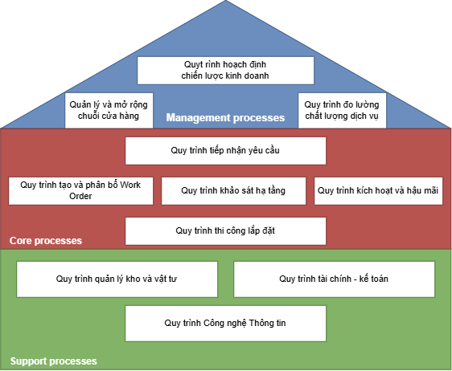
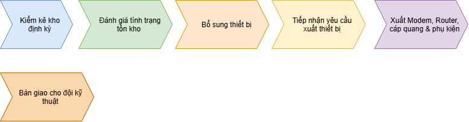
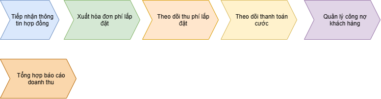
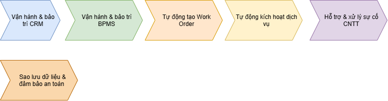

# **CHƯƠNG 2. HỆ THỐNG QUY TRÌNH NGHIỆP VỤ TẠI FPT TELECOM**

## **2.1. Kiến trúc quy trình nghiệp vụ tổng quan**

Để đảm bảo hoạt động hiệu quả trong việc cung cấp dịch vụ viễn thông và Internet đến khách hàng, FPT Telecom xây dựng hệ thống quy trình nghiệp vụ chặt chẽ, bao gồm các hoạt động từ tiếp nhận nhu cầu, vận hành kỹ thuật đến chăm sóc sau bán hàng. Mô hình quản lý này giúp công ty tối ưu hóa trải nghiệm khách hàng, duy trì lợi thế cạnh tranh và phát triển bền vững. Các quy trình của FPT Telecom được phân thành ba nhóm chính: **Quản lý (Management)**, **Cốt lõi (Core)** và **Hỗ trợ (Support)**.

_Hình 2.1. Kiến trúc nghiệp vụ FPT Telecom — phân nhóm Quản lý / Cốt lõi / Hỗ trợ_

## **2.2. Nhóm quy trình Quản lý (Management Processes)**

Nhóm quy trình quản lý tập trung vào việc định hướng phát triển dài hạn, đảm bảo công ty có chiến lược kinh doanh và quản trị hiệu quả.

### **2.2.1. Quy trình hoạch định chiến lược kinh doanh**

**Mô tả luồng:**
1. Phân tích thị trường để xác định cơ hội và thách thức.
2. Xây dựng kế hoạch kinh doanh dựa trên phân tích.
3. Hội đồng quản trị xem xét và phê duyệt. Nếu chưa duyệt → điều chỉnh và quay lại bước 2.
4. Triển khai chiến lược đã được phê duyệt.
5. Theo dõi và đánh giá hiệu quả triển khai.

### **2.2.2. Quy trình quản lý và mở rộng hạ tầng**

**Mô tả luồng:**
1. Khảo sát nhu cầu sử dụng dịch vụ theo vùng.
2. Đánh giá tình trạng cáp quang và Port hiện có.
3. Nếu không cần mở rộng → duy trì hiện trạng.
4. Nếu cần mở rộng → lập dự án đầu tư → triển khai thi công → nghiệm thu hạ tầng.

### **2.2.3. Quy trình đo lường chất lượng dịch vụ (NPS/KPI)**

**Mô tả luồng:**
1. Sau khi khách hàng hoàn tất lắp đặt, tổng đài gọi điện khảo sát.
2. Thu thập điểm NPS (Net Promoter Score).
3. Nếu không đạt ngưỡng → phân tích nguyên nhân → điều chỉnh quy trình.
4. Nếu đạt ngưỡng → tổng hợp báo cáo KPI.

## **2.3. Nhóm quy trình Cốt lõi (Core Processes)**

Nhóm quy trình quan trọng nhất, liên quan trực tiếp đến hoạt động cung cấp dịch vụ lắp đặt Internet cho khách hàng.

### **2.3.1. Quy trình tiếp nhận yêu cầu và ký hợp đồng**

**Mô tả luồng:**
1. Khách hàng có nhu cầu đăng ký dịch vụ Internet qua 1 trong 4 kênh: Website, Hotline, Cửa hàng FPT, hoặc Nhân viên Sales.
2. Nhân viên kinh doanh (Sales) liên hệ khách hàng để xác nhận thông tin.
3. Tư vấn gói cước và các chương trình khuyến mãi.
4. Thu thập giấy tờ cần thiết từ khách hàng.
5. Thực hiện ký kết hợp đồng điện tử hoặc hợp đồng giấy.

### **2.3.2. Quy trình khảo sát hạ tầng và điều phối (Work Order)**

**Mô tả luồng:**
1. Kỹ thuật viên tiếp nhận yêu cầu từ hệ thống.
2. Kiểm tra tình trạng hạ tầng cáp quang tại khu vực lắp đặt và số lượng cổng kết nối (Port) khả dụng.
3. Nếu không đủ điều kiện → thông báo cho khách hàng và kết thúc.
4. Nếu đủ điều kiện, hệ thống BPMS/CRM tiếp nhận dữ liệu hợp đồng và tự động sinh Work Order (đơn lắp đặt).
5. Phân công Work Order cho đội kỹ thuật phụ trách khu vực.
6. Kho vật tư chuẩn bị thiết bị (Modem, cáp quang, phụ kiện).

### **2.3.3. Quy trình thi công lắp đặt và kích hoạt dịch vụ**

**Mô tả luồng:**
1. Kỹ thuật viên liên hệ khách hàng xác nhận lịch và di chuyển đến địa điểm lắp đặt.
2. Kéo cáp quang từ hộp phối đến vị trí khách hàng, hàn nối với Modem/ONT và lắp đặt thiết bị.
3. Cấu hình Wi-Fi và kiểm tra tín hiệu Internet.
4. Nghiệm thu: Nếu chưa đạt → khắc phục sự cố; Nếu đạt → khách hàng ký xác nhận.
5. Kỹ thuật viên cập nhật trạng thái Work Order. Hệ thống tự động kích hoạt tài khoản Internet và gửi SMS/Email xác nhận.
6. Khách hàng xác nhận, bắt đầu sử dụng. Tổng đài sau đó sẽ gọi khảo sát hài lòng.

## **2.4. Nhóm quy trình Hỗ trợ (Support Processes)**

Nhóm quy trình giúp đảm bảo vận hành trơn tru, hỗ trợ các quy trình cốt lõi hoạt động hiệu quả.

### **2.4.1. Quy trình quản lý kho và vật tư**

**Mô tả luồng:**
1. Kho thực hiện kiểm kê định kỳ. Nếu tồn kho không đủ → đặt hàng nhà cung cấp → nhập kho thiết bị mới.
2. Kho tiếp nhận yêu cầu xuất thiết bị từ đội kỹ thuật.
3. Xuất Modem, Router, cáp quang, phụ kiện.
4. Bàn giao thiết bị cho đội kỹ thuật để triển khai lắp đặt.

### **2.4.2. Quy trình tài chính - kế toán**

**Mô tả luồng:**
1. Bộ phận kế toán tiếp nhận thông tin hợp đồng từ hệ thống CRM.
2. Xuất hóa đơn phí lắp đặt ban đầu cho khách hàng và theo dõi thu phí.
3. Theo dõi thanh toán cước hàng tháng.
4. Nếu khách hàng thanh toán quá hạn → nhắc nợ và xử lý.
5. Cuối kỳ, tổng hợp báo cáo doanh thu cho Ban lãnh đạo.

### **2.4.3. Quy trình Công nghệ Thông tin (CRM/BPMS)**

**Mô tả luồng:**
1. Vận hành và bảo trì hệ thống CRM và BPMS.
2. Tự động hóa việc tạo Work Order khi có hợp đồng mới và kích hoạt dịch vụ khi hoàn tất.
3. Xử lý sự cố kỹ thuật CNTT khi phát sinh.
4. Sao lưu dữ liệu định kỳ và đảm bảo an toàn bảo mật.
