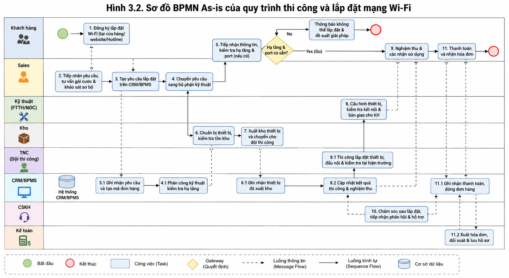

# 3.2. Quy trình cốt lõi 1: Thi công và lắp đặt mạng Wi-Fi

## 3.2.1. Mô tả quy trình

### 3.2.1.1. Mục tiêu của quy trình

Quy trình thi công và lắp đặt mạng Wi-Fi của FPT Telecom nhằm chuyển đổi nhu cầu đăng ký dịch vụ Internet của khách hàng thành một kết nối Internet hoàn chỉnh tại địa điểm sử dụng.

Quy trình bao gồm các hoạt động từ tiếp nhận nhu cầu, kiểm tra khả năng cung cấp dịch vụ, tư vấn và ký hợp đồng, tạo đơn lắp đặt, chuẩn bị thiết bị, thi công, nghiệm thu, kích hoạt dịch vụ và chăm sóc khách hàng sau bán hàng.

Quy trình hiện tại gồm **11 bước**:

1. Khách hàng có nhu cầu.
2. Tiếp nhận yêu cầu.
3. Kiểm tra khả năng cung cấp dịch vụ.
4. Tư vấn và ký hợp đồng.
5. Tạo đơn lắp đặt.
6. Chuẩn bị thiết bị.
7. Kỹ thuật viên liên hệ khách hàng.
8. Tiến hành lắp đặt.
9. Nghiệm thu.
10. Kích hoạt dịch vụ.
11. Chăm sóc sau bán hàng.

### 3.2.1.2. Actor tham gia

| Actor/Bên tham gia | Vai trò trong quy trình |
|---|---|
| **Khách hàng** | Phát sinh nhu cầu, cung cấp thông tin/giấy tờ, lựa chọn gói cước, xác nhận lịch lắp đặt, nghiệm thu và xác nhận sử dụng dịch vụ. |
| **Nhân viên kinh doanh (Sales)** | Tiếp nhận nhu cầu, tư vấn gói cước, thu thập thông tin, thực hiện hợp đồng và đặt lịch lắp đặt. |
| **Bộ phận kỹ thuật khảo sát** | Kiểm tra hạ tầng cáp quang và khả năng còn port để xác định khả năng cung cấp dịch vụ. |
| **Kho & Vật tư** | Chuẩn bị và xuất Modem/ONT, Router Wi-Fi, dây cáp quang và phụ kiện lắp đặt. |
| **Kỹ thuật viên lắp đặt (TNC)** | Liên hệ khách hàng, di chuyển đến địa điểm, kéo cáp, hàn nối, lắp modem, cấu hình Wi-Fi, kiểm tra tín hiệu và thực hiện nghiệm thu. |
| **CRM/BPMS** | Quản lý dữ liệu, tạo Work Order, phân công đội kỹ thuật và kích hoạt tài khoản Internet. |
| **CSKH/Tổng đài** | Khảo sát mức độ hài lòng, tiếp nhận phản hồi và hỗ trợ kỹ thuật sau lắp đặt. |
| **Kế toán** | Xử lý khoản phí lắp đặt/cước ban đầu nếu phát sinh. |

### 3.2.1.3. Khách hàng mục tiêu

Khách hàng mục tiêu của quy trình là các cá nhân, hộ gia đình hoặc khách hàng có nhu cầu đăng ký và sử dụng dịch vụ Internet/Wi-Fi của FPT Telecom tại một địa điểm cụ thể.

Khách hàng có thể bắt đầu quy trình thông qua:

- Website.
- Hotline.
- Cửa hàng giao dịch FPT Telecom.
- Nhân viên kinh doanh.

### 3.2.1.4. Kịch bản thành công

Quy trình được xem là thành công khi:

1. Khách hàng đăng ký sử dụng dịch vụ.
2. Thông tin khách hàng và địa chỉ lắp đặt được tiếp nhận đầy đủ.
3. Địa điểm đáp ứng điều kiện hạ tầng và còn port để cung cấp dịch vụ.
4. Khách hàng hoàn tất thủ tục và ký hợp đồng.
5. Hệ thống tạo Work Order và phân công cho đội kỹ thuật.
6. Thiết bị và vật tư cần thiết được chuẩn bị.
7. Kỹ thuật viên liên hệ và đến đúng địa điểm.
8. Hệ thống cáp quang và thiết bị Wi-Fi được lắp đặt, cấu hình.
9. Tín hiệu Internet được kiểm tra đạt yêu cầu.
10. Khách hàng nghiệm thu và xác nhận hoàn thành.
11. Dịch vụ được kích hoạt trên hệ thống.
12. Khách hàng nhận thông báo và bắt đầu sử dụng dịch vụ.
13. CSKH thực hiện khảo sát và hỗ trợ sau bán hàng.

### 3.2.1.5. Kịch bản thất bại

Quy trình có thể kết thúc không thành công hoặc phải xử lý lại trong một số trường hợp:

- Khu vực khách hàng **chưa có hạ tầng cáp quang**.
- Khu vực đã có hạ tầng nhưng **không còn port kết nối**.
- Khách hàng không cung cấp đủ thông tin hoặc giấy tờ cần thiết.
- Khách hàng không thống nhất được thời gian lắp đặt.
- Phát sinh vấn đề trong quá trình thi công.
- Tín hiệu Internet sau lắp đặt không đạt yêu cầu.
- Khách hàng không xác nhận nghiệm thu.
- Phát sinh vấn đề về phí lắp đặt hoặc thanh toán.

Trong đó, **bước 3 - Kiểm tra khả năng cung cấp dịch vụ** là điểm quyết định **Go/No-Go**. Nếu không đủ điều kiện thì thông báo khách hàng và kết thúc quy trình; nếu đủ điều kiện thì tiếp tục sang bước tiếp theo.

---

## 3.2.2. Mô hình hóa quy trình hiện tại (Sơ đồ BPMN - As-is)

### 3.2.2.1. Sơ đồ BPMN

> **Hình 3.2. Sơ đồ BPMN As-is của quy trình thi công và lắp đặt mạng Wi-Fi**

### 3.2.2.2. Các tác nhân/Swimlane trong BPMN

Sơ đồ BPMN nên được tổ chức thành các swimlane tương ứng với các bên tham gia:

1. **Khách hàng**
2. **Nhân viên kinh doanh (Sales)**
3. **Bộ phận kỹ thuật khảo sát**
4. **CRM/BPMS**
5. **Kho & Vật tư**
6. **Kỹ thuật viên lắp đặt**
7. **CSKH/Tổng đài**
8. **Kế toán**

### 3.2.2.3. Luồng quy trình As-is

#### Giai đoạn 1: Tiếp nhận và kiểm tra nhu cầu

**Khách hàng:**

`Phát sinh nhu cầu → Liên hệ Website/Hotline/Cửa hàng/Sales → Cung cấp thông tin`

**Sales:**

`Tiếp nhận yêu cầu → Ghi nhận thông tin khách hàng → Tư vấn gói cước`

**Kỹ thuật khảo sát:**

`Nhận yêu cầu → Kiểm tra hạ tầng cáp quang → Kiểm tra port`

**Gateway: Đủ điều kiện cung cấp dịch vụ?**

- **Không:** Thông báo khách hàng → **Kết thúc quy trình**.
- **Có:** Tiếp tục tư vấn và ký hợp đồng.

#### Giai đoạn 2: Chốt đơn và tạo đơn lắp đặt

**Sales + Khách hàng:**

`Tư vấn gói cước → Khách hàng cung cấp giấy tờ → Ký hợp đồng`

**CRM/BPMS:**

`Tạo Work Order → Phân công đội kỹ thuật`

#### Giai đoạn 3: Chuẩn bị và triển khai lắp đặt

**Kho & Vật tư:**

`Chuẩn bị Modem/ONT → Chuẩn bị Router Wi-Fi → Chuẩn bị dây cáp quang → Chuẩn bị phụ kiện → Xuất vật tư`

**Kỹ thuật viên:**

`Nhận Work Order → Liên hệ khách hàng → Xác nhận thời gian/địa điểm → Di chuyển → Kéo cáp quang → Hàn nối cáp → Lắp modem → Cấu hình Wi-Fi → Kiểm tra tín hiệu`

#### Giai đoạn 4: Nghiệm thu và hoàn tất

**Khách hàng + Kỹ thuật viên:**

`Kiểm tra Internet/Wi-Fi → Nghiệm thu → Ký xác nhận hoàn thành`

**CRM/BPMS:**

`Cập nhật trạng thái → Kích hoạt tài khoản Internet → Gửi SMS/Email xác nhận`

**CSKH:**

`Gọi khảo sát mức độ hài lòng → Hỗ trợ kỹ thuật khi cần → Kết thúc`

---

## 3.2.3. Phân tích định tính

### 3.2.3.1. Phân tích giá trị gia tăng

Phân tích giá trị gia tăng được chia thành ba nhóm:

- **VA (Value Added):** Hoạt động trực tiếp tạo ra giá trị mà khách hàng cần.
- **BVA (Business Value Added):** Hoạt động không trực tiếp tạo ra giá trị đối với khách hàng nhưng cần thiết đối với doanh nghiệp để kiểm soát, hỗ trợ hoặc hoàn tất quy trình.
- **NVA (Non-Value Added):** Hoạt động không tạo giá trị cho khách hàng và không thực sự cần thiết đối với doanh nghiệp; cần ưu tiên loại bỏ hoặc giảm thiểu.

#### Bảng phân loại VA/BVA/NVA

| Hoạt động | Phân loại | Giải thích |
|---|---|---|
| Tiếp nhận nhu cầu khách hàng | **BVA** | Cần thiết để khởi tạo quy trình nhưng chưa trực tiếp tạo ra kết nối Internet. |
| Tư vấn và lựa chọn gói cước | **VA** | Giúp khách hàng lựa chọn dịch vụ phù hợp với nhu cầu sử dụng. |
| Kiểm tra hạ tầng và port | **BVA** | Không trực tiếp tạo ra kết nối nhưng cần thiết để xác định khả năng triển khai. |
| Ký hợp đồng | **BVA** | Tạo cơ sở pháp lý cho việc cung cấp dịch vụ. |
| Tạo Work Order | **BVA** | Cần thiết để điều phối và kiểm soát đơn lắp đặt. |
| Chuẩn bị thiết bị | **BVA** | Cần thiết để bảo đảm đủ nguồn lực cho thi công. |
| Hẹn khách hàng | **BVA** | Cần thiết để phối hợp thời gian giữa khách hàng và kỹ thuật viên. |
| Di chuyển đến địa điểm | **NVA tiềm năng** | Không trực tiếp tạo thêm giá trị cho dịch vụ đối với khách hàng; tuy nhiên hiện tại cần thiết để thực hiện thi công tại hiện trường. |
| Kéo cáp quang | **VA** | Trực tiếp tạo ra đường truyền vật lý phục vụ kết nối Internet. |
| Hàn nối cáp | **VA** | Trực tiếp hoàn thiện kết nối vật lý của đường truyền. |
| Lắp modem/ONT | **VA** | Tạo điều kiện để khách hàng sử dụng dịch vụ Internet. |
| Cấu hình Wi-Fi | **VA** | Trực tiếp tạo khả năng sử dụng mạng Wi-Fi. |
| Kiểm tra tín hiệu | **BVA** | Bảo đảm chất lượng dịch vụ trước khi bàn giao. |
| Nghiệm thu | **BVA** | Xác nhận dịch vụ đã được hoàn thành và đáp ứng yêu cầu. |
| Kích hoạt dịch vụ | **VA** | Hoàn thiện khả năng sử dụng dịch vụ của khách hàng. |
| Gửi SMS/Email xác nhận | **BVA** | Cung cấp thông tin xác nhận trạng thái dịch vụ. |
| Khảo sát mức độ hài lòng | **BVA** | Phục vụ đo lường và cải thiện chất lượng dịch vụ. |

#### Nhận xét

Các hoạt động tạo giá trị trực tiếp tập trung chủ yếu ở giai đoạn thi công và hoàn tất dịch vụ, gồm kéo cáp, hàn nối cáp, lắp modem/ONT, cấu hình Wi-Fi và kích hoạt dịch vụ.

Các hoạt động BVA chiếm số lượng lớn vì quy trình cần kiểm soát hạ tầng, hợp đồng, điều phối nguồn lực, kiểm tra chất lượng và quản lý trạng thái đơn hàng.

Đối với NVA, hai tài liệu nguồn chưa cung cấp số liệu thực tế đủ để khẳng định có hoạt động NVA thuần túy xảy ra thường xuyên. Do đó, các hoạt động như chờ đợi, di chuyển không cần thiết, thao tác nhập liệu trùng lặp và rework cần tiếp tục được đo lường trước khi kết luận.

---

### 3.2.3.2. Phân tích lãng phí

#### a. Vận chuyển (Transportation)

Kỹ thuật viên phải di chuyển đến địa điểm khách hàng và thiết bị/vật tư phải được đưa đến địa điểm thi công.

**Tác động:**

- Tăng thời gian triển khai.
- Tăng chi phí di chuyển.
- Có thể ảnh hưởng đến khả năng phục vụ nhiều đơn hàng trong ngày.

#### b. Thời gian chờ/Hold (Waiting)

Các điểm có khả năng phát sinh chờ đợi gồm:

- Chờ kiểm tra hạ tầng.
- Chờ khách hàng xác nhận lịch.
- Chờ chuẩn bị hoặc xuất vật tư.
- Chờ kỹ thuật viên đến địa điểm.
- Chờ xử lý bước trước trong quy trình.

**Tác động:** làm tăng Lead Time nhưng không trực tiếp tạo thêm giá trị cho khách hàng.

#### c. Làm quá mức (Overprocessing)

Có khả năng phát sinh việc nhập hoặc cập nhật thông tin lặp lại giữa các bước hoặc hệ thống nếu dữ liệu chưa được liên thông hoàn toàn.

**Tác động:**

- Tăng thời gian xử lý.
- Tăng nguy cơ sai sót.
- Tạo thêm công việc hành chính.

#### d. Thao tác/di chuyển thừa (Motion)

Kỹ thuật viên có thể phải thực hiện thêm thao tác hoặc di chuyển bổ sung nếu:

- Thiếu vật tư.
- Thông tin địa điểm chưa đầy đủ.
- Cấu hình chưa đạt.
- Phải quay lại để xử lý lỗi.

**Tác động:** giảm năng suất của kỹ thuật viên.

#### e. Sai lỗi và làm lại (Defect/Rework)

Sai sót trong kéo cáp, hàn nối, lắp đặt hoặc cấu hình có thể khiến kỹ thuật viên phải sửa chữa hoặc thực hiện lại.

**Tác động:**

- Tăng chi phí.
- Tăng thời gian hoàn thành.
- Có thể làm giảm mức độ hài lòng của khách hàng.

#### f. Tồn kho (Inventory)

Quy trình yêu cầu chuẩn bị Modem/ONT, Router Wi-Fi, dây cáp quang và phụ kiện trước khi thi công.

**Tác động:** nếu việc chuẩn bị và phân bổ vật tư không đồng bộ với nhu cầu thực tế, có thể phát sinh tồn kho hoặc phân bổ vật tư chưa tối ưu.

#### g. Chưa tận dụng nguồn lực (Unused Talent)

Nhân sự chuyên môn có thể phải dành thời gian cho các thao tác hành chính hoặc nhập liệu thủ công thay vì tập trung vào công việc chuyên môn.

**Tác động:** giảm hiệu quả sử dụng nguồn nhân lực.

#### Nhận xét tổng hợp

Các nhóm lãng phí cần ưu tiên đo lường trong quy trình là **Waiting/Hold, Transportation, Motion, Overprocessing và Defect/Rework**.

Tuy nhiên, đây là các điểm có khả năng phát sinh dựa trên cấu trúc quy trình, không phải kết luận rằng FPT Telecom chắc chắn đang phát sinh với một tỷ lệ cụ thể.

Việc sử dụng CRM/BPMS để tạo Work Order và kích hoạt dịch vụ giúp giảm lỗi nhập liệu thủ công và tăng tốc độ xử lý dữ liệu giữa các bộ phận.

---

### 3.2.3.3. Phân tích các bên liên quan

#### a. Stakeholder Analysis

| Bên liên quan | Mức độ ảnh hưởng | Mức độ quan tâm | Vai trò |
|---|---:|---:|---|
| **Khách hàng** | Cao | Cao | Người yêu cầu và trực tiếp sử dụng dịch vụ. |
| **Sales** | Cao | Cao | Khởi tạo nhu cầu, tư vấn và hoàn thiện giao dịch. |
| **Kỹ thuật khảo sát** | Cao | Cao | Quyết định khả năng triển khai dựa trên hạ tầng. |
| **Kỹ thuật viên lắp đặt** | Cao | Cao | Trực tiếp tạo ra kết quả đầu ra của quy trình. |
| **CRM/BPMS** | Cao | Cao | Điều phối, quản lý dữ liệu và kích hoạt dịch vụ. |
| **Kho & Vật tư** | Trung bình | Cao | Bảo đảm thiết bị/vật tư sẵn sàng cho thi công. |
| **CSKH/Tổng đài** | Trung bình | Cao | Đo lường mức độ hài lòng và xử lý phản hồi. |
| **Kế toán** | Trung bình | Trung bình | Xử lý khoản phí và doanh thu liên quan. |

#### b. Nhận xét

Nhóm stakeholder có ảnh hưởng trực tiếp nhất đến kết quả quy trình gồm **khách hàng, Sales, kỹ thuật khảo sát, kỹ thuật viên lắp đặt và CRM/BPMS**.

Nếu một trong các mắt xích này hoạt động không đồng bộ, thời gian hoàn thành đơn lắp đặt có thể bị kéo dài.

---

#### c. Sổ đăng ký vấn đề (Issue Register)

| ID | Vấn đề | Nguyên nhân tiềm ẩn | Tác động | Mức độ |
|---|---|---|---|---|
| **IR-01** | Không đủ hạ tầng/port | Khu vực chưa có hạ tầng hoặc port đã sử dụng hết | Đơn không thể triển khai | **Cao** |
| **IR-02** | Chờ xác nhận lịch | Khách hàng chưa thống nhất được thời gian | Kéo dài thời gian xử lý | Trung bình |
| **IR-03** | Thiếu vật tư | Chuẩn bị vật tư chưa đầy đủ | Kỹ thuật viên phải bổ sung vật tư | **Cao** |
| **IR-04** | Sai/thừa thông tin đơn hàng | Nhập liệu hoặc truyền thông tin giữa các bộ phận chưa chính xác | Phải cập nhật hoặc xử lý lại | Cao |
| **IR-05** | Thi công không đạt | Lỗi kéo cáp, hàn nối hoặc cấu hình | Phải sửa chữa/rework | **Cao** |
| **IR-06** | Khách hàng không nghiệm thu | Kết quả chưa đáp ứng kỳ vọng hoặc khách hàng chưa sẵn sàng | Chậm hoàn tất đơn | Trung bình |
| **IR-07** | Chậm kích hoạt | Trạng thái chưa được cập nhật đúng | Khách hàng chưa thể sử dụng dịch vụ | Cao |
| **IR-08** | Phản hồi sau lắp đặt | Khách hàng gặp vấn đề sau khi sử dụng | Tăng khối lượng CSKH/hỗ trợ kỹ thuật | Trung bình |

---

## 3.2.4. Phân tích định lượng

> **Lưu ý:** Hai tài liệu nguồn hiện có mô tả đầy đủ cấu trúc và các bước của quy trình nhưng **chưa cung cấp số liệu thực tế về thời gian xử lý, thời gian chờ hoặc chi phí của từng công đoạn**. Vì vậy, phần định lượng dưới đây được xây dựng dưới dạng khung đo lường; không coi các biến T1, W1 hoặc dấu `...` là số liệu thực tế của FPT Telecom.

### 3.2.4.1. Định lượng thời gian

#### a. Cycle Time

**Cycle Time (CT)** là tổng thời gian thực tế được sử dụng để thực hiện các hoạt động xử lý trong quy trình.

Có thể xác định:

> **Processing Time = T1 + T2 + ... + T11**

Trong đó `T1 ... T11` là thời gian xử lý thực tế của từng công đoạn.

#### b. Wait Time

**Wait Time (WT)** là tổng thời gian đơn hàng phải chờ giữa các hoạt động.

> **Waiting Time = W1 + W2 + ... + W11**

Trong đó `W1 ... W11` là thời gian chờ tại từng công đoạn.

#### c. Lead Time

**Lead Time (LT)** là tổng thời gian từ khi khách hàng bắt đầu đăng ký đến khi quy trình hoàn tất.

> **Lead Time = Processing Time + Waiting Time**

#### d. Waiting Ratio

Tỷ lệ thời gian chờ:

> **Waiting Ratio = Waiting Time / Lead Time × 100%**

Chỉ tiêu này giúp xác định tỷ trọng thời gian mà đơn hàng không được xử lý trực tiếp.

#### e. Bảng đo thời gian As-is

| STT | Công đoạn | Processing Time | Waiting Time | Tổng thời gian |
|---:|---|---:|---:|---:|
| 1 | Tiếp nhận nhu cầu | T1 | W1 | T1 + W1 |
| 2 | Kiểm tra khả năng cung cấp | T2 | W2 | T2 + W2 |
| 3 | Tư vấn và ký hợp đồng | T3 | W3 | T3 + W3 |
| 4 | Tạo Work Order | T4 | W4 | T4 + W4 |
| 5 | Chuẩn bị thiết bị | T5 | W5 | T5 + W5 |
| 6 | Liên hệ và hẹn khách hàng | T6 | W6 | T6 + W6 |
| 7 | Di chuyển đến địa điểm | T7 | W7 | T7 + W7 |
| 8 | Thi công và cấu hình | T8 | W8 | T8 + W8 |
| 9 | Nghiệm thu | T9 | W9 | T9 + W9 |
| 10 | Kích hoạt dịch vụ | T10 | W10 | T10 + W10 |
| 11 | Chăm sóc sau bán hàng | T11 | W11 | T11 + W11 |
| | **Tổng** | **ΣT** | **ΣW** | **ΣT + ΣW** |

---

### 3.2.4.2. Định lượng chi phí

Chi phí của quy trình có thể được phân tích theo các nhóm:

| Nhóm chi phí | Thành phần |
|---|---|
| **Chi phí nhân công** | Sales, kỹ thuật khảo sát, kỹ thuật viên, CSKH và các nhân sự liên quan. |
| **Chi phí vật tư** | Modem/ONT, Router Wi-Fi, cáp quang và phụ kiện. |
| **Chi phí vận chuyển** | Chi phí di chuyển kỹ thuật viên và vận chuyển vật tư. |
| **Chi phí hệ thống** | Chi phí vận hành CRM/BPMS nếu được phân bổ cho quy trình. |
| **Chi phí Rework** | Chi phí sửa chữa hoặc thi công lại khi phát sinh lỗi. |
| **Chi phí khác** | Các khoản chi phí phát sinh trực tiếp khác nếu có. |

#### Công thức tổng quát

> **Total Cost = Labor Cost + Material Cost + Transportation Cost + System Cost + Rework Cost + Other Cost**

Trong đó:

> **Labor Cost = Σ (Thời gian làm việc × Chi phí nhân công/giờ)**

> **Transportation Cost = Quãng đường × Đơn giá/km**

> **Rework Cost = Số đơn phải xử lý lại × Chi phí xử lý lại/đơn**

#### Bảng định lượng chi phí As-is

| STT | Khoản mục | Đơn vị | Số lượng | Đơn giá | Thành tiền |
|---:|---|---|---:|---:|---:|
| 1 | Nhân công Sales | giờ | ... | ... | ... |
| 2 | Nhân công kỹ thuật khảo sát | giờ | ... | ... | ... |
| 3 | Nhân công kỹ thuật viên | giờ | ... | ... | ... |
| 4 | Modem/ONT | bộ | ... | ... | ... |
| 5 | Router Wi-Fi | bộ | ... | ... | ... |
| 6 | Cáp quang | mét | ... | ... | ... |
| 7 | Phụ kiện | bộ | ... | ... | ... |
| 8 | Vận chuyển/di chuyển | km | ... | ... | ... |
| 9 | Rework | đơn | ... | ... | ... |
| 10 | Chi phí khác | - | ... | ... | ... |
| | **Tổng chi phí** | | | | **...** |

---

### 3.2.4.3. Các chỉ tiêu đánh giá quy trình

| KPI | Công thức | Ý nghĩa |
|---|---|---|
| **Lead Time** | Processing Time + Waiting Time | Tổng thời gian hoàn thành quy trình. |
| **Cycle Time** | Tổng thời gian xử lý thực tế | Đo thời gian thực hiện công việc. |
| **Wait Time** | Tổng thời gian chờ | Xác định mức độ lãng phí do chờ đợi. |
| **Waiting Ratio** | Wait Time / Lead Time × 100% | Đánh giá tỷ trọng thời gian chờ. |
| **Cost/Order** | Total Cost / Số đơn | Chi phí trung bình cho một đơn lắp đặt. |
| **Rework Rate** | Số đơn phải xử lý lại / Tổng số đơn × 100% | Đánh giá mức độ phát sinh lỗi và làm lại. |
| **On-time Rate** | Số đơn hoàn thành đúng hạn / Tổng số đơn × 100% | Đánh giá khả năng đáp ứng tiến độ. |

---

## 3.2.5. Kết luận phân tích quy trình As-is

Quy trình thi công và lắp đặt mạng Wi-Fi của FPT Telecom có cấu trúc tương đối đầy đủ, bao phủ toàn bộ vòng đời từ khi khách hàng phát sinh nhu cầu đến khi hoàn tất lắp đặt, kích hoạt dịch vụ và chăm sóc sau bán hàng.

Điểm mạnh của quy trình là sự chuyên môn hóa giữa các bộ phận, có bước kiểm tra khả năng cung cấp trước khi triển khai và có sự hỗ trợ của CRM/BPMS trong việc tạo Work Order, điều phối và kích hoạt dịch vụ.

Tuy nhiên, xét dưới góc độ quản trị quy trình, các hoạt động chờ đợi, di chuyển, chuẩn bị vật tư, cập nhật thông tin, xử lý lại và phối hợp liên phòng ban cần được đo lường để xác định mức độ lãng phí thực tế.

Đặc biệt, **bước 3 - Kiểm tra khả năng cung cấp dịch vụ** là checkpoint Go/No-Go quan trọng vì giúp hạn chế việc triển khai các đơn hàng không đủ điều kiện hạ tầng.

Do hai tài liệu nguồn chưa cung cấp số liệu thực tế về thời gian và chi phí, nhóm cần bổ sung dữ liệu khảo sát hoặc dữ liệu vận hành trước khi đưa ra kết luận định lượng cụ thể.
