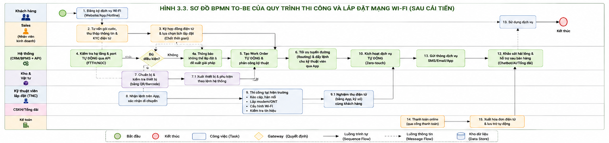

## 3.2. Quy trình cốt lõi 1: Thi công và lắp đặt mạng Wi-Fi

### 3.2.1. Mô tả quy trình

#### 3.2.1.1. Mục tiêu của quy trình
Quy trình thi công và lắp đặt mạng Wi-Fi của FPT Telecom nhằm chuyển đổi nhu cầu đăng ký dịch vụ Internet của khách hàng thành một kết nối Internet hoàn chỉnh tại địa điểm sử dụng.

Quy trình bao gồm các hoạt động từ tiếp nhận nhu cầu, kiểm tra khả năng cung cấp dịch vụ, tư vấn và ký hợp đồng, tạo đơn lắp đặt, chuẩn bị thiết bị, thi công, nghiệm thu, kích hoạt dịch vụ và chăm sóc khách hàng sau bán hàng.

Quy trình hiện tại gồm 11 bước:
1. Khách hàng có nhu cầu.
2. Tiếp nhận yêu cầu.
3. Kiểm tra khả năng cung cấp dịch vụ.
4. Tư vấn và ký hợp đồng.
5. Tạo đơn lắp đặt.
6. Chuẩn bị thiết bị.
7. Kỹ thuật viên liên hệ khách hàng.
8. Tiến hành lắp đặt.
9. Nghiệm thu.
10. Kích hoạt dịch vụ.
11. Chăm sóc sau bán hàng.

> **Ghi chú về cách đếm bước:** 11 bước ở trên là mức tổng quát (macro-step), dùng làm cơ sở cho bảng đo thời gian ở mục 3.2.4.1.e. Ở các phần phân tích chi tiết hơn, một số bước macro được tách thành nhiều bước con để dễ đánh giá (ví dụ bước 4 "Tư vấn và ký hợp đồng" và bước 8 "Tiến hành lắp đặt" được tách nhỏ, đồng thời có bổ sung hoạt động của Kế toán). Vì vậy, mục 3.2.1.4 (13 mục) và bảng VA/BVA/NVA (18 dòng, đã hiệu chỉnh ở mục 3.2.3.1) không mâu thuẫn với 11 bước ở đây — đó chỉ là hai mức độ chi tiết khác nhau của cùng một quy trình.

#### 3.2.1.2. Actor tham gia

| Actor/Bên tham gia | Vai trò trong quy trình |
| :--- | :--- |
| **Khách hàng** | Phát sinh nhu cầu, cung cấp thông tin/giấy tờ, lựa chọn gói cước, xác nhận lịch lắp đặt, nghiệm thu và xác nhận sử dụng dịch vụ. |
| **Nhân viên kinh doanh (Sales)** | Tiếp nhận nhu cầu, tư vấn gói cước, thu thập thông tin, thực hiện hợp đồng và đặt lịch lắp đặt. |
| **Bộ phận kỹ thuật khảo sát** | Kiểm tra hạ tầng cáp quang và khả năng còn port để xác định khả năng cung cấp dịch vụ. |
| **Kho & Vật tư** | Chuẩn bị và xuất Modem/ONT, Router Wi-Fi, dây cáp quang và phụ kiện lắp đặt. |
| **Kỹ thuật viên lắp đặt (TNC)*** | Liên hệ khách hàng, di chuyển đến địa điểm, kéo cáp, hàn nối, lắp modem, cấu hình Wi-Fi, kiểm tra tín hiệu và thực hiện nghiệm thu. |
| **CRM/BPMS** | Quản lý dữ liệu, tạo Work Order, phân công đội kỹ thuật và kích hoạt tài khoản Internet. |
| **CSKH/Tổng đài** | Khảo sát mức độ hài lòng, tiếp nhận phản hồi và hỗ trợ kỹ thuật sau lắp đặt. |
| **Kế toán** | Xử lý khoản phí lắp đặt/cước ban đầu nếu phát sinh. |

* Ghi chú: cần bổ sung/xác nhận diễn giải đầy đủ cho viết tắt "TNC" và dùng thống nhất tên gọi này (hoặc bỏ hẳn viết tắt) ở các mục còn lại của tài liệu, vì phần sau chỉ gọi là "Kỹ thuật viên lắp đặt".

#### 3.2.1.3. Khách hàng mục tiêu
Khách hàng mục tiêu của quy trình là các cá nhân, hộ gia đình hoặc khách hàng có nhu cầu đăng ký và sử dụng dịch vụ Internet/Wi-Fi của FPT Telecom tại một địa điểm cụ thể.

Khách hàng có thể bắt đầu quy trình thông qua:
* Website.
* Hotline.
* Cửa hàng giao dịch FPT Telecom.
* Nhân viên kinh doanh.

#### 3.2.1.4. Kịch bản thành công
Quy trình được xem là thành công khi:
1. Khách hàng đăng ký sử dụng dịch vụ.
2. Thông tin khách hàng và địa chỉ lắp đặt được tiếp nhận đầy đủ.
3. Địa điểm đáp ứng điều kiện hạ tầng và còn port để cung cấp dịch vụ.
4. Khách hàng hoàn tất thủ tục và ký hợp đồng.
5. Hệ thống tạo Work Order và phân công cho đội kỹ thuật.
6. Thiết bị và vật tư cần thiết được chuẩn bị.
7. Kỹ thuật viên liên hệ và đến đúng địa điểm.
8. Hệ thống cáp quang và thiết bị Wi-Fi được lắp đặt, cấu hình.
9. Tín hiệu Internet được kiểm tra đạt yêu cầu.
10. Khách hàng nghiệm thu và xác nhận hoàn thành.
11. Dịch vụ được kích hoạt trên hệ thống.
12. Khách hàng nhận thông báo và bắt đầu sử dụng dịch vụ.
13. CSKH thực hiện khảo sát và hỗ trợ sau bán hàng.

#### 3.2.1.5. Kịch bản thất bại
Quy trình có thể kết thúc không thành công hoặc phải xử lý lại trong một số trường hợp:
* Khu vực khách hàng chưa có hạ tầng cáp quang.
* Khu vực đã có hạ tầng nhưng không còn port kết nối.
* Khách hàng không cung cấp đủ thông tin hoặc giấy tờ cần thiết.
* Khách hàng không thống nhất được thời gian lắp đặt.
* Phát sinh vấn đề trong quá trình thi công.
* Tín hiệu Internet sau lắp đặt không đạt yêu cầu.
* Khách hàng không xác nhận nghiệm thu.
* Phát sinh vấn đề về phí lắp đặt hoặc thanh toán.

Trong đó, bước 3 - Kiểm tra khả năng cung cấp dịch vụ là điểm quyết định Go/No-Go. Nếu không đủ điều kiện thì thông báo khách hàng và kết thúc quy trình; nếu đủ điều kiện thì tiếp tục sang bước tiếp theo.

#### **3.2.1.6. Phỏng vấn (Interview-based Discovery)**

Phương pháp phỏng vấn được sử dụng nhằm thu thập thông tin từ các đối tượng có liên quan trực tiếp đến quy trình thi công và lắp đặt mạng Wi-Fi. Nội dung phỏng vấn tập trung vào việc xác định các bước thực hiện, trách nhiệm của từng bộ phận, các điểm chờ, các lỗi phát sinh, hoạt động tạo giá trị và cơ hội cải tiến quy trình.

Các nhóm đối tượng được lựa chọn để phỏng vấn gồm:

- Nhân viên kinh doanh (Sales);
- Nhân viên khảo sát kỹ thuật;
- Nhân viên kho/vật tư;
- Kỹ thuật viên lắp đặt;
- Nhân viên quản trị CRM/BPMS;
- Nhân viên chăm sóc khách hàng (CSKH);
- Nhân viên kế toán;
- Quản lý bộ phận kỹ thuật hoặc quản lý chi nhánh.

##### **a) Danh sách 10 câu hỏi định tính**

- **Nhóm câu hỏi có cấu trúc (Structured Qualitative Questions):**  
  *(Sử dụng thang đo Likert 5 mức độ hoặc phương án lựa chọn cố định)*

| **Mã** | **Đối tượng phỏng vấn** | **Nội dung câu hỏi có cấu trúc** | **Thang đo / Phương án lựa chọn** |
|---|---|---|---|
| **TC-QL01** | Nhân viên kinh doanh | Anh/Chị đánh giá mức độ thuận tiện của việc tiếp nhận yêu cầu lắp đặt mạng Wi-Fi từ khách hàng hiện nay như thế nào? | 1. Rất bất tiện; 2. Bất tiện; 3. Bình thường; 4. Thuận tiện; 5. Rất thuận tiện |
| **TC-QL02** | Nhân viên khảo sát kỹ thuật | Anh/Chị đánh giá mức độ đầy đủ và chính xác của thông tin về địa chỉ, hạ tầng và nhu cầu khách hàng trước khi khảo sát như thế nào? | 1. Rất thiếu và không chính xác; 2. Thiếu; 3. Đáp ứng một phần; 4. Đầy đủ; 5. Rất đầy đủ và chính xác |
| **TC-QL03** | Nhân viên kho/vật tư | Quy trình chuẩn bị và cấp phát modem, router, dây mạng và phụ kiện hiện nay có đáp ứng tốt kế hoạch lắp đặt không? | 1. Hoàn toàn không đáp ứng; 2. Đáp ứng kém; 3. Đáp ứng trung bình; 4. Đáp ứng tốt; 5. Đáp ứng rất tốt |
| **TC-QL04** | Kỹ thuật viên lắp đặt | Anh/Chị đánh giá mức độ thuận tiện của việc nhận lệnh lắp đặt, lịch hẹn và thông tin khách hàng trên hệ thống hiện nay như thế nào? | 1. Rất khó khăn; 2. Khó khăn; 3. Bình thường; 4. Thuận tiện; 5. Rất thuận tiện |
| **TC-QL05** | Nhân viên CSKH / Quản lý kỹ thuật | Theo Anh/Chị, mức độ phối hợp giữa Sales, kho, kỹ thuật và CSKH trong quá trình lắp đặt hiện nay đạt mức nào? | 1. Rất kém; 2. Kém; 3. Trung bình; 4. Tốt; 5. Rất tốt |

- **Nhóm câu hỏi không có cấu trúc (Unstructured Qualitative Questions):**  
  *(Câu hỏi mở nhằm khai thác nguyên nhân, khó khăn và đề xuất cải tiến)*

| **Mã** | **Đối tượng phỏng vấn** | **Nội dung câu hỏi mở** | **Mục tiêu thu thập thông tin** |
|---|---|---|---|
| **TC-QL06** | Nhân viên kinh doanh | Trong quá trình tiếp nhận và tư vấn khách hàng, những khó khăn nào thường khiến việc tạo yêu cầu lắp đặt bị chậm hoặc phải bổ sung thông tin nhiều lần? | Xác định các vấn đề về thiếu thông tin khách hàng, sai địa chỉ, thiếu giấy tờ hoặc nhập liệu lặp lại |
| **TC-QL07** | Nhân viên khảo sát kỹ thuật | Những nguyên nhân nào thường khiến việc kiểm tra hạ tầng, cổng kết nối hoặc điều kiện lắp đặt không thể hoàn thành ngay từ lần đầu? | Xác định các vấn đề liên quan đến dữ liệu hạ tầng, thiếu cổng, địa hình và thông tin khảo sát |
| **TC-QL08** | Nhân viên kho/vật tư và kỹ thuật viên | Những tình huống nào thường xảy ra khi thiết bị hoặc vật tư được chuẩn bị không đầy đủ trước ngày lắp đặt? | Xác định nguyên nhân gây chậm lịch, phát sinh chuyến đi bổ sung hoặc phải quay lại công trình |
| **TC-QL09** | Kỹ thuật viên lắp đặt | Trong quá trình thi công tại nhà khách hàng, bước nào thường gây nhiều khó khăn hoặc phát sinh làm lại nhất? Vì sao? | Xác định nguyên nhân của lỗi thi công, tín hiệu Wi-Fi không đạt, thiếu vật tư hoặc điều kiện thi công không phù hợp |
| **TC-QL10** | Nhân viên CSKH / Quản lý kỹ thuật | Theo Anh/Chị, khách hàng thường không hài lòng ở những điểm nào trong quá trình đăng ký, chờ lắp đặt, nghiệm thu và kích hoạt dịch vụ? | Xác định các điểm gây ảnh hưởng đến trải nghiệm khách hàng và đề xuất hướng cải tiến quy trình |

##### **b) Danh sách 10 câu hỏi định lượng**

- **Nhóm câu hỏi có cấu trúc (Structured Quantitative Questions):**  
  *(Thu thập số liệu cụ thể với đơn vị đo lường rõ ràng)*

| **Mã** | **Đối tượng phỏng vấn** | **Nội dung câu hỏi định lượng có cấu trúc** | **Đơn vị đo lường** |
|---|---|---|---|
| **TC-QT01** | Nhân viên kinh doanh | Trung bình một ngày, bộ phận kinh doanh tiếp nhận bao nhiêu yêu cầu đăng ký lắp đặt mạng Wi-Fi? | Yêu cầu / người / ngày |
| **TC-QT02** | Nhân viên khảo sát kỹ thuật | Thời gian trung bình để kiểm tra khả năng cung cấp dịch vụ và tình trạng cổng kết nối cho một địa chỉ là bao lâu? | Phút / yêu cầu |
| **TC-QT03** | Nhân viên kho/vật tư | Tỷ lệ đơn lắp đặt được chuẩn bị đầy đủ thiết bị và vật tư ngay từ lần đầu là bao nhiêu phần trăm? | Tỷ lệ phần trăm (%) |
| **TC-QT04** | Kỹ thuật viên lắp đặt | Thời gian trung bình từ khi nhận lệnh lắp đặt đến khi hoàn thành thi công một đơn hàng là bao nhiêu phút? | Phút / đơn hàng |
| **TC-QT05** | Nhân viên CSKH / Quản lý kỹ thuật | Tỷ lệ đơn lắp đặt hoàn thành đúng lịch hẹn với khách hàng hiện nay là bao nhiêu phần trăm? | Tỷ lệ phần trăm (%) |

- **Nhóm câu hỏi không có cấu trúc (Unstructured Quantitative Questions):**  
  *(Câu hỏi mở nhằm thu thập khoảng giá trị, mức độ biến động và chi phí phát sinh)*

| **Mã** | **Đối tượng phỏng vấn** | **Nội dung câu hỏi định lượng mở** | **Dữ liệu định lượng kỳ vọng thu thập** |
|---|---|---|---|
| **TC-QT06** | Nhân viên kinh doanh / CSKH | Khi thông tin khách hàng hoặc địa chỉ lắp đặt bị thiếu, trung bình mất thêm bao nhiêu thời gian để liên hệ và bổ sung thông tin? | Khoảng thời gian bổ sung thông tin theo phút hoặc giờ |
| **TC-QT07** | Nhân viên khảo sát kỹ thuật | Trong một tháng, có khoảng bao nhiêu trường hợp phải khảo sát lại hoặc kiểm tra hạ tầng lần thứ hai do thông tin ban đầu chưa chính xác? | Số trường hợp / tháng và tỷ lệ phần trăm (%) |
| **TC-QT08** | Nhân viên kho/vật tư | Trong một tháng, có khoảng bao nhiêu đơn lắp đặt phải bổ sung thiết bị, dây mạng hoặc phụ kiện sau khi kỹ thuật viên đã đến địa điểm? | Số đơn hàng / tháng; số lần phát sinh / đơn |
| **TC-QT09** | Kỹ thuật viên lắp đặt | Khi phát sinh lỗi tín hiệu, thiếu vật tư hoặc khách hàng chưa thể nghiệm thu, thời gian xử lý bổ sung trung bình dao động từ bao nhiêu phút đến bao nhiêu giờ? | Khoảng thời gian xử lý theo phút/giờ |
| **TC-QT10** | Nhân viên CSKH / Quản lý chi nhánh | Ước tính tổng chi phí phát sinh mỗi tháng do đổi lịch, di chuyển lại, thi công lại hoặc xử lý khiếu nại sau lắp đặt là khoảng bao nhiêu? | Chi phí phát sinh theo VNĐ/tháng |

##### **c) Mục đích sử dụng kết quả phỏng vấn**

Kết quả phỏng vấn dự kiến được sử dụng làm cơ sở cho các nội dung phân tích tiếp theo:

| **Nội dung phân tích** | **Thông tin thu thập từ phỏng vấn** |
|---|---|
| **Phân tích VA/BVA/NVA** | Xác định hoạt động tạo giá trị, hoạt động cần thiết cho doanh nghiệp và hoạt động không tạo giá trị |
| **Phân tích 7 loại lãng phí** | Xác định thời gian chờ, di chuyển dư thừa, tồn kho vật tư, thao tác lặp lại và lỗi phải làm lại |
| **Issue Register** | Xác định và kiểm chứng các vấn đề IR-01 đến IR-09 trong quy trình As-is |
| **Phân tích định lượng** | Thu thập thời gian xử lý, thời gian chờ, tỷ lệ hoàn thành đúng hạn, tỷ lệ làm lại và chi phí phát sinh |
| **Thiết kế quy trình To-Be** | Xác định nhu cầu tích hợp CRM/BPMS, kiểm tra hạ tầng tự động, quản lý vật tư bằng QR/Barcode, ứng dụng dành cho kỹ thuật viên và nghiệm thu điện tử |

##### **d) Liên kết câu hỏi phỏng vấn với các vấn đề của quy trình**

| **Mã câu hỏi** | **Vấn đề có thể phát hiện** | **Nội dung phân tích liên quan** |
|---|---|---|
| **TC-QL01, TC-QL06** | Tiếp nhận yêu cầu chậm, thông tin khách hàng không đầy đủ | BVA, Waiting, Overprocessing, IR-01 |
| **TC-QL02, TC-QL07** | Dữ liệu hạ tầng không chính xác, phải khảo sát lại | Defect/Rework, Waiting, IR-02 |
| **TC-QL03, TC-QT08** | Thiếu thiết bị hoặc vật tư khi triển khai | Inventory, Waiting, Transportation, IR-03 |
| **TC-QL04, TC-QT04** | Kỹ thuật viên nhận lệnh chậm hoặc thiếu thông tin | Waiting, Overprocessing, IR-04 |
| **TC-QL05, TC-QL10** | Phối hợp giữa các bộ phận chưa hiệu quả, khách hàng không hài lòng | Waiting, Defect/Rework, Customer Experience, IR-05 |
| **TC-QT01, TC-QT02** | Khối lượng yêu cầu và thời gian xử lý ban đầu cao | Processing Time, Capacity, Workload |
| **TC-QT03, TC-QT07** | Tỷ lệ chuẩn bị vật tư không đạt, phát sinh khảo sát lại | Quality, Rework, Inventory |
| **TC-QT05, TC-QT09** | Không hoàn thành đúng lịch, phát sinh xử lý bổ sung | On-time Rate, Rework, Lead Time |
| **TC-QT10** | Chi phí phát sinh do đổi lịch, di chuyển lại và khiếu nại | Cost per Order, Transportation, Cost of Poor Quality |
---

### 3.2.2. Mô hình hóa quy trình hiện tại (Sơ đồ BPMN - As-is)

#### 3.2.2.1. Sơ đồ BPMN

> **Hình 3.2. Sơ đồ BPMN As-is của quy trình thi công và lắp đặt mạng Wi-Fi**

#### 3.2.2.2. Các tác nhân/Swimlane trong BPMN
Sơ đồ BPMN nên được tổ chức thành các swimlane tương ứng với các bên tham gia:
1. Khách hàng
2. Nhân viên kinh doanh (Sales)
3. Bộ phận kỹ thuật khảo sát
4. Kho & Vật tư
5. Kỹ thuật viên lắp đặt
6. CRM/BPMS
7. CSKH/Tổng đài
8. Kế toán

> Thứ tự swimlane đã được sắp xếp lại để thống nhất với thứ tự trình bày actor ở mục 3.2.1.2.

#### 3.2.2.3. Luồng quy trình As-is

**Giai đoạn 1: Tiếp nhận và kiểm tra nhu cầu**
* **Khách hàng:** `Phát sinh nhu cầu → Liên hệ Website/Hotline/Cửa hàng/Sales → Cung cấp thông tin`
* **Sales:** `Tiếp nhận yêu cầu → Ghi nhận thông tin khách hàng → Tư vấn gói cước`
* **Kỹ thuật khảo sát:** `Nhận yêu cầu → Kiểm tra hạ tầng cáp quang → Kiểm tra port`
* **Gateway 1:** Đủ điều kiện cung cấp dịch vụ? (tương ứng kịch bản thất bại "chưa có hạ tầng" / "không còn port")
  * **Không:** Thông báo khách hàng → Kết thúc quy trình.
  * **Có:** Tiếp tục tư vấn và ký hợp đồng.

**Giai đoạn 2: Chốt đơn và tạo đơn lắp đặt**
* **Sales + Khách hàng:** `Tư vấn gói cước → Khách hàng cung cấp giấy tờ → Ký hợp đồng`
* **Gateway 2:** Thông tin/giấy tờ và thời gian lắp đặt đã đầy đủ, thống nhất? (tương ứng kịch bản thất bại "thiếu thông tin/giấy tờ" và "không thống nhất được lịch")
  * **Không:** Yêu cầu bổ sung thông tin hoặc thỏa thuận lại lịch hẹn với khách hàng → quay lại bước tư vấn/chốt lịch.
  * **Có:** Tiếp tục tạo Work Order.
* **Kế toán** (nếu phát sinh phí lắp đặt/cước ban đầu): `Ghi nhận và thu phí lắp đặt/cước ban đầu → Xác nhận thanh toán`
* **Gateway 3:** Thanh toán/phí lắp đặt hợp lệ? (tương ứng kịch bản thất bại "phát sinh vấn đề về phí lắp đặt hoặc thanh toán")
  * **Không:** Tạm dừng đơn, phối hợp với khách hàng xử lý phí → có thể quay lại chốt đơn hoặc kết thúc quy trình.
  * **Có:** Tiếp tục sang CRM/BPMS.
* **CRM/BPMS:** `Tạo Work Order → Phân công đội kỹ thuật`

**Giai đoạn 3: Chuẩn bị và triển khai lắp đặt**
* **Kho & Vật tư:** `Chuẩn bị Modem/ONT → Chuẩn bị Router Wi-Fi → Chuẩn bị dây cáp quang → Chuẩn bị phụ kiện → Xuất vật tư`
* **Kỹ thuật viên:** `Nhận Work Order → Liên hệ khách hàng → Xác nhận thời gian/địa điểm → Di chuyển → Kéo cáp quang → Hàn nối cáp → Lắp modem → Cấu hình Wi-Fi → Kiểm tra tín hiệu`
* **Gateway 4:** Thi công/tín hiệu đạt yêu cầu? (tương ứng kịch bản thất bại "phát sinh vấn đề trong thi công" và "tín hiệu không đạt yêu cầu")
  * **Không:** Khắc phục sự cố, sửa chữa hoặc thi công lại (rework) → quay lại bước kiểm tra tín hiệu.
  * **Có:** Tiếp tục sang nghiệm thu.

**Giai đoạn 4: Nghiệm thu và hoàn tất**
* **Khách hàng + Kỹ thuật viên:** `Kiểm tra Internet/Wi-Fi → Nghiệm thu → Ký xác nhận hoàn thành`
* **Gateway 5:** Khách hàng xác nhận nghiệm thu? (tương ứng kịch bản thất bại "khách hàng không xác nhận nghiệm thu")
  * **Không:** Ghi nhận phản hồi, xử lý lại hạng mục chưa đạt → quay lại bước kiểm tra/thi công.
  * **Có:** Tiếp tục kích hoạt dịch vụ.
* **CRM/BPMS:** `Cập nhật trạng thái → Kích hoạt tài khoản Internet → Gửi SMS/Email xác nhận`
* **CSKH:** `Gọi khảo sát mức độ hài lòng → Hỗ trợ kỹ thuật khi cần → Kết thúc`

> **Ghi chú:** Bản mô tả As-is ban đầu chỉ có 1 gateway (Go/No-Go ở bước kiểm tra hạ tầng) dù mục 3.2.1.5 liệt kê 8 kịch bản thất bại khác nhau; các Gateway 2–5 đã được bổ sung để mỗi kịch bản thất bại đều có nhánh xử lý tương ứng, và đã được cập nhật trực tiếp trong sơ đồ BPMN (Hình 3.2, `so_do_bpmn_as_is.svg`) ở đầu mục 3.2.2.3.

---

### 3.2.3. Phân tích định tính

#### 3.2.3.1. Phân tích giá trị gia tăng
Phân tích giá trị gia tăng được chia thành ba nhóm:
* **VA (Value Added):** Hoạt động trực tiếp tạo ra giá trị mà khách hàng cần.
* **BVA (Business Value Added):** Hoạt động không trực tiếp tạo ra giá trị đối với khách hàng nhưng cần thiết đối với doanh nghiệp để kiểm soát, hỗ trợ hoặc hoàn tất quy trình.
* **NVA (Non-Value Added):** Hoạt động không tạo giá trị cho khách hàng và không thực sự cần thiết đối với doanh nghiệp; cần ưu tiên loại bỏ hoặc giảm thiểu.

**Bảng phân loại VA/BVA/NVA**

> Bảng dưới đây tách chi tiết 11 bước macro (mục 3.2.1.1) thành 18 bước con để đánh giá VA/BVA/NVA sát với thực tế hơn (bước 4 "Tư vấn và ký hợp đồng" và bước 8 "Tiến hành lắp đặt" được tách nhỏ). Đồng thời bổ sung hoạt động của **Kế toán** (STT 5) vốn bị thiếu ở bảng gốc, để nhất quán với vai trò actor đã nêu ở mục 3.2.1.2.

| STT | Bước công việc (Step) | Tác nhân thực hiện | Phân loại |
| :--- | :--- | :--- | :--- |
| 1 | Tiếp nhận nhu cầu khách hàng | Sales | BVA |
| 2 | Tư vấn và lựa chọn gói cước | Sales + Khách hàng | VA |
| 3 | Kiểm tra hạ tầng và port | Bộ phận kỹ thuật khảo sát | BVA |
| 4 | Ký hợp đồng | Sales + Khách hàng | BVA* |
| 5 | Xử lý phí lắp đặt/cước ban đầu (nếu có) | Kế toán | BVA |
| 6 | Tạo Work Order và phân công đội kỹ thuật | CRM/BPMS | BVA |
| 7 | Chuẩn bị và xuất thiết bị, vật tư | Kho & Vật tư | BVA |
| 8 | Liên hệ và hẹn khách hàng | Kỹ thuật viên lắp đặt | BVA |
| 9 | Di chuyển đến địa điểm lắp đặt | Kỹ thuật viên lắp đặt | NVA tiềm năng |
| 10 | Kéo cáp quang | Kỹ thuật viên lắp đặt | VA |
| 11 | Hàn nối cáp | Kỹ thuật viên lắp đặt | VA |
| 12 | Lắp đặt modem/ONT | Kỹ thuật viên lắp đặt | VA |
| 13 | Cấu hình Wi-Fi | Kỹ thuật viên lắp đặt | VA |
| 14 | Kiểm tra tín hiệu Internet/Wi-Fi | Kỹ thuật viên lắp đặt | BVA |
| 15 | Nghiệm thu và ký xác nhận hoàn thành | Khách hàng + Kỹ thuật viên lắp đặt | BVA* |
| 16 | Kích hoạt dịch vụ | CRM/BPMS | VA |
| 17 | Gửi SMS/Email xác nhận | CRM/BPMS | BVA |
| 18 | Khảo sát mức độ hài lòng và hỗ trợ sau bán hàng | CSKH/Tổng đài | BVA |

* Bước 4 (Ký hợp đồng) và bước 15 (Nghiệm thu) được giữ ở nhóm BVA theo quan điểm "hoạt động xác nhận/thủ tục nội bộ", nhưng đây là ranh giới còn tranh luận: nếu xét theo góc độ khách hàng chỉ chính thức nhận được quyền sử dụng dịch vụ sau khi hai bước này hoàn tất, có thể xếp vào VA. Nhóm thực hiện nên thống nhất rõ tiêu chí phân loại (dựa trên "khách hàng có sẵn sàng trả tiền cho riêng hoạt động này không") và áp dụng nhất quán cho toàn bộ bảng, đặc biệt giữa bước 14 (Kiểm tra tín hiệu – BVA) và bước 16 (Kích hoạt dịch vụ – VA) là hai bước liền kề, cùng nhóm kỹ thuật/hệ thống nhưng đang được xếp khác nhóm.

**Nhận xét**
* Các hoạt động tạo giá trị trực tiếp tập trung chủ yếu ở giai đoạn thi công và hoàn tất dịch vụ, gồm tư vấn/lựa chọn gói cước, kéo cáp, hàn nối cáp, lắp modem/ONT, cấu hình Wi-Fi và kích hoạt dịch vụ.
* Các hoạt động BVA chiếm số lượng lớn vì quy trình cần kiểm soát hạ tầng, hợp đồng, tài chính, điều phối nguồn lực, kiểm tra chất lượng và quản lý trạng thái đơn hàng.
* Đối với NVA, hai tài liệu nguồn chưa cung cấp số liệu thực tế đủ để khẳng định có hoạt động NVA thuần túy xảy ra thường xuyên. Do đó, các hoạt động như chờ đợi, di chuyển không cần thiết, thao tác nhập liệu trùng lặp và rework cần tiếp tục được đo lường trước khi kết luận.

---

#### 3.2.3.2. Phân tích lãng phí

**a. Vận chuyển (Transportation)**
* Kỹ thuật viên phải di chuyển đến địa điểm khách hàng và thiết bị/vật tư phải được đưa đến địa điểm thi công.
* **Tác động:** Tăng thời gian triển khai; Tăng chi phí di chuyển; Có thể ảnh hưởng đến khả năng phục vụ nhiều đơn hàng trong ngày.

**b. Thời gian chờ/Hold (Waiting)**
* Các điểm có khả năng phát sinh chờ đợi gồm: Chờ kiểm tra hạ tầng; Chờ khách hàng xác nhận lịch; Chờ chuẩn bị hoặc xuất vật tư; Chờ kỹ thuật viên đến địa điểm; Chờ xử lý bước trước trong quy trình.
* **Tác động:** làm tăng Lead Time nhưng không trực tiếp tạo thêm giá trị cho khách hàng.

**c. Làm quá mức (Overprocessing)**
* Có khả năng phát sinh việc nhập hoặc cập nhật thông tin lặp lại giữa các bước hoặc hệ thống nếu dữ liệu chưa được liên thông hoàn toàn.
* **Tác động:** Tăng thời gian xử lý; Tăng nguy cơ sai sót; Tạo thêm công việc hành chính.

**d. Thao tác/di chuyển thừa (Motion)**
* Kỹ thuật viên có thể phải thực hiện thêm thao tác hoặc di chuyển bổ sung nếu: Thiếu vật tư; Thông tin địa điểm chưa đầy đủ; Cấu hình chưa đạt; Phải quay lại để xử lý lỗi.
* **Tác động:** giảm năng suất của kỹ thuật viên.

**e. Sai lỗi và làm lại (Defect/Rework)**
* Sai sót trong kéo cáp, hàn nối, lắp đặt hoặc cấu hình có thể khiến kỹ thuật viên phải sửa chữa hoặc thực hiện lại.
* **Tác động:** Tăng chi phí; Tăng thời gian hoàn thành; Có thể làm giảm mức độ hài lòng của khách hàng.

**f. Tồn kho (Inventory)**
* Quy trình yêu cầu chuẩn bị Modem/ONT, Router Wi-Fi, dây cáp quang và phụ kiện trước khi thi công.
* **Tác động:** nếu việc chuẩn bị và phân bổ vật tư không đồng bộ với nhu cầu thực tế, có thể phát sinh tồn kho hoặc phân bổ vật tư chưa tối ưu.

**g. Chưa tận dụng nguồn lực (Unused Talent)**
* Nhân sự chuyên môn có thể phải dành thời gian cho các thao tác hành chính hoặc nhập liệu thủ công thay vì tập trung vào công việc chuyên môn.
* **Tác động:** giảm hiệu quả sử dụng nguồn nhân lực.

**Nhận xét tổng hợp**
* Các nhóm lãng phí cần ưu tiên đo lường trong quy trình là Waiting/Hold, Transportation, Motion, Overprocessing và Defect/Rework.
* Tuy nhiên, đây là các điểm có khả năng phát sinh dựa trên cấu trúc quy trình, không phải kết luận rằng FPT Telecom chắc chắn đang phát sinh với một tỷ lệ cụ thể.
* Việc sử dụng CRM/BPMS để tạo Work Order và kích hoạt dịch vụ giúp giảm lỗi nhập liệu thủ công và tăng tốc độ xử lý dữ liệu giữa các bộ phận.

---

#### 3.2.3.3. Phân tích các bên liên quan

**a. Stakeholder Analysis**

| Bên liên quan | Mức độ ảnh hưởng | Mức độ quan tâm | Vai trò |
| :--- | :--- | :--- | :--- |
| **Khách hàng** | Cao | Cao | Người yêu cầu và trực tiếp sử dụng dịch vụ. |
| **Sales** | Cao | Cao | Khởi tạo nhu cầu, tư vấn và hoàn thiện giao dịch. |
| **Kỹ thuật khảo sát** | Cao | Cao | Quyết định khả năng triển khai dựa trên hạ tầng. |
| **Kỹ thuật viên lắp đặt** | Cao | Cao | Trực tiếp tạo ra kết quả đầu ra của quy trình. |
| **CRM/BPMS** | Cao | Cao | Điều phối, quản lý dữ liệu và kích hoạt dịch vụ. |
| **Kho & Vật tư** | Trung bình | Cao | Bảo đảm thiết bị/vật tư sẵn sàng cho thi công. |
| **CSKH/Tổng đài** | Trung bình | Cao | Đo lường mức độ hài lòng và xử lý phản hồi. |
| **Kế toán** | Trung bình | Trung bình | Xử lý khoản phí và doanh thu liên quan. |

**b. Nhận xét**
* Nhóm stakeholder có ảnh hưởng trực tiếp nhất đến kết quả quy trình gồm khách hàng, Sales, kỹ thuật khảo sát, kỹ thuật viên lắp đặt và CRM/BPMS.
* Nếu một trong các mắt xích này hoạt động không đồng bộ, thời gian hoàn thành đơn lắp đặt có thể bị kéo dài.

---

**c. Sổ đăng ký vấn đề (Issue Register)**

| ID | Vấn đề | Nguyên nhân tiềm ẩn | Tác động | Mức độ |
| :--- | :--- | :--- | :--- | :--- |
| IR-01 | Không đủ hạ tầng/port | Khu vực chưa có hạ tầng hoặc port đã sử dụng hết | Đơn không thể triển khai | Cao |
| IR-02 | Chờ xác nhận lịch | Khách hàng chưa thống nhất được thời gian | Kéo dài thời gian xử lý | Trung bình |
| IR-03 | Thiếu vật tư | Chuẩn bị vật tư chưa đầy đủ | Kỹ thuật viên phải bổ sung vật tư | Cao |
| IR-04 | Sai/thừa thông tin đơn hàng | Nhập liệu hoặc truyền thông tin giữa các bộ phận chưa chính xác | Phải cập nhật hoặc xử lý lại | Cao |
| IR-05 | Thi công không đạt | Lỗi kéo cáp, hàn nối hoặc cấu hình | Phải sửa chữa/rework | Cao |
| IR-06 | Khách hàng không nghiệm thu | Kết quả chưa đáp ứng kỳ vọng hoặc khách hàng chưa sẵn sàng | Chậm hoàn tất đơn | Trung bình |
| IR-07 | Chậm kích hoạt | Trạng thái chưa được cập nhật đúng | Khách hàng chưa thể sử dụng dịch vụ | Cao |
| IR-08 | Phản hồi sau lắp đặt | Khách hàng gặp vấn đề sau khi sử dụng | Tăng khối lượng CSKH/hỗ trợ kỹ thuật | Trung bình |
| IR-09 | Vướng mắc về phí lắp đặt/thanh toán | Khách hàng chưa đồng ý mức phí hoặc chưa hoàn tất thanh toán ban đầu | Đơn bị tạm dừng, ảnh hưởng Kế toán và tiến độ triển khai | Trung bình |

---

### 3.2.4. Phân tích định lượng

> **Lưu ý về dữ liệu:** Hai tài liệu nguồn không cung cấp dữ liệu vận hành nội bộ của FPT Telecom về thời gian xử lý, thời gian chờ và đơn giá nhân công/vật tư. Vì vậy, để hoàn thiện bài và có cơ sở so sánh As-is/To-Be, nhóm sử dụng **bộ số liệu giả định tham chiếu** dưới đây. Các số liệu phải được thay bằng dữ liệu khảo sát/thực tế của nhóm nếu có trước khi kết luận chính thức về hiệu quả của FPT Telecom.

#### 3.2.4.1. Định lượng thời gian

**a. Cycle Time / Processing Time**
Trong tài liệu này, Cycle Time (CT) và Processing Time được quy ước là tổng thời gian xử lý thực tế, không bao gồm thời gian chờ.
> **Cycle Time (CT) = Processing Time = ΣT**
Với bộ số liệu giả định tham chiếu:
> **Cycle Time = 265 phút = 4 giờ 25 phút**

**b. Wait Time**
Wait Time (WT) là tổng thời gian đơn hàng phải chờ giữa các hoạt động.
> **Waiting Time = ΣW**
Với bộ số liệu giả định tham chiếu:
> **Wait Time = 355 phút = 5 giờ 55 phút**

**c. Lead Time**
> **Lead Time = Cycle Time + Waiting Time**
> **Lead Time = 265 + 355 = 620 phút = 10 giờ 20 phút**

**d. Waiting Ratio**
> **Waiting Ratio = Waiting Time / Lead Time × 100%**
> **Waiting Ratio = 355 / 620 × 100% ≈ 57,3%**

Kết quả cho thấy trong bộ dữ liệu giả định, hơn một nửa tổng Lead Time đến từ thời gian chờ. Vì vậy, giảm Waiting Time là một hướng cải tiến quan trọng.

**e. Bảng đo thời gian As-is**

| STT | Công đoạn (11 bước) | Processing Time T (phút) | Waiting Time W (phút) | Tổng (phút) |
| :--- | :--- | :--- | :--- | :--- |
| 1 | Khách hàng có nhu cầu | 10 | 30 | 40 |
| 2 | Tiếp nhận yêu cầu | 15 | 20 | 35 |
| 3 | Kiểm tra khả năng cung cấp dịch vụ | 20 | 60 | 80 |
| 4 | Tư vấn và ký hợp đồng | 20 | 30 | 50 |
| 5 | Tạo Work Order | 10 | 15 | 25 |
| 6 | Chuẩn bị thiết bị | 25 | 45 | 70 |
| 7 | Kỹ thuật viên liên hệ khách hàng | 15 | 120 | 135 |
| 8 | Tiến hành lắp đặt | 120 | 0 | 120 |
| 9 | Nghiệm thu | 15 | 10 | 25 |
| 10 | Kích hoạt dịch vụ | 5 | 5 | 10 |
| 11 | Chăm sóc sau bán hàng | 10 | 20 | 30 |
| | **Tổng** | **265** | **355** | **620** |

**f. Các điểm có Wait Time cao**
Theo bộ số liệu tham chiếu, ba điểm chờ đáng chú ý là:
* Kỹ thuật viên liên hệ khách hàng: 120 phút.
* Kiểm tra khả năng cung cấp dịch vụ: 60 phút.
* Chuẩn bị thiết bị: 45 phút.
Các điểm này phù hợp với những nhóm lãng phí đã nhận diện ở mục 3.2.3.2 và là ưu tiên khi thiết kế To-Be.

#### 3.2.4.2. Định lượng chi phí

**a. Bộ đơn giá tham chiếu**

| Hạng mục | Đơn vị | Đơn giá tham chiếu | Ghi chú |
| :--- | :--- | :--- | :--- |
| Nhân công Sales | VNĐ/giờ | 60.000 | Giả định |
| Nhân công kỹ thuật khảo sát | VNĐ/giờ | 70.000 | Giả định |
| Nhân công kỹ thuật viên lắp đặt | VNĐ/giờ | 80.000 | Giả định |
| Nhân công CSKH | VNĐ/giờ | 60.000 | Giả định |
| Modem/ONT | Bộ | 550.000 | Giả định |
| Router Wi-Fi | Bộ | 450.000 | Giả định |
| Dây cáp quang | Mét | 3.000 | Giả định |
| Phụ kiện lắp đặt | Bộ | 50.000 | Giả định |
| Di chuyển | VNĐ/km | 4.000 | Giả định |
| Phân bổ CRM/BPMS | VNĐ/đơn | 120.000 | Giả định bình quân |
| Rework | VNĐ/lần | 200.000 | Giả định |

**b. Giả định khối lượng cho 1 đơn**
* Thời gian Sales: 0,25 giờ
* Thời gian kỹ thuật khảo sát: 0,33 giờ
* Thời gian kỹ thuật viên: 2,00 giờ
* Thời gian CSKH: 0,17 giờ
* Modem/ONT: 1 bộ
* Router Wi-Fi: 1 bộ
* Cáp quang: 30 mét
* Phụ kiện: 1 bộ
* Quãng đường di chuyển: 25 km
* Tỷ lệ rework: 12%

**c. Tính chi phí**
> Sales = 0,25 × 60.000 = **15.000 VNĐ**
> Kỹ thuật khảo sát = 0,33 × 70.000 ≈ **23.100 VNĐ**
> Kỹ thuật viên = 2,00 × 80.000 = **160.000 VNĐ**
> CSKH = 0,17 × 60.000 ≈ **10.200 VNĐ**
> **Tổng nhân công ≈ 208.300 VNĐ/đơn**

> Modem/ONT = **550.000 VNĐ**
> Router Wi-Fi = **450.000 VNĐ**
> Cáp quang = 30 × 3.000 = **90.000 VNĐ**
> Phụ kiện = **50.000 VNĐ**
> Di chuyển = 25 × 4.000 = **100.000 VNĐ**
> Rework kỳ vọng = 12% × 200.000 = **24.000 VNĐ/đơn**
> **Total Cost ≈ 1.592.300 VNĐ/đơn**

Các con số trên chỉ là giả định tham chiếu phục vụ phân tích, không phải đơn giá nội bộ chính thức của FPT Telecom.

**d. Bảng tổng hợp chi phí As-is tham chiếu**

| Nhóm chi phí | Thành tiền (VNĐ/đơn) |
| :--- | :--- |
| Nhân công | 208.300 |
| Modem/ONT | 550.000 |
| Router Wi-Fi | 450.000 |
| Cáp quang | 90.000 |
| Phụ kiện | 50.000 |
| Di chuyển | 100.000 |
| Phân bổ CRM/BPMS | 120.000 |
| Rework kỳ vọng | 24.000 |
| **Tổng** | **1.592.300** |

#### 3.2.4.3. Các chỉ tiêu đánh giá quy trình

| KPI | As-is tham chiếu | To-Be mục tiêu | Mức cải thiện |
| :--- | :--- | :--- | :--- |
| Lead Time | 620 phút | 360 phút | Giảm 41,9% |
| Cycle Time | 265 phút | 250 phút | Giảm 5,7% |
| Wait Time | 355 phút | 110 phút | Giảm 69,0% |
| Waiting Ratio | 57,3% | 30,6% | Giảm 26,7 điểm % |
| Cost/Order | 1.592.300 VNĐ | 1.350.000 VNĐ | Giảm 15,2% |
| On-time Rate | 78%* | 96%* | +18 điểm % |
| Rework Rate | 12%* | 4%* | Giảm 8 điểm % |
| CSAT | 88%* | 95%* | +7 điểm % |

`*` Các KPI có dấu * là mục tiêu/giả định tham chiếu để thiết kế To-Be và cần được xác nhận bằng dữ liệu thực tế.

---

### 3.2.5. Kết luận phân tích quy trình As-is
Quy trình thi công và lắp đặt mạng Wi-Fi của FPT Telecom có cấu trúc tương đối đầy đủ, bao phủ toàn bộ vòng đời từ khi khách hàng phát sinh nhu cầu đến khi hoàn tất lắp đặt, kích hoạt dịch vụ và chăm sóc sau bán hàng.

Điểm mạnh của quy trình là sự chuyên môn hóa giữa các bộ phận, có bước kiểm tra khả năng cung cấp trước khi triển khai và có sự hỗ trợ của CRM/BPMS trong việc tạo Work Order, điều phối và kích hoạt dịch vụ.

Tuy nhiên, xét dưới góc độ quản trị quy trình, các hoạt động chờ đợi, di chuyển, chuẩn bị vật tư, cập nhật thông tin, xử lý lại và phối hợp liên phòng ban cần được đo lường để xác định mức độ lãng phí thực tế.

Đặc biệt, bước 3 - Kiểm tra khả năng cung cấp dịch vụ là checkpoint Go/No-Go quan trọng vì giúp hạn chế việc triển khai các đơn hàng không đủ điều kiện hạ tầng.

Do hai tài liệu nguồn chưa cung cấp số liệu thực tế về thời gian và chi phí, nhóm cần bổ sung dữ liệu khảo sát hoặc dữ liệu vận hành trước khi đưa ra kết luận định lượng cụ thể.

---

### 3.2.6. Mô hình hóa quy trình tương lai (Sơ đồ BPMN - To-Be)

#### 3.2.6.1. Mục tiêu của mô hình To-Be
Mô hình To-Be được xây dựng trên cơ sở giảm các điểm lãng phí đã nhận diện ở As-is, tăng mức độ tự động hóa và liên thông dữ liệu giữa khách hàng, Sales, CRM/BPMS, kho và kỹ thuật viên.

Các nguyên tắc chính:
* Tự động kiểm tra hạ tầng và port thông qua API khi có dữ liệu hệ thống.
* Ký hợp đồng điện tử và thanh toán trực tuyến trong cùng một luồng.
* Tự động tạo Work Order sau khi đơn đủ điều kiện.
* Đẩy lịch, tọa độ, thông tin khách hàng và vật tư cho kỹ thuật viên qua App Mobile.
* Tối ưu lộ trình kỹ thuật viên bằng Routing.
* Quản lý vật tư bằng QR/Barcode.
* Nghiệm thu điện tử trên Mobile App.
* Tự động kích hoạt dịch vụ sau khi nghiệm thu đạt.
* Tự động khảo sát CSAT sau bán hàng.

#### 3.2.6.2. Sơ đồ BPMN To-Be

> **Hình 3.3. Sơ đồ BPMN To-Be của quy trình thi công và lắp đặt mạng Wi-Fi**

```mermaid
flowchart LR

  subgraph KH["KHÁCH HÀNG"]
    A((Bắt đầu))
    B["Đăng ký dịch vụ\nWebsite / App / Hotline"]
    C["Cung cấp thông tin & vị trí"]
    D["Ký hợp đồng điện tử"]
    E["Thanh toán trực tuyến\n(nếu có)"]
    F["Xác nhận lịch lắp đặt"]
    G["Nghiệm thu điện tử"]
    H["Nhận thông báo kích hoạt"]
    I["Sử dụng dịch vụ"]
    J((Kết thúc))
    A --> B --> C
  end

  subgraph SALES["SALES"]
    S1["Tiếp nhận / tư vấn\ntrên CRM"]
    S2["Xác nhận gói cước\nvà thông tin đơn"]
  end

  subgraph TECH["KỸ THUẬT KHẢO SÁT"]
    T1["API tự động kiểm tra\nhạ tầng + port"]
    X1{"Đủ điều kiện?"}
    T2["Thông báo không thể lắp đặt\n& đề xuất phương án khác"]
  end

  subgraph CRM["CRM / BPMS"]
    R1["Tự động tạo Work Order"]
    R2["Phân công kỹ thuật viên\n+ lịch + tọa độ"]
    R3["Đồng bộ App Mobile"]
    R4["Nhận kết quả thi công\n& nghiệm thu"]
    X4{"Thi công đạt?"}
    R5["Tự động kích hoạt dịch vụ"]
    R6["Tự động gửi SMS/Email/App"]
  end

  subgraph WH["KHO & VẬT TƯ"]
    W1["Quét QR/Barcode\nxác nhận vật tư"]
    W2["Đóng gói & bàn giao\ntheo Work Order"]
  end

  subgraph TNC["KỸ THUẬT VIÊN LẮP ĐẶT"]
    N1["Nhận Work Order trên App"]
    N2["Tối ưu lộ trình Routing"]
    N3["Liên hệ / xác nhận lịch"]
    N4["Đến hiện trường"]
    N5["Kéo cáp + hàn nối"]
    N6["Lắp modem/ONT + Router"]
    N7["Cấu hình Wi-Fi + đo tín hiệu"]
    N8["Checklist điện tử\n+ ảnh hiện trường"]
    N9["Gửi kết quả lên App"]
  end

  subgraph ACCOUNT["KẾ TOÁN"]
    K1["Đối soát thanh toán tự động"]
    K2["Xuất hóa đơn điện tử"]
  end

  subgraph CSKH["CSKH / TỔNG ĐÀI"]
    C1["Khảo sát CSAT tự động"]
    C2["Chatbot / Ticket hỗ trợ\nkhi cần"]
  end

  C --> S1 --> S2 --> T1 --> X1
  X1 -- "Không" --> T2 --> J
  X1 -- "Có" --> D --> E --> K1 --> R1
  R1 --> R2 --> R3 --> W1 --> W2 --> N1
  N1 --> N2 --> N3 --> F --> N4 --> N5 --> N6 --> N7 --> N8 --> N9 --> R4 --> X4
  X4 -- "Không" --> N7
  X4 -- "Có" --> G --> R5 --> R6 --> H --> I --> C1 --> C2 --> J
  K1 --> K2
```

### 3.2.6.3. So sánh luồng As-is và To-Be

| Nội dung | As-is | To-Be đề xuất |
| :--- | :--- | :--- |
| **Kiểm tra hạ tầng/port** | Kiểm tra thủ công/qua nhân sự kỹ thuật | API tự động kiểm tra từ CRM |
| **Nhập thông tin** | Có khả năng nhập lặp | Một nguồn dữ liệu dùng chung |
| **Hợp đồng** | Điện tử hoặc giấy | Ưu tiên e-Contract |
| **Thanh toán** | Có thể phát sinh xử lý riêng | Tích hợp Payment Gateway |
| **Tạo Work Order** | CRM/BPMS tạo và phân công | Tự động tạo và phân công |
| **Lịch hẹn** | Gọi/xác nhận thủ công | Xác nhận qua App/SMS |
| **Vật tư** | Chuẩn bị/xuất kho thủ công | QR/Barcode + Work Order |
| **Điều phối kỹ thuật** | Phân công theo lịch | Routing tối ưu |
| **Liên hệ khách hàng** | Kỹ thuật viên gọi thủ công | Thông báo và App |
| **Thi công** | Ghi nhận thủ công | Mobile App + checklist + ảnh |
| **Nghiệm thu** | Giấy/tờ hoặc biên bản | Nghiệm thu điện tử |
| **Kích hoạt** | Cập nhật trạng thái rồi kích hoạt | Tự động kích hoạt |
| **CSKH** | Gọi khảo sát | CSAT tự động + Chatbot/Ticket |

---

### 3.2.7. Đề xuất giải pháp cải tiến quy trình (Improvement Solutions)

#### 3.2.7.1. Ma trận giải pháp theo Issue Register

| Mã vấn đề | Vấn đề | Giải pháp cải tiến | Công nghệ/Phương pháp | Lợi ích kỳ vọng |
| :--- | :--- | :--- | :--- | :--- |
| **IR-01** | Không đủ hạ tầng/port | Tự động kiểm tra hạ tầng và port trước khi chốt đơn | API Hạ tầng – CRM/BPMS | Giảm đơn lỗi, giảm thời gian khảo sát |
| **IR-02** | Chờ xác nhận lịch | Cho khách hàng chọn/đổi lịch trực tuyến; tự động nhắc lịch | Web/App, SMS, Mobile App | Giảm thời gian chờ, tăng tỷ lệ đúng hẹn |
| **IR-03** | Thiếu vật tư | Liên kết Work Order với kho; quét QR/Barcode khi xuất vật tư | WMS + QR/Barcode | Giảm thiếu vật tư và chuyến đi bổ sung |
| **IR-04** | Sai/thừa thông tin | Dùng một nguồn dữ liệu khách hàng, tự động đồng bộ giữa Sales–CRM–Kỹ thuật | CRM/BPMS, Integration Platform | Giảm nhập liệu lặp và Human Error |
| **IR-05** | Thi công không đạt | Checklist kỹ thuật số, ảnh hiện trường và kiểm tra tín hiệu bắt buộc | Mobile App, Digital Checklist | Giảm Rework, tăng chất lượng |
| **IR-06** | Khách hàng không nghiệm thu | Nghiệm thu điện tử và xác nhận trên App | Mobile App, E-Signature | Giảm tranh chấp, tăng tốc đóng đơn |
| **IR-07** | Chậm kích hoạt | Tự động kích hoạt khi CRM nhận trạng thái nghiệm thu đạt | BPMS Automation | Rút ngắn thời gian từ nghiệm thu đến sử dụng |
| **IR-08** | Phản hồi sau lắp đặt | Gửi CSAT tự động, phân loại phản hồi và tạo ticket | Chatbot, AI, QoE Monitoring | Tăng tốc xử lý phản hồi |
| **IR-09** | Vướng mắc phí/thanh toán | Tích hợp Payment Gateway ngay sau e-Contract; đối soát tự động | Payment Gateway, E-Invoice | Giảm chờ thanh toán và tải cho Kế toán |

#### 3.2.7.2. Ưu tiên giải pháp

**Ưu tiên 1 – Tác động cao**
* API kiểm tra hạ tầng/port.
* Tự động tạo và phân công Work Order.
* Mobile App cho kỹ thuật viên.
* Tích hợp thanh toán trực tuyến.
* Nghiệm thu điện tử.

**Ưu tiên 2 – Tối ưu vận hành**
* QR/Barcode quản lý vật tư.
* Routing tối ưu.
* Dashboard KPI.
* Tự động khảo sát CSAT.

**Ưu tiên 3 – Nâng cao**
* Chatbot/AI hỗ trợ.
* Phân tích dự báo nhu cầu vật tư.
* Phân tích chất lượng mạng sau lắp đặt.
* Tối ưu điều phối theo dữ liệu lịch sử.

---

### 3.2.8. Kế hoạch chuyển đổi & Lộ trình thực thi (Implementation Plan)

#### 3.2.8.1. Mục tiêu chuyển đổi
Mục tiêu là chuyển từ quy trình As-is phụ thuộc nhiều vào thao tác thủ công và thời gian chờ sang To-Be có mức độ tự động hóa, tích hợp dữ liệu và điều phối theo thời gian thực cao hơn.

#### 3.2.8.2. Roadmap triển khai

| Giai đoạn | Thời gian tham chiếu | Mục tiêu | Nhiệm vụ chính | Kết quả/KPI |
| :--- | :--- | :--- | :--- | :--- |
| **GĐ 0 – Khảo sát & chuẩn hóa** | Tuần 0–2 | Chuẩn hóa dữ liệu và baseline | Xác nhận SOP, dữ liệu khách hàng, API hạ tầng, KPI baseline | Baseline KPI được phê duyệt |
| **GĐ 1 – Tự động hóa lõi** | Tuần 3–6 | Giảm thao tác thủ công | API port, e-Contract, Payment Gateway, auto Work Order | 100% đơn đủ điều kiện được tạo WO tự động |
| **GĐ 2 – Số hóa hiện trường** | Tuần 7–12 | Giảm Wait/Transportation/Rework | Mobile App, GPS, Routing, QR/Barcode, checklist | Wait Time giảm ≥ 50% |
| **GĐ 3 – Tự động hóa đầu cuối** | Từ tuần 13 | Tối ưu toàn bộ vòng đời | Auto activation, e-Invoice, CSAT tự động, Dashboard | Lead Time ≤ 360 phút, On-time ≥ 95% |
| **GĐ 4 – Tối ưu liên tục** | Sau triển khai | Cải tiến theo dữ liệu | KPI review, AI/Chatbot, predictive analytics | Cải tiến định kỳ |

#### 3.2.8.3. Kế hoạch hành động
1. Khảo sát As-is và xác nhận baseline trong 1–2 tuần.
2. Chuẩn hóa dữ liệu CRM/BPMS và thiết kế API hạ tầng trong 1–2 tuần.
3. Triển khai e-Contract + Payment Gateway + tự động tạo Work Order trong 2–3 tuần.
4. Phát triển Mobile App cho kỹ thuật viên trong 2–3 tuần.
5. Tích hợp WMS/QR/Barcode và Routing trong 2–3 tuần.
6. Triển khai nghiệm thu điện tử và Auto Activation trong 1–2 tuần.
7. Thiết lập Dashboard KPI và CSAT tự động trong 1–2 tuần.
8. Đào tạo Sales, Kỹ thuật, Kho, CSKH và Kế toán trước khi pilot.
9. Pilot tại một khu vực, đo KPI trước và sau.
10. Mở rộng triển khai sau khi kết quả pilot đạt KPI mục tiêu.

#### 3.2.8.4. Quản trị thay đổi

| Nhóm | Nội dung cần đào tạo | Hình thức |
| :--- | :--- | :--- |
| **Sales** | e-Contract, CRM, quản lý đơn | Đào tạo + SOP |
| **Kỹ thuật khảo sát** | API hạ tầng, xử lý ngoại lệ | Workshop |
| **Kỹ thuật viên** | Mobile App, GPS, Routing, checklist | Thực hành |
| **Kho & Vật tư** | QR/Barcode, WMS | Thực hành |
| **CSKH** | CSAT, Chatbot/Ticket | Đào tạo hệ thống |
| **Kế toán** | Payment Gateway, đối soát, e-Invoice | Đào tạo hệ thống |

#### 3.2.8.5. Rủi ro triển khai và biện pháp giảm thiểu

| Rủi ro | Tác động | Biện pháp |
| :--- | :--- | :--- |
| API hạ tầng không ổn định | Chậm kiểm tra điều kiện | Fallback sang kiểm tra thủ công |
| Nhân viên chưa quen hệ thống | Giảm năng suất giai đoạn đầu | Đào tạo + pilot + hỗ trợ tại chỗ |
| Dữ liệu CRM không đồng nhất | Lỗi Work Order | Chuẩn hóa master data |
| Người dùng không sử dụng App đầy đủ | Mất dữ liệu hiện trường | KPI sử dụng App + kiểm tra bắt buộc |
| Thanh toán lỗi | Đơn bị treo | Retry + đối soát + fallback |
| Routing chưa phù hợp thực tế | Tăng thời gian di chuyển | Pilot và hiệu chỉnh thuật toán |

---

### 3.2.9. Đánh giá tác động của chuyển đổi

#### 3.2.9.1. Tác động đến thời gian
Theo bộ số liệu tham chiếu, việc tự động hóa các điểm chờ có thể đưa Lead Time từ 620 phút xuống mục tiêu 360 phút, tương đương mức giảm khoảng 41,9%.

#### 3.2.9.2. Tác động đến chi phí
Chi phí tham chiếu cho một đơn giảm từ khoảng 1.592.300 VNĐ xuống 1.350.000 VNĐ, tương đương giảm khoảng 15,2%.
Phần tiết kiệm chủ yếu đến từ:
* Giảm thời gian chờ và nhân công điều phối.
* Giảm quãng đường di chuyển nhờ Routing.
* Giảm chuyến đi bổ sung vật tư.
* Giảm chi phí rework.
* Giảm thao tác nhập liệu thủ công.

#### 3.2.9.3. Tác động đến chất lượng dịch vụ
To-Be đặt mục tiêu:
* Rework Rate giảm từ 12% xuống 4%.
* On-time Rate tăng từ 78% lên 96%.
* CSAT tăng từ 88% lên 95%.

*Đây là mục tiêu tham chiếu cần được kiểm chứng bằng dữ liệu pilot.*

---

### 3.2.10. Kết luận sau cải tiến
Quy trình To-Be giữ lại các checkpoint nghiệp vụ cần thiết của As-is nhưng chuyển cách thức thực hiện theo hướng số hóa, tự động hóa và tích hợp dữ liệu.

Trọng tâm cải tiến là giảm thời gian chờ, giảm di chuyển không tạo giá trị, hạn chế nhập liệu lặp và giảm Rework. Các giải pháp trọng tâm gồm:
* Tự động kiểm tra hạ tầng/port bằng API.
* Tự động tạo và phân công Work Order.
* Điều phối kỹ thuật viên qua Mobile App và Routing.
* Quản lý vật tư bằng QR/Barcode.
* Thanh toán trực tuyến.
* Nghiệm thu điện tử.
* Tự động kích hoạt dịch vụ.
* CSAT và hỗ trợ sau bán hàng tự động.

Theo bộ số liệu giả định tham chiếu, Lead Time có thể giảm 41,9%, Wait Time giảm 69,0% và Cost/Order giảm khoảng 15,2%.
Các kết quả này là mục tiêu thiết kế/ước tính, không phải số liệu nội bộ đã được xác minh của FPT Telecom. Nhóm cần thay thế bằng dữ liệu khảo sát hoặc dữ liệu vận hành thực tế nếu có.