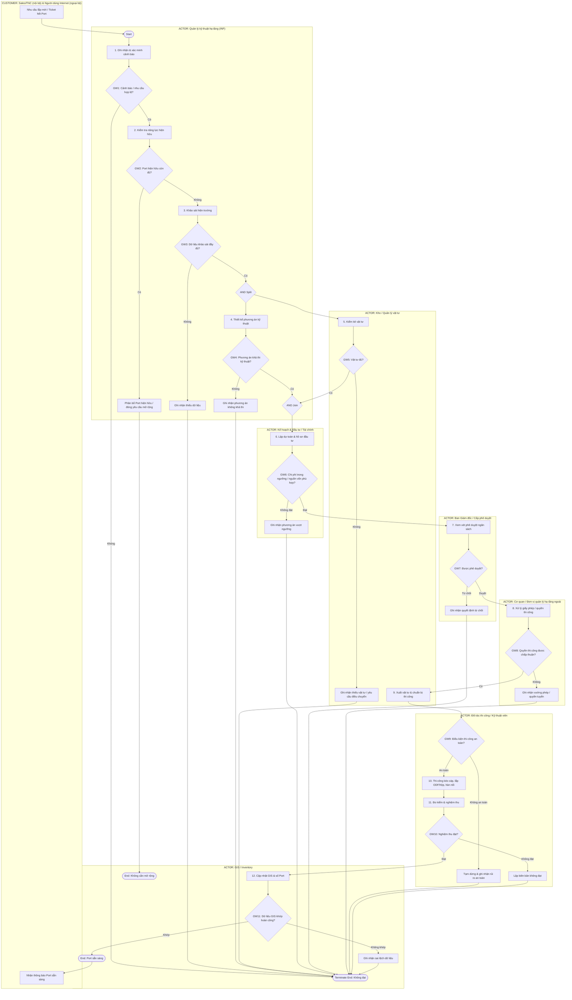
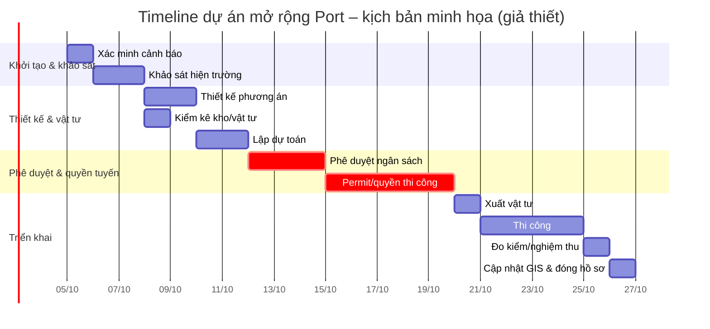

# 3.3. Quy trình quản lý 2: Quản lý và mở rộng hạ tầng viễn thông (Cáp quang & Port)

## Tóm tắt điều hành

Phần 3.3 được xây dựng theo đúng logic và mức độ chi tiết của phần 3.2 mà nhóm đã thực hiện: **mô tả quy trình → BPMN As-is → phân tích định tính → phân tích định lượng → kết luận/cải tiến**. Cách xử lý Gateway cũng kế thừa nguyên tắc của 3.2: nhánh ngoại lệ được kết thúc rõ ràng, không tạo vòng lặp vô hạn trong cùng một process instance.

Về chuẩn mô hình hóa, BPMN 2.0.2 của Object Management Group là đặc tả chính thức cho Business Process Model and Notation; OMG mô tả BPMN như một ký pháp đồ họa tiêu chuẩn nhằm làm cho quy trình có thể được hiểu bởi cả người dùng nghiệp vụ và người triển khai kỹ thuật.

Về nền tảng kỹ thuật cáp quang, ITU-T G.652 mô tả các thuộc tính hình học, cơ học và truyền dẫn của sợi quang đơn mode; phiên bản hiện hành G.652 được ITU-T phê duyệt tháng 8/2024. ITU-T G.657 tập trung vào sợi đơn mode có khả năng giảm tổn hao do uốn, đặc biệt phù hợp cho mạng truy nhập và các môi trường mật độ cáp cao. Với mạng truy nhập PON, ITU-T G.984.2 quy định các yêu cầu lớp vật lý của GPON, còn ITU-T G.9807.1 mô tả XGS-PON và kiến trúc truy nhập quang điểm-đa điểm.

FPT Telecom tiếp tục công khai định hướng đầu tư hạ tầng và nâng cao chất lượng kết nối trong năm 2026; tuy nhiên, không có SOP công khai đủ chi tiết để khẳng định đây là quy trình nội bộ chính thức của doanh nghiệp. Vì vậy, **toàn bộ vai trò chi tiết, Gateway, thời gian, chi phí, xác suất và KPI bên dưới được xây dựng như giả thiết học thuật phục vụ môn BPM**, không phải số liệu vận hành chính thức.

Kết quả định lượng của kịch bản giả thiết cho một dự án mở rộng quy mô nhỏ:

| Chỉ tiêu chính | Kết quả |
| --- | ---: |
| Cycle Time | **20,75 ngày (giả thiết)** |
| Processing Time theo đường găng | **10,05 ngày (giả thiết)** |
| Wait Time | **10,70 ngày (giả thiết)** |
| Cycle Time Efficiency | **48,43% (giả thiết)** |
| Tổng chi phí dự án | **74.400.000 VNĐ (giả thiết)** |
| Bottleneck lớn nhất | **Permit/quyền thi công: WT 4,50 ngày (giả thiết)** |
| Bottleneck thứ hai | **Phê duyệt ngân sách: WT 2,60 ngày (giả thiết)** |

### Mục lục

- [3.3.1. Mô tả quy trình](#331-mô-tả-quy-trình)
- [3.3.2. Mô hình hóa quy trình hiện tại BPMN As-is](#332-mô-hình-hóa-quy-trình-hiện-tại-bpmn-as-is)
- [3.3.3. Phân tích định tính](#333-phân-tích-định-tính)
- [3.3.4. Phân tích định lượng](#334-phân-tích-định-lượng)
- [3.3.5. Đề xuất To-be và kế hoạch hành động](#335-đề-xuất-to-be-và-kế-hoạch-hành-động)
- [Tài liệu tham khảo](#tài-liệu-tham-khảo)

## 3.3.1. Mô tả quy trình

**3.3.1.1. Mục tiêu**

Quy trình quản lý và mở rộng hạ tầng viễn thông nhằm phát hiện khu vực có nguy cơ thiếu năng lực phục vụ, xác minh nhu cầu, khảo sát hiện trường, lập phương án kỹ thuật và tài chính, xin phê duyệt, tổ chức thi công, nghiệm thu và cập nhật dữ liệu Port lên hệ thống quản lý/GIS. Đầu ra cuối cùng của quy trình là **hạ tầng sẵn sàng cung cấp dịch vụ** và **dữ liệu Port khả dụng được đồng bộ để các bộ phận liên quan có thể sử dụng**.

Trong mô hình này, “Port” được hiểu ở mức nghiệp vụ là **đơn vị năng lực kết nối khả dụng mà hệ thống quản lý hạ tầng sử dụng để đáp ứng yêu cầu triển khai thuê bao**. Tùy kiến trúc thực tế, Port có thể liên quan tới OLT/PON, splitter, ODF/hộp phối quang hoặc điểm đấu nối được quản lý trên GIS. Báo cáo không cố định một cấu hình PON cụ thể nhằm tránh gán sai kiến trúc nội bộ của doanh nghiệp.

Khái niệm ODN trong các chuẩn ITU mô tả hạ tầng quang điểm-đa điểm có thể bao gồm sợi quang, splitter, combiner, filter và các thành phần quang thụ động khác; điều này phù hợp với việc mô hình hóa quy trình ở mức quản trị tài sản và năng lực thay vì buộc quy trình phải phụ thuộc một cấu hình thiết bị duy nhất.

**3.3.1.2. Tác nhân tham gia – Actor**

| Actor | Vai trò trong quy trình |
| --- | --- |
| **Bộ phận Kinh doanh – Sales / Kỹ thuật triển khai thuê bao – TNC** | Gửi nhu cầu, ticket hoặc phản ánh khu vực không còn năng lực triển khai; là khách hàng nội bộ sử dụng kết quả mở rộng. |
| **Quản lý kỹ thuật hạ tầng – INF** | Process Owner; xác minh cảnh báo, khảo sát, thiết kế sơ bộ, điều phối thi công, nghiệm thu và xác nhận cập nhật GIS. |
| **Bộ phận Kế hoạch & Đầu tư / Tài chính** | Kiểm tra dự toán, nguồn vốn, hiệu quả đầu tư và tính đầy đủ của hồ sơ. |
| **Kho / Quản lý vật tư** | Kiểm kê tồn kho, xác nhận vật tư khả dụng, giữ/chuyển vật tư và đối soát xuất dùng. |
| **Ban Giám đốc / Cấp có thẩm quyền** | Phê duyệt hoặc từ chối đề xuất đầu tư theo hạn mức. |
| **Đối tác thi công / Kỹ thuật viên hiện trường** | Kéo cáp, lắp hộp/ODF, hàn nối, đo kiểm và sửa lỗi thi công. |
| **Cơ quan/đơn vị quản lý hạ tầng bên ngoài** | Xử lý giấy phép, quyền thi công, quyền sử dụng tuyến/cột/ống cống khi phát sinh. |
| **Hệ thống GIS / Inventory / NOC** | Ghi nhận trạng thái hạ tầng, số Port khả dụng, vị trí tài sản và bằng chứng nghiệm thu. |

Sự phụ thuộc vào đơn vị quản lý cột/tuyến là một giả thiết hợp lý về mặt nghiệp vụ. FPT từng công khai thỏa thuận với EVN Telecom cho phép sử dụng hạ tầng cột điện và phối hợp trong khảo sát, xây lắp, quản lý và vận hành hệ thống viễn thông. Nguồn này có tính lịch sử, nên báo cáo chỉ sử dụng để minh họa **sự tồn tại hợp lý của dependency bên ngoài**, không xem đó là cơ chế hiện hành của FPT Telecom.

**3.3.1.3. Khách hàng mục tiêu – Customer**

| Nhóm Customer | Nhu cầu nhận được từ quy trình |
| --- | --- |
| **Khách hàng nội bộ – Sales** | Biết khu vực có thể bán/lắp mới và thời điểm Port sẵn sàng. |
| **Khách hàng nội bộ – TNC/Kỹ thuật triển khai** | Có Port và tuyến cáp thực tế phù hợp với dữ liệu trên hệ thống để triển khai thuê bao. |
| **Khách hàng ngoại bộ – người dùng Internet** | Được rút ngắn thời gian chờ khi khu vực trước đó thiếu năng lực hạ tầng. |
| **Quản lý doanh nghiệp** | Có cơ sở kiểm soát CAPEX, tiến độ, chất lượng và mức sử dụng tài sản sau đầu tư. |

FPT Telecom hiện vẫn mô tả bước kiểm tra hạ tầng như một phần của quá trình cung cấp dịch vụ Internet tại một số khu vực, cho thấy tính hợp lý của việc coi trạng thái hạ tầng là điều kiện đầu vào quan trọng đối với Sales và triển khai thuê bao.

**3.3.1.4. Luồng các bước thực hiện – Workflow**

| STT | Bước thực hiện | Actor chính | Nội dung |
| ---: | --- | --- | --- |
| 1 | Ghi nhận và xác minh cảnh báo thiếu Port | INF | Nhận ticket từ Sales/TNC hoặc cảnh báo công suất; đối chiếu GIS/Inventory và danh sách nhu cầu. |
| 2 | Kiểm tra năng lực hiện hữu | INF | Xác định còn Port khả dụng có thể tái phân bổ hay thực sự phải mở rộng. |
| 3 | Khảo sát hiện trường | INF / Kỹ thuật viên | Kiểm tra tuyến cáp, tủ/hộp phối quang, điểm đấu nối, khoảng cách, điều kiện kéo cáp và rủi ro thi công. |
| 4 | Thiết kế phương án kỹ thuật | INF | Chọn tuyến, dung lượng, vị trí ODF/hộp, nhu cầu hàn nối và phương án đo kiểm. |
| 5 | Kiểm kê và xác nhận vật tư | Kho | Kiểm tra cáp, ODF/hộp, splitter, closure, pigtail, adapter và phụ kiện. Bước này chạy song song với bước 4 trong mô hình. |
| 6 | Lập dự toán và hồ sơ đầu tư | Kế hoạch & Đầu tư / INF | Tổng hợp khối lượng, chi phí, tiến độ, nhu cầu và rủi ro. |
| 7 | Phê duyệt ngân sách | Ban Giám đốc / Cấp thẩm quyền | Quyết định đầu tư hoặc kết thúc instance nếu không được phê duyệt. |
| 8 | Xin phép/quyền thi công | INF / Đơn vị bên ngoài | Hoàn thiện thủ tục liên quan tuyến, cột, mặt bằng, đào đường hoặc các quyền tiếp cận cần thiết. |
| 9 | Xuất vật tư và chuẩn bị thi công | Kho / Nhà thầu | Xuất đúng BOM, điều phối nhân lực, thiết bị đo và lịch thi công. |
| 10 | Thi công mở rộng | Nhà thầu / Kỹ thuật viên | Kéo cáp, lắp ODF/hộp, hàn nối, cố định tuyến và hoàn thiện hiện trường. |
| 11 | Đo kiểm và nghiệm thu | INF / Nhà thầu | Kiểm tra tuyến, mối nối, suy hao, nhãn, hồ sơ hoàn công và chất lượng lắp đặt. |
| 12 | Cập nhật GIS/Port và đóng yêu cầu | INF / GIS | Đồng bộ số Port/tài sản/tuyến mới; thông báo Sales/TNC và đóng hồ sơ. |

Bước thiết kế và kiểm kê vật tư được mô hình hóa song song để phản ánh một cơ hội giảm Cycle Time. Về mặt kỹ thuật, việc sử dụng sợi đơn mode và kiểm soát chất lượng đường truyền phù hợp với phạm vi mà ITU-T G.652/G.657 đặt ra cho sợi/cáp quang đơn mode và mạng truy nhập.

**3.3.1.5. Kịch bản thành công**

Một process instance được xem là hoàn thành thành công khi:

1. Nhu cầu mở rộng được xác minh hợp lệ.
2. Không còn giải pháp tái phân bổ Port hiện hữu phù hợp.
3. Khảo sát và phương án kỹ thuật đạt yêu cầu.
4. Vật tư và ngân sách được bảo đảm.
5. Quyền thi công cần thiết được chấp thuận.
6. Thi công và đo kiểm đạt tiêu chí nghiệm thu.
7. Dữ liệu GIS/Inventory khớp với hiện trạng vật lý.
8. Sales/TNC nhận được thông báo Port đã sẵn sàng.

**3.3.1.6. Kịch bản thất bại/ngoại lệ**

Để đồng nhất với cách mô hình hóa của 3.2, phiên bản As-is này **không tạo vòng lặp vô hạn trong cùng một process instance**. Khi một Gateway không đạt, quy trình đi vào Task xử lý ngoại lệ một chiều rồi kết thúc instance; nếu sau đó doanh nghiệp quyết định lập lại hồ sơ, trường hợp đó được xem là một instance mới.

Các trường hợp ngoại lệ chính:

- Cảnh báo thiếu Port không đúng hoặc dữ liệu nhu cầu không đủ.
- Vẫn còn Port hiện hữu có thể tái phân bổ nên không cần mở rộng.
- Khảo sát thiếu dữ liệu hoặc phương án không khả thi.
- Vật tư không đủ và không thể điều chuyển trong phạm vi instance hiện tại.
- Chi phí vượt hạn mức hoặc hồ sơ không được phê duyệt.
- Chưa có giấy phép/quyền thi công.
- Điều kiện thi công không bảo đảm an toàn.
- Nghiệm thu không đạt.
- GIS/Inventory không khớp với hồ sơ hoàn công.

**3.3.1.7. Business Value**

Quy trình tạo ra năm nhóm giá trị chính:

- **Khả năng phục vụ khách hàng:** chuyển khu vực “không đủ Port” thành khu vực có thể triển khai dịch vụ.
- **Giảm lead time triển khai thuê bao:** Sales/TNC có thông tin rõ về năng lực và tiến độ mở rộng.
- **Kiểm soát CAPEX:** đầu tư được gắn với nhu cầu, thiết kế và dự toán trước khi giải ngân.
- **Chất lượng và khả năng truy vết:** hạ tầng được nghiệm thu trước khi đưa vào trạng thái khả dụng.
- **Độ tin cậy dữ liệu:** GIS/Inventory được coi là một đầu ra bắt buộc, giảm chênh lệch giữa hạ tầng vật lý và dữ liệu điều phối.

FPT Telecom công khai trong năm 2026 rằng đầu tư hạ tầng và làm chủ công nghệ là nền tảng để nâng cao chất lượng kết nối và phát triển hạ tầng số. Điều này hỗ trợ việc lựa chọn “quản lý và mở rộng hạ tầng” như một quy trình quản lý phù hợp để phân tích trong bài học, nhưng không được dùng để suy diễn SOP nội bộ cụ thể.

## 3.3.2. Mô hình hóa quy trình hiện tại BPMN As-is

**Quy ước mô hình**

BPMN cung cấp ký pháp đồ họa để biểu diễn quy trình nghiệp vụ và được OMG chuẩn hóa; phiên bản đặc tả chính thức hiện được công bố là BPMN 2.0.2. Mermaid bên dưới được sử dụng như **bản nháp trực quan có swimlane mô phỏng**. Khi chuyển sang DOC/DOCX cuối cùng, nên dựng lại bằng Camunda Modeler, Bizagi hoặc draw.io với ký hiệu BPMN 2.0 chính thức.

Mô hình sử dụng **11 Gateway XOR** và **1 cặp AND Split/Join**, vượt yêu cầu “>7 Gateways”.

**Actor/Customer được hiển thị trên sơ đồ:**

- Customer nội bộ: Sales/TNC.
- Customer ngoại bộ: người dùng Internet chờ triển khai.
- Actor: INF.
- Actor: Kế hoạch & Đầu tư/Tài chính.
- Actor: Kho.
- Actor: Ban Giám đốc.
- Actor: Cơ quan/đơn vị quản lý hạ tầng ngoài.
- Actor: Đối tác thi công/Kỹ thuật viên.
- Actor: GIS/Inventory.

**BPMN As-is – Mermaid code**

**Danh sách Gateway và logic kiểm soát**

| Gateway | Loại | Điều kiện | Nhánh đạt | Nhánh không đạt |
| --- | --- | --- | --- | --- |
| GW1 | XOR | Cảnh báo/nhu cầu hợp lệ? | Kiểm tra năng lực | Terminate |
| GW2 | XOR | Port hiện hữu còn đủ? | Không cần mở rộng, kết thúc | Tiếp tục khảo sát |
| GW3 | XOR | Khảo sát đầy đủ? | AND Split | Ghi nhận thiếu dữ liệu → Terminate |
| GW4 | XOR | Phương án khả thi kỹ thuật? | AND Join | Ghi nhận không khả thi → Terminate |
| GW5 | XOR | Vật tư đủ? | AND Join | Ghi nhận thiếu vật tư → Terminate |
| GW6 | XOR | Chi phí/nguồn vốn phù hợp? | Trình phê duyệt | Terminate |
| GW7 | XOR | Ngân sách được duyệt? | Xin phép/quyền thi công | Terminate |
| GW8 | XOR | Quyền thi công được chấp thuận? | Xuất vật tư | Terminate |
| GW9 | XOR | Điều kiện thi công an toàn? | Thi công | Terminate |
| GW10 | XOR | Nghiệm thu đạt? | Cập nhật GIS | Terminate |
| GW11 | XOR | GIS khớp hoàn công? | Hoàn thành | Terminate |

**Nhận xét mô hình As-is**

Điểm nổi bật của luồng là hai nhóm kiểm soát:

**Kiểm soát trước đầu tư:** GW1 → GW8.

**Kiểm soát chất lượng và đóng vòng dữ liệu sau đầu tư:** GW9 → GW11.

Việc tách kiểm kê vật tư và thiết kế thành hai nhánh song song phản ánh một cơ hội thực tế để rút ngắn Cycle Time. Các nhánh thất bại đều có điểm kết thúc rõ ràng, bám cùng nguyên tắc thiết kế với phần 3.2 của nhóm.

## 3.3.3. Phân tích định tính

**3.3.3.1. Phân tích giá trị gia tăng – VA/BVA/NVA**

Quy ước sử dụng trong bài:

- **VA – Value-Adding:** trực tiếp tạo thêm khả năng cung cấp dịch vụ cho khách hàng.
- **BVA – Business Value-Adding:** không trực tiếp làm tăng giá trị sử dụng của dịch vụ nhưng cần cho quản trị, tài chính, an toàn, pháp lý hoặc chất lượng.
- **NVA – Non-Value-Adding:** không tạo thêm giá trị và cần giảm hoặc loại bỏ nếu có thể.

| STT | Hoạt động | Phân loại | Lý do | Hướng xử lý |
| ---: | --- | --- | --- | --- |
| 1 | Xác minh cảnh báo/nhu cầu | BVA | Ngăn đầu tư dựa trên dữ liệu sai | Tự động đối chiếu ticket–GIS |
| 2 | Kiểm tra Port hiện hữu | BVA | Tránh mở rộng khi có thể tái phân bổ | Dashboard Port thời gian gần thực |
| 3 | Khảo sát hiện trường | BVA | Cần để xác nhận khả thi và khối lượng | Checklist/mobile form |
| 4 | Thiết kế phương án kỹ thuật | BVA | Tạo cơ sở triển khai đúng cấu hình | Chuẩn hóa mẫu thiết kế |
| 5 | Kiểm kê vật tư | BVA | Bảo đảm khả năng thi công | Reservation vật tư theo dự án |
| 6 | Lập dự toán/hồ sơ đầu tư | BVA | Kiểm soát CAPEX và nguồn lực | Template BOM + đơn giá chuẩn |
| 7 | Phê duyệt ngân sách | BVA | Kiểm soát đầu tư | SLA + e-approval |
| 8 | Xin phép/quyền thi công | BVA | Điều kiện pháp lý/vận hành cần thiết | Hồ sơ chuẩn, theo dõi trạng thái |
| 9 | Xuất vật tư | BVA | Đưa nguồn lực tới công trường | Kitting vật tư theo BOM |
| 10 | Kéo cáp, lắp ODF/hộp, hàn nối | **VA** | Trực tiếp tạo năng lực hạ tầng mới | Chuẩn hóa thi công |
| 11 | Đo kiểm/nghiệm thu | BVA | Ngăn đưa hạ tầng lỗi vào khai thác | Biên bản điện tử + evidence |
| 12 | Cập nhật GIS/Port | BVA | Làm cho năng lực mới có thể được điều phối | Đồng bộ tự động từ nghiệm thu |
| 13 | Chờ phê duyệt | **NVA** | Không tạo thêm năng lực | Giảm bằng SLA |
| 14 | Chờ giấy phép/quyền tuyến | **NVA** | Không tạo thêm năng lực | Chuẩn bị hồ sơ sớm |
| 15 | Di chuyển bổ sung vật tư thiếu | **NVA** | Phát sinh do chuẩn bị/BOM chưa đủ | Kitting và kiểm kê trước xuất |

**Nhận xét:** VA vật lý tập trung chủ yếu tại bước thi công. Phần lớn hoạt động còn lại là BVA để bảo đảm đầu tư đúng, an toàn và có thể vận hành. Vì vậy, cải tiến không nên hiểu là loại bỏ các BVA mà là **rút ngắn thời gian, chuẩn hóa dữ liệu và số hóa việc kiểm soát**.

Hai NVA có khả năng chi phối Cycle Time là:

> **Chờ phê duyệt ngân sách**

và

> **Chờ giấy phép/quyền thi công.**

**3.3.3.2. Phân tích Lean 7 Wastes**

| Waste | Biểu hiện trong quy trình | Tác động | Ưu tiên | Biện pháp |
| --- | --- | --- | --- | --- |
| **Transportation** | Chuyển cáp, ODF/hộp và phụ kiện nhiều chuyến từ kho tới công trường | Tăng chi phí logistics, rủi ro thất lạc | Trung bình | Kitting theo BOM, gom chuyến |
| **Inventory** | Giữ dư cáp/phụ kiện hoặc tồn sai chủng loại so với nhu cầu | Chiếm vốn và diện tích kho | Trung bình | Min–max theo vùng, reservation theo dự án |
| **Motion** | Kỹ thuật viên phải quay lại kho/điểm khảo sát để lấy thông tin hoặc vật tư thiếu | Tăng PT và chi phí nhân lực | Cao | Mobile checklist, ảnh hiện trường, BOM chuẩn |
| **Waiting** | Chờ phê duyệt ngân sách và chờ giấy phép/quyền tuyến | Kéo dài Cycle Time | **Rất cao** | SLA, e-approval, permit checklist |
| **Overproduction** | Mở rộng dung lượng quá sớm so với nhu cầu đã xác minh | CAPEX sử dụng thấp | Trung bình | Ngưỡng đầu tư + forecast |
| **Over-processing** | Nhập lại cùng thông tin vào ticket, Excel, hồ sơ và GIS | Tăng thao tác, nguy cơ sai dữ liệu | Cao | Single source of truth, API/workflow |
| **Defects/Rework** | Sai khảo sát, sai BOM, mối hàn/suy hao không đạt, GIS cập nhật sai | Thi công lại, trì hoãn khai thác | **Rất cao** | QA checklist + đo kiểm + xác nhận GIS |

**Kết luận:** hai loại waste cần ưu tiên là **Waiting** và **Defects/Rework**. Waiting kéo dài trực tiếp Cycle Time; Defects/Rework vừa làm tăng thời gian vừa tăng chi phí và ảnh hưởng chất lượng dữ liệu.

**3.3.3.3. Stakeholder Analysis**

| Stakeholder | Mức ảnh hưởng | Mức quan tâm | Kỳ vọng chính | Rủi ro nếu phối hợp kém | Chiến lược tương tác |
| --- | --- | --- | --- | --- | --- |
| INF | Cao | Cao | Dữ liệu đúng, thi công đúng chuẩn, tiến độ rõ | Quy trình bị nghẽn tại nhiều điểm | Manage closely |
| Sales/TNC | Trung bình–Cao | Cao | Có Port đúng thời điểm, GIS đúng | Mất cơ hội bán/lắp, điều phối sai | Cập nhật ETA và trạng thái |
| Kế hoạch & Đầu tư/Tài chính | Cao | Cao | CAPEX có căn cứ, kiểm soát vượt ngân sách | Trả hồ sơ/chậm duyệt | Chuẩn BOM–cost–benefit |
| Ban Giám đốc | Cao | Trung bình–Cao | Quyết định nhanh trên dữ liệu tin cậy | Chờ duyệt kéo dài | Dashboard và SLA |
| Kho | Trung bình | Cao | BOM rõ, tồn kho chính xác | Thiếu/dư vật tư | Reservation + scan xuất kho |
| Đối tác thi công | Trung bình | Cao | Mặt bằng, vật tư, bản vẽ rõ | Thi công chậm/rework | Work package chuẩn |
| Đơn vị quản lý hạ tầng ngoài | Cao tại bước permit | Trung bình | Hồ sơ đầy đủ, tuân thủ điều kiện | Trễ quyền thi công | Chuẩn hồ sơ và đầu mối |
| Khách hàng ngoại bộ | Thấp về quyền quyết định | Rất cao | Có dịch vụ đúng hẹn | Chờ lắp lâu, hủy nhu cầu | Thông báo ETA qua Sales |

**3.3.3.4. Issue Register**

Các xác suất dưới đây đều là **giả thiết mô hình**, chỉ phục vụ việc so sánh mức độ ưu tiên trong bài học.

| ID | Vấn đề | Biểu hiện | Nguyên nhân sơ bộ | Xác suất | Tác động | Mức ưu tiên |
| --- | --- | --- | --- | ---: | --- | --- |
| **ISS-01** | Chậm/sai cập nhật Port lên GIS | Thi công xong nhưng hệ thống chưa phản ánh Port khả dụng | Nhập tay, bàn giao hồ sơ chậm, thiếu bước reconcile | **35% (giả thiết)** | Sales/TNC khảo sát “ảo”, bỏ sót năng lực mới | **Cao** |
| **ISS-02** | Hao hụt/chênh vật tư so với dự toán | Cáp/phụ kiện thực dùng khác BOM | Khảo sát tuyến chưa chính xác, dự phòng không chuẩn | **25% (giả thiết)** | Tăng chi phí, phát sinh chuyến kho | Trung bình–Cao |
| **ISS-03** | Chậm giấy phép/quyền sử dụng hạ tầng | Không thể thi công theo lịch | Hồ sơ thiếu, phụ thuộc bên ngoài, lịch xử lý không đồng bộ | **30% (giả thiết)** | Bottleneck lớn, kéo dài Cycle Time | **Cao** |

**3.3.3.5. Root Cause Analysis – 5 Whys cho ISS-01**

**Vấn đề:** Port mới đã được nghiệm thu nhưng chưa sẵn sàng trên GIS/Inventory.

| Why | Câu hỏi | Trả lời phân tích |
| ---: | --- | --- |
| 1 | Tại sao GIS chưa có Port mới? | Vì hồ sơ hoàn công chưa được nhập/xác nhận ngay sau nghiệm thu. |
| 2 | Tại sao hồ sơ chưa được nhập ngay? | Vì thông tin nghiệm thu và cập nhật GIS là hai thao tác tách rời. |
| 3 | Tại sao hai thao tác tách rời? | Vì chưa có workflow bắt buộc “nghiệm thu → tạo yêu cầu cập nhật → reconcile”. |
| 4 | Tại sao chưa có workflow bắt buộc? | Vì trách nhiệm và SLA cập nhật dữ liệu chưa được gắn rõ với trạng thái đóng dự án. |
| 5 | Tại sao trách nhiệm/SLA chưa rõ? | Vì mô hình quản trị ưu tiên hoàn tất thi công vật lý hơn là hoàn tất vòng đời dữ liệu tài sản. |

**Root cause đề xuất:**

> Thiếu cơ chế **close-the-loop** giữa nghiệm thu vật lý và cập nhật dữ liệu.

Biện pháp xử lý ở tầng nguyên nhân gốc không phải chỉ “nhắc nhân viên nhập GIS nhanh hơn”, mà là **không cho phép đóng dự án nếu GW11 chưa xác nhận dữ liệu GIS khớp hồ sơ hoàn công**.

**3.3.3.6. Root Cause Analysis – 5 Whys cho ISS-03**

**Vấn đề:** dự án bị chậm vì chưa có quyền thi công/quyền tuyến.

| Why | Câu hỏi | Trả lời phân tích |
| ---: | --- | --- |
| 1 | Tại sao chưa thể thi công? | Vì quyền sử dụng tuyến/cột/mặt bằng chưa được chấp thuận. |
| 2 | Tại sao chấp thuận chậm? | Vì hồ sơ phải bổ sung hoặc chờ xác minh hiện trường. |
| 3 | Tại sao phải bổ sung? | Vì bộ hồ sơ ban đầu chưa chuẩn hóa theo loại tuyến và yêu cầu của đơn vị quản lý. |
| 4 | Tại sao chưa chuẩn hóa? | Vì dữ liệu permit lịch sử và checklist chưa được quản lý thành bộ mẫu dùng lại. |
| 5 | Tại sao chưa có bộ mẫu dùng lại? | Vì hoạt động xin phép được xử lý theo từng dự án thay vì quản lý như một capability có SLA và knowledge base. |

**Root cause đề xuất:**

> Permit management chưa được chuẩn hóa và chưa được khởi động đủ sớm.

Biện pháp xử lý là phân loại tuyến ngay tại bước khảo sát, sử dụng checklist theo từng loại quyền thi công và chuẩn bị permit sớm thay vì chỉ bắt đầu sau khi toàn bộ hồ sơ đầu tư đã hoàn tất.

## 3.3.4. Phân tích định lượng

**3.3.4.1. Phạm vi và nguyên tắc giả thiết**

Toàn bộ số liệu trong phần 3.3.4 là **giả thiết phục vụ việc học và phân tích BPM**, không phải dữ liệu vận hành chính thức của FPT Telecom.

Kịch bản định lượng giả định một dự án mở rộng quy mô nhỏ tại một khu vực đã xác nhận thiếu Port, gồm khoảng:

- **2,0 km cáp quang (giả thiết)**.
- **2 bộ ODF/hộp phối quang 48FO (giả thiết)**.
- Một số splitter, măng xông/closure và phụ kiện đi kèm **(giả thiết)**.
- Một đội triển khai hiện trường quy mô nhỏ **(giả thiết)**.

Để đồng nhất với 3.2, thời gian được tính trên **đường đi thành công**; không cộng một chuỗi vòng lặp xử lý lại vô hạn.

Hai bước:

> Thiết kế phương án kỹ thuật

và

> Kiểm kê vật tư

được chạy song song. Vì vậy Cycle Time của nhóm này sử dụng **max()**, không phải phép cộng.

**3.3.4.2. Cycle Time, Processing Time và Wait Time**

| Bước | Hoạt động | CT | PT | WT = CT − PT | Ghi chú |
| ---: | --- | ---: | ---: | ---: | --- |
| 1 | Xác minh cảnh báo/nhu cầu | **0,50 ngày (giả thiết)** | **0,25 ngày (giả thiết)** | **0,25 ngày (giả thiết)** | Đối chiếu ticket/GIS |
| 2 | Khảo sát hiện trường | **2,00 ngày (giả thiết)** | **1,20 ngày (giả thiết)** | **0,80 ngày (giả thiết)** | Gồm lịch hẹn/di chuyển |
| 3 | Kiểm kê vật tư | **1,00 ngày (giả thiết)** | **0,35 ngày (giả thiết)** | **0,65 ngày (giả thiết)** | Chạy song song bước 4 |
| 4 | Thiết kế phương án | **2,00 ngày (giả thiết)** | **1,50 ngày (giả thiết)** | **0,50 ngày (giả thiết)** | Chạy song song bước 3 |
| 5 | Lập dự toán/hồ sơ đầu tư | **1,50 ngày (giả thiết)** | **1,00 ngày (giả thiết)** | **0,50 ngày (giả thiết)** | |
| 6 | Phê duyệt ngân sách | **3,00 ngày (giả thiết)** | **0,40 ngày (giả thiết)** | **2,60 ngày (giả thiết)** | **Bottleneck 1** |
| 7 | Xin phép/quyền thi công | **5,00 ngày (giả thiết)** | **0,50 ngày (giả thiết)** | **4,50 ngày (giả thiết)** | **Bottleneck 2** |
| 8 | Xuất vật tư/chuẩn bị | **1,00 ngày (giả thiết)** | **0,50 ngày (giả thiết)** | **0,50 ngày (giả thiết)** | |
| 9 | Thi công kéo cáp/lắp/hàn | **4,00 ngày (giả thiết)** | **3,50 ngày (giả thiết)** | **0,50 ngày (giả thiết)** | VA chính |
| 10 | Đo kiểm/nghiệm thu | **1,00 ngày (giả thiết)** | **0,75 ngày (giả thiết)** | **0,25 ngày (giả thiết)** | |
| 11 | Cập nhật GIS/Port | **0,50 ngày (giả thiết)** | **0,30 ngày (giả thiết)** | **0,20 ngày (giả thiết)** | |
| 12 | Thông báo Sales/TNC & đóng hồ sơ | **0,25 ngày (giả thiết)** | **0,15 ngày (giả thiết)** | **0,10 ngày (giả thiết)** | |

**Tính Cycle Time**

Do bước 3 và bước 4 chạy song song:

\[
T_{3-4}=\max(1,00;\;2,00)
\]

\[
T_{3-4}=2,00\text{ ngày (giả thiết)}
\]

Do đó:

\[
CT_{total}
=

0,50+2,00+2,00+1,50+3,00+5,00+1,00+4,00+1,00+0,50+0,25
\]

\[
\boxed{CT_{total}=20,75\text{ ngày (giả thiết)}}
\]

**Tính Processing Time theo đường găng**

Đối với cụm chạy song song:

\[
PT_{3-4}=\max(0,35;\;1,50)
\]

\[
PT_{3-4}=1,50\text{ ngày (giả thiết)}
\]

Tổng PT:

\[
PT_{total}
=

0,25+1,20+1,50+1,00+0,40+0,50+0,50+3,50+0,75+0,30+0,15
\]

\[
\boxed{PT_{total}=10,05\text{ ngày (giả thiết)}}
\]

**Tính Wait Time**

\[
WT_{total}=CT_{total}-PT_{total}
\]

\[
WT_{total}=20,75-10,05
\]

\[
\boxed{WT_{total}=10,70\text{ ngày (giả thiết)}}
\]

**Cycle Time Efficiency**

\[
Cycle\ Time\ Efficiency
=

\frac{PT_{total}}{CT_{total}}\times100\%
\]

\[
=

\frac{10,05}{20,75}\times100\%
\]

\[
\boxed{Cycle\ Time\ Efficiency\approx48,43\%\text{ (giả thiết)}}
\]

Phần thời gian không xử lý trực tiếp:

\[
100\%-48,43\%=51,57\%\text{ (giả thiết)}
\]

Hai bottleneck phê duyệt ngân sách và permit tạo tổng Wait Time:

\[
2,60+4,50=7,10\text{ ngày (giả thiết)}
\]

Tỷ trọng trong tổng Wait Time:

\[
\frac{7,10}{10,70}\times100\%
\approx66,36\%\text{ (giả thiết)}
\]

Như vậy, theo bộ giả thiết, **hai bottleneck này chiếm khoảng 66,36% tổng Wait Time**. Phép tính được kiểm tra trực tiếp từ các tham số của mô hình.

**Nhận xét:** nếu mục tiêu là giảm Cycle Time, can thiệp vào workflow phê duyệt và permit có khả năng mang lại hiệu quả lớn hơn việc chỉ yêu cầu đội thi công kéo cáp nhanh hơn.

**3.3.4.3. Phân tích chi phí**

Tất cả đơn giá trong phần này là **giá mô phỏng (giả thiết)** và không phải báo giá mua sắm thực tế.

**Chi phí vật tư**

| Hạng mục | Khối lượng | Đơn giá | Thành tiền |
| --- | ---: | ---: | ---: |
| Cáp quang 24FO | **2.000 m (giả thiết)** | **12.500 VNĐ/m (giả thiết)** | **25.000.000 VNĐ (giả thiết)** |
| ODF/hộp phối quang 48FO | **2 bộ (giả thiết)** | **3.500.000 VNĐ/bộ (giả thiết)** | **7.000.000 VNĐ (giả thiết)** |
| Splitter quang | **6 bộ (giả thiết)** | **450.000 VNĐ/bộ (giả thiết)** | **2.700.000 VNĐ (giả thiết)** |
| Măng xông/closure/hộp đấu | **8 bộ (giả thiết)** | **650.000 VNĐ/bộ (giả thiết)** | **5.200.000 VNĐ (giả thiết)** |
| Pigtail, adapter, patch cord | **1 lô (giả thiết)** | **4.000.000 VNĐ/lô (giả thiết)** | **4.000.000 VNĐ (giả thiết)** |
| Phụ kiện treo/ống/neo/bảo vệ tuyến | **1 lô (giả thiết)** | **6.000.000 VNĐ/lô (giả thiết)** | **6.000.000 VNĐ (giả thiết)** |
| Vật tư tiêu hao | **1 lô (giả thiết)** | **2.500.000 VNĐ/lô (giả thiết)** | **2.500.000 VNĐ (giả thiết)** |
| **Tổng vật tư** | | | **52.400.000 VNĐ (giả thiết)** |

Các chủng loại cáp/sợi thực tế phải được chọn theo thiết kế mạng, tiêu chuẩn doanh nghiệp và điều kiện lắp đặt. ITU-T G.652 là khuyến nghị nền tảng về sợi đơn mode, trong khi G.657 đưa ra các đặc tính cho sợi có khả năng chịu uốn tốt hơn và đặc biệt phù hợp với mạng truy nhập hoặc các khu vực có không gian hạn chế.

**Chi phí nhân công**

| Hạng mục | Thành tiền |
| --- | ---: |
| Khảo sát + thiết kế | **3.500.000 VNĐ (giả thiết)** |
| Nhân công kéo cáp/lắp đặt | **5.500.000 VNĐ (giả thiết)** |
| Hàn nối + đo kiểm | **3.000.000 VNĐ (giả thiết)** |
| Giám sát/nghiệm thu hiện trường | **2.000.000 VNĐ (giả thiết)** |
| **Tổng nhân công** | **14.000.000 VNĐ (giả thiết)** |

**Chi phí thủ tục và quản lý**

| Hạng mục | Thành tiền |
| --- | ---: |
| Phí/hồ sơ/quyền thi công | **4.000.000 VNĐ (giả thiết)** |
| Quản lý dự án, hồ sơ, cập nhật dữ liệu | **4.000.000 VNĐ (giả thiết)** |
| **Tổng** | **8.000.000 VNĐ (giả thiết)** |

**Tổng chi phí dự án**

\[
C_{total}
=

C_{vật\ tư}
+
C_{nhân\ công}
+
C_{permit}
+
C_{quản\ lý}
\]

\[
=

52.400.000
+
14.000.000
+
4.000.000
+
4.000.000
\]

\[
\boxed{C_{total}=74.400.000\text{ VNĐ (giả thiết)}}
\]

Tỷ trọng chi phí vật tư:

\[
\frac{52.400.000}{74.400.000}\times100\%
=

70,43\%\text{ (giả thiết)}
\]

Chi phí cơ hội do khách hàng chờ lắp chưa đưa vào tổng chi phí vì không có dữ liệu thực tế về số khách hàng chờ, ARPU và contribution margin. Khi có dữ liệu, có thể mở rộng bằng:

\[
Opportunity\ Loss
=

N_{khách\ chờ}
\times
Contribution\ Margin_{tháng}
\times
\frac{Số\ ngày\ chờ}{30}
\]

**3.3.4.4. BPMN định lượng thời gian và chi phí tại từng Task**

Sơ đồ BPMN thứ hai copy đường đi chính của As-is nhưng tập trung vào:

- Thời gian tại từng Task.
- Chi phí tại từng Task.
- Bước kiểm kê kho/vật tư.
- Hai bottleneck được tô nổi.
- Tổng chi phí node bằng tổng chi phí dự án.

```mermaid
flowchart LR
    classDef normal fill:#ffffff,stroke:#333,stroke-width:1px;
    classDef bottleneck fill:#ffe0e0,stroke:#b30000,stroke-width:3px;
    classDef value fill:#e9f7ef,stroke:#2d7d46,stroke-width:2px;
    classDef event fill:#ffffff,stroke:#333,stroke-width:2px;

    S([Start]):::event

    T1["Xác minh cảnh báo<br/>CT: 0,50 ngày (giả thiết)<br/>Cost: 150.000 VNĐ (giả thiết)"]:::normal

    T2["Khảo sát hiện trường<br/>CT: 2,00 ngày (giả thiết)<br/>Cost: 1.500.000 VNĐ (giả thiết)"]:::normal

    A1{"AND"}:::normal

    T3["Kiểm kê kho/vật tư<br/>CT: 1,00 ngày (giả thiết)<br/>Cost: 250.000 VNĐ (giả thiết)"]:::normal

    T4["Thiết kế phương án<br/>CT: 2,00 ngày (giả thiết)<br/>Cost: 1.800.000 VNĐ (giả thiết)"]:::normal

    A2{"AND"}:::normal

    T5["Lập dự toán/hồ sơ<br/>CT: 1,50 ngày (giả thiết)<br/>Cost: 1.000.000 VNĐ (giả thiết)"]:::normal

    T6["PHÊ DUYỆT NGÂN SÁCH<br/>CT: 3,00 ngày (giả thiết)<br/>Cost: 500.000 VNĐ (giả thiết)<br/>WT: 2,60 ngày (giả thiết)"]:::bottleneck

    T7["PERMIT / QUYỀN THI CÔNG<br/>CT: 5,00 ngày (giả thiết)<br/>Cost: 4.000.000 VNĐ (giả thiết)<br/>WT: 4,50 ngày (giả thiết)"]:::bottleneck

    T8["Xuất vật tư<br/>CT: 1,00 ngày (giả thiết)<br/>Cost: 52.400.000 VNĐ (giả thiết)"]:::normal

    T9["Thi công kéo cáp/lắp/hàn<br/>CT: 4,00 ngày (giả thiết)<br/>Cost: 8.500.000 VNĐ (giả thiết)"]:::value

    T10["Đo kiểm & nghiệm thu<br/>CT: 1,00 ngày (giả thiết)<br/>Cost: 3.500.000 VNĐ (giả thiết)"]:::normal

    T11["Cập nhật GIS/Port<br/>CT: 0,50 ngày (giả thiết)<br/>Cost: 400.000 VNĐ (giả thiết)"]:::normal

    T12["Thông báo Sales/TNC<br/>CT: 0,25 ngày (giả thiết)<br/>Cost: 400.000 VNĐ (giả thiết)"]:::normal

    E([End: Port sẵn sàng]):::event

    S --> T1 --> T2 --> A1
    A1 --> T3 --> A2
    A1 --> T4 --> A2
    A2 --> T5 --> T6 --> T7 --> T8 --> T9 --> T10 --> T11 --> T12 --> E
```

**Kiểm tra tổng chi phí ghi trên các node**

Đơn vị: triệu VNĐ.

\[
0,15
+1,50
+0,25
+1,80
+1,00
+0,50
+4,00
+52,40
+8,50
+3,50
+0,40
+0,40
\]

\[
=\boxed{74,40\text{ triệu VNĐ (giả thiết)}}
\]

Lưu ý: phân bổ chi phí theo node được thiết kế để phục vụ việc **đọc BPMN định lượng**. Chi phí vật tư được tập trung tại Task “Xuất vật tư”; nhân công và quản lý được phân bổ vào các Task tương ứng.

**3.3.4.5. Quality KPIs**

| KPI | Baseline | Mục tiêu To-be | Công thức/ý nghĩa |
| --- | ---: | ---: | --- |
| First Pass Acceptance | **88% (giả thiết)** | **≥95% (giả thiết)** | Dự án đạt nghiệm thu lần đầu / Tổng dự án nghiệm thu |
| GIS Update ≤ 1 ngày làm việc | **80% (giả thiết)** | **≥98% (giả thiết)** | Dự án cập nhật GIS đúng SLA / Tổng dự án hoàn tất |
| Sai lệch Port vật lý–GIS | **7% (giả thiết)** | **≤2% (giả thiết)** | Port sai lệch / Tổng Port kiểm tra |
| Đo kiểm quang đạt lần đầu | **90% (giả thiết)** | **≥97% (giả thiết)** | Tuyến/mối nối đạt lần đầu / Tổng đo kiểm |
| Schedule Adherence | **75% (giả thiết)** | **≥90% (giả thiết)** | Dự án hoàn tất đúng/trước kế hoạch / Tổng dự án |
| Material Variance | **8% (giả thiết)** | **≤3% (giả thiết)** | \|Thực dùng − BOM\| / BOM |
| Safety Incident | **1 sự cố/100 dự án (giả thiết)** | **0 sự cố (giả thiết)** | Số sự cố an toàn phải báo cáo |

Báo cáo không tự đặt một ngưỡng suy hao quang tuyệt đối áp dụng cho mọi trường hợp, bởi giá trị nghiệm thu phải phụ thuộc kiến trúc ODN, optical budget, thiết bị, bước sóng, splitter và tiêu chuẩn nội bộ. ITU-T G.984.2 mô tả yêu cầu lớp PMD và các optical budget của GPON; ITU-T G.9807.1 cũng mô tả quan hệ giữa công suất phát, độ nhạy thu, optical path loss và path penalty trong XGS-PON.

**3.3.4.6. Timeline dự án – Mermaid Gantt**

Mốc thời gian dưới đây là **lịch minh họa hoàn toàn giả thiết**, bắt đầu ngày **05/10/2026 (giả thiết)**; không đại diện cho một dự án FPT Telecom thực tế.

Gantt sử dụng ngày nguyên để dễ đọc, nên các công việc dưới một ngày đã được làm tròn. Vì vậy biểu đồ timeline không cần trùng tuyệt đối với Cycle Time chi tiết **20,75 ngày (giả thiết)**.

**3.3.4.7. Tổng hợp kết quả định lượng**

| Chỉ tiêu | Kết quả |
| --- | ---: |
| Cycle Time đường đi thành công | **20,75 ngày (giả thiết)** |
| Processing Time đường găng | **10,05 ngày (giả thiết)** |
| Wait Time | **10,70 ngày (giả thiết)** |
| Cycle Time Efficiency | **48,43% (giả thiết)** |
| WT tại phê duyệt ngân sách | **2,60 ngày (giả thiết)** |
| WT tại permit/quyền thi công | **4,50 ngày (giả thiết)** |
| Tỷ trọng hai bottleneck trong tổng WT | **66,36% (giả thiết)** |
| Tổng chi phí dự án | **74.400.000 VNĐ (giả thiết)** |
| Tỷ trọng vật tư trong tổng chi phí | **70,43% (giả thiết)** |

**Nhận xét định lượng**

Theo bộ giả thiết, bottleneck lớn nhất **không phải bản thân hoạt động kéo cáp**.

Thi công có:

- CT = **4,00 ngày (giả thiết)**.
- PT = **3,50 ngày (giả thiết)**.
- WT = **0,50 ngày (giả thiết)**.

Trong khi phê duyệt + permit có:

\[
CT=3,00+5,00=8,00\text{ ngày (giả thiết)}
\]

nhưng Processing Time chỉ:

\[
PT=0,40+0,50=0,90\text{ ngày (giả thiết)}
\]

và Wait Time:

\[
WT=7,10\text{ ngày (giả thiết)}
\]

Do đó, từ góc nhìn BPM, **giảm thời gian chờ ra quyết định và chờ quyền thi công có giá trị cải tiến lớn hơn việc chỉ tối ưu tốc độ kéo cáp**.

## 3.3.5. Đề xuất To-be và kế hoạch hành động

**3.3.5.1. Nguyên tắc thiết kế To-be**

Quy trình To-be không nên loại bỏ các điểm kiểm soát về tài chính, an toàn và chất lượng chỉ để làm Cycle Time “đẹp hơn”. Mục tiêu hợp lý là:

> **giữ kiểm soát nhưng giảm Waiting, giảm thao tác thủ công, giảm nhập liệu lặp lại và tăng First Pass Quality.**

**Các đề xuất cải tiến**

| Mã | Đề xuất | Vấn đề xử lý | Kết quả kỳ vọng |
| --- | --- | --- | --- |
| **IMP-01** | Cảnh báo năng lực Port theo ngưỡng + forecast nhu cầu | Chỉ phản ứng khi đã hết Port | Khởi động mở rộng sớm |
| **IMP-02** | Single source of truth giữa Ticket–GIS–Inventory | ISS-01, Over-processing | Giảm sai lệch và nhập lại |
| **IMP-03** | E-approval + SLA theo hạn mức đầu tư | Waiting tại GW6/GW7 | Rút ngắn phê duyệt |
| **IMP-04** | Checklist khảo sát số hóa + ảnh/GPS/bằng chứng bắt buộc | ISS-02, Defects | BOM và thiết kế chính xác hơn |
| **IMP-05** | Permit playbook theo loại tuyến/cột/mặt bằng | ISS-03 | Khởi động permit sớm, giảm bổ sung hồ sơ |
| **IMP-06** | Reservation/kitting vật tư theo BOM dự án | Transportation, Motion, Inventory | Giảm quay lại kho và thiếu vật tư |
| **IMP-07** | Digital acceptance package: ảnh, kết quả đo, biên bản, as-built | Defects/Rework, ISS-01 | Tăng First Pass và truy vết |
| **IMP-08** | Auto-trigger cập nhật GIS sau nghiệm thu + GW reconcile bắt buộc | ISS-01 | Không đóng dự án khi dữ liệu chưa khớp |
| **IMP-09** | Dashboard KPI end-to-end | Thiếu minh bạch bottleneck | Quản lý CT, WT, SLA, FPY theo dự án |

Như vậy báo cáo đưa ra **9 đề xuất**, vượt yêu cầu tối thiểu 6 đề xuất.

**3.3.5.2. Kịch bản tác động To-be**

Mục tiêu Cycle Time giả thiết:

\[
20,75\rightarrow14,00\text{ ngày}
\]

Tỷ lệ giảm:

\[
\frac{20,75-14,00}{20,75}\times100\%
\approx32,53\%\text{ (giả thiết)}
\]

Các thay đổi mục tiêu:

| Chỉ tiêu | As-is | To-be |
| --- | ---: | ---: |
| Phê duyệt ngân sách | **3,00 ngày (giả thiết)** | **1,50 ngày (giả thiết)** |
| Permit/quyền thi công | **5,00 ngày (giả thiết)** | **2,50 ngày (giả thiết)** |
| Cập nhật GIS | **0,50 ngày (giả thiết)** | **0,25 ngày (giả thiết)** |
| First Pass Acceptance | **88% (giả thiết)** | **≥95% (giả thiết)** |
| Sai lệch Port vật lý–GIS | **7% (giả thiết)** | **≤2% (giả thiết)** |

Đây là **target học thuật**, không phải cam kết vận hành. Khi có process log thực tế, target phải được hiệu chỉnh theo median, P75/P90 và năng lực nguồn lực thực tế.

**3.3.5.3. Kế hoạch hành động ngắn hạn**

| Giai đoạn | Thời gian | Hành động chính | Deliverable |
| --- | --- | --- | --- |
| **Bước 1 – Chuẩn hóa** | **Ngày 0–30 (giả thiết)** | Chốt RACI; định nghĩa Port; chuẩn checklist khảo sát, BOM, permit, nghiệm thu; đo baseline CT/WT | Bộ SOP/checklist + baseline KPI |
| **Bước 2 – Pilot số hóa** | **Ngày 31–60 (giả thiết)** | Pilot e-approval, reservation vật tư, nghiệm thu số và cập nhật GIS có SLA tại một khu vực | Workflow pilot + dữ liệu log |
| **Bước 3 – Đánh giá và mở rộng** | **Ngày 61–90 (giả thiết)** | So sánh KPI trước/sau, sửa bottleneck, chuẩn hóa To-be và mở rộng phạm vi | Báo cáo pilot + BPMN To-be |

**3.3.5.4. KPIs theo dõi sau cải tiến**

| KPI theo dõi | Baseline | Mục tiêu sau pilot |
| --- | ---: | ---: |
| Cycle Time | **20,75 ngày (giả thiết)** | **≤14,00 ngày (giả thiết)** |
| Wait Time | **10,70 ngày (giả thiết)** | **≤5,00 ngày (giả thiết)** |
| Cycle Time Efficiency | **48,43% (giả thiết)** | **≥65% (giả thiết)** |
| Approval SLA đạt | **70% (giả thiết)** | **≥95% (giả thiết)** |
| Permit đúng kế hoạch | **65% (giả thiết)** | **≥90% (giả thiết)** |
| First Pass Acceptance | **88% (giả thiết)** | **≥95% (giả thiết)** |
| GIS Update ≤1 ngày | **80% (giả thiết)** | **≥98% (giả thiết)** |
| Sai lệch Port vật lý–GIS | **7% (giả thiết)** | **≤2% (giả thiết)** |
| Material Variance | **8% (giả thiết)** | **≤3% (giả thiết)** |

**3.3.5.5. Kết luận quy trình**

Quy trình quản lý và mở rộng hạ tầng cáp quang & Port là một quy trình liên phòng ban rõ rệt. Nhu cầu có thể xuất phát từ Sales/TNC, nhưng khả năng hoàn thành phụ thuộc đồng thời vào INF, Kho, Kế hoạch & Đầu tư/Tài chính, cấp phê duyệt, đơn vị quản lý hạ tầng bên ngoài, nhà thầu và hệ thống GIS. Vì vậy, hiệu suất quy trình **không thể chỉ được đánh giá bằng thời gian kéo cáp**.

Mô hình As-is sử dụng **11 Gateway XOR cùng một cặp AND Split/Join**, thể hiện các điểm kiểm soát:

> Nhu cầu → Port hiện hữu → Khảo sát → Kỹ thuật → Vật tư → Tài chính → Phê duyệt → Permit → An toàn → Nghiệm thu → GIS.

Cách tổ chức này đồng nhất với triết lý của phần 3.2: Gateway không chỉ được đặt để làm sơ đồ phức tạp hơn, mà phải đại diện cho **một quyết định nghiệp vụ có khả năng làm thay đổi đường đi của process instance**.

Theo bộ dữ liệu giả thiết:

\[
CT=20,75\text{ ngày}
\]

\[
PT=10,05\text{ ngày}
\]

\[
WT=10,70\text{ ngày}
\]

\[
Efficiency=48,43\%
\]

và:

\[
Total\ Cost=74.400.000\text{ VNĐ}
\]

Hai bottleneck lớn nhất là phê duyệt ngân sách và permit/quyền thi công. Ở khía cạnh chất lượng, ISS-01 chỉ ra một điểm đặc biệt quan trọng: **một dự án mở rộng hạ tầng chưa thực sự tạo giá trị cho Sales/TNC nếu tài sản đã tồn tại ngoài thực địa nhưng GIS vẫn chưa phản ánh chính xác Port mới**.

Vì vậy, trọng tâm To-be nên là:

> **E-approval + Permit Playbook + Digital Survey + Material Reservation + Digital Acceptance + GIS Reconciliation.**

Khi có log thực tế, các con số giả thiết trong bài nên được thay thế bằng:

- Median Cycle Time.
- P75/P90 Cycle Time.
- Median Approval Wait Time.
- Permit lead time thực tế.
- Tỷ lệ First Pass Acceptance.
- Sai lệch vật tư.
- Sai lệch GIS.
- Chi phí thực tế trên một Port hoặc một dự án.
- Tỷ lệ dự án hoàn thành đúng SLA.

Khi đó, mô hình 3.3 sẽ chuyển từ một **mô hình học thuật để học BPM** sang một mô hình có thể hỗ trợ **quản trị hiệu suất vận hành**.

## Tài liệu tham khảo

**[cite: 1]** Tài liệu **3.2. Quy trình quản lý: Hoạch định chiến lược kinh doanh** do nhóm cung cấp; được sử dụng làm khung tham chiếu về cấu trúc mô tả, Gateway, VA/BVA/NVA, Issue Register, phân tích thời gian, chi phí và nguyên tắc không tạo infinite loop trong cùng process instance.

**[cite: 2]** Object Management Group, **Business Process Model and Notation – BPMN Version 2.0.2**. OMG công bố BPMN 2.0.2 là phiên bản đặc tả chính thức và mô tả BPMN là ký pháp tiêu chuẩn cho Business Process Diagram.

**[cite: 3]** ITU-T Recommendation **G.652 (08/2024), Characteristics of a single-mode optical fibre and cable**. Phiên bản tháng 8/2024 được ITU-T liệt kê là phiên bản đang có hiệu lực.

**[cite: 4]** ITU-T Recommendation **G.657 (08/2024), Characteristics of a bending-loss insensitive single-mode optical fibre and cable**. Khuyến nghị mô tả các loại sợi đơn mode có đặc tính giảm tổn hao do uốn, trong đó mạng truy nhập là một bối cảnh triển khai quan trọng.

**[cite: 5]** ITU-T Recommendation **G.984.2 – Gigabit-capable Passive Optical Networks: Physical Media Dependent layer specification**. Khuyến nghị mô tả yêu cầu lớp vật lý GPON và các lớp optical budget liên quan.

**[cite: 6]** ITU-T Recommendation **G.9807.1 – 10-Gigabit-capable symmetric passive optical network (XGS-PON)**. ITU mô tả XGS-PON là hệ thống truy nhập quang điểm-đa điểm 10 Gbit/s đối xứng và định nghĩa ODN cùng các quan hệ về optical path loss.

**[cite: 7]** FPT Telecom, thông tin công khai năm 2026 về tiếp tục đầu tư hạ tầng, nâng cao chất lượng kết nối và phát triển hạ tầng số.

**[cite: 8]** FPT, thông tin lịch sử về hợp tác FPT Telecom–EVN Telecom liên quan sử dụng hệ thống cột điện và phối hợp khảo sát, xây lắp, vận hành hạ tầng. Nguồn chỉ được dùng để minh họa tính hợp lý của dependency bên ngoài, không được coi là mô tả SOP hiện hành.

# 3.3. Quy trình quản lý 2: Quản lý và mở rộng hạ tầng viễn thông (Cáp quang & Port)

## 3.3.1. Mô tả quy trình
- **Tác nhân tham gia (Actor):** Bộ phận Kế hoạch & Đầu tư, Quản lý kỹ thuật hạ tầng (INF), Đối tác thi công/Kỹ thuật viên, Ban Giám đốc[cite: 1, 3].
- **Khách hàng mục tiêu (Customer):** Khách hàng nội bộ (Bộ phận Kinh doanh - Sales, Bộ phận Kỹ thuật triển khai - TNC) và Khách hàng ngoại bộ (Người dùng Internet tại khu vực hết port)[cite: 3, 11].
- **Luồng các bước thực hiện (Workflow):** Hệ thống ghi nhận cảnh báo thiếu hụt Port/vượt ngưỡng lưu lượng -> Khảo sát năng lực hạ tầng khu vực -> Lập phương án đầu tư và dự toán chi phí -> Trình duyệt ngân sách lên Ban Giám đốc -> Triển khai thi công (kéo cáp, lắp tủ ODF mới) -> Nghiệm thu chất lượng và cập nhật số lượng Port mới lên hệ thống bản đồ GIS[cite: 1, 8].
- **Kịch bản thành công/thất bại:**
  - *Kết quả tích cực (Positive Outcome):* Hạ tầng cáp quang và Port được mở rộng đúng tiến độ; hệ thống GIS cập nhật chính xác số lượng Port khả dụng, giải quyết triệt để lỗi thiếu Port (ISS-01) cho Đội thi công[cite: 1, 3, 11].
  - *Kết quả tiêu cực (Negative Outcome):* Dự án bị từ chối do quá ngân sách; thi công chậm trễ do vướng giấy phép ngầm hóa/treo cáp điện lực; cập nhật sai lệch dữ liệu Port lên GIS gây lỗi điều phối[cite: 1, 11].

## 3.3.2. Mô hình hóa quy trình hiện tại (Sơ đồ BPMN - As-is)
*(Ghi chú cho nhóm: Chèn hình ảnh sơ đồ BPMN chi tiết tại đây. Nhớ thiết kế >7 Gateways, ví dụ: Gateway duyệt ngân sách, Gateway kiểm tra giấy phép thi công, Gateway kết quả nghiệm thu)*[cite: 3, 12].

## 3.3.3. Phân tích định tính
### 3.3.3.1. Phân tích giá trị gia tăng (VA, BVA, NVA)
- **Value-Adding (VA):** Thi công kéo cáp quang dã chiến/ngầm, Lắp đặt và hàn nối hộp ODF[cite: 3].
- **Business Value-Adding (BVA):** Khảo sát hiện trạng, Lập dự toán vật tư, Trình duyệt hồ sơ, Nghiệm thu hạ tầng[cite: 3].
- **Non-Value Adding (NVA):** Thời gian chờ đợi phê duyệt nhiều cấp, Thời gian chờ giấy phép thi công từ cơ quan nhà nước, Di chuyển qua lại giữa kho và hiện trường để bù vật tư thiếu[cite: 3].

### 3.3.3.2. Phân tích lãng phí (Lean 7 Wastes)
- **Thời gian chờ/Hold:** NVA lớn nhất nằm ở độ trễ từ lúc nhận ticket báo hết Port đến lúc có quyết định duyệt ngân sách đầu tư[cite: 3, 4].
- **Sự vận chuyển (Transportation):** Chuyển vật tư (cáp, bộ chia, tủ ODF) từ kho trung tâm đến các tuyến đường thi công xa[cite: 3].
- **Làm lỗi/Làm lại (Defects/Rework):** Khảo sát sai lệch vị trí dẫn đến thiết kế dự toán sai, thi công không đạt chuẩn suy hao quang phải hàn lại[cite: 3, 4].

### 3.3.3.3. Phân tích các bên liên quan (Stakeholder Analysis) và Sổ đăng ký vấn đề (Issue Register)
- **Sổ đăng ký vấn đề (Issue Register):**
  - *ISS-01:* Độ trễ cập nhật dữ liệu Port khả dụng lên GIS sau khi thi công xong (Nguyên nhân gốc rễ gây ra khảo sát ảo ở quy trình Core)[cite: 3, 4].
  - *ISS-02:* Hao hụt vật tư cáp dã chiến trong quá trình kéo cáp không sát với dự toán[cite: 4, 8].
  - *ISS-03:* Khó khăn trong việc xin phép hạ tầng cột điện của điện lực địa phương[cite: 8].

## 3.3.4. Phân tích định lượng
### 3.3.4.1. Định lượng Thời gian (Cycle time, Wait time)
- Phân tích và đo lường khoảng biến thiên thời gian thực hiện (Process Time) của tác vụ thi công và Thời gian chờ (Wait Time) khi duyệt hồ sơ. Tính tổng thời gian chu kỳ (Cycle Time) hoàn thành 1 dự án mở rộng trạm/port[cite: 3, 4].
### 3.3.4.2. Định lượng Chi phí
- Ước tính các thành phần chi phí: Chi phí vật tư cố định (Cáp, tủ ODF, Splitter), Chi phí nhân công (công thợ kéo cáp/hàn nối quang), và Tổn thất cơ hội/doanh thu (chi phí mất khách hàng do không có mạng/port để lắp đặt)[cite: 3, 4].
