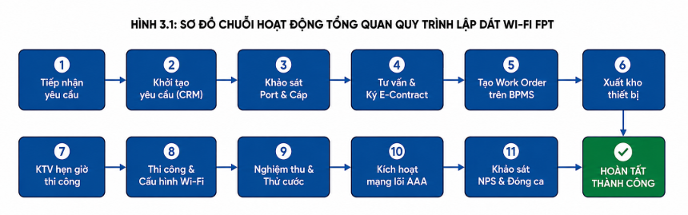
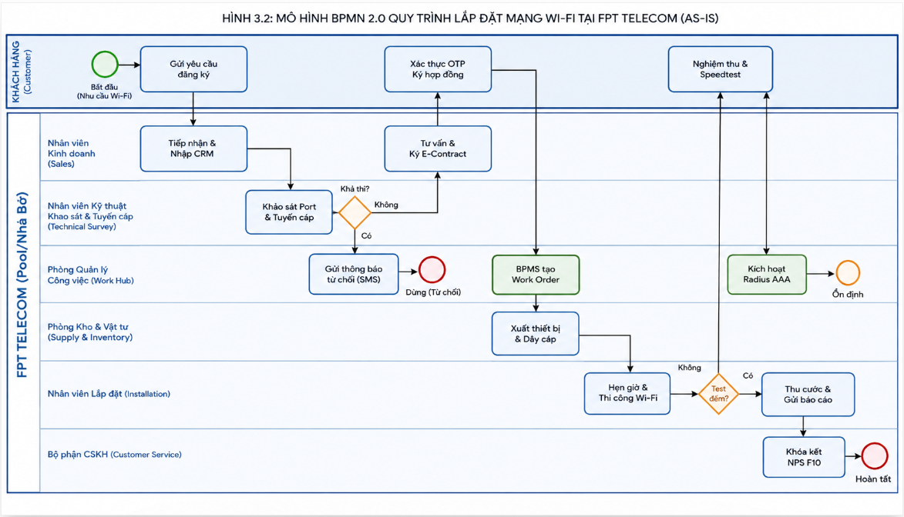
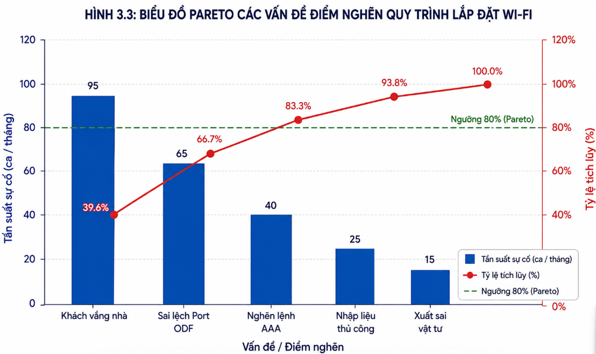
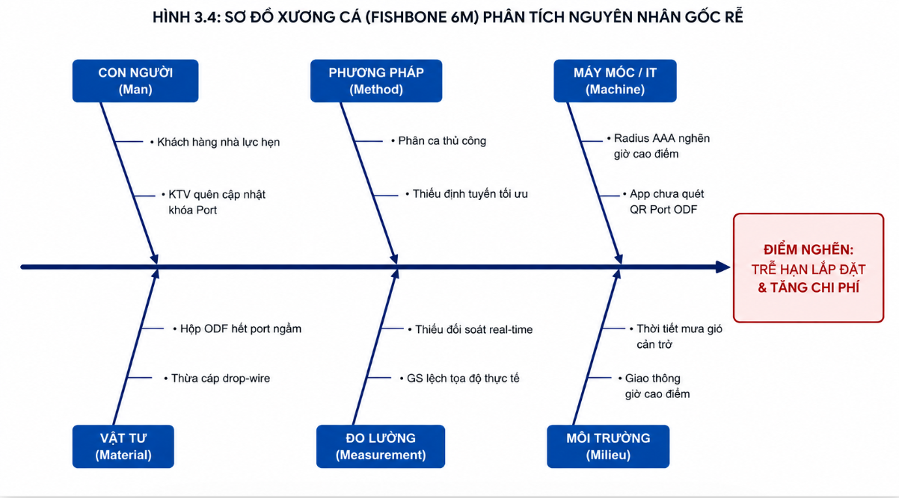
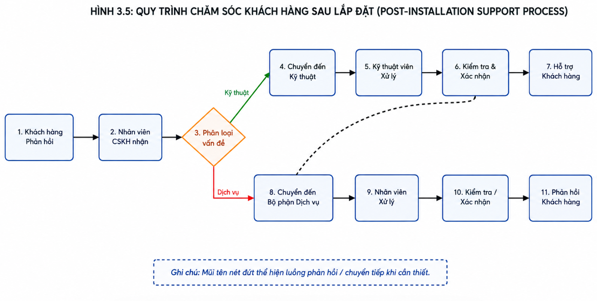
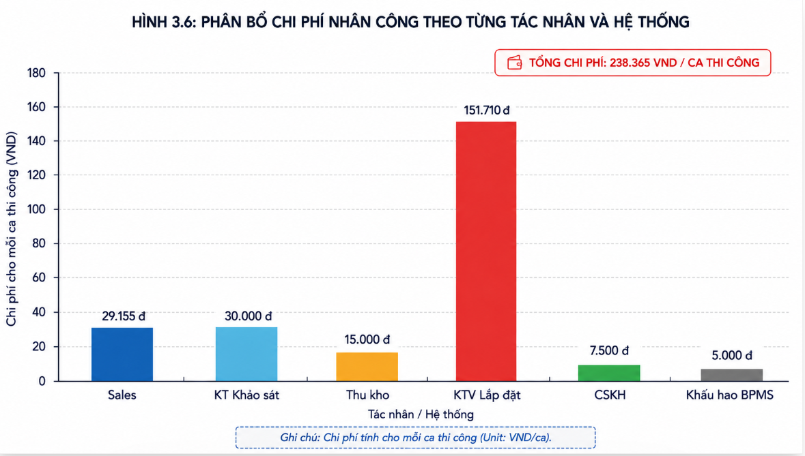

# **CHƯƠNG 3: MÔ HÌNH HÓA VÀ PHÂN TÍCH QUY TRÌNH NGHIỆP VỤ**

## **3.4. QUY TRÌNH LẮP ĐẶT MẠNG WI-FI TẠI CÔNG TY CỔ PHẦN VIỄN THÔNG FPT (FPT TELECOM)**

### **3.4.1. Khám phá quy trình (Process Discovery)**

Khám phá quy trình (Process Discovery) là giai đoạn nền tảng trong vòng đời Quản trị Quy trình Nghiệp vụ (BPM Lifecycle). Mục đích của giai đoạn này là thu thập hiện trạng vận hành thực tế, làm rõ ranh giới các bước công việc, xác định các tác nhân liên quan và nhận diện các điểm nghẽn, rủi ro tiềm ẩn. Nhóm áp dụng kết hợp **3 phương pháp khám phá quy trình chuẩn mực** theo giáo trình môn học IE203 (Chương 4 – Process Discovery) bao gồm:
1. **Phương pháp dựa trên bằng chứng (Evidence-based Discovery)**: Thu thập tài liệu quy định, quy chuẩn kỹ thuật, nhật ký hệ thống CRM/BPMS và các biểu mẫu nghiệp vụ thực tế tại FPT Telecom.
2. **Phương pháp phỏng vấn (Interview-based Discovery)**: Phỏng vấn trực tiếp các bên liên quan từ cấp quản trị đến kỹ thuật viên hiện trường và khách hàng để thu thập dữ liệu định tính và định lượng.
3. **Phương pháp hội thảo chuyên sâu (Workshop-based Discovery)**: Tổ chức buổi làm việc tập trung giữa các bộ phận để giải quyết xung đột góc nhìn và chuẩn hóa bức tranh toàn cảnh As-Is.

---

#### **3.4.1.1. Phương pháp dựa trên bằng chứng (Evidence-based Discovery)**

Phương pháp dựa trên bằng chứng được thực hiện thông qua việc rà soát hồ sơ quy trình vận hành tiêu chuẩn (SOP), các văn bản chỉ đạo của Ban Điều hành FPT Telecom, dữ liệu log từ hệ thống FPT CRM / Mobisale / BPMS và các mẫu chứng từ đang lưu hành.

##### **a) Mô tả chuỗi hoạt động As-Is dựa trên văn bản quy chuẩn**

Quy trình lắp đặt mạng Wi-Fi (Internet cáp quang băng rộng FTTH) tại FPT Telecom là quy trình nghiệp vụ cốt lõi (Core Process), liên kết trực tiếp từ nhu cầu đăng ký dịch vụ của khách hàng đến kết quả bàn giao kết nối Internet, thu phí và khảo sát chăm sóc sau bán hàng.

_Hình 3.1: Sơ đồ chuỗi hoạt động tổng quan quy trình lắp đặt mạng Wi-Fi_

- **Bước 1: Tiếp nhận nhu cầu đăng ký từ khách hàng:**
  - **Mục tiêu:** Thu thập đầy đủ, chính xác thông tin đăng ký dịch vụ của khách hàng qua đa kênh tiếp cận.
  - **Thực hiện:** Khách hàng đăng ký qua Website chính thức (fpt.vn / fptlapdat.com.vn), Tổng đài Hotline 19006600, quầy giao dịch VPGD hoặc trực tiếp qua Nhân viên kinh doanh (Sales D2D). Thông tin thu thập gồm: Họ tên, số điện thoại, địa chỉ lắp đặt chi tiết và gói cước Internet/Wi-Fi mong muốn.

- **Bước 2: Ghi nhận và khởi tạo yêu cầu khảo sát trên hệ thống:**
  - **Mục tiêu:** Số hóa dữ liệu đăng ký và khởi tạo luồng xử lý trên hệ thống tập trung.
  - **Thực hiện:** Nhân viên Sales nhập hồ sơ lên hệ thống FPT CRM / Mobisale, phần mềm tự động cấp mã Ticket ID và chuyển dữ liệu tới Đội Kỹ thuật hạ tầng khu vực.

- **Bước 3: Khảo sát hạ tầng mạng cáp và cổng kết nối (Port):**
  - **Mục tiêu:** Điểm kiểm soát trọng yếu (Go/No-Go Checkpoint) nhằm xác minh tính khả thi kỹ thuật trước khi cam kết thương mại, tránh lãng phí chi phí triển khai.
  - **Thực hiện:** Bộ phận Kỹ thuật kiểm tra trên bản đồ mạng GIS và hiện trường: cự ly kéo cáp từ Hộp chia quang (ODF/DP) đến nhà khách hàng (đạt chuẩn <= 300m) và kiểm tra số Port còn trống.
    - **Rẽ nhánh 1 (Không đủ điều kiện):** Cập nhật trạng thái 'Không khả thi', hệ thống tự động gửi tin nhắn/email từ chối lịch sự và đóng hồ sơ.
    - **Rẽ nhánh 2 (Đủ điều kiện):** Xác nhận khả thi và chuyển tiếp sang bước ký hợp đồng.

- **Bước 4: Tư vấn chi tiết gói cước và ký kết hợp đồng:**
  - **Mục tiêu:** Thống nhất phương án gói cước, thu thập hồ sơ định danh và ký kết hợp đồng dịch vụ viễn thông.
  - **Thực hiện:** Nhân viên Sales tư vấn thiết bị (Modem ONT 2 băng tần, Mesh Wi-Fi 6), các chương trình trả trước cước. Khách hàng cung cấp ảnh CCCD để định danh điện tử (eKYC). Sales tạo Hợp đồng điện tử (E-Contract), gửi mã OTP xác thực qua SMS để khách hàng ký số trực tuyến.

- **Bước 5: Khởi tạo và phân bổ lệnh thi công (Work Order):**
  - **Mục tiêu:** Tự động hóa quá trình điều phối nguồn lực, loại bỏ độ trễ và thao tác thủ công.
  - **Thực hiện:** Hệ thống BPMS/CRM tự động tạo phiếu công tác (Work Order), phân bổ ca thi công và tự động gán cho Kỹ thuật viên (TNC) phụ trách tuyến theo thuật toán tối ưu vị trí địa lý.

- **Bước 6: Chuẩn bị và xuất kho thiết bị, vật tư:**
  - **Mục tiêu:** Cung cấp đầy đủ, chính xác vật tư và thiết bị mạng đạt tiêu chuẩn.
  - **Thực hiện:** Thủ kho tiếp nhận lệnh xuất kho điện tử, quét mã Serial/MAC Address của thiết bị (Modem quang ONT, Router phụ, cáp quang drop-wire, Fast Connector, phụ kiện) và bàn giao cho KTV.

- **Bước 7: Kỹ thuật viên liên hệ hẹn giờ thi công:**
  - **Mục tiêu:** Thống nhất thời gian có mặt chính xác, tránh tình trạng khách hàng vắng nhà gây lãng phí công di chuyển.
  - **Thực hiện:** KTV sử dụng ứng dụng chuyên dụng (FoxPro/MyFPT TNC) gọi điện cho khách hàng, xác nhận thời gian có mặt và vị trí dự kiến đặt modem trong nhà.

- **Bước 8: Thi công kéo cáp và cấu hình thiết bị:**
  - **Mục tiêu:** Xây dựng đường truyền vật lý đạt tiêu chuẩn kỹ thuật và cấu hình mạng Wi-Fi.
  - **Thực hiện:** KTV kéo rải cáp từ hộp ODF vào nhà khách hàng, bấm đầu Fast Connector hoặc hàn nối quang dã chiến; đo kiểm công suất quang (suy hao <= -24 dBm). Lắp đặt Modem, cấu hình tên mạng Wi-Fi (SSID), mật khẩu và dải tần. Thu cước hòa mạng ban đầu (nếu chọn trả sau) qua tiền mặt hoặc mã QR Foxpay/VNPay.

- **Bước 9: Nghiệm thu và bàn giao dịch vụ:**
  - **Mục tiêu:** Xác nhận chất lượng dịch vụ hoạt động ổn định và đo lường sự hài lòng tại chỗ.
  - **Thực hiện:** KTV hướng dẫn khách hàng kết nối thử thiết bị, thực hiện kiểm tra tốc độ qua công cụ Speedtest. Khách hàng ký xác nhận vào biên bản nghiệm thu điện tử trên ứng dụng di động của KTV.

- **Bước 10: Kích hoạt dịch vụ trên hệ thống mạng lõi:**
  - **Mục tiêu:** Đưa thuê bao vào vận hành thương mại chính thức trên hạ tầng mạng viễn thông.
  - **Thực hiện:** KTV bấm 'Hoàn tất lắp đặt' trên app; hệ thống BPMS tự động gửi lệnh Provisioning kích hoạt tài khoản PPPoE/MAC Address lên Radius/AAA Server, gửi SMS/Email thông báo tài khoản quản trị mạng FPT cho khách hàng.

- **Bước 11: Khảo sát chất lượng dịch vụ (NPS) & Chăm sóc sau bán hàng:**
  - **Mục tiêu:** Đo lường chỉ số hài lòng (NPS) và quản lý chất lượng dịch vụ.
  - **Thực hiện:** Trong vòng 24 - 48 giờ sau khi nghiệm thu, hệ thống CSKH tự động gửi tin nhắn khảo sát hoặc điện thoại viên liên hệ ghi nhận đánh giá (thang điểm 1-10). Đóng ca làm việc hoàn tất.

##### **b) Danh mục tài liệu và biểu mẫu nghiệp vụ thu thập (Evidence Artifacts)**

Nhóm đã thu thập và đối chiếu các biểu mẫu nghiệp vụ thực tế đang vận hành tại FPT Telecom:

* **Biểu mẫu 1: Phiếu ghi nhận đăng ký dịch vụ (CRM Lead Ticket)**  
  * *Mã hiệu:* BM-FPT-KD01 | *Kênh tiếp nhận:* Website / D2D / Hotline  
  * *Nội dung thu thập:* Mã Lead ID, Thời gian đăng ký, Họ tên khách hàng, Số điện thoại, Địa chỉ lắp đặt chi tiết (Số nhà, Đường, Phường/Xã, Quận/Huyện, Tọa độ GPS), Gói cước yêu cầu (Giga 150Mbps / Sky 1Gbps / F-Game), Hình thức thanh toán dự kiến (Trả trước 6 tháng / 12 tháng / Trả sau).

* **Biểu mẫu 2: Phiếu thẩm định khảo sát hạ tầng (GIS Technical Survey Report)**  
  * *Mã hiệu:* BM-FPT-KT02 | *Hệ thống:* GIS Network Management  
  * *Nội dung:* Mã Ticket ID, Mã hộp ODF/Tập điểm quang gần nhất, Cự ly dây cáp thực tế (Mét), Tổng số Port thiết kế, Số Port đang sử dụng, Số Port trống khả dụng, Kết luận khảo sát: [Đủ điều kiện] / [Không đủ điều kiện - Lý do: Hết port / Vượt khoảng cách 300m / Chướng ngại vật], Chữ ký số KTV khảo sát.

* **Biểu mẫu 3: Hợp đồng điện tử dịch vụ viễn thông (FPT E-Contract)**  
  * *Mã hiệu:* HD-FTTH-2026 | *Nền tảng:* FPT E-Contract & eKYC  
  * *Nội dung:* Số hợp đồng, Thông tin chủ thể thuê bao (CCCD, Họ tên, Ngày sinh), Địa chỉ đặt thiết bị, Thông số gói cước & thiết bị đi kèm (Modem Wi-Fi 6 ONT, Thiết bị Mesh phụ), Mã OTP xác thực giao dịch qua SMS, Chữ ký điện tử của khách hàng và Đại diện FPT Telecom.

* **Biểu mẫu 4: Lệnh công tác thi công lắp đặt (Work Order)**  
  * *Mã hiệu:* WO-TNC-2026-X | *Hệ thống:* FPT BPMS / Dispatching Engine  
  * *Nội dung:* Mã Work Order, Khung giờ hẹn khách, Kỹ thuật viên phụ trách (Mã NV, Họ tên, SĐT), Địa chỉ thi công, Tọa độ hộp cáp ODF, Thiết bị xuất kho tương ứng (Serial/MAC), Ghi chú thi công từ Sales.

* **Biểu mẫu 5: Phiếu xuất kho vật tư thiết bị mạng (WMS Material Dispatch)**  
  * *Mã hiệu:* PXK-TNC-05 | *Đơn vị cấp phát:* Kho kỹ thuật Chi nhánh FPT  
  * *Nội dung:* Ngày xuất, Người nhận (KTV TNC), Danh mục: Modem Wi-Fi 6 GPON ONT (Mã barcode, Serial, MAC), Cuộn cáp quang thuê bao 1FO (Số mét bàn giao), Đầu kết nối nhanh Fast Connector (Số lượng cái), Dây kẹp treo cáp, Ống co nhiệt.

* **Biểu mẫu 6: Biên bản nghiệm thu kỹ thuật và bàn giao dịch vụ điện tử**  
  * *Mã hiệu:* BBNT-FTTH-06 | *Ứng dụng:* FoxPro / MyFPT TNC App  
  * *Nội dung:* Mã thuê bao (Account PPPoE), Giá trị đo công suất quang suy hao tại đầu ONT (Chuẩn: $-18 \text{ dBm} \div -24 \text{ dBm}$), Kết quả đo tốc độ Download/Upload thực tế qua Speedtest, Tên mạng Wi-Fi (SSID 2.4GHz & 5GHz), Chữ ký xác nhận nghiệm thu điện tử của khách hàng tại chỗ.

---

#### **3.4.1.2. Phương pháp phỏng vấn (Interview-based Discovery)**

Phương pháp phỏng vấn trực tiếp được nhóm triển khai nhằm khai thác sâu các khía cạnh vận hành thực tế tại hiện trường, làm rõ trải nghiệm của khách hàng, nhận diện các khó khăn của kỹ thuật viên và kiểm chứng các tham số định lượng (thời gian, chi phí, tỷ lệ lỗi). 

Bộ câu hỏi phỏng vấn được thiết kế phân tầng cho **7 nhóm tác nhân chủ chốt** (Khách hàng, Nhân viên Sales, Kỹ thuật Khảo sát, Quản trị hệ thống BPMS, Thủ kho, Kỹ thuật viên TNC, và Nhân viên CSKH), bao gồm **10 câu hỏi định tính** và **10 câu hỏi định lượng**, cân đối chuẩn mực giữa **dạng câu hỏi có cấu trúc (Structured)** và **không có cấu trúc (Unstructured)** theo đúng tiêu chí Rubric đánh giá của môn học.

##### **a) Danh sách 10 câu hỏi định tính**

* **Nhóm câu hỏi có cấu trúc (Structured Qualitative Questions):** *(Sử dụng thang đo Likert 5 mức độ hoặc các phương án lựa chọn cố định nhằm lượng hóa mức độ đồng thuận)*

| STT | Đối tượng phỏng vấn | Nội dung câu hỏi có cấu trúc | Thang đo / Phương án lựa chọn |
| :---: | :--- | :--- | :--- |
| **Q1** | Khách hàng | Anh/Chị đánh giá mức độ rõ ràng, minh bạch của thông tin gói cước và chính sách khuyến mãi do nhân viên Sales tư vấn như thế nào? | 1. Rất mập mờ; 2. Chưa rõ ràng; 3. Bình thường; 4. Khá rõ ràng; 5. Rất minh bạch, dễ hiểu. |
| **Q2** | Kỹ thuật viên (TNC) | Anh/Chị đánh giá mức độ tiện dụng và độ ổn định của ứng dụng di động nội bộ (FoxPro/MyFPT TNC) khi nhận lệnh thi công và cập nhật trạng thái ngoài hiện trường? | 1. Rất khó dùng/thường lỗi; 2. Khó dùng; 3. Dùng được; 4. Dễ dùng, ổn định; 5. Rất trực quan và mượt mà. |
| **Q3** | Kỹ thuật viên Khảo sát | Mức độ tin cậy và khớp thực tế giữa dữ liệu sơ đồ hạ tầng trên phần mềm bản đồ số GIS với hiện trạng cổng ODF tại cột điện đạt mức nào? | 1. Sai lệch rất lớn (>20%); 2. Thường sai lệch; 3. Khớp một phần; 4. Khá chuẩn xác; 5. Khớp hoàn toàn 100%. |
| **Q4** | Khách hàng | Trải nghiệm xác thực ký kết Hợp đồng điện tử (E-Contract) qua mã OTP SMS và thanh toán trực tuyến của Anh/Chị như thế nào? | [A] Rất nhanh chóng và tiện lợi; [B] Hơi phức tạp do không quen công nghệ; [C] Thích ký hợp đồng giấy truyền thống hơn; [D] Gặp lỗi hệ thống khi nhận mã OTP. |
| **Q5** | Thủ kho thiết bị | Hoạt động xuất cấp Modem ONT và vật tư cho KTV vào đầu ca sáng hiện nay được thực hiện chủ yếu qua hình thức nào? | [A] Quét mã vạch tự động trên phần mềm kho WMS; [B] Vừa quét mã vừa ghi sổ tay đối chiếu; [C] Ký nhận trên giấy tờ thủ công; [D] KTV tự lấy thiết bị rồi bổ sung chứng từ sau. |

* **Nhóm câu hỏi không có cấu trúc (Unstructured Qualitative Questions):** *(Câu hỏi mở để đối tượng tự do phản ánh góc nhìn, đào sâu nguyên nhân gốc rễ và cơ hội cải tiến)*

| STT | Đối tượng phỏng vấn | Nội dung câu hỏi mở (Không có cấu trúc) | Mục tiêu thu thập thông tin |
| :---: | :--- | :--- | :--- |
| **Q6** | Kỹ thuật viên (TNC) | Trong thực tế kéo cáp và lắp đặt tại nhà khách hàng, những yếu tố trở ngại lớn nhất khiến ca thi công bị vượt quá khung giờ cam kết (SLA) là gì? | Xác định điểm nghẽn hiện trường (nhà kín khó luồn dây, thời tiết xấu, khách hẹn dời giờ...). |
| **Q7** | Kỹ thuật viên Khảo sát | Vì sao vẫn còn xảy ra trường hợp hệ thống GIS ghi nhận còn Port khả dụng nhưng khi KTV ra hiện trường thi công thì hộp ODF thực tế đã hết cổng cắm? | Tìm nguyên nhân gốc rễ của vấn đề ISS-01 (độ trễ khóa Port, KTV tuyến trước không cập nhật...). |
| **Q8** | Nhân viên Kinh doanh | Anh/Chị gặp những khó khăn gì trong việc theo dõi tiến độ thi công của KTV để kịp thời thông tin, trấn an khách hàng khi xảy ra chậm trễ? | Đánh giá tính liên thông dữ liệu giữa Sales và Đội Kỹ thuật qua hệ thống BPMS. |
| **Q9** | Quản trị hệ thống BPMS / IT | Những nguyên nhân kỹ thuật nào dẫn đến việc hệ thống kích hoạt thuê bao tự động (Provisioning AAA) bị nghẽn lệnh vào các khung giờ cao điểm cuối ngày? | Khám phá nguyên nhân gốc rễ của vấn đề ISS-03 và hạn chế tích hợp API giữa CRM và AAA. |
| **Q10** | Trưởng phòng Kỹ thuật | Theo Anh/Chị, việc nâng cấp thuật toán điều phối thông minh (Smart Dispatching) theo vị trí địa lý sẽ mang lại cải tiến đột phá nào cho năng suất thi công? | Định hình giải pháp cải tiến To-Be và lộ trình tối ưu hóa nguồn lực. |

---

##### **b) Danh sách 10 câu hỏi định lượng**

* **Nhóm câu hỏi có cấu trúc (Structured Quantitative Questions):** *(Yêu cầu người trả lời cung cấp số liệu đo lường cụ thể với đơn vị tính rõ ràng)*

| STT | Đối tượng phỏng vấn | Nội dung câu hỏi định lượng có cấu trúc | Đơn vị đo lường |
| :---: | :--- | :--- | :---: |
| **Q11** | Kỹ thuật viên (TNC) | Thời gian trung bình để thực hiện trọn vẹn thao tác kỹ thuật hiện trường (rải cáp, bấm Fast Connector, cài đặt Wi-Fi và đo suy hao quang) cho 01 ca tiêu chuẩn là bao nhiêu phút? | Phút / ca |
| **Q12** | Kỹ thuật viên Khảo sát | Thời gian trung bình để bộ phận Kỹ thuật kiểm tra trên bản đồ GIS và trả kết quả tính khả thi hạ tầng cho 01 yêu cầu đăng ký là bao lâu? | Phút / hồ sơ |
| **Q13** | Kỹ thuật viên (TNC) | Trong 100 mối hàn nối cáp quang hoặc bấm đầu Fast Connector tại hiện trường, trung bình có bao nhiêu trường hợp suy hao vượt chuẩn phải cắt bấm lại? | Tỷ lệ phần trăm (%) |
| **Q14** | Nhân viên Sales & Kỹ thuật | Trong tổng số các yêu cầu đăng ký mới trong tháng, tỷ lệ hồ sơ bị từ chối do không đủ điều kiện hạ tầng (hết port ODF hoặc khoảng cách kéo cáp > 300m) là bao nhiêu? | Tỷ lệ phần trăm (%) |
| **Q15** | Kỹ thuật viên (TNC) | Trung bình trong một ngày làm việc tiêu chuẩn (ca 8 tiếng), một Kỹ thuật viên TNC hoàn thành được bao nhiêu ca lắp đặt mạng thành công? | Ca hoàn tất / ngày / KTV |

* **Nhóm câu hỏi không có cấu trúc (Unstructured Quantitative Questions):** *(Khảo sát khoảng biến thiên, dữ liệu phân bổ xác suất và ước lượng thiệt hại tài chính)*

| STT | Đối tượng phỏng vấn | Nội dung câu hỏi mở định lượng (Không có cấu trúc) | Dữ liệu định lượng kỳ vọng thu thập |
| :---: | :--- | :--- | :--- |
| **Q16** | Kỹ thuật viên (TNC) | Trong trường hợp khách hàng vắng nhà hoặc yêu cầu dời lịch hẹn đột xuất, thời gian KTV phải chờ đợi tại chỗ hoặc hoãn ca dao động trong khoảng bao lâu? | Khoảng thời gian (phút) Best-case đến Worst-case. |
| **Q17** | Kỹ thuật viên (TNC) | Chiều dài đoạn dây cáp quang bị cắt dôi dư hoặc hao hụt dã chiến trong quá trình kéo từ cột điện vào nhà khách hàng bình quân dao động khoảng bao nhiêu mét? | Số mét cáp quang hao hụt bình quân trên mỗi ca. |
| **Q18** | Quản trị hệ thống BPMS | Vào các khung giờ cao điểm (17h00 – 19h00), thời gian phản hồi của lệnh kích hoạt mạng lõi AAA Server bị kéo dài từ bao nhiêu phút lên bao nhiêu phút? | Khoảng thời gian nghẽn lệnh (phút). |
| **Q19** | Kế toán & Vận hành | Ước tính chi phí thiệt hại tài chính trực tiếp (xăng xe, công thợ, lãng phí ca làm việc) cho FPT khi phát sinh 01 ca khảo sát ảo (đến nơi mới phát hiện hết Port) là bao nhiêu? | Giá trị chi phí ước tính (VNĐ / ca). |
| **Q20** | Ban Giám đốc Chi nhánh | Sau khi số hóa quy trình và tích hợp thuật toán điều phối thông minh, Chi nhánh kỳ vọng cắt giảm tổng thời gian chu kỳ toàn quy trình (Cycle Time) khoảng bao nhiêu phần trăm? | Tỷ lệ cắt giảm thời gian kỳ vọng (%). |

---

##### **c) Bảng Ma trận đối chiếu (Mapping Matrix) giữa Kết quả phỏng vấn và Mô hình Định lượng**

Các dữ liệu thu thập được từ bộ câu hỏi phỏng vấn định tính và định lượng được sử dụng trực tiếp để thiết lập và kiểm chứng các tham số trong mô hình phân tích thời gian chu kỳ, chi phí vận hành và bảng Issue Register của quy trình 3.4:

| STT | Tham số / Chỉ số trong Mô hình 3.4 | Giá trị định lượng áp dụng trong bài | Căn cứ câu hỏi phỏng vấn | Ý nghĩa nghiệp vụ và cơ sở đối chiếu |
| :---: | :--- | :---: | :---: | :--- |
| 1 | **Xác suất Khảo sát hạ tầng khả thi ($p_1$)** | **90%** (0.90) | **Q14, Q7** | Xác định nhánh rẽ thành công (Go) tại Exclusive Gateway GW1 trong sơ đồ BPMN. |
| 2 | **Xác suất Khảo sát hạ tầng không đạt ($p_2$)** | **10%** (0.10) | **Q14, Q3** | Xác định nhánh rẽ dừng quy trình (No-Go) khi hộp ODF hết port hoặc ngoài cự ly 300m. |
| 3 | **Thời gian thi công kéo cáp & cấu hình ($T_8$)** | **60 phút** | **Q11, Q15** | Hoạt động VA trọng yếu nhất; được xác nhận bởi KTV thi công (1 KTV làm 4-5 ca/ngày). |
| 4 | **Tỷ lệ làm lại đầu nối quang ($r$)** | **$r = 5\%$** | **Q13** | Cơ sở tính hệ số vòng lặp làm lại: $T_{8(\text{hiệu chỉnh})} = \frac{60}{1 - 0.05} \approx 63.16$ phút. |
| 5 | **Thời gian khảo sát Port & tuyến cáp ($T_2$)** | Chu kỳ: **30 phút** Xử lý: **20 phút** | **Q12, Q3** | Đo lường độ trễ từ lúc nhận ticket GIS đến lúc KTV thẩm định xong tính khả thi. |
| 6 | **Thời gian di chuyển & Chờ khách ($T_7$)** | **35 phút** | **Q16, Q6** | Cơ sở định lượng hoạt động lãng phí NVA (10p di chuyển thực + 25p chờ xác nhận lịch hẹn). |
| 7 | **Tổn thất tài chính do sai lệch Port (ISS-01)** | **~30.000 VNĐ / ca** | **Q19, Q7** | Chi phí công KTV và nhiên liệu di chuyển vô ích cho 8% số ca khảo sát sai trên GIS. |
| 8 | **Độ trễ kích hoạt mạng lõi giờ cao điểm (ISS-03)** | Tăng từ **10 phút lên 30 phút** | **Q18, Q9** | Căn cứ nhận diện điểm nghẽn hệ thống AAA Server trong Bảng Issue Register và Pareto. |
| 9 | **Tỷ lệ hao hụt vật tư cáp dã chiến (ISS-04)** | **~3%** tổng chiều dài cáp | **Q17, Q5** | Căn cứ định lượng lãng phí Over-production và sai số quyết toán vật tư cuối tháng. |
| 10 | **Mục tiêu cải tiến thời gian chu kỳ (To-Be)** | Rút ngắn từ **3.58h xuống < 2h** | **Q20, Q10** | Mục tiêu định lượng làm tiền đề cho việc xây dựng kiến trúc To-Be tối ưu hóa. |

---

#### **3.4.1.3. Phương pháp hội thảo chuyên sâu (Workshop-based Discovery)**

Nhằm giải quyết triệt để các xung đột quan điểm giữa các bộ phận (ví dụ: Sales phản ánh Kỹ thuật khảo sát chậm làm mất khách, Kỹ thuật phản ánh Sales ký hợp đồng khi chưa rõ hạ tầng cáp, Kho phàn nàn KTV đến lĩnh vật tư dồn dập), một phiên Workshop đã được tổ chức với sự tham gia của các bên liên quan.

##### **a) Biểu mẫu tổ chức cuộc họp (Meeting Agenda & Setup Form)**

* **Tên cuộc họp:** Hội thảo Khám phá và Chuẩn hóa Quy trình Lắp đặt Mạng Wi-Fi FTTH (Process Discovery Workshop)
* **Thời gian tổ chức:** 08:30 – 12:00, Ngày 15 tháng 08 năm 2026
* **Địa điểm:** Phòng họp Lotus, Trung tâm Kỹ thuật FPT Telecom Chi nhánh & Trực tuyến qua Microsoft Teams.
* **Thành phần tham gia theo ma trận vai trò (RACI Role Setup):**

| Vai trò trong Workshop | Chức danh đại diện | Trách nhiệm chính trong phiên làm việc |
| :--- | :--- | :--- |
| **Facilitator (Người điều phối)** | Chuyên viên Phân tích Quy trình (Lead BA) | Định hướng thảo luận, giữ vững phạm vi BPMN, khơi gợi các ngoại lệ và trung lập hóa các tranh luận. |
| **Process Owner (Chủ quy trình)** | Trưởng phòng Quản lý Vận hành Dịch vụ | Xác nhận mục tiêu chiến lược, thời gian cam kết SLA và chuẩn đầu ra toàn chuỗi quy trình. |
| **Đại diện Khối Kinh doanh** | Trưởng nhóm Sales D2D & Trưởng VPGD | Làm rõ cách thức tiếp nhận Lead, tư vấn gói cước và rào cản ký E-Contract. |
| **Đại diện Đội Kỹ thuật Khảo sát** | Trưởng nhóm Giám sát mạng cáp GIS | Làm rõ tiêu chuẩn cự ly cáp (<= 300m), quy định số Port an toàn trên hộp ODF. |
| **Đại diện Kỹ thuật viên Hiện trường** | Nhóm trưởng Kỹ thuật TNC | Trình bày thực tế thi công, lỗi bấm Fast Connector dã chiến và tình trạng khách vắng nhà. |
| **Đại diện Bộ phận Kho vật tư** | Quản lý Kho chi nhánh | Phản ánh quy trình quét mã Serial/MAC và đối soát vật tư cáp thu hồi. |
| **Đại diện Vận hành Hệ thống** | Kỹ sư Trưởng hệ thống BPMS / CRM | Giải trình cơ chế phân bổ Work Order và độ trễ giao tiếp API với AAA Radius Server. |
| **Scribe (Thư ký ghi biên bản)** | Thành viên nhóm phân tích (BA) | Ghi chép chi tiết biên bản, tổng hợp danh mục vấn đề phát sinh và vẽ phác thảo luồng BPMN. |

##### **b) Kịch bản điều phối và các kết quả thống nhất quan trọng**

* **Giai đoạn 1 – Thống nhất ranh giới quy trình (Boundary Setting):** 
  - *Điểm bắt đầu:* Phát sinh nhu cầu đăng ký dịch vụ của khách hàng qua website/hotline/sales.
  - *Điểm kết thúc:* Kích hoạt thành công trên hệ thống mạng lõi AAA và thực hiện cuộc gọi/tin nhắn khảo sát NPS sau 24h–48h.
* **Giai đoạn 2 – Giải quyết xung đột giữa Sales và Kỹ thuật về điểm kiểm soát Khảo sát (Go/No-Go):**
  - *Xung đột:* Sales muốn ký hợp đồng ngay khi khách có nhu cầu để chốt doanh số; Kỹ thuật yêu cầu phải khảo sát trước vì nếu ký mà không kéo được cáp thì khách hàng rất bức xúc và tốn chi phí hủy hợp đồng.
  - *Đồng thuận tại Workshop:* Bắt buộc giữ Gateway khảo sát hạ tầng (Bước 3) ngay sau khi tiếp nhận. Tuy nhiên, để hỗ trợ Sales, hệ thống CRM/Mobisale phải cung cấp tính năng tra cứu nhanh sơ bộ (Quick Check GIS) trong vòng 3 phút; các ca giáp ranh mới điều phối KTV khảo sát hiện trường.
* **Giai đoạn 3 – Thống nhất luồng thi công và nghiệm thu điện tử:**
  - Chấm dứt việc ký biên bản giấy; 100% ca lắp đặt nghiệm thu qua chữ ký số trên app của KTV và kiểm tra tốc độ thực tế qua Speedtest trước sự chứng kiến của khách hàng.
* **Giai đoạn 4 – Chốt danh mục vấn đề ưu tiên (Issue Register):**
  - Thống nhất 4 vấn đề nghiêm trọng nhất cần giải quyết: Lệch dữ liệu Port GIS (ISS-01), Khách vắng nhà (ISS-02), Nghẽn server AAA kích hoạt giờ cao điểm (ISS-03), và Thao tác ghi chép vật tư thủ công (ISS-04).

---

### **3.4.2. Mô hình hóa quy trình (BPMN 2.0 As-Is Model)**

#### **3.4.2.1. Các tác nhân tham gia quy trình (Roles & Swimlanes)**

Mô hình quy trình được tổ chức theo chuẩn BPMN 2.0 gồm 2 Pool chính: **Khách hàng** (Pool đối tác bên ngoài) và **FPT Telecom** (Pool nội bộ tổ chức). Trong Pool FPT Telecom, trách nhiệm được phân chia thành các Lane chức năng:
- **Khách hàng (Customer):** Gửi yêu cầu đăng ký, cung cấp thông tin, ký E-Contract, phối hợp khảo sát vị trí, nghiệm thu và đánh giá.
- **Khối Kinh doanh (Sales / Cửa hàng):** Tiếp nhận thông tin, tư vấn gói cước, tạo ticket khảo sát và thực hiện ký hợp đồng điện tử.
- **Bộ phận Kỹ thuật Khảo sát:** Kiểm tra bản đồ mạng viễn thông (GIS), thẩm định tính khả thi của tuyến cáp và số lượng Port ODF.
- **Hệ thống BPMS / CRM:** Trung tâm tự động hóa; xử lý dữ liệu, tự động tạo và điều phối Work Order, kích hoạt dịch vụ mạng lõi và gửi thông báo tự động.
- **Bộ phận Kho & Vật tư:** Chuẩn bị, quét mã Serial/MAC và xuất kho thiết bị (Modem, Router, Cáp quang, phụ kiện).
- **Kỹ thuật viên Lắp đặt (TNC - Field Engineer):** Nhận lệnh trên mobile app, liên hệ hẹn giờ, kéo cáp, hàn quang, cài đặt Wi-Fi, thu cước ban đầu và lấy chữ ký nghiệm thu.
- **Bộ phận Chăm sóc Khách hàng (Call Center / CSKH):** Khảo sát đo lường chỉ số hài lòng (NPS), hỗ trợ khiếu nại sau bán hàng và đóng hồ sơ ca lắp đặt.

#### **3.4.2.2. Khách hàng của quy trình**

- **Khách hàng bên ngoài:** Các cá nhân, hộ gia đình và doanh nghiệp có nhu cầu hòa mạng Internet. Họ là người thụ hưởng trực tiếp kết quả cốt lõi của dịch vụ.
- **Khách hàng nội bộ:** Bộ phận Kế toán - Tài chính (nhận dữ liệu hợp đồng điện tử và dòng tiền chính xác); Trung tâm Vận hành Mạng NOC (nhận dữ liệu thiết bị và thuê bao chuẩn hóa).

#### **3.4.2.3. Giá trị mà quy trình mang lại**

- **Đối với Khách hàng:** Thủ tục đơn giản, ký hợp đồng và thanh toán trực tuyến nhanh chóng, thời gian chờ lắp đặt được rút ngắn tối đa (<= 24-48h), chất lượng kết nối được nghiệm thu minh bạch.
- **Đối với FPT Telecom:** Tự động hóa phân công công việc qua BPMS giúp giảm 70% thao tác thủ công; điểm kiểm soát khảo sát hạ tầng (Go/No-Go) ngay từ đầu giúp loại bỏ rủi ro chi phí; chuẩn hóa chất lượng phục vụ và nâng cao chỉ số NPS.

#### **3.4.2.4. Các kết quả đầu ra của quy trình**

1. **Hoàn tất lắp đặt thành công:** Khách hàng nghiệm thu, thuê bao kích hoạt trên mạng lõi, phí hòa mạng được hạch toán và đóng hồ sơ.
2. **Từ chối do không khả thi hạ tầng:** Khu vực hết port hoặc ngoài vùng phủ cáp; quy trình dừng ngay sau bước 3, gửi thông báo và đóng hồ sơ minh bạch.
3. **Khách hàng hủy yêu cầu:** Khách hàng thay đổi ý định hoặc không thỏa thuận được về chi phí/thời gian; hồ sơ được hủy và lưu vào CSDL CRM để tiếp thị lại trong tương lai.

#### **3.4.2.5. Mô hình hóa quy trình chi tiết bằng BPMN 2.0 (AS-IS Model)**

_Hình 3.2: Sơ đồ BPMN 2.0 quy trình lắp đặt mạng Wi-Fi tại FPT Telecom theo chuẩn Pools & Lanes_

#### **3.4.2.6. Đặc tả chi tiết các phần tử trong mô hình BPMN 2.0**

| STT | Thành phần BPMN | Loại ký hiệu | Nhãn phần tử (Label) | Diễn giải chức năng |
| :--- | :--- | :--- | :--- | :--- |
| 1 | Start Event | None Start Event | Nhu cầu lắp đặt Wi-Fi phát sinh | Điểm bắt đầu quy trình từ phía khách hàng |
| 2 | User Task | Rectangle | Gửi yêu cầu đăng ký | Khách hàng điền form thông tin qua Web/App/Hotline |
| 3 | User Task | Rectangle | Tiếp nhận thông tin khách hàng | Nhân viên Sales kiểm tra và nhập yêu cầu vào CRM |
| 4 | User Task | Rectangle | Khảo sát hạ tầng & Cổng kết nối | Kỹ thuật viên kiểm tra bản đồ GIS và port ODF |
| 5 | Gateway (XOR-split) | Exclusive Gateway | Hạ tầng có khả thi? | Rẽ nhánh: [Không đủ điều kiện] hoặc [Đủ điều kiện] |
| 6 | Service Task | Rectangle | Gửi thông báo từ chối dịch vụ | Hệ thống CRM tự động gửi SMS/Email từ chối |
| 7 | End Event | None End Event | Quy trình kết thúc (Không khả thi) | Kết thúc nhánh không đủ điều kiện triển khai |
| 8 | User Task | Rectangle | Tư vấn gói cước & Ký E-Contract | Sales tư vấn gói cước và khách ký xác thực OTP |
| 9 | Service Task | Rectangle | Khởi tạo & Phân bổ Work Order | BPMS tự động tạo lệnh thi công và gán KTV |
| 10 | User Task | Rectangle | Xuất kho thiết bị và vật tư | Thủ kho xuất Modem, cáp, phụ kiện theo mã barcode |
| 11 | User Task | Rectangle | Liên hệ xác nhận lịch hẹn | KTV gọi điện xác nhận giờ thi công với khách hàng |
| 12 | User Task | Rectangle | Thi công kéo cáp & Cài đặt Wi-Fi | KTV kéo cáp, hàn quang, cấu hình SSID/Password |
| 13 | Gateway (XOR-split) | Exclusive Gateway | Chất lượng đo kiểm đạt chuẩn? | Rẽ nhánh: [Đạt suy hao quang] hoặc [Lỗi/Hàn lại] |
| 14 | User Task | Rectangle | Nghiệm thu & Ký biên bản điện tử | Khách hàng test tốc độ Speedtest và ký nghiệm thu |
| 15 | User Task | Rectangle | Thu phí hòa mạng ban đầu | KTV thu cước (nếu trả sau) và gửi phiếu thu điện tử |
| 16 | Service Task | Rectangle | Kích hoạt dịch vụ trên mạng lõi | BPMS gửi lệnh provisioning lên Radius Server |
| 17 | Catch Timer Event | Intermediate Timer | Chờ 24 giờ sau nghiệm thu | Thiết lập khoảng chờ 24h trước khi gửi khảo sát |
| 18 | User Task | Rectangle | Khảo sát hài lòng NPS & Đóng ca | CSKH gọi điện/gửi tin nhắn đánh giá và đóng hồ sơ |
| 19 | End Event | None End Event | Quy trình hoàn tất thành công | Kết thúc quy trình lắp đặt thành công |

### **3.4.3. Phân tích định tính quy trình**

#### **3.4.3.1. Phân tích giá trị gia tăng (Value-Added Analysis)**

| STT | Bước công việc (Step) | Tác nhân thực hiện | Phân loại | Lập luận theo tiêu chuẩn phân loại |
| :--- | :--- | :--- | :--- | :--- |
| 1 | Nhập thông tin & Gửi yêu cầu đăng ký | Khách hàng | **VA** | Bước bắt buộc do khách hàng thực hiện để yêu cầu dịch vụ. |
| 2 | Tiếp nhận & Nhập thông tin yêu cầu | Nhân viên Sales | **BVA** | Cần thiết cho công tác quản trị nội bộ và khởi tạo đơn hàng. |
| 3 | Khảo sát hạ tầng & Cổng kết nối (Port) | Kỹ thuật Khảo sát | **BVA** | Đảm bảo tính khả thi kỹ thuật, tránh rủi ro chi phí phát sinh. |
| 4 | Gửi thông báo không đủ điều kiện | Hệ thống CRM | **BVA** | Đảm bảo tính minh bạch và trải nghiệm khách hàng khi từ chối. |
| 5 | Tư vấn gói cước & Chọn phương án | Nhân viên Sales | **VA** | Khách hàng trực tiếp nhận giá trị tư vấn để chọn gói cước tối ưu. |
| 6 | Ký hợp đồng điện tử (E-Contract) | Khách hàng / Sales | **BVA** | Thỏa thuận pháp lý bắt buộc theo quy định của nhà nước và công ty. |
| 7 | Tự động tạo Work Order & Gán ca | Hệ thống BPMS | **BVA** | Điều phối công việc tự động nội bộ trong hệ thống doanh nghiệp. |
| 8 | Xuất kho thiết bị & Dây cáp quang | Thủ kho | **BVA** | Hoạt động hậu cần chuẩn bị vật tư thiết bị phục vụ thi công. |
| 9 | Gọi điện hẹn giờ & Xác nhận địa điểm | Kỹ thuật viên (KTV) | **NVA** | Thao tác bàn giao trung gian, có thể tự động hóa qua SMS/App. |
| 10 | Di chuyển đến địa chỉ khách hàng | Kỹ thuật viên (KTV) | **NVA** | Thời gian di chuyển vật lý thuần túy không tạo giá trị trực tiếp. |
| 11 | Kéo cáp, hàn nối & Cấu hình Modem Wi-Fi | Kỹ thuật viên (KTV) | **VA** | Hoạt động cốt lõi tạo ra sản phẩm kết nối mạng cho khách hàng. |
| 12 | Nghiệm thu tốc độ & Ký bàn giao | Khách hàng / KTV | **VA** | Khách hàng kiểm tra chất lượng thực tế và nhận bàn giao dịch vụ. |
| 13 | Thu phí hòa mạng / Cước ban đầu | Kỹ thuật viên (KTV) | **BVA** | Thu hồi dòng tiền cho doanh nghiệp. |
| 14 | Kích hoạt thuê bao trên mạng lõi | Hệ thống BPMS | **VA** | Kích hoạt tín hiệu Internet thực tế cho khách hàng sử dụng. |
| 15 | Khảo sát mức độ hài lòng (NPS) | Bộ phận CSKH | **BVA** | Đánh giá chất lượng phục vụ và phục vụ công tác cải tiến quy trình. |

_Bảng 3.1: Bảng phân loại giá trị gia tăng quy trình lắp đặt mạng Wi-Fi_

#### **3.4.3.2. Phân tích 7 loại lãng phí (Waste Analysis theo Lean)**

##### **1. Nhóm Di chuyển (Move)**
- **Vận chuyển không cần thiết (Transportation):** KTV phải đến kho trung tâm nhận vật tư nhiều lần trong ngày thay vì được cấp phát tập trung theo cụm trạm kỹ thuật tại địa bàn.
- **Chuyển động thừa (Motion):** Nhân viên ghi thông số kỹ thuật (suy hao quang, số mét dây) ra giấy rồi sau đó nhập lại vào phần mềm di động.

##### **2. Nhóm Tồn đọng & Trì hoãn (Hold)**
- **Tồn kho dữ liệu (Inventory):** Hợp đồng đã ký điện tử bị treo trên hệ thống chờ nhân viên điều phối duyệt thủ công vào khung giờ cao điểm.
- **Chờ đợi (Waiting):** KTV đến địa chỉ nhưng phải chờ khách hàng do không xác nhận lịch hẹn trước; KTV chờ hệ thống kích hoạt tài khoản Radius từ 10 - 15 phút do nghẽn mạng nội bộ.

##### **3. Nhóm Làm quá mức (Over-do)**
- **Sai lỗi khi thực hiện (Defects):** Dữ liệu cổng Port trên hệ thống GIS không khớp thực địa (hệ thống báo còn nhưng hộp ODF thực tế đã đầy), dẫn đến việc KTV kéo cáp đến nơi nhưng không thể đấu nối, phải làm lại từ đầu.
- **Xử lý quá mức (Over-processing):** In thêm biên bản nghiệm thu giấy đối với khách hàng cá nhân dù đã có chữ ký số trên ứng dụng di động.
- **Sản xuất dư thừa (Over-production):** Cắt dư thừa chiều dài dây cáp quang thuê bao dã chiến vượt quá định mức thiết kế.

#### **3.4.3.3. Phân tích các bên liên quan (Stakeholder Analysis)**

| Bên liên quan | Vai trò trong quy trình | Mức độ ảnh hưởng | Mối quan tâm / Kỳ vọng chính | Rủi ro tiềm ẩn nếu quy trình kém | Chiến lược quản lý & Phối hợp |
| :--- | :--- | :--- | :--- | :--- | :--- |
| **Khách hàng** | Người đăng ký, nghiệm thu và thanh toán | Rất cao | Lắp đặt nhanh chóng, đúng giờ hẹn, mạng ổn định, giá cước minh bạch | Khiếu nại dịch vụ, hủy hợp đồng, đánh giá NPS thấp | Cung cấp ứng dụng theo dõi tiến độ thời gian thực, nhắc lịch tự động qua SMS/Zalo |
| **Nhân viên Sales** | Tư vấn và phát triển thuê bao | Cao | Ký hợp đồng nhanh, thủ tục đơn giản, hoa hồng ghi nhận kịp thời | Nhập sai thông tin khách hàng, tư vấn sai gói cước | Chuẩn hóa quy trình E-Contract, tính năng tự động kiểm tra Port trên Mobisale |
| **Kỹ thuật viên (TNC)** | Thi công kéo cáp và cấu hình thiết bị | Rất cao | Lịch làm việc phân bổ hợp lý, đầy đủ vật tư, hệ thống kích hoạt nhanh | Thi công trễ giờ, lỗi hàn cáp, quá tải ca làm việc | Ứng dụng mobile app chỉ đường tối ưu, trang bị máy hàn quang hiện đại |
| **Thủ kho** | Quản lý và cấp phát thiết bị, vật tư | Trung bình | Phiếu xuất rõ ràng, tồn kho chính xác, quét mã Serial nhanh | Cấp sai loại modem/router, chậm trễ xuất kho | Số hóa kho bằng mã vạch/QR Code, đồng bộ dữ liệu với BPMS |
| **Bộ phận CSKH** | Khảo sát NPS và chăm sóc sau bán | Trung bình | Dữ liệu nghiệm thu đầy đủ, phản hồi khách hàng được xử lý triệt để | Bỏ sót khách hàng không hài lòng, xử lý khiếu nại chậm | Tự động hóa gửi khảo sát NPS đa kênh (SMS, Zalo ZNS, App MyFPT) |
| **Ban Giám đốc** | Định hướng và kiểm soát hiệu quả | Rất cao | Tối ưu hóa chi phí vận hành, tăng trưởng thuê bao, nâng cao uy tín thương hiệu | Chi phí lắp đặt trên mỗi đơn hàng cao, tỷ lệ rời mạng tăng | Theo dõi Dashboard hiệu suất thời gian thực (Tactical & Strategic Dashboards) |

#### **3.4.3.4. Bảng theo dõi vấn đề (Issue Register)**

| ID | Tên vấn đề | Giả định / Tình huống | Tác động định tính | Tác động định lượng | Hành động cải tiến đề xuất |
| :--- | :--- | :--- | :--- | :--- | :--- |
| **ISS-01** | Khảo sát sai lệch tình trạng Port thực tế | Dữ liệu GIS không đồng bộ với thực địa, chiếm ~8% số ca khảo sát | KTV đến nơi không có cổng đấu nối, gây bức xúc cho khách hàng | Mất trung bình 45 phút/ca vô ích, lãng phí chi phí công KTV ~30.000 VNĐ/ca | Tích hợp tính năng chụp ảnh và cập nhật trạng thái Port thực tế ngay trên app sau mỗi ca thi công |
| **ISS-02** | Khách hàng vắng nhà vào giờ hẹn thi công | Không có cơ chế nhắc hẹn tự động, chiếm ~12% tổng số ca lắp đặt | KTV bị gián đoạn lịch trình, giảm hiệu suất làm việc trong ngày | Kéo dài thời gian chu kỳ thêm 120 - 240 phút do phải hẹn lại ca sau | Hệ thống tự động gửi tin nhắn SMS/Zalo kèm định vị của KTV trước 30 phút khi đến nơi |
| **ISS-03** | Nghẽn lệnh kích hoạt dịch vụ mạng lõi (AAA) | Hệ thống Radius Server xử lý chậm vào khung giờ cao điểm (17h - 19h) | KTV và khách hàng phải chờ đợi tại chỗ sau khi đã lắp đặt xong | Thời gian chờ đợi tại chỗ tăng từ 10 lên 30 phút/ca | Nâng cấp API tích hợp giữa BPMS và AAA Server, tự động retry khi nghẽn mạng |
| **ISS-04** | Nhập liệu thủ công thông tin vật tư tiêu hao | KTV ghi chép số mét dây cáp ra giấy rồi báo cáo thủ công cuối ngày | Dễ sai lệch số liệu tồn kho, chậm quyết toán vật tư hàng tháng | Mất 20 phút nhập liệu thủ công mỗi ngày/KTV, sai số vật tư ~3% | Bắt buộc quét mã barcode cuộn cáp và nhập số mét trực tiếp trên ứng dụng di động |

#### **3.4.3.5. Biểu đồ Pareto nhận diện vấn đề ưu tiên**

_Hình 3.3: Biểu đồ Pareto nhận diện 80% nguyên nhân phát sinh điểm nghẽn trong quy trình_

#### **3.4.3.6. Phân tích nguyên nhân gốc rễ (Root-Cause Analysis - 5 Whys & Fishbone)**

_Hình 3.4: Sơ đồ xương cá 6M phân tích các nhóm nguyên nhân gây chậm trễ quy trình_

**Vấn đề 1: Kỹ thuật viên đến hiện trường nhưng không thể thi công do hết cổng Port**
- **Why 1:** Tại sao KTV không thể đấu nối cáp quang? $\rightarrow$ Do hộp chia quang (ODF) tại cột điện đã hết cổng cắm khả dụng.
- **Why 2:** Tại sao trước đó hệ thống báo vẫn còn cổng trống? $\rightarrow$ Do dữ liệu trên phần mềm quản lý hạ tầng mạng không được cập nhật kịp thời.
- **Why 3:** Tại sao dữ liệu quản lý hạ tầng không được cập nhật? $\rightarrow$ Do các ca thi công hoặc chuyển đổi mạng trước đó sử dụng Port nhưng KTV không thực hiện thủ tục khóa Port trên hệ thống.
- **Why 4:** Tại sao KTV không thực hiện thủ tục khóa Port trên hệ thống? $\rightarrow$ Do quy trình trước đây cho phép cập nhật thủ công bằng sổ sách cuối tuần thay vì bắt buộc cập nhật thời gian thực.
- **Why 5:** Tại sao không bắt buộc cập nhật thời gian thực? $\rightarrow$ Do ứng dụng di động nội bộ chưa tích hợp tính năng quét mã QR định danh của từng Port trên hộp cáp.

**Vấn đề 2: Tỷ lệ khách hàng khiếu nại về thời gian chờ lắp đặt kéo dài**
- **Why 1:** Tại sao thời gian từ lúc ký hợp đồng đến lúc có mạng bị trễ? $\rightarrow$ Do ca thi công bị dồn ứ và phải dời lịch hẹn sang ngày hôm sau.
- **Why 2:** Tại sao ca thi công bị dồn ứ? $\rightarrow$ Do KTV mất nhiều thời gian di chuyển qua lại giữa các khu vực địa bàn xa nhau.
- **Why 3:** Tại sao KTV phải di chuyển quãng đường xa giữa các ca? $\rightarrow$ Do việc phân ca thi công được thực hiện thủ công dựa trên phân công ngẫu nhiên của điều phối viên.
- **Why 4:** Tại sao điều phối viên phân công ngẫu nhiên? $\rightarrow$ Do thiếu công cụ tự động gom nhóm đơn hàng theo cụm địa lý (Geographic Clustering).
- **Why 5:** Tại sao thiếu công cụ gom nhóm tự động? $\rightarrow$ Do hệ thống CRM chưa tích hợp thuật toán định tuyến thông minh (Smart Dispatching Engine).

### **3.4.4. Phân tích định lượng quy trình**

#### **3.4.4.1. Phân tích định lượng thời gian (Flow Analysis of Cycle Time)**

_Hình 3.5: Sơ đồ BPMN định lượng thời gian và xác suất rẽ nhánh quy trình_

| STT | Bước công việc | Thời gian chu kỳ ($T_i$) | Thời gian xử lý thực ($T_p$) | Phân loại |
| :--- | :--- | :--- | :--- | :--- |
| 1 | Tiếp nhận thông tin & Khởi tạo đơn | 15 phút | 15 phút | BVA |
| 2 | Khảo sát Port và tuyến cáp | 30 phút | 20 phút | BVA |
| 3 | [Nếu không đạt (10%)]: Thông báo từ chối | 5 phút | 5 phút | BVA |
| 4 | [Nếu đạt (90%)]: Tư vấn & Ký hợp đồng E-Contract | 20 phút | 20 phút | VA |
| 5 | Hệ thống tạo Work Order & Phân bổ | 5 phút | 5 phút | BVA |
| 6 | Xuất kho thiết bị & Vật tư cáp | 20 phút | 15 phút | BVA |
| 7 | Liên hệ hẹn giờ & Di chuyển hiện trường | 35 phút | 10 phút | NVA |
| 8 | Kéo cáp, hàn quang & Cấu hình Modem | 60 phút | 60 phút | VA |
| 9 | Nghiệm thu & Đo kiểm sóng Wi-Fi | 15 phút | 15 phút | VA |
| 10 | Thu cước ban đầu & Gửi hóa đơn điện tử | 10 phút | 10 phút | BVA |
| 11 | Kích hoạt hệ thống mạng lõi (Provisioning) | 10 phút | 5 phút | VA |
| 12 | Khảo sát NPS sau 24h & Đóng hồ sơ | 10 phút | 5 phút | BVA |

_Bảng 3.2: Bảng định lượng thời gian các bước trong quy trình_

**Tính toán các chỉ số thời gian chu kỳ theo công thức chuẩn môn học:**

1. **Thời gian chu kỳ nhánh Không khả thi ($CT_{\text{fail}}$):**
   $$CT_{\text{fail}} = T_1 + T_2 + T_3 = 15 + 30 + 5 = 50\text{ phút}.$$

2. **Thời gian chu kỳ nhánh Thành công ($CT_{\text{success}}$):**
   - Bước thi công (bước 8) có tỷ lệ làm lại đầu nối quang $r = 5\%$:
     $$T_{8(\text{hiệu chỉnh})} = \frac{T_8}{1 - r} = \frac{60}{1 - 0.05} \approx 63.16\text{ phút}.$$
   - Tổng thời gian chu kỳ nhánh thành công:
     $$CT_{\text{success}} = (15 + 30) + 20 + 5 + 20 + 35 + 63.16 + 15 + 10 + 10 + 10 = 233.16\text{ phút} \approx 3.88\text{ giờ}.$$

3. **Tổng thời gian chu kỳ trung bình toàn quy trình ($CT_{\text{avg}}$):**
   $$CT_{\text{avg}} = (p_1 \times CT_{\text{success}}) + (p_2 \times CT_{\text{fail}}) = (0.90 \times 233.16) + (0.10 \times 50) = 209.84 + 5 = 214.84\text{ phút} \approx 3.58\text{ giờ}.$$

4. **Tổng thời gian xử lý thực tế trung bình ($PT_{\text{avg}}$):**
   - $PT_{\text{fail}} = 15 + 20 + 5 = 40\text{ phút}.$
   - $PT_{\text{success}} = 15 + 20 + 20 + 5 + 15 + 10 + 60 + 15 + 10 + 5 + 5 = 180\text{ phút}.$
   - $PT_{\text{avg}} = (0.90 \times 180) + (0.10 \times 40) = 162 + 4 = 166\text{ phút} \approx 2.77\text{ giờ}.$

5. **Hiệu suất thời gian chu kỳ (Cycle Time Efficiency - CTE):**
   $$CTE = \left(\frac{PT_{\text{avg}}}{CT_{\text{avg}}}\right) \times 100\% = \left(\frac{166}{214.84}\right) \times 100\% \approx 77.27\%.$$

#### **3.4.4.2. Phân tích định lượng chi phí (Cost Analysis)**

_Hình 3.6: Sơ đồ BPMN định lượng chi phí nhân công theo từng Lane chức năng_

| Tác nhân thực hiện | Tổng thời gian tham gia | Đơn giá nhân công | Chi phí thành phần (VNĐ) |
| :--- | :--- | :--- | :--- |
| **Nhân viên Sales** | 35 phút | 833 VNĐ/phút (50k/h) | 29.155 VNĐ |
| **Kỹ thuật Khảo sát** | 30 phút | 1.000 VNĐ/phút (60k/h) | 30.000 VNĐ |
| **Thủ kho** | 20 phút | 750 VNĐ/phút (45k/h) | 15.000 VNĐ |
| **Kỹ thuật viên Lắp đặt (TNC)** | 130 phút | 1.167 VNĐ/phút (70k/h) | 151.710 VNĐ |
| **Điện thoại viên CSKH** | 10 phút | 750 VNĐ/phút (45k/h) | 7.500 VNĐ |
| **Khấu hao hệ thống CRM/BPMS** | - | Tự động | 5.000 VNĐ |
| **Tổng chi phí vận hành / đơn thành công** | | | **238.365 VNĐ** |

_Bảng 3.3: Bảng phân tích chi phí nhân công và vận hành một ca lắp đặt_

**Đánh giá và nhận xét định lượng chi phí:**
- Chi phí nhân công Kỹ thuật viên thi công chiếm tỷ trọng cao nhất (khoảng 63.6% tổng chi phí vận hành) do đặc thù công việc kéo cáp, hàn quang dã chiến đòi hỏi kỹ thuật cao và thời gian thao tác hiện trường dài.
- Ứng dụng hệ thống BPMS tự động hóa phân bổ Work Order và Provisioning kích hoạt mạng lõi giúp FPT Telecom tiết kiệm ước tính 45.000 VNĐ/đơn hàng chi phí điều hành trung gian so với quy trình quản lý giấy tờ truyền thống.
