## **3.5. QUY TRÌNH CỐT LÕI 2: LẮP ĐẶT MẠNG WI-FI TẠI FPT TELECOM**

---

### **3.5.1. Khám phá quy trình (Process Discovery)**

Khám phá quy trình (Process Discovery) là giai đoạn nền tảng trong vòng đời Quản trị Quy trình Nghiệp vụ (BPM Lifecycle). Mục đích của giai đoạn này là thu thập hiện trạng vận hành thực tế, làm rõ ranh giới các bước công việc, xác định các tác nhân liên quan và nhận diện các điểm nghẽn, rủi ro tiềm ẩn. Nhóm áp dụng kết hợp **3 phương pháp khám phá quy trình chuẩn mực** theo giáo trình môn học IE203 (Chương 4 – Process Discovery) bao gồm:
1. **Phương pháp dựa trên bằng chứng (Evidence-based Discovery)**: Rà soát tài liệu quy trình vận hành tiêu chuẩn (SOP), quy chuẩn kỹ thuật cáp quang FTTH, dữ liệu log từ hệ thống CRM / Mobisale / BPMS và các mẫu chứng từ đang lưu hành thực tế tại FPT Telecom.
2. **Phương pháp phỏng vấn (Interview-based Discovery)**: Phỏng vấn trực tiếp các bên liên quan từ cấp quản trị chi nhánh, nhân viên kinh doanh, kỹ thuật viên khảo sát, thủ kho, kỹ thuật viên hiện trường (TNC), nhân viên CSKH và khách hàng để thu thập dữ liệu định tính và định lượng.
3. **Phương pháp hội thảo chuyên sâu (Workshop-based Discovery)**: Tổ chức phiên làm việc tập trung giữa các bộ phận để giải quyết triệt để các xung đột góc nhìn, thống nhất các điểm kiểm soát chất lượng (Go/No-Go Checkpoint) và chuẩn hóa bức tranh toàn cảnh As-Is.

---

#### **3.5.1.1. Phương pháp dựa trên bằng chứng (Evidence-based Discovery)**

Phương pháp dựa trên bằng chứng được thực hiện thông qua việc rà soát hồ sơ quy trình vận hành tiêu chuẩn (SOP), các văn bản chỉ đạo của Ban Điều hành FPT Telecom, dữ liệu log từ hệ thống FPT CRM / Mobisale / BPMS và các mẫu chứng từ đang lưu hành.

##### **a) Mô tả chuỗi hoạt động As-Is dựa trên văn bản quy chuẩn**

Quy trình thi công và lắp đặt mạng Wi-Fi (Internet cáp quang băng rộng FTTH) tại FPT Telecom là quy trình nghiệp vụ cốt lõi (Core Process), liên kết trực tiếp từ nhu cầu đăng ký dịch vụ của khách hàng đến kết quả bàn giao kết nối Internet hoàn chỉnh, thu phí và khảo sát chăm sóc sau bán hàng.

_Hình 3.1: Sơ đồ chuỗi hoạt động tổng quan quy trình lắp đặt mạng Wi-Fi_

Chuỗi hoạt động hiện tại gồm **11 bước tổng quát (macro-steps)**:

- **Bước 1: Tiếp nhận nhu cầu đăng ký từ khách hàng:**
  - **Mục tiêu:** Thu thập đầy đủ, chính xác thông tin đăng ký dịch vụ của khách hàng qua đa kênh tiếp cận.
  - **Thực hiện:** Khách hàng đăng ký qua Website chính thức (fpt.vn / fptlapdat.com.vn), ứng dụng Hi FPT, Tổng đài Hotline 19006600, quầy giao dịch VPGD hoặc trực tiếp qua Nhân viên kinh doanh (Sales D2D). Thông tin thu thập gồm: Họ tên, số điện thoại, địa chỉ lắp đặt chi tiết và gói cước Internet/Wi-Fi mong muốn.

- **Bước 2: Ghi nhận và khởi tạo yêu cầu khảo sát trên hệ thống:**
  - **Mục tiêu:** Số hóa dữ liệu đăng ký và khởi tạo luồng xử lý trên hệ thống tập trung.
  - **Thực hiện:** Nhân viên Sales nhập hồ sơ lên hệ thống FPT CRM / Mobisale, phần mềm tự động cấp mã Ticket ID và chuyển dữ liệu tới Đội Kỹ thuật hạ tầng khu vực.

- **Bước 3: Khảo sát hạ tầng mạng cáp và cổng kết nối (Port):**
  - **Mục tiêu:** Điểm kiểm soát trọng yếu (Go/No-Go Checkpoint) nhằm xác minh tính khả thi kỹ thuật trước khi cam kết thương mại, tránh lãng phí chi phí triển khai.
  - **Thực hiện:** Bộ phận Kỹ thuật kiểm tra trên bản đồ mạng GIS và hiện trường: cự ly kéo cáp từ Hộp chia quang (ODF/DP) đến nhà khách hàng (đạt chuẩn $\le 300\text{m}$) và kiểm tra số Port còn trống.
    - **Rẽ nhánh 1 (Không đủ điều kiện):** Cập nhật trạng thái 'Không khả thi', hệ thống tự động gửi tin nhắn/email từ chối lịch sự và đóng hồ sơ.
    - **Rẽ nhánh 2 (Đủ điều kiện):** Xác nhận khả thi và chuyển tiếp sang bước ký hợp đồng.

- **Bước 4: Tư vấn chi tiết gói cước và ký kết hợp đồng:**
  - **Mục tiêu:** Thống nhất phương án gói cước, thu thập hồ sơ định danh và ký kết hợp đồng dịch vụ viễn thông.
  - **Thực hiện:** Nhân viên Sales tư vấn thiết bị (Modem ONT 2 băng tần, Mesh Wi-Fi 6), các chương trình trả trước cước. Khách hàng cung cấp ảnh CCCD để định danh điện tử (eKYC). Sales tạo Hợp đồng điện tử (E-Contract), gửi mã OTP xác thực qua SMS để khách hàng ký số trực tuyến.

- **Bước 5: Khởi tạo và phân bổ lệnh thi công (Work Order):**
  - **Mục tiêu:** Tự động hóa quá trình điều phối nguồn lực, loại bỏ độ trễ và thao tác thủ công.
  - **Thực hiện:** Hệ thống BPMS/CRM tự động tạo phiếu công tác (Work Order), phân bổ ca thi công và tự động gán cho Kỹ thuật viên (TNC) phụ trách tuyến theo thuật toán phân bổ.

- **Bước 6: Chuẩn bị và xuất kho thiết bị, vật tư:**
  - **Mục tiêu:** Cung cấp đầy đủ, chính xác vật tư và thiết bị mạng đạt tiêu chuẩn chất lượng.
  - **Thực hiện:** Thủ kho tiếp nhận lệnh xuất kho điện tử, quét mã Serial/MAC Address của thiết bị (Modem quang ONT, Router phụ, cuộn cáp quang drop-wire, Fast Connector, phụ kiện) và bàn giao cho KTV.

- **Bước 7: Kỹ thuật viên liên hệ hẹn giờ thi công:**
  - **Mục tiêu:** Thống nhất thời gian có mặt chính xác, tránh tình trạng khách hàng vắng nhà gây lãng phí công di chuyển.
  - **Thực hiện:** KTV sử dụng ứng dụng chuyên dụng (FoxPro/MyFPT TNC) gọi điện cho khách hàng, xác nhận thời gian có mặt và vị trí dự kiến đặt modem trong nhà.

- **Bước 8: Thi công kéo cáp và cấu hình thiết bị:**
  - **Mục tiêu:** Xây dựng đường truyền vật lý đạt tiêu chuẩn kỹ thuật và cấu hình mạng Wi-Fi.
  - **Thực hiện:** KTV kéo rải cáp từ hộp ODF vào nhà khách hàng, bấm đầu Fast Connector hoặc hàn nối quang dã chiến; đo kiểm công suất quang (suy hao $\le -24\text{ dBm}$). Lắp đặt Modem, cấu hình tên mạng Wi-Fi (SSID), mật khẩu và dải tần. Thu cước hòa mạng ban đầu (nếu chọn trả sau) qua tiền mặt hoặc mã QR Foxpay/VNPay.

- **Bước 9: Nghiệm thu và bàn giao dịch vụ:**
  - **Mục tiêu:** Xác nhận chất lượng dịch vụ hoạt động ổn định và đo lường sự hài lòng tại chỗ.
  - **Thực hiện:** KTV hướng dẫn khách hàng kết nối thử thiết bị, thực hiện kiểm tra tốc độ qua công cụ Speedtest. Khách hàng ký xác nhận vào biên bản nghiệm thu điện tử trên ứng dụng di động của KTV.

- **Bước 10: Kích hoạt dịch vụ trên hệ thống mạng lõi:**
  - **Mục tiêu:** Đưa thuê bao vào vận hành thương mại chính thức trên hạ tầng mạng viễn thông.
  - **Thực hiện:** KTV bấm 'Hoàn tất lắp đặt' trên app; hệ thống BPMS tự động gửi lệnh Provisioning kích hoạt tài khoản PPPoE/MAC Address lên Radius/AAA Server, gửi SMS/Email thông báo tài khoản quản trị mạng FPT cho khách hàng.

- **Bước 11: Khảo sát chất lượng dịch vụ (NPS) & Chăm sóc sau bán hàng:**
  - **Mục tiêu:** Đo lường chỉ số hài lòng (NPS) và quản lý chất lượng dịch vụ.
  - **Thực hiện:** Trong vòng 24 - 48 giờ sau khi nghiệm thu, hệ thống CSKH tự động gửi tin nhắn khảo sát hoặc điện thoại viên liên hệ ghi nhận đánh giá (thang điểm 1-10). Đóng ca làm việc hoàn tất.

> **Ghi chú về mức độ phân rã bước:** 11 bước ở trên là mức tổng quát (macro-steps) dùng làm cơ sở cho bảng đo thời gian Lead Time ở mục 3.4.4.1. Ở các phần phân tích chi tiết hơn (như mô hình BPMN và bảng VA/BVA/NVA), một số bước macro được phân rã thành các bước con cụ thể (chẳng hạn tách riêng hoạt động ký hợp đồng, thu tiền phí của Kế toán, kéo cáp, hàn nối, cấu hình thiết bị và nghiệm thu) để đánh giá chính xác từng tác nhân và loại trừ các giả định mâu thuẫn.

##### **b) Danh mục tài liệu và biểu mẫu nghiệp vụ thu thập (Evidence Artifacts)**

Nhóm đã thu thập và đối chiếu các biểu mẫu nghiệp vụ thực tế đang vận hành tại FPT Telecom:

* **Biểu mẫu 1: Phiếu ghi nhận đăng ký dịch vụ (CRM Lead Ticket)**  
  * *Mã hiệu:* BM-FPT-KD01 | *Kênh tiếp nhận:* Website / D2D / Hotline / Quầy giao dịch  
  * *Nội dung thu thập:* Mã Lead ID, Thời gian đăng ký, Họ tên khách hàng, Số điện thoại, Địa chỉ lắp đặt chi tiết (Số nhà, Đường, Phường/Xã, Quận/Huyện, Tọa độ GPS), Gói cước yêu cầu (Giga 150Mbps / Sky 1Gbps / Meta 1Gbps / F-Game), Hình thức thanh toán dự kiến (Trả trước 6 tháng / 12 tháng / Trả sau).

* **Biểu mẫu 2: Phiếu thẩm định khảo sát hạ tầng (GIS Technical Survey Report)**  
  * *Mã hiệu:* BM-FPT-KT02 | *Hệ thống:* GIS Network Management  
  * *Nội dung:* Mã Ticket ID, Mã hộp ODF/Tập điểm quang gần nhất, Cự ly dây cáp thực tế (Mét), Tổng số Port thiết kế, Số Port đang sử dụng, Số Port trống khả dụng, Kết luận khảo sát: [Đủ điều kiện] / [Không đủ điều kiện - Lý do: Hết port / Vượt khoảng cách 300m / Chướng ngại vật], Chữ ký số KTV khảo sát.

* **Biểu mẫu 3: Hợp đồng điện tử dịch vụ viễn thông (FPT E-Contract)**  
  * *Mã hiệu:* HD-FTTH-2026 | *Nền tảng:* FPT E-Contract & eKYC  
  * *Nội dung:* Số hợp đồng, Thông tin chủ thể thuê bao (CCCD, Họ tên, Ngày sinh), Địa chỉ đặt thiết bị, Thông số gói cước & thiết bị đi kèm (Modem Wi-Fi 6 ONT, Thiết bị Mesh phụ), Mã OTP xác thực giao dịch qua SMS, Chữ ký điện tử của khách hàng và Đại diện FPT Telecom.

* **Biểu mẫu 4: Lệnh công tác thi công lắp đặt (Work Order)**  
  * *Mã hiệu:* WO-TNC-2026-X | *Hệ thống:* FPT BPMS / Dispatching Engine  
  * *Nội dung:* Mã Work Order, Khung giờ hẹn khách, Kỹ thuật viên phụ trách (Mã NV, Họ tên, SĐT), Địa chỉ thi công, Tọa độ hộp cáp ODF, Thiết bị xuất kho tương ứng (Serial/MAC), Ghi chú thi công từ Sales.

* **Biểu mẫu 5: Phiếu xuất kho vật tư thiết bị mạng (WMS Material Dispatch)**  
  * *Mã hiệu:* PXK-TNC-05 | *Đơn vị cấp phát:* Kho kỹ thuật Chi nhánh FPT  
  * *Nội dung:* Ngày xuất, Người nhận (KTV TNC), Danh mục: Modem Wi-Fi 6 GPON ONT (Mã barcode, Serial, MAC), Cuộn cáp quang thuê bao 1FO (Số mét bàn giao), Đầu kết nối nhanh Fast Connector (Số lượng cái), Dây kẹp treo cáp, Ống co nhiệt.

* **Biểu mẫu 6: Biên bản nghiệm thu kỹ thuật và bàn giao dịch vụ điện tử**  
  * *Mã hiệu:* BBNT-FTTH-06 | *Ứng dụng:* FoxPro / MyFPT TNC App  
  * *Nội dung:* Mã thuê bao (Account PPPoE), Giá trị đo công suất quang suy hao tại đầu ONT (Chuẩn: $-18\text{ dBm} \div -24\text{ dBm}$), Kết quả đo tốc độ Download/Upload thực tế qua Speedtest, Tên mạng Wi-Fi (SSID 2.4GHz & 5GHz), Chữ ký xác nhận nghiệm thu điện tử của khách hàng tại chỗ.

---

#### **3.5.1.2. Phương pháp phỏng vấn (Interview-based Discovery)**

Phương pháp phỏng vấn trực tiếp được nhóm triển khai nhằm khai thác sâu các khía cạnh vận hành thực tế tại hiện trường, làm rõ trải nghiệm của khách hàng, nhận diện các khó khăn của kỹ thuật viên và kiểm chứng các tham số định lượng (thời gian, chi phí, tỷ lệ lỗi). 

Bộ câu hỏi phỏng vấn được thiết kế phân tầng cho **8 nhóm tác nhân chủ chốt** (Khách hàng, Nhân viên Sales, Kỹ thuật Khảo sát, Quản trị hệ thống BPMS, Thủ kho, Kỹ thuật viên TNC, Kế toán, và Nhân viên CSKH), bao gồm **10 câu hỏi định tính** và **10 câu hỏi định lượng**, cân đối chuẩn mực giữa **dạng câu hỏi có cấu trúc (Structured)** và **không có cấu trúc (Unstructured)** theo đúng tiêu chí Rubric đánh giá của môn học.

##### **a) Danh sách 10 câu hỏi định tính**

* **Nhóm câu hỏi có cấu trúc (Structured Qualitative Questions):** *(Sử dụng thang đo Likert 5 mức độ hoặc các phương án lựa chọn cố định nhằm lượng hóa mức độ đồng thuận)*

| STT | Đối tượng phỏng vấn | Nội dung câu hỏi có cấu trúc | Thang đo / Phương án lựa chọn |
| :---: | :--- | :--- | :--- |
| **Q1** | Khách hàng | Anh/Chị đánh giá mức độ rõ ràng, minh bạch của thông tin gói cước và chính sách khuyến mãi do nhân viên Sales tư vấn như thế nào? | 1. Rất mập mờ; 2. Chưa rõ ràng; 3. Bình thường; 4. Khá rõ ràng; 5. Rất minh bạch, dễ hiểu |
| **Q2** | Kỹ thuật viên (TNC) | Anh/Chị đánh giá mức độ tiện dụng và độ ổn định của ứng dụng di động nội bộ (FoxPro/MyFPT TNC) khi nhận lệnh thi công và cập nhật trạng thái ngoài hiện trường? | 1. Rất khó dùng/thường lỗi; 2. Khó dùng; 3. Dùng được; 4. Dễ dùng, ổn định; 5. Rất trực quan và mượt mà |
| **Q3** | Kỹ thuật viên Khảo sát | Mức độ tin cậy và khớp thực tế giữa dữ liệu sơ đồ hạ tầng trên phần mềm bản đồ số GIS với hiện trạng cổng ODF tại cột điện đạt mức nào? | 1. Sai lệch rất lớn (>20%); 2. Thường sai lệch; 3. Khớp một phần; 4. Khá chuẩn xác; 5. Khớp hoàn toàn 100% |
| **Q4** | Khách hàng | Trải nghiệm xác thực ký kết Hợp đồng điện tử (E-Contract) qua mã OTP SMS và thanh toán trực tuyến của Anh/Chị như thế nào? | [A] Rất nhanh chóng và tiện lợi; [B] Hơi phức tạp do không quen công nghệ; [C] Thích ký hợp đồng giấy truyền thống hơn; [D] Gặp lỗi hệ thống khi nhận mã OTP |
| **Q5** | Thủ kho thiết bị | Hoạt động xuất cấp Modem ONT và vật tư cho KTV vào đầu ca sáng hiện nay được thực hiện chủ yếu qua hình thức nào? | [A] Quét mã vạch tự động trên phần mềm kho WMS; [B] Vừa quét mã vừa ghi sổ tay đối chiếu; [C] Ký nhận trên giấy tờ thủ công; [D] KTV tự lấy thiết bị rồi bổ sung chứng từ sau |

* **Nhóm câu hỏi không có cấu trúc (Unstructured Qualitative Questions):** *(Câu hỏi mở để đối tượng tự do phản ánh góc nhìn, đào sâu nguyên nhân gốc rễ và cơ hội cải tiến)*

| STT | Đối tượng phỏng vấn | Nội dung câu hỏi mở (Không có cấu trúc) | Mục tiêu thu thập thông tin |
| :---: | :--- | :--- | :--- |
| **Q6** | Kỹ thuật viên (TNC) | Trong thực tế kéo cáp và lắp đặt tại nhà khách hàng, những yếu tố trở ngại lớn nhất khiến ca thi công bị vượt quá khung giờ cam kết (SLA) là gì? | Xác định điểm nghẽn hiện trường (nhà kín khó luồn dây, thời tiết xấu, khách hẹn dời giờ, vật tư thiếu hụt...). |
| **Q7** | Kỹ thuật viên Khảo sát | Vì sao vẫn còn xảy ra trường hợp hệ thống GIS ghi nhận còn Port khả dụng nhưng khi KTV ra hiện trường thi công thì hộp ODF thực tế đã hết cổng cắm? | Tìm nguyên nhân gốc rễ của vấn đề ISS-01 (độ trễ khóa Port, KTV tuyến trước không cập nhật...). |
| **Q8** | Nhân viên Kinh doanh | Anh/Chị gặp những khó khăn gì trong việc theo dõi tiến độ thi công của KTV để kịp thời thông tin, trấn an khách hàng khi xảy ra chậm trễ? | Đánh giá tính liên thông dữ liệu giữa Sales và Đội Kỹ thuật qua hệ thống BPMS. |
| **Q9** | Quản trị hệ thống BPMS / IT | Những nguyên nhân kỹ thuật nào dẫn đến việc hệ thống kích hoạt thuê bao tự động (Provisioning AAA) bị nghẽn lệnh vào các khung giờ cao điểm cuối ngày? | Khám phá nguyên nhân gốc rễ của vấn đề ISS-03 và hạn chế tích hợp API giữa CRM và AAA. |
| **Q10** | Trưởng phòng Kỹ thuật | Theo Anh/Chị, việc nâng cấp thuật toán điều phối thông minh (Smart Dispatching) theo vị trí địa lý sẽ mang lại cải tiến đột phá nào cho năng suất thi công? | Định hình giải pháp cải tiến To-Be và lộ trình tối ưu hóa nguồn lực. |

---

##### **b) Danh sách 10 câu hỏi định lượng**

* **Nhóm câu hỏi có cấu trúc (Structured Quantitative Questions):** *(Yêu cầu người trả lời cung cấp số liệu đo lường cụ thể với đơn vị tính rõ ràng)*

| STT | Đối tượng phỏng vấn | Nội dung câu hỏi định lượng có cấu trúc | Đơn vị đo lường |
| :---: | :--- | :--- | :---: |
| **Q11** | Kỹ thuật viên (TNC) | Thời gian trung bình để thực hiện trọn vẹn thao tác kỹ thuật hiện trường (rải cáp, bấm Fast Connector, cài đặt Wi-Fi và đo suy hao quang) cho 01 ca tiêu chuẩn là bao nhiêu phút? | Phút / ca |
| **Q12** | Kỹ thuật viên Khảo sát | Thời gian trung bình để bộ phận Kỹ thuật kiểm tra trên bản đồ GIS và trả kết quả tính khả thi hạ tầng cho 01 yêu cầu đăng ký là bao lâu? | Phút / hồ sơ |
| **Q13** | Kỹ thuật viên (TNC) | Trong 100 mối hàn nối cáp quang hoặc bấm đầu Fast Connector tại hiện trường, trung bình có bao nhiêu trường hợp suy hao vượt chuẩn phải cắt bấm lại? | Tỷ lệ phần trăm (%) |
| **Q14** | Nhân viên Sales & Kỹ thuật | Trong tổng số các yêu cầu đăng ký mới trong tháng, tỷ lệ hồ sơ bị từ chối do không đủ điều kiện hạ tầng (hết port ODF hoặc khoảng cách kéo cáp > 300m) là bao nhiêu? | Tỷ lệ phần trăm (%) |
| **Q15** | Kỹ thuật viên (TNC) | Trung bình trong một ngày làm việc tiêu chuẩn (ca 8 tiếng), một Kỹ thuật viên TNC hoàn thành được bao nhiêu ca lắp đặt mạng thành công? | Ca hoàn tất / ngày / KTV |

* **Nhóm câu hỏi không có cấu trúc (Unstructured Quantitative Questions):** *(Khảo sát khoảng biến thiên, dữ liệu phân bổ xác suất và ước lượng thiệt hại tài chính)*

| STT | Đối tượng phỏng vấn | Nội dung câu hỏi mở định lượng (Không có cấu trúc) | Dữ liệu định lượng kỳ vọng thu thập |
| :---: | :--- | :--- | :--- |
| **Q16** | Kỹ thuật viên (TNC) | Trong trường hợp khách hàng vắng nhà hoặc yêu cầu dời lịch hẹn đột xuất, thời gian KTV phải chờ đợi tại chỗ hoặc hoãn ca dao động trong khoảng bao lâu? | Khoảng thời gian (phút) Best-case đến Worst-case. |
| **Q17** | Kỹ thuật viên (TNC) | Chiều dài đoạn dây cáp quang bị cắt dôi dư hoặc hao hụt dã chiến trong quá trình kéo từ cột điện vào nhà khách hàng bình quân dao động khoảng bao nhiêu mét? | Số mét cáp quang hao hụt bình quân trên mỗi ca. |
| **Q18** | Quản trị hệ thống BPMS | Vào các khung giờ cao điểm (17h00 – 19h00), thời gian phản hồi của lệnh kích hoạt mạng lõi AAA Server bị kéo dài từ bao nhiêu phút lên bao nhiêu phút? | Khoảng thời gian nghẽn lệnh (phút). |
| **Q19** | Kế toán & Vận hành | Ước tính chi phí thiệt hại tài chính trực tiếp (xăng xe, công thợ, lãng phí ca làm việc) cho FPT khi phát sinh 01 ca khảo sát ảo (đến nơi mới phát hiện hết Port) là bao nhiêu? | Giá trị chi phí ước tính (VNĐ / ca). |
| **Q20** | Ban Giám đốc Chi nhánh | Sau khi số hóa quy trình và tích hợp thuật toán điều phối thông minh, Chi nhánh kỳ vọng cắt giảm tổng thời gian chu kỳ toàn quy trình (Cycle Time) khoảng bao nhiêu phần trăm? | Tỷ lệ cắt giảm thời gian kỳ vọng (%). |

---

##### **c) Bảng Ma trận đối chiếu (Mapping Matrix) giữa Kết quả phỏng vấn và Mô hình Định lượng**

Các dữ liệu thu thập được từ bộ câu hỏi phỏng vấn định tính và định lượng được sử dụng trực tiếp để thiết lập và kiểm chứng các tham số trong mô hình phân tích thời gian chu kỳ, chi phí vận hành và bảng Issue Register của quy trình:

| STT | Tham số / Chỉ số trong Mô hình 3.4 | Giá trị định lượng áp dụng trong bài | Căn cứ câu hỏi phỏng vấn | Ý nghĩa nghiệp vụ và cơ sở đối chiếu |
| :---: | :--- | :---: | :---: | :--- |
| 1 | **Xác suất Khảo sát hạ tầng khả thi ($p_1$)** | **90%** (0.90) | **Q14, Q7** | Xác định nhánh rẽ thành công (Go) tại Exclusive Gateway GW1 trong sơ đồ BPMN. |
| 2 | **Xác suất Khảo sát hạ tầng không đạt ($p_2$)** | **10%** (0.10) | **Q14, Q3** | Xác định nhánh rẽ dừng quy trình (No-Go) khi hộp ODF hết port hoặc ngoài cự ly 300m. |
| 3 | **Thời gian thi công kéo cáp & cấu hình ($T_8$)** | **60 phút** | **Q11, Q15** | Hoạt động VA trọng yếu nhất; được xác nhận bởi KTV thi công (1 KTV làm 4-5 ca/ngày). |
| 4 | **Tỷ lệ làm lại đầu nối quang ($r$)** | **$r = 5\%$** | **Q13** | Cơ sở tính hệ số vòng lặp làm lại: $T_{8(\text{hiệu chỉnh})} = \frac{60}{1 - 0.05} \approx 63.16$ phút. |
| 5 | **Thời gian khảo sát Port & tuyến cáp ($T_2$)** | Chu kỳ: **30 phút** Xử lý: **20 phút** | **Q12, Q3** | Đo lường độ trễ từ lúc nhận ticket GIS đến lúc KTV thẩm định xong tính khả thi. |
| 6 | **Thời gian di chuyển & Chờ khách ($T_7$)** | **35 phút** | **Q16, Q6** | Cơ sở định lượng hoạt động lãng phí NVA (10p di chuyển thực + 25p chờ xác nhận lịch hẹn). |
| 7 | **Tổn thất tài chính do sai lệch Port (ISS-01)** | **~30.000 VNĐ / ca** | **Q19, Q7** | Chi phí công KTV và nhiên liệu di chuyển vô ích cho 8% số ca khảo sát sai trên GIS. |
| 8 | **Độ trễ kích hoạt mạng lõi giờ cao điểm (ISS-03)** | Tăng từ **10 phút lên 30 phút** | **Q18, Q9** | Căn cứ nhận diện điểm nghẽn hệ thống AAA Server trong Bảng Issue Register và Pareto. |
| 9 | **Tỷ lệ hao hụt vật tư cáp dã chiến (ISS-04)** | **~3%** tổng chiều dài cáp | **Q17, Q5** | Căn cứ định lượng lãng phí Over-production và sai số quyết toán vật tư cuối tháng. |
| 10 | **Mục tiêu cải tiến thời gian chu kỳ (To-Be)** | Rút ngắn từ **3.58h xuống < 2h** | **Q20, Q10** | Mục tiêu định lượng làm tiền đề cho việc xây dựng kiến trúc To-Be tối ưu hóa. |

---

##### **d) Liên kết kết quả phỏng vấn với việc nhận diện lãng phí và vấn đề quy trình**

| Nhóm câu hỏi | Vấn đề phát hiện trên thực tế | Phân loại lãng phí Lean liên quan | Mã vấn đề trong Issue Register |
|---|---|---|---|
| **Q1, Q4, Q8** | Tiếp nhận thông tin chậm, vướng mắc hợp đồng & thanh toán | Overprocessing, Waiting | **ISS-08, ISS-09** |
| **Q3, Q7, Q12, Q14** | Dữ liệu hạ tầng GIS lệch thực địa, hết Port bất ngờ | Defect / Rework, Waiting | **ISS-01** |
| **Q5, Q17** | Thủ tục xuất kho thủ công, hao hụt vật tư cáp | Inventory, Overproduction | **ISS-04, ISS-07** |
| **Q2, Q6, Q11, Q15, Q16** | KTV nhận lệnh chậm, khách vắng nhà, di chuyển xa | Waiting, Transportation, Motion | **ISS-02** |
| **Q13** | Lỗi bấm Fast Connector, suy hao quang cao | Defect / Rework | **ISS-05** |
| **Q9, Q18** | Nghẽn lệnh kích hoạt AAA Radius giờ cao điểm | Waiting, Customer Dissatisfaction | **ISS-03** |
| **Q10, Q19, Q20** | Chi phí vận hành cao, điều phối thủ công chưa tối ưu | Unused Talent, Cost Inefficiency | **Mục tiêu To-Be** |

---

#### **3.5.1.3. Phương pháp hội thảo chuyên sâu (Workshop-based Discovery)**

Nhằm giải quyết triệt để các xung đột quan điểm giữa các bộ phận (ví dụ: Sales phản ánh Kỹ thuật khảo sát chậm làm mất khách, Kỹ thuật phản ánh Sales ký hợp đồng khi chưa rõ hạ tầng cáp, Kho phàn nàn KTV đến lĩnh vật tư dồn dập), một phiên Workshop đã được tổ chức với sự tham gia của các bên liên quan.

##### **a) Biểu mẫu tổ chức cuộc họp (Meeting Agenda & Setup Form)**

* **Tên cuộc họp:** Hội thảo Khám phá và Chuẩn hóa Quy trình Lắp đặt Mạng Wi-Fi FTTH (Process Discovery Workshop)
* **Thời gian tổ chức:** 08:30 – 12:00, Ngày 15 tháng 08 năm 2026
* **Địa điểm:** Phòng họp Lotus, Trung tâm Kỹ thuật FPT Telecom Chi nhánh & Trực tuyến qua Microsoft Teams.
* **Thành phần tham gia theo ma trận vai trò (RACI Role Setup):**

| Vai trò trong Workshop | Chức danh đại diện | Trách nhiệm chính trong phiên làm việc |
| :--- | :--- | :--- |
| **Facilitator (Người điều phối)** | Chuyên viên Phân tích Quy trình (Lead BA) | Định hướng thảo luận, giữ vững phạm vi BPMN, khơi gợi các ngoại lệ và trung lập hóa các tranh luận. |
| **Process Owner (Chủ quy trình)** | Trưởng phòng Quản lý Vận hành Dịch vụ | Xác nhận mục tiêu chiến lược, thời gian cam kết SLA và chuẩn đầu ra toàn chuỗi quy trình. |
| **Đại diện Khối Kinh doanh** | Trưởng nhóm Sales D2D & Trưởng VPGD | Làm rõ cách thức tiếp nhận Lead, tư vấn gói cước và rào cản ký E-Contract. |
| **Đại diện Đội Kỹ thuật Khảo sát** | Trưởng nhóm Giám sát mạng cáp GIS | Làm rõ tiêu chuẩn cự ly cáp ($\le 300\text{m}$), quy định số Port an toàn trên hộp ODF. |
| **Đại diện Kỹ thuật viên Hiện trường** | Nhóm trưởng Kỹ thuật TNC | Trình bày thực tế thi công, lỗi bấm Fast Connector dã chiến và tình trạng khách vắng nhà. |
| **Đại diện Bộ phận Kho vật tư** | Quản lý Kho chi nhánh | Phản ánh quy trình quét mã Serial/MAC và đối soát vật tư cáp thu hồi. |
| **Đại diện Bộ phận Kế toán** | Kế toán Doanh thu chi nhánh | Làm rõ việc thu cước hòa mạng, tiền trả trước và đối soát công nợ ban đầu. |
| **Đại diện Vận hành Hệ thống** | Kỹ sư Trưởng hệ thống BPMS / CRM | Giải trình cơ chế phân bổ Work Order và độ trễ giao tiếp API với AAA Radius Server. |
| **Scribe (Thư ký ghi biên bản)** | Thành viên nhóm phân tích (BA) | Ghi chép chi tiết biên bản, tổng hợp danh mục vấn đề phát sinh và vẽ phác thảo luồng BPMN. |

##### **b) Kịch bản điều phối và các kết quả thống nhất quan trọng**

* **Giai đoạn 1 – Thống nhất ranh giới quy trình (Boundary Setting):** 
  - *Điểm bắt đầu:* Phát sinh nhu cầu đăng ký dịch vụ của khách hàng qua website/hotline/sales.
  - *Điểm kết thúc:* Kích hoạt thành công trên hệ thống mạng lõi AAA và thực hiện cuộc gọi/tin nhắn khảo sát NPS sau 24h–48h.
* **Giai đoạn 2 – Giải quyết xung đột giữa Sales và Kỹ thuật về điểm kiểm soát Khảo sát (Go/No-Go):**
  - *Xung đột:* Sales muốn ký hợp đồng ngay khi khách có nhu cầu để chốt doanh số; Kỹ thuật yêu cầu phải khảo sát trước vì nếu ký mà không kéo được cáp thì khách hàng rất bức xúc và tốn chi phí hủy hợp đồng.
  - *Đồng thuận tại Workshop:* Bắt buộc giữ Gateway khảo sát hạ tầng (Bước 3) ngay sau khi tiếp nhận. Tuy nhiên, để hỗ trợ Sales, hệ thống CRM/Mobisale phải cung cấp tính năng tra cứu nhanh sơ bộ (Quick Check GIS) trong vòng 3 phút; các ca giáp ranh mới điều phối KTV khảo sát hiện trường.
* **Giai đoạn 3 – Thống nhất luồng thi công và nghiệm thu điện tử:**
  - Chấm dứt việc ký biên bản giấy; 100% ca lắp đặt nghiệm thu qua chữ ký số trên app của KTV và kiểm tra tốc độ thực tế qua Speedtest trước sự chứng kiến của khách hàng.
* **Giai đoạn 4 – Chốt danh mục vấn đề ưu tiên (Issue Register):**
  - Thống nhất các vấn đề nghiêm trọng nhất cần giải quyết: Lệch dữ liệu Port GIS (ISS-01), Khách vắng nhà (ISS-02), Nghẽn server AAA kích hoạt giờ cao điểm (ISS-03), Thao tác ghi chép vật tư thủ công (ISS-04), và Tỷ lệ làm lại đầu nối quang (ISS-05).

---

### **3.5.2. Mô hình hóa quy trình (BPMN 2.0 As-Is Model)**

#### **3.5.2.1. Các tác nhân tham gia quy trình (Roles & Swimlanes)**

Mô hình quy trình được tổ chức theo chuẩn BPMN 2.0 gồm 2 Pool chính: **Khách hàng** (Pool đối tác bên ngoài) và **FPT Telecom** (Pool nội bộ tổ chức). Trong Pool FPT Telecom, trách nhiệm được phân chia thành **7 Lane chức năng** (tổng cộng 8 tác nhân tham gia tương ứng):

| STT | Tác nhân / Swimlane | Loại Pool/Lane | Trách nhiệm chính trong quy trình |
| :---: | :--- | :--- | :--- |
| 1 | **Khách hàng** | Pool ngoài (Black Box / White Box) | Phát sinh nhu cầu, cung cấp giấy tờ định danh, lựa chọn gói cước, ký E-Contract, thanh toán phí ban đầu, nghiệm thu dịch vụ và đánh giá CSAT/NPS. |
| 2 | **Nhân viên Kinh doanh (Sales)** | Lane nội bộ (FPT Telecom) | Tiếp nhận nhu cầu, tư vấn gói cước, tạo ticket khảo sát hạ tầng, thu thập ảnh CCCD (eKYC) và thực hiện ký hợp đồng điện tử. |
| 3 | **Bộ phận Kỹ thuật Khảo sát** | Lane nội bộ (FPT Telecom) | Thẩm định bản đồ mạng GIS, kiểm tra cự ly kéo cáp ($\le 300\text{m}$) và số Port khả dụng trên hộp cáp ODF; xác định Go/No-Go. |
| 4 | **Hệ thống BPMS / CRM** | Lane hệ thống (Automated System) | Trung tâm điều phối tự động; xử lý dữ liệu hồ sơ, tự động khởi tạo Work Order, phân công ca làm việc, điều phối lệnh kích hoạt mạng lõi Radius và gửi thông báo SMS/Email. |
| 5 | **Bộ phận Kho & Vật tư** | Lane nội bộ (FPT Telecom) | Quản lý thiết bị; tiếp nhận lệnh xuất kho điện tử, quét mã Serial/MAC và xuất cấp Modem ONT, Router Mesh, dây cáp quang, phụ kiện cho KTV. |
| 6 | **Kỹ thuật viên Lắp đặt (TNC)** | Lane nội bộ (Field Engineer) | Nhận lệnh trên Mobile App, liên hệ hẹn giờ khách hàng, di chuyển, kéo cáp, hàn quang, cài đặt Wi-Fi, đo suy hao quang, thu phí trực tiếp (nếu có) và lập biên bản nghiệm thu điện tử. |
| 7 | **Bộ phận Kế toán** | Lane nội bộ (FPT Telecom) | Tiếp nhận thông tin phí lắp đặt/cước đóng trước, đối soát thanh toán trực tuyến hoặc gạch nợ phiếu thu tiền mặt do KTV nộp về, xuất hóa đơn điện tử. |
| 8 | **Bộ phận Chăm sóc Khách hàng (CSKH)** | Lane nội bộ (FPT Telecom) | Kích hoạt kịch bản khảo sát NPS tự động sau 24–48h, tiếp nhận phản ánh sau lắp đặt, hỗ trợ kỹ thuật và đóng hồ sơ ca làm việc. |

---

#### **3.5.2.2. Khách hàng của quy trình**

- **Khách hàng bên ngoài:** Các cá nhân, hộ gia đình và doanh nghiệp có nhu cầu hòa mạng Internet băng rộng. Họ là người thụ hưởng trực tiếp kết quả cốt lõi của dịch vụ và trả tiền cho giá trị sử dụng.
- **Khách hàng nội bộ:**
  - *Bộ phận Kế toán – Tài chính:* Tiếp nhận dữ liệu hợp đồng điện tử chuẩn hóa, dòng tiền thu cước chính xác để hạch toán doanh thu và đối soát công nợ.
  - *Trung tâm Vận hành Mạng (NOC):* Tiếp nhận dữ liệu thiết bị (MAC Address, Serial), thông số cổng quang và tài khoản PPPoE để giám sát chất lượng đường truyền.
  - *Bộ phận Quản lý Chất lượng:* Thu thập dữ liệu khảo sát NPS để liên tục cải tiến quy trình.

---

#### **3.5.2.3. Giá trị mà quy trình mang lại**

- **Đối với Khách hàng:** Thủ tục đăng ký nhanh gọn, ký hợp đồng và thanh toán trực tuyến minh bạch, thời gian chờ lắp đặt được rút ngắn tối đa, chất lượng kết nối Wi-Fi ổn định và được nghiệm thu tốc độ thực tế tại chỗ.
- **Đối với FPT Telecom:** Tự động hóa phân công công việc qua BPMS giúp giảm thiểu thao tác thủ công; điểm kiểm soát khảo sát hạ tầng (Go/No-Go) ngay từ đầu giúp loại bỏ rủi ro chi phí triển khai ảo; chuẩn hóa chất lượng kỹ thuật đường truyền cáp quang và nâng cao năng lực cạnh tranh thương hiệu.

---

#### **3.5.2.4. Kịch bản thành công và Kịch bản thất bại / Xử lý ngoại lệ**

##### **a) Kịch bản thành công tiêu chuẩn (13 mốc kiểm soát)**
Quy trình được xem là hoàn tất thành công khi thỏa mãn chuỗi 13 mốc kiểm soát chất lượng:
1. Khách hàng gửi yêu cầu đăng ký dịch vụ thành công qua các kênh.
2. Thông tin khách hàng và tọa độ địa chỉ lắp đặt được ghi nhận chuẩn xác trên CRM.
3. Địa điểm lắp đặt đáp ứng điều kiện hạ tầng: cự ly $\le 300\text{m}$ và hộp ODF còn cổng kết nối khả dụng.
4. Khách hàng đồng thuận gói cước, hoàn tất eKYC và ký số Hợp đồng điện tử (E-Contract).
5. Phí lắp đặt/cước đóng trước được thanh toán trực tuyến hoặc xác nhận thu sau.
6. Hệ thống BPMS tự động tạo Work Order và phân bổ KTV phù hợp.
7. Thiết bị Modem ONT, Router Mesh và vật tư cáp được quét mã và xuất kho đầy đủ.
8. KTV liên hệ thành công và có mặt đúng khung giờ đã hẹn với khách hàng.
9. Tuyến cáp quang được kéo đạt chuẩn, mối nối quang có độ suy hao quang đạt tiêu chuẩn ($\le -24\text{ dBm}$), thiết bị Wi-Fi được cấu hình tối ưu.
10. Khách hàng kiểm tra tốc độ thực tế qua Speedtest, đạt cam kết và ký nghiệm thu điện tử.
11. Dịch vụ được kích hoạt tự động thành công trên hệ thống mạng lõi AAA/Radius Server.
12. Khách hàng nhận thông báo tài khoản quản trị mạng qua SMS/Email và bắt đầu sử dụng.
13. Bộ phận CSKH thực hiện khảo sát NPS sau 24h, ghi nhận đánh giá hài lòng và đóng hồ sơ ca lắp đặt.

##### **b) Kịch bản thất bại và Cơ chế xử lý ngoại lệ tại 5 Cổng điều kiện (Exclusive Gateways)**
Trong thực tế vận hành As-Is, quy trình có thể phát sinh 8 tình huống ngoại lệ hoặc thất bại. Để phản ánh chính xác nghiệp vụ thực địa, mô hình As-Is được thiết kế với **5 Cổng điều kiện (Exclusive Gateways)** xử lý triệt để:

* **Cổng điều kiện 1 (GW1: Hạ tầng & Port có khả thi?):**
  - *Kịch bản thất bại:* Khu vực chưa có hạ tầng cáp quang hoặc hộp ODF đã hết port cắm, hoặc cự ly kéo cáp $> 300\text{m}$.
  - *Cơ chế xử lý:* Hệ thống CRM tự động gửi SMS/Email từ chối lịch sự, giải thích rõ lý do, ghi nhận nhu cầu vào danh sách chờ mở rộng hạ tầng và đóng hồ sơ ngay sau Bước 3 (tránh phát sinh chi phí triển khai ảo).
* **Cổng điều kiện 2 (GW2: Thông tin & Lịch hẹn có hợp lệ?):**
  - *Kịch bản thất bại:* Khách hàng cung cấp thiếu CCCD, sai lệch địa chỉ hoặc hai bên không thống nhất được thời gian thi công.
  - *Cơ chế xử lý:* Sales liên hệ lại để bổ sung hồ sơ hoặc đàm phán lại khung giờ hẹn trước khi phát hành Work Order.
* **Cổng điều kiện 3 (GW3: Thanh toán ban đầu hợp lệ?):**
  - *Kịch bản thất bại:* Khách hàng chọn trả trước nhưng giao dịch thanh toán trực tuyến bị lỗi trừ tiền, hoặc khách hàng thay đổi ý định thanh toán.
  - *Cơ chế xử lý:* Hệ thống tạm dừng phát lệnh thi công, thông báo Sales hỗ trợ đối soát hoặc chuyển sang hình thức thu tiền mặt khi kỹ thuật viên đến lắp đặt.
* **Cổng điều kiện 4 (GW4: Chất lượng đo kiểm cáp & Wi-Fi đạt chuẩn?):**
  - *Kịch bản thất bại:* Mối hàn quang bị lỗi suy hao cao ($> -24\text{ dBm}$), đầu bấm Fast Connector bị bẩn, hoặc cáp đứt ngầm trong quá trình kéo rải.
  - *Cơ chế xử lý:* KTV bắt buộc phải cắt gọt và thực hiện lại mối nối quang (vòng lặp Rework $r = 5\%$) cho đến khi máy đo công suất quang báo đạt chuẩn kỹ thuật mới chuyển sang bước bàn giao.
* **Cổng điều kiện 5 (GW5: Khách hàng xác nhận nghiệm thu?):**
  - *Kịch bản thất bại:* Sóng Wi-Fi tại các góc khuất bị yếu, khách hàng chưa hài lòng về vị trí đặt modem hoặc tốc độ Speedtest chưa đạt cam kết.
  - *Cơ chế xử lý:* KTV tư vấn điều chỉnh lại vị trí đặt modem, hướng dẫn kết nối dải tần 5GHz hoặc đề xuất lắp thêm thiết bị Mesh phụ trợ. Nếu khách hàng kiên quyết không nghiệm thu, lập biên bản bảo lưu và chuyển bộ phận giám sát xử lý.

---

#### **3.5.2.5. Mô hình hóa quy trình chi tiết bằng BPMN 2.0 (AS-IS Model)**

_Hình 3.2: Sơ đồ BPMN 2.0 quy trình lắp đặt mạng Wi-Fi tại FPT Telecom theo chuẩn Pools & Lanes_

Quy trình As-Is được tổ chức xuyên suốt qua **4 giai đoạn vận hành chính**:
- **Giai đoạn 1: Tiếp nhận và Thẩm định khả thi:** Nhu cầu khách hàng $\rightarrow$ Sales tiếp nhận $\rightarrow$ Khảo sát GIS $\rightarrow$ Rẽ nhánh tại GW1 (Đủ điều kiện tiếp tục / Không đủ điều kiện dừng quy trình).
- **Giai đoạn 2: Ký hợp đồng và Điều phối Work Order:** Sales tư vấn và ký E-Contract $\rightarrow$ Xác nhận lịch hẹn (GW2) $\rightarrow$ Khách hàng thanh toán phí (GW3) $\rightarrow$ BPMS tự động tạo Work Order và chuyển giao ca thi công.
- **Giai đoạn 3: Xuất kho và Thi công hiện trường:** Kho xuất vật tư theo WO $\rightarrow$ KTV liên hệ hẹn giờ và di chuyển $\rightarrow$ Kéo cáp, bấm đầu quang, lắp modem $\rightarrow$ Đo kiểm suy hao quang (GW4: Đạt thì nghiệm thu, Chưa đạt thì cắt nối lại).
- **Giai đoạn 4: Nghiệm thu, Kích hoạt và Hậu mãi:** Khách hàng Speedtest và ký nghiệm thu điện tử (GW5) $\rightarrow$ KTV thu cước ban đầu (nếu có) $\rightarrow$ BPMS gửi lệnh Provisioning kích hoạt mạng lõi $\rightarrow$ Gửi thông báo hoàn tất $\rightarrow$ Chờ 24h $\rightarrow$ CSKH khảo sát NPS và đóng hồ sơ.

---

#### **3.5.2.6. Đặc tả chi tiết các phần tử trong mô hình BPMN 2.0**

| STT | Thành phần BPMN | Loại ký hiệu | Nhãn phần tử (Label) | Diễn giải chức năng nghiệp vụ |
| :---: | :--- | :--- | :--- | :--- |
| 1 | Start Event | None Start Event | Nhu cầu lắp đặt Wi-Fi phát sinh | Khởi phát quy trình từ phía khách hàng khi có nhu cầu sử dụng Internet. |
| 2 | User Task | Task (Human) | Gửi yêu cầu đăng ký | Khách hàng cung cấp thông tin liên hệ và địa chỉ qua Web/App/Hotline. |
| 3 | User Task | Task (Human) | Tiếp nhận thông tin khách hàng | Nhân viên Sales kiểm tra, chuẩn hóa thông tin và tạo Ticket trên CRM. |
| 4 | User Task | Task (Human) | Khảo sát hạ tầng & Cổng kết nối | Kỹ thuật viên khảo sát tra cứu bản đồ GIS và kiểm tra số Port ODF. |
| 5 | Exclusive Gateway | XOR Split (GW1) | Hạ tầng có khả thi? | Rẽ nhánh: Nếu không đủ port/ngoài cự ly thì từ chối; nếu đủ thì tiếp tục. |
| 6 | Service Task | Task (Automated) | Gửi thông báo từ chối dịch vụ | Hệ thống CRM tự động gửi tin nhắn SMS/Email thông báo không thể cung cấp. |
| 7 | End Event | None End Event | Kết thúc (Không khả thi) | Kết thúc sớm quy trình do nguyên nhân bất khả kháng về hạ tầng. |
| 8 | User Task | Task (Human) | Tư vấn gói cước & Ký E-Contract | Sales tư vấn gói cước, thu thập eKYC và gửi mã OTP cho khách ký số. |
| 9 | Exclusive Gateway | XOR Split (GW2) | Thông tin & Lịch hẹn hợp lệ? | Kiểm tra tính đầy đủ của hồ sơ và sự thống nhất về lịch thi công. |
| 10 | User Task | Task (Human) | Thanh toán phí cước ban đầu | Khách hàng thanh toán qua ngân hàng/ví điện tử hoặc xác nhận thanh toán sau. |
| 11 | Service Task | Task (Automated) | Khởi tạo & Phân bổ Work Order | Hệ thống BPMS tự động tạo lệnh thi công và gán kỹ thuật viên theo tuyến. |
| 12 | User Task | Task (Human) | Chuẩn bị & Xuất kho vật tư | Thủ kho quét mã vạch/Serial xuất Modem ONT, cáp quang và phụ kiện. |
| 13 | User Task | Task (Human) | Liên hệ xác nhận lịch hẹn | KTV gọi điện thoại cho khách hàng xác nhận thời gian có mặt thi công. |
| 14 | User Task | Task (Human) | Thi công kéo cáp & Cài đặt Wi-Fi | KTV rải cáp, bấm Fast Connector, gắn modem và cấu hình SSID/Password. |
| 15 | Exclusive Gateway | XOR Split (GW4) | Chất lượng đo kiểm đạt chuẩn? | Kiểm tra suy hao quang $\le -24\text{ dBm}$; nếu lỗi phải cắt bấm hàn lại. |
| 16 | User Task | Task (Human) | Nghiệm thu & Ký biên bản điện tử | Khách hàng test tốc độ Speedtest và ký xác nhận trên mobile app của KTV. |
| 17 | User Task | Task (Human) | Thu cước hòa mạng trực tiếp | KTV thu tiền mặt (đối với đơn trả sau) và gửi biên lai điện tử. |
| 18 | Service Task | Task (Automated) | Kích hoạt dịch vụ trên mạng lõi | BPMS tự động gửi lệnh Provisioning kích hoạt tài khoản PPPoE lên AAA Server. |
| 19 | Catch Timer Event | Intermediate Timer | Chờ 24 giờ sau nghiệm thu | Thiết lập khoảng chờ 24h trước khi gửi kịch bản khảo sát đánh giá. |
| 20 | User Task / Service | Send Task / Human | Khảo sát hài lòng NPS & Đóng ca | CSKH gửi tin nhắn/gọi điện khảo sát chất lượng dịch vụ và đóng hồ sơ ca. |
| 21 | End Event | None End Event | Quy trình hoàn tất thành công | Kết thúc toàn bộ quy trình lắp đặt mạng Wi-Fi thành công. |

---

### **3.5.3. Phân tích định tính quy trình**

#### **3.5.3.1. Phân tích giá trị gia tăng (Value-Added Analysis)**

Phân tích giá trị gia tăng được thực hiện theo tiêu chuẩn môn học, chia hoạt động thành **3 nhóm**:
* **VA (Value Added - Giá trị gia tăng):** Hoạt động trực tiếp tạo ra sự biến đổi vật lý/thông tin của sản phẩm dịch vụ mà khách hàng nhận thấy, mong muốn và sẵn sàng chi trả.
* **BVA (Business Value Added - Giá trị gia tăng doanh nghiệp):** Hoạt động không trực tiếp tạo ra giá trị cho khách hàng nhưng bắt buộc phải có để phục vụ quản trị, kiểm soát rủi ro, tuân thủ pháp luật hoặc hỗ trợ quy trình vận hành.
* **NVA (Non-Value Added - Không tạo giá trị / Lãng phí):** Hoạt động tiêu tốn thời gian, chi phí và nguồn lực nhưng không mang lại lợi ích cho cả khách hàng lẫn doanh nghiệp; cần ưu tiên loại bỏ hoặc giảm thiểu tối đa.

| STT | Bước công việc (Step) | Tác nhân thực hiện | Phân loại | Lập luận theo tiêu chuẩn phân loại |
| :---: | :--- | :--- | :---: | :--- |
| 1 | Nhập thông tin & Gửi yêu cầu đăng ký | Khách hàng | **VA** | Bước bắt buộc do khách hàng khởi phát để yêu cầu cung cấp dịch vụ. |
| 2 | Tiếp nhận & Nhập thông tin yêu cầu | Nhân viên Sales | **BVA** | Cần thiết cho công tác quản trị nội bộ và khởi tạo đơn hàng trên CRM. |
| 3 | Khảo sát hạ tầng & Cổng kết nối (Port) | Kỹ thuật Khảo sát | **BVA** | Đảm bảo tính khả thi kỹ thuật, tránh rủi ro chi phí triển khai ảo cho công ty. |
| 4 | Gửi thông báo không đủ điều kiện | Hệ thống CRM | **BVA** | Đảm bảo tính minh bạch thông tin và giữ gìn hình ảnh thương hiệu khi từ chối. |
| 5 | Tư vấn gói cước & Chọn phương án | Nhân viên Sales | **VA** | Khách hàng trực tiếp nhận giá trị tư vấn chuyên môn để chọn gói cước tối ưu. |
| 6 | Ký hợp đồng điện tử (E-Contract) | Khách hàng / Sales | **BVA** | Thỏa thuận pháp lý ràng buộc bắt buộc theo Luật Viễn thông và quy định công ty. |
| 7 | Thanh toán phí lắp đặt / cước đóng trước | Khách hàng / Kế toán | **BVA** | Thu hồi dòng tiền doanh thu cho doanh nghiệp, thủ tục tài chính cần thiết. |
| 8 | Tự động tạo Work Order & Phân ca | Hệ thống BPMS | **BVA** | Điều phối công việc tự động nội bộ trong hệ thống tổ chức doanh nghiệp. |
| 9 | Chuẩn bị & Xuất kho thiết bị, vật tư | Thủ kho | **BVA** | Hoạt động hậu cần chuẩn bị vật tư thiết bị mạng đạt chuẩn phục vụ thi công. |
| 10 | Gọi điện hẹn giờ & Xác nhận địa điểm | Kỹ thuật viên (KTV) | **NVA** | Thao tác bàn giao trung gian, có thể tự động hóa bằng tin nhắn thông minh/App. |
| 11 | Di chuyển đến địa chỉ khách hàng | Kỹ thuật viên (KTV) | **NVA** | Thời gian di chuyển vật lý thuần túy không tạo giá trị trực tiếp cho khách hàng. |
| 12 | Kéo rải cáp quang thuê bao | Kỹ thuật viên (KTV) | **VA** | Hoạt động thi công vật lý cốt lõi tạo nên tuyến cáp kết nối vào nhà khách hàng. |
| 13 | Hàn nối quang / Bấm đầu Fast Connector | Kỹ thuật viên (KTV) | **VA** | Hoạt động cốt lõi đảm bảo truyền dẫn tín hiệu quang học đạt tiêu chuẩn. |
| 14 | Lắp đặt Modem ONT & Cấu hình Wi-Fi | Kỹ thuật viên (KTV) | **VA** | Hoạt động trực tiếp tạo ra sóng Wi-Fi và mạng Internet cho khách hàng sử dụng. |
| 15 | Kiểm tra suy hao quang & Đo Speedtest | Kỹ thuật viên (KTV) | **BVA** | Kiểm soát chất lượng kỹ thuật nội bộ trước khi chính thức bàn giao cho khách hàng. |
| 16 | Khách hàng nghiệm thu & Ký biên bản | Khách hàng / KTV | **VA** | Khách hàng trực tiếp trải nghiệm tốc độ mạng và nhận bàn giao quyền sử dụng. |
| 17 | Kích hoạt thuê bao trên mạng lõi | Hệ thống BPMS | **VA** | Mở cổng Internet thương mại chính thức cho khách hàng bắt đầu truy cập. |
| 18 | Khảo sát mức độ hài lòng (NPS) | Bộ phận CSKH | **BVA** | Đánh giá chất lượng phục vụ, kiểm soát vận hành và phục vụ cải tiến quy trình. |

_Bảng 3.1: Bảng phân loại giá trị gia tăng quy trình lắp đặt mạng Wi-Fi_

**Nhận xét tổng quan phân tích VA/BVA/NVA:**
* **Nhóm VA (6 bước):** Tập trung chủ yếu vào các hoạt động tư vấn gói cước, thi công kéo cáp, hàn quang, cấu hình Wi-Fi, nghiệm thu và kích hoạt dịch vụ. Đây là những hoạt động khách hàng nhìn thấy và sẵn sàng chi trả.
* **Nhóm BVA (10 bước):** Chiếm số lượng lớn do ngành viễn thông đòi hỏi sự kiểm soát nghiêm ngặt về hạ tầng mạng, hồ sơ pháp lý thuê bao, quản lý tài chính và điều phối kho bãi. Hướng tối ưu là tự động hóa các bước này qua hệ thống phần mềm để giảm thời gian xử lý con người.
* **Nhóm NVA (2 bước):** Bao gồm thời gian gọi điện thoại xác nhận thủ công và thời gian di chuyển ngoài đường của KTV. Mặc dù di chuyển là bắt buộc đối với dịch vụ hiện trường, nhưng các chuyến đi lòng vòng do lộ trình không tối ưu hoặc đến nơi khách vắng nhà chính là lãng phí thuần túy cần triệt tiêu bằng thuật toán định tuyến (Routing).

---

#### **3.5.3.2. Phân tích 7 loại lãng phí (Lean Waste Analysis)**

Áp dụng mô hình Quản trị Tinh gọn (Lean Management), 7 loại lãng phí trong quy trình thi công lắp đặt mạng Wi-Fi được nhận diện và phân nhóm cụ thể:

##### **1. Nhóm Di chuyển (Move)**
- **Vận chuyển không cần thiết (Transportation):** KTV phải di chuyển về kho trung tâm chi nhánh nhiều lần trong ngày để lấy bổ sung vật tư do không dự trù đủ cáp hoặc thiết bị cho các ca phát sinh. Quãng đường di chuyển giữa các ca lắp đặt bị phân tán xa nhau do điều phối thủ công.
- **Thao tác / Chuyển động thừa (Motion):** KTV ghi thông số suy hao quang và số mét cáp ra giấy biên bản rồi sau đó mới dùng điện thoại mở app chụp ảnh và gõ lại lần thứ hai; việc tìm kiếm vật tư trong cốp xe không được sắp xếp khoa học.

##### **2. Nhóm Tồn đọng & Trì hoãn (Hold)**
- **Tồn kho dữ liệu & Thiết bị (Inventory):** Hợp đồng đã ký điện tử bị treo trên hệ thống chờ phân bổ Work Order; modem và vật tư bị giam giữ tại kho chi nhánh do phân bổ theo định mức cứng nhắc thay vì điều phối động theo nhu cầu thực tế.
- **Thời gian chờ đợi (Waiting):** Đây là lãng phí nghiêm trọng nhất: KTV đến nơi phải chờ khách hàng do khách bận đột xuất; khách hàng chờ KTV do KTV bị trễ ca trước; KTV và khách hàng cùng phải chờ từ 10 - 30 phút tại chỗ để hệ thống AAA Radius kích hoạt tài khoản mạng lõi vào giờ cao điểm.

##### **3. Nhóm Làm quá mức (Over-do)**
- **Sai lỗi và làm lại (Defects / Rework):** Dữ liệu cổng Port trên bản đồ GIS không đồng bộ với thực tế cột điện, dẫn đến việc KTV kéo dây cáp đến nơi nhưng không có cổng cắm, phải rút cáp về (lãng phí 100% công sức); lỗi thao tác bấm đầu Fast Connector bị suy hao cao phải cắt bấm lại ($r = 5\%$).
- **Xử lý quá mức (Over-processing):** Nhân viên Sales in thêm biên bản nghiệm thu bằng giấy để lưu hồ sơ nội bộ dù khách hàng đã ký số trên ứng dụng di động; kiểm tra đối soát thủ công lặp lại giữa Kế toán và Sales.
- **Sản xuất dư thừa (Over-production):** Kỹ thuật viên kéo cắt dôi dư chiều dài dây cáp quang dã chiến quá nhiều so với thực tế thiết kế (hao hụt bình quân ~3% tổng chiều dài dây cáp).
- **Lãng phí tiềm năng con người (Unused Talent):** Kỹ sư mạng và nhân sự kỹ thuật lành nghề phải dành nhiều thời gian xử lý các biểu mẫu giấy tờ hành chính và gọi điện nhắc hẹn thủ công thay vì tập trung nâng cao chất lượng đường truyền.

---

#### **3.5.3.3. Phân tích các bên liên quan (Stakeholder Analysis)**

| Bên liên quan | Vai trò trong quy trình | Mức độ ảnh hưởng | Mối quan tâm / Kỳ vọng chính | Rủi ro tiềm ẩn nếu quy trình kém | Chiến lược quản lý & Phối hợp |
| :--- | :--- | :---: | :--- | :--- | :--- |
| **Khách hàng** | Người đăng ký, nghiệm thu và trả cước | Rất cao | Lắp đặt nhanh chóng, đúng giờ hẹn, sóng Wi-Fi ổn định khắp nhà, thủ tục minh bạch | Khiếu nại gay gắt, từ chối nghiệm thu, hủy hợp đồng, đánh giá NPS thấp | Cung cấp ứng dụng theo dõi tiến độ thời gian thực, nhắc lịch hẹn tự động qua SMS/Zalo kèm định vị KTV |
| **Nhân viên Sales** | Tiếp cận, tư vấn và phát triển thuê bao | Cao | Chốt hợp đồng nhanh, thủ tục eKYC mượt mà, hoa hồng ghi nhận chính xác | Nhập sai thông tin khách hàng, tư vấn sai gói cước gây xung đột với Kỹ thuật | Chuẩn hóa quy trình E-Contract, tính năng tự động kiểm tra Port trên Mobisale |
| **Kỹ thuật viên Khảo sát** | Thẩm định hạ tầng mạng cáp | Cao | Bản đồ GIS chính xác, cự ly cáp thực tế khớp hệ thống, giảm tải đi lại | Dữ liệu sai lệch dẫn đến cấp Port ảo, gây xung đột nội bộ với Sales | Cập nhật dữ liệu Port thời gian thực, chụp ảnh định danh hộp ODF sau mỗi lần đấu nối |
| **Kỹ thuật viên Lắp đặt (TNC)** | Thi công hiện trường và cấu hình thiết bị | Rất cao | Lịch phân bổ tập trung theo cụm, đầy đủ vật tư, ứng dụng mượt, kích hoạt nhanh | Thi công trễ giờ cam kết, lỗi suy hao quang, quá tải ca làm việc | Ứng dụng Mobile tối ưu lộ trình chỉ đường, trang bị kìm bấm quang chuyên dụng, thưởng theo năng suất |
| **Thủ kho Vật tư** | Quản lý và cấp phát thiết bị | Trung bình | Phiếu xuất kho rõ ràng, tồn kho khớp thực tế, quét mã Serial nhanh | Cấp sai mã modem/router, ùn ứ KTV vào đầu ca sáng | Ứng dụng mã vạch/QR Code quản lý thiết bị, tích hợp tự động với Work Order của BPMS |
| **Bộ phận Kế toán** | Đối soát công nợ và ghi nhận doanh thu | Trung bình | Dòng tiền khớp đúng, gạch nợ tức thời, hóa đơn điện tử phát hành chuẩn xác | Treo giao dịch thanh toán, lệch số liệu giữa tiền mặt và phần mềm | Tích hợp cổng thanh toán trực tuyến tự động đối soát, hạn chế tối đa thu tiền mặt |
| **Bộ phận CSKH** | Khảo sát NPS và chăm sóc sau bán hàng | Trung bình | Tiếp nhận dữ liệu nghiệm thu đầy đủ, chỉ số NPS cao, phản hồi được xử lý sớm | Bỏ sót khách hàng không hài lòng, xử lý khiếu nại trễ hạn | Tự động hóa gửi khảo sát NPS đa kênh (SMS, Zalo ZNS, App MyFPT), phân luồng ticket tự động |
| **Ban Giám đốc** | Kiểm soát hiệu quả và định hướng | Rất cao | Tối ưu hóa chi phí trên từng đơn hàng, tăng trưởng thuê bao ròng, nâng cao CSAT | Chi phí vận hành ca lắp đặt cao, tỷ lệ khách hàng rời mạng tăng | Bảng điều khiển KPI thời gian thực (Tactical & Strategic Dashboards) giám sát SLA toàn chi nhánh |

---

#### **3.5.3.4. Bảng theo dõi vấn đề toàn diện (Issue Register)**

Dựa trên kết quả khám phá bằng chứng, phỏng vấn phân tầng và hội thảo chuyên sâu, nhóm đã tổng hợp và chuẩn hóa **9 vấn đề nghiệp vụ trọng yếu (ISS-01 đến ISS-09)** trong quy trình As-Is:

| ID | Tên vấn đề | Giả định / Tình huống phát sinh | Tác động định tính | Tác động định lượng | Mức độ | Hành động cải tiến đề xuất |
| :---: | :--- | :--- | :--- | :--- | :---: | :--- |
| **ISS-01** | Khảo sát sai lệch tình trạng Port thực tế | Dữ liệu GIS không đồng bộ với thực địa hộp cáp ODF | KTV đến nơi không có cổng đấu nối; khách hàng bức xúc; xung đột nội bộ | Mất 45 phút/ca vô ích; lãng phí ~30.000 VNĐ chi phí công thợ và xăng xe | **Cao** | Bắt buộc quét mã QR Port và chụp ảnh hiện trạng ODF cập nhật trực tiếp lên hệ thống sau mỗi ca |
| **ISS-02** | Khách hàng vắng nhà vào giờ hẹn thi công | Không có cơ chế nhắc hẹn thông minh và tự động | KTV bị gián đoạn lịch trình, giảm hiệu suất làm việc trong ngày | Kéo dài Lead Time thêm 120 – 240 phút do phải dời sang ca sau | **Trung bình** | Hệ thống tự động gửi tin nhắn SMS/Zalo kèm định vị của KTV trước 30 phút khi đến nơi |
| **ISS-03** | Nghẽn lệnh kích hoạt dịch vụ mạng lõi (AAA) | Hệ thống Radius Server xử lý chậm vào giờ cao điểm (17h - 19h) | KTV và khách hàng phải chờ đợi tại chỗ sau khi đã lắp đặt xong; ức chế tâm lý | Thời gian chờ đợi tại chỗ tăng từ 10 lên 30 phút/ca | **Cao** | Nâng cấp API tích hợp giữa BPMS và AAA Server; cơ chế xếp hàng tin nhắn (Message Queue) tự động retry |
| **ISS-04** | Nhập liệu và kiểm soát vật tư thủ công | KTV ghi chép số mét dây cáp và Serial ra sổ tay rồi báo cáo lại | Dễ sai lệch số liệu tồn kho, chậm quyết toán vật tư cuối tháng | Mất 20 phút nhập liệu thủ công mỗi ngày/KTV; sai số vật tư ~3% | **Trung bình** | Bắt buộc quét mã Barcode cuộn cáp và nhập số mét dây trực tiếp trên Mobile App |
| **ISS-05** | Sai sót kỹ thuật bấm đầu quang (Rework) | Thao tác bấm Fast Connector dã chiến bị lỗi, suy hao $> -24\text{ dBm}$ | Mạng chập chờn, KTV phải cắt bỏ đầu bấm và thực hiện lại từ đầu | Chi phí làm lại ~24.000 VNĐ/đơn; tăng thêm 15–20 phút thi công | **Cao** | Trang bị kìm bấm quang chuyên dụng chuẩn mực; bắt buộc chụp màn hình máy đo suy hao quang để nghiệm thu |
| **ISS-06** | Khách hàng từ chối nghiệm thu dịch vụ | Sóng Wi-Fi góc khuất yếu, vị trí đặt modem chưa tối ưu | Chậm hoàn tất ca làm việc, giảm chỉ số NPS, tranh chấp phương án kéo dây | Kéo dài thêm 30–60 phút tư vấn và dịch chuyển thiết bị | **Trung bình** | Sử dụng tính năng Wi-Fi Heatmap trên app để đo vùng phủ sóng thực tế trước khi khách ký số |
| **ISS-07** | Xuất kho thiết bị chậm, thiếu phụ kiện | Quy trình chuẩn bị vật tư đầu ca sáng bị ùn tắc tại kho | KTV xuất phát trễ giờ cam kết với khách hàng, phát sinh chuyến đi lấy bổ sung | Làm trễ lịch hẹn từ 15–30 phút đối với các ca sáng | **Cao** | Liên kết Work Order với kho tự động; chuẩn bị sẵn gói vật tư (Kitting) từ chiều hôm trước theo lịch hẹn |
| **ISS-08** | Vướng mắc thu phí và đối soát thanh toán | Khách hàng thanh toán tiền mặt hoặc chuyển khoản sai cú pháp | KTV phải mang tiền mặt về nộp; Kế toán đối soát thủ công vất vả | KTV mất 30 phút về nộp tiền cuối ngày; Kế toán mất 45 phút đối soát | **Trung bình** | Tích hợp mã VietQR động trực tiếp trên hợp đồng điện tử; tự động gạch nợ Real-time |
| **ISS-09** | Sai lệch thông tin đơn hàng giữa các bộ phận | Nhập liệu lặp lại giữa Sales, CRM và phân hệ điều phối kỹ thuật | KTV nhận lệnh sai địa chỉ, nhầm gói cước, phải gọi điện xác minh nhiều lần | Tăng thời gian chờ xử lý thông tin thêm 15–20 phút/đơn | **Cao** | Thống nhất một nguồn dữ liệu (Single Source of Truth) đồng bộ tự động giữa CRM, BPMS và Mobile App |

---

#### **3.5.3.5. Biểu đồ Pareto nhận diện vấn đề ưu tiên**

_Hình 3.3: Biểu đồ Pareto nhận diện 80% nguyên nhân phát sinh điểm nghẽn trong quy trình_

Phân tích Pareto chỉ ra rằng **80% thời gian trễ hạn và khiếu nại khách hàng** tập trung vào 3 nhóm nguyên nhân gốc rễ chủ yếu:
1. **Sai lệch dữ liệu Port trên GIS (ISS-01):** Chiếm ~38% tổng các trường hợp hoãn ca hoặc khảo sát ảo.
2. **Khách hàng vắng nhà hoặc đổi giờ hẹn đột xuất (ISS-02):** Chiếm ~27% tổng thời gian chờ lãng phí ngoài hiện trường.
3. **Nghẽn hệ thống kích hoạt dịch vụ mạng lõi AAA (ISS-03):** Chiếm ~18% tổng thời gian chờ nghiệm thu tại chỗ.

Do đó, chiến lược tối ưu hóa quy trình To-Be phải tập trung nguồn lực giải quyết dứt điểm 3 điểm nghẽn mang tính cốt tử này.

---

#### **3.5.3.6. Phân tích nguyên nhân gốc rễ (Root-Cause Analysis - 5 Whys & Fishbone)**

_Hình 3.4: Sơ đồ xương cá 6M phân tích các nhóm nguyên nhân gây chậm trễ quy trình_

##### **Phân tích 5 Whys cho Vấn đề 1: Kỹ thuật viên đến hiện trường nhưng không thể thi công do hết cổng Port (ISS-01)**
- **Why 1:** Tại sao KTV không thể đấu nối cáp quang? $\rightarrow$ Do hộp chia quang (ODF) tại cột điện thực tế đã kín cổng cắm khả dụng.
- **Why 2:** Tại sao trước đó hệ thống GIS báo vẫn còn cổng trống? $\rightarrow$ Do dữ liệu trên phần mềm quản lý hạ tầng mạng không được cập nhật kịp thời.
- **Why 3:** Tại sao dữ liệu hạ tầng không được cập nhật? $\rightarrow$ Do các ca thi công hoặc chuyển đổi mạng trước đó sử dụng Port nhưng KTV không thực hiện thủ tục khóa Port trên hệ thống.
- **Why 4:** Tại sao KTV không thực hiện thủ tục khóa Port? $\rightarrow$ Do quy trình trước đây cho phép cập nhật thủ công bằng sổ sách cuối tuần thay vì bắt buộc cập nhật tức thời ngoài hiện trường.
- **Why 5:** Tại sao không bắt buộc cập nhật thời gian thực? $\rightarrow$ Do ứng dụng di động nội bộ chưa tích hợp tính năng quét mã QR định danh của từng Port trên hộp cáp ODF.

##### **Phân tích 5 Whys cho Vấn đề 2: Tỷ lệ khách hàng khiếu nại về thời gian chờ lắp đặt kéo dài (ISS-02)**
- **Why 1:** Tại sao thời gian từ lúc đăng ký đến lúc có mạng bị trễ cam kết? $\rightarrow$ Do ca thi công bị dồn ứ và phải dời lịch hẹn sang ngày hôm sau.
- **Why 2:** Tại sao ca thi công bị dồn ứ? $\rightarrow$ Do KTV mất nhiều thời gian di chuyển lòng vòng giữa các khu vực địa bàn xa nhau.
- **Why 3:** Tại sao KTV phải di chuyển quãng đường xa giữa các ca? $\rightarrow$ Do việc phân ca thi công được thực hiện thủ công dựa trên phân công ngẫu nhiên của điều phối viên.
- **Why 4:** Tại sao điều phối viên phân công ngẫu nhiên? $\rightarrow$ Do thiếu công cụ tự động gom nhóm đơn hàng theo cụm địa lý (Geographic Clustering).
- **Why 5:** Tại sao thiếu công cụ gom nhóm tự động? $\rightarrow$ Do hệ thống CRM chưa tích hợp thuật toán định tuyến thông minh (Smart Dispatching & Route Optimization Engine).

---

### **3.5.4. Phân tích định lượng quy trình**

#### **3.5.4.1. Phân tích định lượng thời gian (Time Analysis)**

Nhóm tiến hành phân tích định lượng thời gian dưới hai góc nhìn bổ trợ cho nhau: **Phân tích dòng thời gian chu kỳ (Flow Analysis)** và **Phân tích thời gian chờ vĩ mô (Macro Lead Time & Waiting Ratio)**.

##### **Góc nhìn 1: Phân tích dòng trạng thái công việc (Flow Analysis of Cycle Time)**

_Hình 3.5: Sơ đồ BPMN định lượng thời gian và xác suất rẽ nhánh quy trình_

| STT | Bước công việc trong chuỗi phân tích dòng | Thời gian chu kỳ ($T_i$) | Thời gian xử lý thực ($T_p$) | Phân loại |
| :---: | :--- | :---: | :---: | :---: |
| 1 | Tiếp nhận thông tin & Khởi tạo đơn | 15 phút | 15 phút | BVA |
| 2 | Khảo sát Port và tuyến cáp trên GIS | 30 phút | 20 phút | BVA |
| 3 | [Nhánh Thất bại $p_2 = 10\%$]: Thông báo từ chối | 5 phút | 5 phút | BVA |
| 4 | [Nhánh Thành công $p_1 = 90\%$]: Tư vấn & Ký E-Contract | 20 phút | 20 phút | VA |
| 5 | Hệ thống BPMS tạo Work Order & Phân bổ | 5 phút | 5 phút | BVA |
| 6 | Xuất kho thiết bị & Vật tư cáp | 20 phút | 15 phút | BVA |
| 7 | Liên hệ hẹn giờ & Di chuyển hiện trường | 35 phút | 10 phút | NVA |
| 8 | Kéo cáp, hàn quang & Cấu hình Modem | 60 phút | 60 phút | VA |
| 9 | Nghiệm thu & Đo kiểm sóng Wi-Fi | 15 phút | 15 phút | VA |
| 10 | Thu cước ban đầu & Gửi biên nhận điện tử | 10 phút | 10 phút | BVA |
| 11 | Kích hoạt hệ thống mạng lõi (Provisioning) | 10 phút | 5 phút | VA |
| 12 | Khảo sát NPS sau 24h & Đóng hồ sơ | 10 phút | 5 phút | BVA |

_Bảng 3.2: Bảng định lượng thời gian các bước trong quy trình As-Is_

**Tính toán các chỉ số thời gian chu kỳ theo công thức chuẩn môn học:**

1. **Thời gian chu kỳ nhánh Không khả thi ($CT_{\text{fail}}$):**
   $$CT_{\text{fail}} = T_1 + T_2 + T_3 = 15 + 30 + 5 = 50\text{ phút}.$$

2. **Thời gian chu kỳ nhánh Thành công ($CT_{\text{success}}$):**
   - Bước thi công kéo cáp (bước 8) có tỷ lệ làm lại đầu nối quang $r = 5\%$:
     $$T_{8(\text{hiệu chỉnh})} = \frac{T_8}{1 - r} = \frac{60}{1 - 0.05} \approx 63.16\text{ phút}.$$
   - Tổng thời gian chu kỳ nhánh thành công:
     $$CT_{\text{success}} = (15 + 30) + 20 + 5 + 20 + 35 + 63.16 + 15 + 10 + 10 + 10 = 233.16\text{ phút} \approx 3.88\text{ giờ}.$$

3. **Tổng thời gian chu kỳ trung bình toàn quy trình ($CT_{\text{avg}}$):**
   $$CT_{\text{avg}} = (p_1 \times CT_{\text{success}}) + (p_2 \times CT_{\text{fail}}) = (0.90 \times 233.16) + (0.10 \times 50) = 209.84 + 5 = 214.84\text{ phút} \approx 3.58\text{ giờ}.$$

4. **Tổng thời gian xử lý thực tế trung bình ($PT_{\text{avg}}$):**
   - $PT_{\text{fail}} = 15 + 20 + 5 = 40\text{ phút}.$
   - $PT_{\text{success}} = 15 + 20 + 20 + 5 + 15 + 10 + 60 + 15 + 10 + 5 + 5 = 180\text{ phút}.$
   - $PT_{\text{avg}} = (0.90 \times 180) + (0.10 \times 40) = 162 + 4 = 166\text{ phút} \approx 2.77\text{ giờ}.$

5. **Hiệu suất thời gian chu kỳ (Cycle Time Efficiency - CTE):**
   $$CTE = \left(\frac{PT_{\text{avg}}}{CT_{\text{avg}}}\right) \times 100\% = \left(\frac{166}{214.84}\right) \times 100\% \approx 77.27\%.$$

---

##### **Góc nhìn 2: Phân tích thời gian chờ vĩ mô (Macro Lead Time & Waiting Ratio)**

Xét trên toàn bộ vòng đời của 01 đơn hàng thực tế (bao gồm cả các khoảng chờ giữa các phòng ban và thời gian chờ khách hàng sắp xếp thời gian), nhóm tổng hợp bảng đo thời gian theo 11 công đoạn vĩ mô As-Is:

| STT | Công đoạn vĩ mô (11 bước macro) | Processing Time $T$ (phút) | Waiting Time $W$ (phút) | Tổng thời gian (phút) |
| :---: | :--- | :---: | :---: | :---: |
| 1 | Khách hàng phát sinh nhu cầu & Đăng ký | 10 | 30 | 40 |
| 2 | Tiếp nhận & Kiểm tra thông tin | 15 | 20 | 35 |
| 3 | Kiểm tra hạ tầng & Port trên GIS | 20 | 60 | 80 |
| 4 | Tư vấn gói cước & Ký hợp đồng | 20 | 30 | 50 |
| 5 | Tạo Work Order & Phân bổ kỹ thuật | 10 | 15 | 25 |
| 6 | Chuẩn bị & Xuất kho thiết bị | 25 | 45 | 70 |
| 7 | Kỹ thuật viên liên hệ & Chờ hẹn khách | 15 | 120 | 135 |
| 8 | Tiến hành thi công lắp đặt tại chỗ | 120 | 0 | 120 |
| 9 | Nghiệm thu & Đo kiểm Speedtest | 15 | 10 | 25 |
| 10 | Kích hoạt dịch vụ trên mạng lõi | 5 | 5 | 10 |
| 11 | Khảo sát chăm sóc sau bán hàng | 10 | 20 | 30 |
| | **TỔNG CỘNG TOÀN QUY TRÌNH** | **265 phút** | **355 phút** | **620 phút** |

_Bảng 3.3: Bảng đo thời gian xử lý và thời gian chờ toàn quy trình As-Is_

* **Tổng thời gian xử lý (Cycle Time / Processing Time):**
  $$\text{Cycle Time} = \sum T = 265\text{ phút} = 4\text{ giờ } 25\text{ phút}.$$
* **Tổng thời gian chờ đợi (Waiting Time):**
  $$\text{Wait Time} = \sum W = 355\text{ phút} = 5\text{ giờ } 55\text{ phút}.$$
* **Tổng thời gian đáp ứng toàn quy trình (Lead Time):**
  $$\text{Lead Time} = \text{Cycle Time} + \text{Wait Time} = 265 + 355 = 620\text{ phút} = 10\text{ giờ } 20\text{ phút}.$$
* **Tỷ lệ thời gian chờ (Waiting Ratio):**
  $$\text{Waiting Ratio} = \left(\frac{\text{Wait Time}}{\text{Lead Time}}\right) \times 100\% = \left(\frac{355}{620}\right) \times 100\% \approx 57.26\%.$$

> **Nhận xét quan trọng:** Kết quả định lượng cho thấy trong quy trình As-Is, **thời gian chờ chiếm tới 57.26% tổng Lead Time** của khách hàng. Trong đó, 3 điểm nghẽn gây lãng phí thời gian chờ lớn nhất là:
> 1. KTV liên hệ hẹn giờ và chờ khách hàng: **120 phút**.
> 2. Chờ phê duyệt khảo sát hạ tầng: **60 phút**.
> 3. Chờ chuẩn bị và xuất kho vật tư: **45 phút**.
> Đây chính là cơ sở khoa học để thiết kế mô hình To-Be tập trung tự động hóa và triệt tiêu thời gian chờ.

---

#### **3.5.4.2. Phân tích định lượng chi phí (Cost Analysis)**

Nhóm xây dựng mô hình định lượng chi phí toàn diện gồm 2 cấu phần: **Chi phí nhân công trực tiếp theo thời gian** và **Tổng chi phí vận hành toàn diện trên 01 đơn hàng**.

##### **Phần 1: Chi phí nhân công trực tiếp theo thời gian tham gia từng Lane chức năng**

_Hình 3.6: Sơ đồ BPMN định lượng chi phí nhân công theo từng Lane chức năng_

| Tác nhân thực hiện | Tổng thời gian tham gia | Đơn giá nhân công quy đổi | Chi phí thành phần (VNĐ) |
| :--- | :---: | :---: | :---: |
| **Nhân viên Sales** | 35 phút | 833 VNĐ/phút (50.000 VNĐ/giờ) | 29.155 VNĐ |
| **Kỹ thuật Khảo sát** | 30 phút | 1.000 VNĐ/phút (60.000 VNĐ/giờ) | 30.000 VNĐ |
| **Thủ kho Vật tư** | 20 phút | 750 VNĐ/phút (45.000 VNĐ/giờ) | 15.000 VNĐ |
| **Kỹ thuật viên Lắp đặt (TNC)** | 130 phút | 1.167 VNĐ/phút (70.000 VNĐ/giờ) | 151.710 VNĐ |
| **Điện thoại viên CSKH** | 10 phút | 750 VNĐ/phút (45.000 VNĐ/giờ) | 7.500 VNĐ |
| **Khấu hao vận hành CRM/BPMS** | - | Tự động hóa | 5.000 VNĐ |
| **TỔNG CHI PHÍ NHÂN CÔNG TRỰC TIẾP** | | | **238.365 VNĐ** |

_Bảng 3.4: Bảng phân tích chi phí nhân công trực tiếp cho một ca lắp đặt thành công_

##### **Phần 2: Tổng chi phí vận hành toàn diện cho 01 đơn hàng (Total Cost of Order)**

Trong thực tế viễn thông, chi phí để hoàn thành 01 hợp đồng lắp đặt mạng không chỉ có nhân công mà còn bao gồm phần cứng thiết bị viễn thông, vật tư cáp, chi phí xăng xe đi lại và dự phòng rủi ro sai lỗi (Rework):

| Hạng mục chi phí | Khối lượng định mức / đơn | Đơn giá tham chiếu | Thành tiền (VNĐ/đơn) | Ghi chú nghiệp vụ |
| :--- | :---: | :---: | :---: | :--- |
| **Nhân công trực tiếp** | Toàn bộ các bộ phận | Theo Bảng 3.4 | **238.365 VNĐ** | Kế thừa trực tiếp từ Bảng 3.4 (chi phí nhân sự theo Swimlanes) |
| **Modem Wi-Fi 6 GPON ONT** | 01 bộ thiết bị | 550.000 VNĐ/bộ | **550.000 VNĐ** | Thiết bị chính trang bị cho khách hàng |
| **Router Mesh Wi-Fi 6 phụ** | 01 bộ thiết bị | 450.000 VNĐ/bộ | **450.000 VNĐ** | Thiết bị mở rộng vùng phủ sóng |
| **Dây cáp quang thuê bao 1FO** | 30 mét dây | 3.000 VNĐ/mét | **90.000 VNĐ** | Cáp quang dã chiến ngoài trời |
| **Phụ kiện thi công** | 01 gói vật tư | 50.000 VNĐ/bộ | **50.000 VNĐ** | Fast Connector, kẹp treo, nở, ốc vít |
| **Chi phí nhiên liệu di chuyển** | 25 km / ca (2 chiều) | 4.000 VNĐ/km | **100.000 VNĐ** | Xăng xe KTV di chuyển hiện trường |
| **Chi phí phân bổ hệ thống IT** | 01 lượt đơn hàng | 120.000 VNĐ/đơn | **120.000 VNĐ** | Bản quyền, máy chủ CRM/BPMS/AAA |
| **Chi phí rủi ro làm lại (Rework)** | Tỷ lệ lỗi 12% | 200.000 VNĐ/lần | **24.000 VNĐ** | Kỳ vọng: $12\% \times 200.000\text{ VNĐ}$ |
| **TỔNG CHI PHÍ TOÀN DIỆN AS-IS** | | | **1.622.365 VNĐ** | Chi phí cấu thành toàn diện cho 01 đơn |

_Bảng 3.5: Bảng tổng hợp chi phí toàn diện cho một đơn hàng lắp đặt As-Is_

---

#### **3.5.4.3. Bảng tổng hợp các chỉ số hiệu suất vận hành As-Is (Baseline KPIs)**

| Chỉ số KPI | Giá trị Baseline As-Is | Đơn vị tính | Ý nghĩa nghiệp vụ |
| :--- | :---: | :---: | :--- |
| **Lead Time** | **620** | Phút (10h20p) | Tổng thời gian từ lúc khách đăng ký đến khi hoàn tất có mạng |
| **Cycle Time** | **265** | Phút (4h25p) | Tổng thời gian các tác nhân thực sự làm việc trên đơn |
| **Wait Time** | **355** | Phút (5h55p) | Tổng thời gian đơn hàng nằm chờ giữa các công đoạn |
| **Waiting Ratio** | **57.3%** | Phần trăm (%) | Tỷ lệ thời gian chết không tạo giá trị trong tổng Lead Time |
| **Cycle Time Efficiency (CTE)** | **77.27%** | Phần trăm (%) | Tỷ lệ thời gian xử lý thực tế trên thời gian chu kỳ luồng |
| **Tổng chi phí / Đơn hàng** | **1.622.365** | VNĐ / đơn | Chi phí toàn diện cấu thành một ca hoàn tất |
| **Tỷ lệ hoàn thành đúng hẹn (On-time Rate)**| **78%** | Phần trăm (%) | Tỷ lệ ca lắp đặt đúng khung giờ cam kết với khách hàng |
| **Tỷ lệ làm lại (Rework Rate)** | **12%** | Phần trăm (%) | Tỷ lệ ca phát sinh lỗi kỹ thuật, sai Port hoặc hẹn lại |
| **Chỉ số hài lòng khách hàng (CSAT)** | **88%** | Phần trăm (%) | Điểm số hài lòng trung bình ghi nhận sau lắp đặt |

---

### **3.5.5. Kết luận phân tích quy trình As-is**

Quy trình thi công và lắp đặt mạng Wi-Fi hiện tại của FPT Telecom đã hình thành được bộ khung vận hành tương đối bài bản, có sự chuyên môn hóa rõ rệt giữa các phòng ban, có ứng dụng công nghệ trong việc phân bổ Work Order và có bước kiểm soát hạ tầng Go/No-Go nhằm tránh rủi ro triển khai.

Tuy nhiên, dưới góc độ Quản trị Quy trình Nghiệp vụ (BPM), quy trình As-Is còn bộc lộ những điểm nghẽn nghiêm trọng:
1. **Lãng phí thời gian chờ áp đảo:** Thời gian chờ chiếm tới **57.3%** tổng Lead Time (355/620 phút), chủ yếu do việc liên hệ hẹn khách thủ công và độ trễ thẩm định hạ tầng.
2. **Dữ liệu phân mảnh, thiếu đồng bộ thời gian thực:** Tình trạng dữ liệu Port trên GIS không khớp thực địa dẫn đến các ca khảo sát ảo gây lãng phí chi phí công thợ (~30.000 VNĐ/ca) và bức xúc cho khách hàng.
3. **Phân bổ điều phối chưa thông minh:** Việc gán ca chưa tối ưu hóa theo lộ trình địa lý khiến KTV phải di chuyển quãng đường xa (bình quân 25 km/ca), tăng chi phí xăng xe và rủi ro trễ hẹn.
4. **Thao tác thủ công còn tồn đọng:** Hoạt động xuất kho vật tư, thu tiền mặt và ký nghiệm thu biên bản vẫn còn những mắt xích thủ công, làm chậm tiến độ kích hoạt dịch vụ mạng lõi.

Những hạn chế trên là động lực bắt buộc FPT Telecom phải tái thiết kế quy trình sang mô hình **To-Be số hóa và tự động hóa toàn diện**.

---

### **3.5.6. Mô hình hóa quy trình tương lai (BPMN 2.0 To-Be Model)**

#### **3.5.6.1. Mục tiêu và nguyên tắc tái thiết kế quy trình To-Be**

Mô hình To-Be được thiết kế dựa trên nguyên lý Quản trị Tinh gọn (Lean) kết hợp tự động hóa quy trình nghiệp vụ (Business Process Automation - BPA), hướng tới các mục tiêu:
- **Tự động kiểm tra hạ tầng bằng API Real-time:** Tích hợp API kiểm tra Port và cự ly cáp tự động ngay khi khách hàng nhập địa chỉ trên Website/App, trả kết quả trong 3 giây.
- **Số hóa hợp đồng và thanh toán không tiền mặt:** Ký E-Contract xác thực OTP SMS và thanh toán qua cổng Payment Gateway tích hợp mã VietQR động, triệt tiêu việc thu tiền mặt.
- **Tự động hóa điều phối thông minh (Smart Dispatching Engine):** Hệ thống BPMS tự động phân ca và tối ưu hóa lộ trình di chuyển của KTV theo thuật toán định tuyến GPS.
- **Quản lý kho số hóa bằng mã Barcode/QR Code:** Tự động hóa khâu chuẩn bị vật tư (Kitting) theo Work Order từ chiều hôm trước, KTV chỉ cần quét mã nhận gói vật tư trong 3 phút.
- **Ứng dụng hiện trường toàn diện (Mobile App KTV):** Tích hợp checklist kỹ thuật số, đo kiểm vùng phủ sóng Wi-Fi Heatmap, chụp ảnh suy hao quang và lấy chữ ký số nghiệm thu trên màn hình điện thoại.
- **Tự động kích hoạt mạng lõi (Instant Provisioning):** Khi khách hàng ký nghiệm thu trên app, hệ thống tự động bắn Webhook kích hoạt tài khoản trên Radius AAA trong vòng 30 giây.
- **Khảo sát CSAT đa kênh tự động:** Hệ thống tự động gửi tin nhắn Zalo ZNS/SMS khảo sát mức độ hài lòng tức thì, hỗ trợ xử lý khiếu nại tự động qua Chatbot AI.

---

#### **3.5.6.2. Sơ đồ quy trình To-Be (BPMN 2.0 To-Be Diagram)**

_Hình 3.7: Sơ đồ BPMN 2.0 To-Be quy trình lắp đặt mạng Wi-Fi FPT Telecom_

```mermaid
flowchart LR

  subgraph KH["KHÁCH HÀNG"]
    A((Bắt đầu))
    B["Đăng ký dịch vụ\nWebsite / App Hi FPT / Hotline"]
    C["Cung cấp thông tin & Định vị GPS"]
    D["Ký E-Contract qua OTP"]
    E["Thanh toán trực tuyến\nVietQR / Ví Foxpay"]
    F["Xác nhận lịch hẹn trên App"]
    G["Speedtest & Nghiệm thu điện tử"]
    H["Nhận thông báo kích hoạt"]
    I["Trải nghiệm Internet Wi-Fi"]
    J((Kết thúc))
    A --> B --> C
  end

  subgraph SALES["KHỐI KINH DOANH (SALES)"]
    S1["Tiếp nhận / Hỗ trợ tư vấn gói cước"]
    S2["Xác nhận đơn trên CRM"]
  end

  subgraph TECH["KỸ THUẬT KHẢO SÁT & GIS"]
    T1["API tự động tra cứu\nhạ tầng cáp & Port GIS"]
    X1{"Hạ tầng khả thi?"}
    T2["Thông báo từ chối lịch sự\n& Ghi nhận mở rộng mạng"]
  end

  subgraph CRM["HỆ THỐNG BPMS / CRM"]
    R1["Tự động tạo Work Order"]
    R2["Smart Dispatching\nPhân bổ theo vị trí GPS"]
    R3["Đồng bộ lệnh xuống App KTV"]
    R4["Tiếp nhận kết quả thi công\n& Dữ liệu nghiệm thu"]
    X4{"Đo kiểm đạt?"}
    R5["Instant Provisioning\nKích hoạt mạng lõi AAA"]
    R6["Tự động gửi SMS/Email/App"]
  end

  subgraph WH["KHO & VẬT TƯ"]
    W1["Quét Barcode/QR Code\nđóng gói vật tư (Kitting)"]
    W2["Bàn giao gói vật tư\ntheo Work Order"]
  end

  subgraph TNC["KỸ THUẬT VIÊN HIỆN TRƯỜNG (TNC)"]
    N1["Nhận Work Order trên App"]
    N2["Smart Routing\nTối ưu lộ trình di chuyển"]
    N3["Thông báo tự động đến khách"]
    N4["Đến hiện trường đúng giờ"]
    N5["Kéo cáp quang thuê bao"]
    N6["Lắp Modem ONT & Mesh Wi-Fi"]
    N7["Cấu hình Wi-Fi + Đo suy hao quang"]
    N8["Checklist điện tử\n+ Chụp ảnh hiện trường"]
    N9["Đồng bộ biên bản lên hệ thống"]
  end

  subgraph ACCOUNT["BỘ PHẬN KẾ TOÁN"]
    K1["Tự động đối soát Webhook"]
    K2["Tự động phát hành E-Invoice"]
  end

  subgraph CSKH["CSKH & HỆ THỐNG AI"]
    C1["Khảo sát CSAT/NPS tự động qua Zalo ZNS"]
    C2["AI Chatbot hỗ trợ kỹ thuật tức thì"]
  end

  C --> S1 --> S2 --> T1 --> X1
  X1 -- "Không" --> T2 --> J
  X1 -- "Có" --> D --> E --> K1 --> R1
  R1 --> R2 --> R3 --> W1 --> W2 --> N1
  N1 --> N2 --> N3 --> F --> N4 --> N5 --> N6 --> N7 --> N8 --> N9 --> R4 --> X4
  X4 -- "Không" --> N7
  X4 -- "Có" --> G --> R5 --> R6 --> H --> I --> C1 --> C2 --> J
  K1 --> K2
```

---

#### **3.5.6.3. Bảng so sánh và phân tích thay đổi toàn diện As-Is vs To-Be**

| Hạng mục nghiệp vụ | Quy trình hiện tại (As-Is) | Quy trình tương lai (To-Be) | Hiệu quả cải tiến đạt được |
| :--- | :--- | :--- | :---: |
| **Khảo sát hạ tầng & Port** | Thẩm định bán thủ công, mất 20–30 phút, dễ lệch dữ liệu | Tích hợp API kiểm tra tự động trên GIS trong 3 giây | **Rút ngắn 99% thời gian**, loại bỏ 100% ca khảo sát ảo |
| **Ký hợp đồng** | Ký giấy hoặc eKYC phân tán, Sales nhập liệu thủ công | 100% E-Contract xác thực OTP SMS tập trung | **Tiết kiệm 50% thời gian**, chuẩn hóa dữ liệu pháp lý |
| **Hình thức thanh toán** | 35% thu tiền mặt tại chỗ, KTV nộp tiền về kho | Thanh toán trực tuyến 100% qua VietQR / Foxpay | **Triệt tiêu rủi ro tiền mặt**, tự động gạch nợ tức thì |
| **Khởi tạo Work Order** | Nhân viên điều phối duyệt và phân công thủ công | BPMS tự động tạo lệnh và gán theo thuật toán thông minh | **Loại bỏ hoàn toàn độ trễ điều phối** (từ 15p xuống 0p) |
| **Điều phối tuyến thi công** | Phân công ngẫu nhiên theo kinh nghiệm điều phối | Smart Dispatching & Routing tối ưu hóa quãng đường GPS | **Giảm 40% quãng đường**, tiết kiệm xăng xe và công thợ |
| **Chuẩn bị vật tư tại kho** | KTV đến kho xếp hàng bốc vật tư vào đầu ca sáng | Kitting sẵn từ chiều hôm trước, quét mã Barcode nhận gói | **Giảm thời gian chờ tại kho từ 45p xuống 5p** |
| **Giao tiếp hẹn giờ khách** | KTV tự gọi điện thoại thủ công, dễ trùng giờ | SMS/Zalo tự động gửi định vị và thời gian dự kiến đến | **Giảm 80% tỷ lệ khách vắng nhà** hoặc hoãn ca |
| **Thi công & Kiểm tra** | Ghi chép thông số ra giấy, đo kiểm tùy ý | Bắt buộc chụp ảnh máy đo suy hao và checklist trên App | **Giảm tỷ lệ Rework từ 12% xuống dưới 4%** |
| **Biên bản nghiệm thu** | Ký biên bản giấy hoặc app đơn giản | Nghiệm thu điện tử Speedtest trực tiếp cùng khách hàng | **Minh bạch hóa chất lượng**, nâng cao trải nghiệm |
| **Kích hoạt mạng lõi (AAA)** | KTV gọi tổng đài hoặc chờ hệ thống xử lý (10–30p) | Instant Provisioning qua Webhook tự động trong 30 giây | **Rút ngắn thời gian kích hoạt tới 95%** |
| **Phát hành hóa đơn GTGT** | Kế toán xuất hóa đơn lô thủ công định kỳ | Tự động xuất Hóa đơn điện tử (e-Invoice) có mã CQT | **Chuẩn hóa 100% theo Nghị định 123** |
| **Khảo sát đánh giá CSAT** | Điện thoại viên gọi ngẫu nhiên sau vài ngày | Tự động gửi Zalo ZNS/SMS khảo sát NPS sau 24h | **Tăng tỷ lệ phản hồi từ 25% lên trên 75%** |

---

### **3.5.7. Đề xuất giải pháp cải tiến quy trình (Process Improvement Solutions)**

#### **3.5.7.1. Ma trận giải pháp cải tiến theo Issue Register**

| Mã vấn đề | Vấn đề As-Is | Giải pháp cải tiến cụ thể | Công nghệ / Phương pháp ứng dụng | Lợi ích định lượng kỳ vọng |
| :---: | :--- | :--- | :--- | :--- |
| **ISS-01** | Lệch dữ liệu Port GIS | Bắt buộc quét mã QR Port và chụp ảnh hiện trạng sau mỗi ca | Dynamic QR Code, GIS Mobile SDK | Triệt tiêu 100% ca khảo sát ảo; tiết kiệm 30.000 VNĐ/ca |
| **ISS-02** | Khách vắng nhà | Tự động gửi SMS/Zalo kèm định vị thời gian thực của KTV trước 30p | Zalo ZNS API, GPS Real-time Tracking | Giảm tỷ lệ trễ hẹn từ 12% xuống dưới 3% |
| **ISS-03** | Nghẽn lệnh kích hoạt AAA | Nâng cấp Webhook API và cơ chế hàng đợi bất đồng bộ | Message Queue (RabbitMQ/Kafka), Webhook | Rút ngắn thời gian kích hoạt từ 30p xuống dưới 30 giây |
| **ISS-04** | Kiểm soát vật tư thủ công | Quét Barcode cuộn cáp và nhập số mét trực tiếp trên app | Barcode Scanner, WMS Integration | Giảm hao hụt vật tư cáp từ 3% xuống dưới 0.8% |
| **ISS-05** | Sai sót kỹ thuật làm lại | Trang bị kìm bấm quang chuyên dụng, chụp ảnh suy hao quang | Standard Work SOP, Optical Power Meter | Giảm tỷ lệ Rework từ 12% xuống 4% |
| **ISS-06** | Khách không nghiệm thu | Sử dụng phần mềm đo vùng phủ sóng Wi-Fi Heatmap tại chỗ | Wi-Fi Heatmap Tool, Mobile Speedtest | Tăng tỷ lệ nghiệm thu lần đầu (FPY) lên 98% |
| **ISS-07** | Xuất kho vật tư chậm | Chuẩn bị sẵn gói vật tư (Kitting) từ chiều hôm trước | Lean Kitting, Warehouse Management System | Tiết kiệm 40 phút chờ đợi tại kho mỗi buổi sáng |
| **ISS-08** | Vướng mắc thanh toán | Tạo mã VietQR động gắn kèm số tiền và mã hợp đồng | VietQR Napas 247, Payment Gateway API | Tăng tỷ lệ thanh toán không tiền mặt lên $\ge 95\%$ |
| **ISS-09** | Sai lệch dữ liệu nội bộ | Thống nhất cơ sở dữ liệu dùng chung duy nhất | Master Data Management, BPMS Engine | Loại bỏ 100% việc nhập liệu lặp lại giữa các khâu |

---

#### **3.5.7.2. Phân loại ưu tiên giải pháp (Prioritization Matrix)**

* **Nhóm Ưu tiên 1 (Tác động cốt lõi - Triển khai ngay):**
  - Tích hợp API kiểm tra Port và hạ tầng tự động trên CRM.
  - Tự động tạo và điều phối Work Order trên BPMS.
  - Tích hợp mã thanh toán VietQR động và ký E-Contract qua OTP SMS.
  - Xây dựng tính năng chữ ký số và nghiệm thu Speedtest trên Mobile App.
* **Nhóm Ưu tiên 2 (Tối ưu hóa vận hành hiện trường - Triển khai trung hạn):**
  - Nâng cấp thuật toán định tuyến Smart Routing theo vị trí GPS cho KTV.
  - Quản lý đóng gói vật tư kho bằng mã Barcode/QR Code.
  - Tự động gửi định vị KTV và nhắc hẹn khách hàng qua Zalo ZNS.
  - Xây dựng cơ chế Instant Provisioning kích hoạt mạng lõi qua Webhook.
* **Nhóm Ưu tiên 3 (Nâng cao thông minh & Phân tích dự báo - Triển khai dài hạn):**
  - Ứng dụng AI Chatbot hỗ trợ xử lý sự cố mạng tức thời sau bán hàng.
  - Mô hình máy học phân tích dự báo nhu cầu bảo trì và nâng cấp hạ tầng ODF.
  - Bảng điều khiển chiến lược (Strategic Dashboard) theo dõi toàn diện chỉ số SLA và NPS.

---

### **3.5.8. Kế hoạch chuyển đổi & Lộ trình thực thi (Implementation Plan)**

#### **3.5.8.1. Mục tiêu chuyển đổi số**

Chuyển đổi toàn diện quy trình thi công lắp đặt mạng Wi-Fi từ mô hình thủ công, phân tán sang mô hình vận hành số hóa khép kín, định hướng dữ liệu (Data-driven) và lấy trải nghiệm khách hàng làm trọng tâm.

#### **3.5.8.2. Lộ trình thực thi 5 giai đoạn (Implementation Roadmap)**

| Giai đoạn | Khung thời gian | Mục tiêu trọng tâm | Nhiệm vụ kỹ thuật chính | Kết quả đầu ra (Deliverables) |
| :---: | :---: | :--- | :--- | :--- |
| **GĐ 0** | Tuần 0 – 2 | Khảo sát hiện trạng & Chuẩn hóa baseline | Rà soát SOP, chuẩn hóa cơ sở dữ liệu khách hàng, chốt bộ chỉ số đo lường KPI | Tài liệu đặc tả yêu cầu nghiệp vụ (BRD) được phê duyệt |
| **GĐ 1** | Tuần 3 – 6 | Tự động hóa luồng lõi CRM & Hợp đồng | Xây dựng API kiểm tra Port GIS, tích hợp VietQR, E-Contract, auto Work Order | 100% đơn đủ điều kiện được tạo Work Order tự động |
| **GĐ 2** | Tuần 7 – 12 | Số hóa hiện trường & Quản lý kho | Nâng cấp Mobile App KTV, tích hợp GPS Smart Routing, quét mã Barcode kho | Ứng dụng Mobile App mới được đưa vào thử nghiệm |
| **GĐ 3** | Tuần 13 – 16 | Tự động hóa đầu cuối & Nghiệm thu | Triển khai Instant Provisioning AAA, ký số nghiệm thu, khảo sát Zalo ZNS | Lead Time giảm $\ge 40\%$, tỷ lệ nghiệm thu đạt $96\%$ |
| **GĐ 4** | Sau tuần 16 | Tối ưu hóa liên tục & Mở rộng diện rộng | Vận hành toàn diện, triển khai Dashboard KPI, ứng dụng AI hỗ trợ | Triển khai thành công trên toàn bộ hệ thống chi nhánh |

---

#### **3.5.8.3. Kế hoạch hành động 10 bước triển khai cụ thể**

1. Thành lập Ban Chỉ đạo Dự án Chuyển đổi Quy trình (đại diện Kinh doanh, Kỹ thuật, IT, Kho, Kế toán).
2. Hoàn thiện việc chuẩn hóa mã định danh (QR Code) cho toàn bộ các hộp cáp ODF trên bản đồ GIS.
3. Lập trình module API kết nối thời gian thực giữa hệ thống bán hàng CRM và phần mềm quản lý hạ tầng GIS.
4. Tích hợp cổng thanh toán trực tuyến VietQR Napas 247 và luồng xác thực E-Contract qua SMS OTP.
5. Nâng cấp thuật toán phân bổ công việc tự động (Smart Dispatching) trên hệ thống BPMS.
6. Phát triển tính năng chỉ đường thông minh và checklist kỹ thuật số trên ứng dụng FoxPro/MyFPT TNC.
7. Triển khai quy trình xuất kho vật tư theo gói Kitting quét mã vạch tại các chi nhánh.
8. Kết nối Webhook tự động kích hoạt tài khoản thuê bao giữa BPMS và Radius AAA Server.
9. Tổ chức đào tạo tập trung và diễn tập vận hành thực tế cho toàn bộ nhân sự các phòng ban.
10. Triển khai thí điểm (Pilot) tại 02 Chi nhánh trọng điểm trong 4 tuần, đánh giá KPI trước khi nhân rộng toàn quốc.

---

#### **3.5.8.4. Quản trị thay đổi & Kế hoạch đào tạo (Change Management & Training)**

| Nhóm đối tượng | Nội dung đào tạo nghiệp vụ | Hình thức đào tạo | Đánh giá hoàn thành |
| :--- | :--- | :--- | :--- |
| **Nhân viên Sales** | Quy trình tư vấn mới, thao tác tạo E-Contract, hướng dẫn khách quét VietQR | Đào tạo tập trung + Video bài giảng E-learning | Bài kiểm tra thực hành thao tác trên CRM đạt 100% |
| **Kỹ thuật Khảo sát** | Quản trị bản đồ GIS, xử lý ngoại lệ hạ tầng, đối soát Port định kỳ | Workshop chuyên sâu | Thẩm định chuẩn xác 100% ca khảo sát thử nghiệm |
| **Kỹ thuật viên (TNC)** | Sử dụng Mobile App mới, thao tác checklist, đo Wi-Fi Heatmap, nghiệm thu điện tử | Thực hành cầm tay chỉ việc tại phòng Lab hiện trường | Vượt qua bài sát hạch thi công chuẩn thời gian SLA |
| **Thủ kho Vật tư** | Quy trình đóng gói Kitting, sử dụng máy quét Barcode/QR Code trên WMS | Thực hành tại kho chi nhánh | Thao tác xuất kho đạt chuẩn $\le 5$ phút/gói vật tư |
| **Điện thoại viên CSKH** | Theo dõi dashboard CSAT, vận hành kịch bản tin nhắn tự động, xử lý khiếu nại | Đào tạo tình huống (Role-play) | Tỷ lệ xử lý thành công khiếu nại đạt $\ge 95\%$ |
| **Nhân viên Kế toán** | Đối soát giao dịch trực tuyến qua Webhook, quy trình xuất e-Invoice tự động | Hướng dẫn hệ thống ERP | Đối soát khớp đúng 100% số liệu sao kê hàng ngày |

---

#### **3.5.8.5. Quản trị rủi ro triển khai và giải pháp giảm thiểu (Risk Management Matrix)**

| Rủi ro tiềm ẩn | Mức độ | Tác động vận hành | Biện pháp phòng ngừa & Giảm thiểu (Mitigation & Fallback) |
| :--- | :---: | :--- | :--- |
| **API kiểm tra hạ tầng bị nghẽn** | Cao | Không tra cứu được Port tự động, chậm ký hợp đồng | Thiết lập cơ chế bộ nhớ đệm (Cache) và Fallback sang nhân viên khảo sát duyệt thủ công trong 15p |
| **KTV không quen dùng App mới** | Trung bình | Ghi nhận sai sót hiện trường, thao tác lúng túng | Bố trí nhóm Hỗ trợ Kỹ thuật tại chỗ (On-site Support) đồng hành trong 2 tuần đầu pilot |
| **Mất kết nối 4G tại hiện trường** | Trung bình | KTV không gửi được kết quả nghiệm thu điện tử | Ứng dụng hỗ trợ chế độ Offline-first: Lưu tạm dữ liệu và chữ ký trên máy, tự động đồng bộ khi có mạng |
| **Lỗi giao dịch thanh toán VietQR** | Thấp | Đơn hàng bị treo trạng thái chưa thanh toán | Hệ thống tự động chuyển đổi sang hình thức thu sau qua KTV; đối soát bù vào cuối ngày |
| **Thuật toán chỉ đường chưa tối ưu** | Thấp | KTV di chuyển vào đường cấm hoặc ùn tắc | Cho phép KTV chủ động điều chỉnh thứ tự ưu tiên các ca thi công theo kinh nghiệm thực địa |

---

### **3.5.9. Đánh giá tác động của chuyển đổi (Impact Assessment & KPI Targets)**

#### **3.5.9.1. Tác động đến thời gian (Lead Time & Waiting Ratio)**

* **Tổng thời gian đáp ứng (Lead Time):** Giảm từ **620 phút xuống còn 360 phút** (giảm **41.94%**), giúp khách hàng được phục vụ và có mạng sử dụng chỉ trong vòng chưa đầy 6 giờ kể từ khi đăng ký.
* **Thời gian xử lý thực (Cycle Time):** Tối ưu từ **265 phút xuống còn 250 phút** (giảm **5.66%**).
* **Thời gian chờ đợi (Wait Time):** Giảm mạnh từ **355 phút xuống còn 110 phút** (giảm **69.01%**), triệt tiêu phần lớn thời gian chết trong khâu chờ duyệt khảo sát, chờ xuất kho và chờ kích hoạt mạng lõi.
* **Tỷ lệ thời gian chờ (Waiting Ratio):** Giảm ngoạn mục từ **57.26% xuống còn 30.56%** (giảm 26.7 điểm phần trăm), đưa quy trình đạt chuẩn vận hành tinh gọn.

---

#### **3.5.9.2. Tác động đến chi phí vận hành (Cost Reduction)**

* **Chi phí toàn diện trên 01 đơn hàng:** Giảm từ **1.622.365 VNĐ xuống còn 1.350.000 VNĐ** (tiết kiệm **16.79%**, tương đương giảm **272.365 VNĐ trên mỗi đơn hàng**).
* **Nguồn tiết kiệm chi phí chủ yếu đến từ:**
  - Giảm chi phí nhiên liệu di chuyển nhờ thuật toán Smart Routing (tiết kiệm ~35.000 VNĐ/ca).
  - Giảm chi phí rủi ro làm lại (Rework) nhờ checklist chuẩn và máy đo chuyên dụng (tiết kiệm ~16.000 VNĐ/đơn).
  - Triệt tiêu chi phí in ấn giấy tờ hợp đồng và biên bản nghiệm thu (tiết kiệm ~15.000 VNĐ/đơn).
  - Giảm thiểu hao hụt vật tư cáp quang dã chiến nhờ quản lý Barcode (tiết kiệm ~20.000 VNĐ/đơn).
  - Tối ưu hóa năng suất lao động của đội ngũ Sales, Kỹ thuật và Kế toán (tiết kiệm ~186.365 VNĐ chi phí nhân công gián tiếp/đơn).

---

#### **3.5.9.3. Tác động đến chất lượng dịch vụ và Khách hàng**

* **Tỷ lệ hoàn thành đúng hẹn (On-time Delivery Rate):** Tăng vọt từ **78% lên 96%** (+18 điểm phần trăm), giải quyết dứt điểm tình trạng dời lịch hẹn gây phiền hà cho khách hàng.
* **Tỷ lệ làm lại (Rework Rate):** Giảm mạnh từ **12% xuống còn 4%** (-8 điểm phần trăm), bảo đảm đường truyền cáp quang đạt suy hao chuẩn ngay từ lần hàn nối đầu tiên.
* **Chỉ số hài lòng khách hàng (CSAT):** Tăng từ **88% lên 95%** (+7 điểm phần trăm); chỉ số đo lường mức độ giới thiệu (NPS) đạt mức xuất sắc ($> 70$).

##### **Bảng tổng hợp đối chiếu chỉ số KPI As-Is và To-Be:**

| Chỉ số hiệu suất (KPI) | Hiện trạng As-Is | Mục tiêu To-Be | Mức độ cải thiện | Đánh giá hiệu quả |
| :--- | :---: | :---: | :---: | :--- |
| **Lead Time** | 620 phút | **360 phút** | **-41.9%** | Rút ngắn gần một nửa thời gian chờ đợi |
| **Cycle Time** | 265 phút | **250 phút** | **-5.7%** | Tinh giản các thao tác xử lý dư thừa |
| **Wait Time** | 355 phút | **110 phút** | **-69.0%** | Triệt tiêu thời gian chết và chờ đợi |
| **Waiting Ratio** | 57.3% | **30.6%** | **-26.7%** | Cải thiện vượt bậc hiệu quả tinh gọn |
| **Chi phí / Đơn hàng** | 1.622.365 VNĐ | **1.350.000 VNĐ** | **-16.8%** | Tiết kiệm hàng trăm triệu đồng/tháng/chi nhánh |
| **Tỷ lệ đúng hẹn (On-time)** | 78% | **96%** | **+18.0%** | Nâng cao uy tín cam kết thương hiệu FPT |
| **Tỷ lệ làm lại (Rework)** | 12% | **4%** | **-8.0%** | Chuẩn hóa chất lượng kỹ thuật đường truyền |
| **Chỉ số hài lòng (CSAT)** | 88% | **95%** | **+7.0%** | Khách hàng có trải nghiệm công nghệ vượt trội |

---

### **3.5.10. Kết luận toàn chương (Conclusion)**

Quy trình thi công và lắp đặt mạng Wi-Fi tại Công ty Cổ phần Viễn thông FPT (FPT Telecom) là mạch máu cốt lõi chuyển hóa nhu cầu khách hàng thành doanh thu và giá trị thương hiệu. 

Bằng việc kết hợp chặt chẽ giữa **3 phương pháp khám phá quy trình** (Bằng chứng tài liệu, Phỏng vấn phân tầng định tính/định lượng, và Hội thảo chuyên sâu), áp dụng mô hình **BPMN 2.0 có độ phức tạp cao với 5 Cổng điều kiện (Gateways)** bao phủ trọn vẹn các kịch bản thành công và ngoại lệ nghiệp vụ, cùng các công cụ phân tích hiện đại (VA/BVA/NVA, 7 Lãng phí Lean, Stakeholder RACI, Issue Register, Pareto 80/20, Fishbone 6M, Flow Analysis, Lead Time & Waiting Ratio, Cost Breakdown), nghiên cứu đã làm sáng tỏ toàn diện bức tranh vận hành hiện tại.

Mô hình To-Be đề xuất với kiến trúc **Event-Driven & Smart Automation** (kết hợp API kiểm tra Port thời gian thực, Hợp đồng điện tử, Thanh toán VietQR Napas, Điều phối thông minh Smart Routing, Mobile App hiện trường và Instant Provisioning mạng lõi) là lời giải toàn diện, khả thi và mang lại giá trị kinh tế to lớn. Đây không chỉ là một bài tập học thuật chuẩn mực mà còn là bản thiết kế chuyển đổi số có giá trị ứng dụng thực tiễn cao, giúp FPT Telecom củng cố vững chắc vị thế dẫn đầu về chất lượng dịch vụ viễn thông tại Việt Nam.
