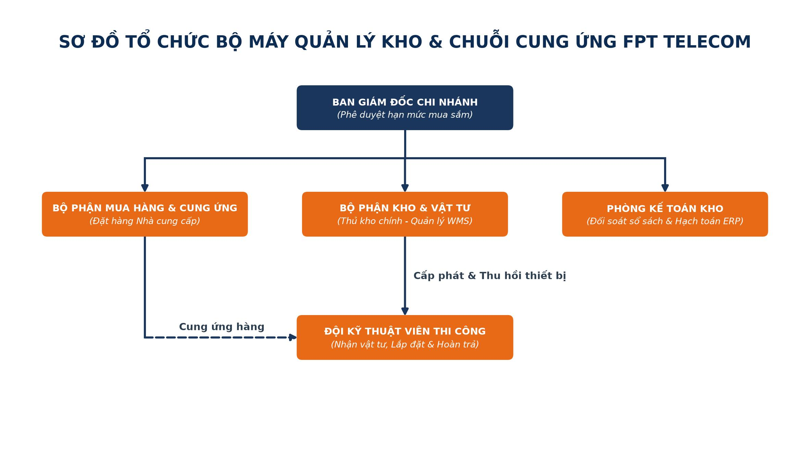
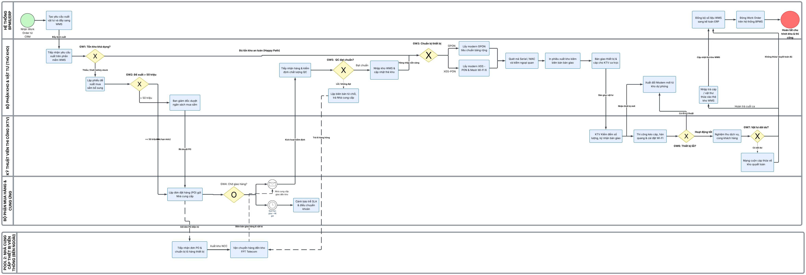

## **3.5. Quy trình hỗ trợ: Quản lý kho và xuất vật tư**

### **3.5.1. Phương pháp thực hiện (Khám phá quy trình - Process Discovery)**

Khám phá quy trình (Process Discovery) là giai đoạn nền tảng trong vòng đời BPM nhằm thu thập dữ liệu hiện trạng, làm rõ các bước công việc thực tế, nhận diện các bên liên quan và phát hiện những điểm nghẽn trong vận hành. Nhóm áp dụng kết hợp **3 phương pháp khám phá quy trình chuẩn mực** theo bài giảng môn học (Chương 4 – Process Discovery) bao gồm: **(1) Phương pháp dựa trên bằng chứng (Evidence-based Discovery)**, **(2) Phương pháp phỏng vấn (Interview-based Discovery)**, và **(3) Phương pháp hội thảo chuyên sâu (Workshop-based Discovery)**.

---

#### **3.5.1.1. Dựa trên bằng chứng (Evidence-based Discovery)**

Phương pháp dựa trên bằng chứng tập trung thu thập, kiểm tra và phân tích các tài liệu, hồ sơ vận hành thực tế đã ban hành và lưu trữ tại FPT Telecom để phản ánh trung thực quy trình As-Is mà không bị ảnh hưởng bởi thiên kiến chủ quan.

##### **a) Mô tả quy trình hiện có (As-is Process Description)**

Quy trình Quản lý kho và xuất vật tư tại FPT Telecom là quy trình hỗ trợ sống còn, có nhiệm vụ đảm bảo cung ứng đầy đủ, chính xác và kịp thời các thiết bị đầu cuối viễn thông (Modem/ONT, Mesh Wi-Fi, Router) và vật tư cáp quang cho đội ngũ kỹ thuật viên triển khai dịch vụ lắp đặt Internet cho khách hàng. Quy trình hiện tại được vận hành qua chuỗi **10 bước nghiệp vụ liên tục** như sau:

* **Bước 1: Tiếp nhận yêu cầu xuất vật tư từ hệ thống:**  
  Khi khách hàng hoàn tất ký kết hợp đồng điện tử (E-Contract), hệ thống BPMS/CRM tự động tạo Lệnh thi công (Work Order) và đẩy thông tin yêu cầu xuất vật tư sang hệ thống Quản lý kho (WMS). Dữ liệu bao gồm: mã Work Order, gói cước đăng ký, địa chỉ lắp đặt, chủng loại thiết bị cần xuất và thông tin Kỹ thuật viên (KTV) được điều phối.

* **Bước 2: Kiểm tra tồn kho khả dụng và đối chiếu ngưỡng an toàn (Safety Stock):**  
  Thủ kho truy cập WMS để kiểm tra số lượng tồn kho khả dụng của các thiết bị và phụ kiện yêu cầu. Tại đây phát sinh điểm kiểm soát: Nếu số lượng tồn kho đáp ứng nhu cầu và vẫn cao hơn mức tồn kho an toàn (*Safety Stock*), quy trình chuyển thẳng sang bước chuẩn bị hàng. Nếu tồn kho dưới ngưỡng an toàn hoặc thiếu hàng, hệ thống kích hoạt luồng xử lý mua sắm bổ sung.

* **Bước 3: Xử lý đề xuất mua sắm và đặt hàng bổ sung:**  
  Thủ kho tạo Phiếu đề xuất mua sắm bổ sung trên WMS. Nếu giá trị đơn hàng vượt hạn mức chi nhánh (> 50 triệu đồng), phiếu phải chuyển đến Ban Giám đốc Chi nhánh phê duyệt. Sau khi được duyệt, Bộ phận Mua hàng & Cung ứng gửi đơn đặt hàng chính thức (Purchase Order) đến Nhà cung cấp hoặc làm lệnh điều chuyển từ Kho tổng trung tâm.

* **Bước 4: Tiếp nhận hàng và kiểm tra chất lượng đầu vào (QC Incoming):**  
  Khi Nhà cung cấp giao hàng đến kho, Thủ kho phối hợp cùng nhân viên kiểm soát chất lượng thực hiện nghiệm thu ngoại quan, quy cách đóng gói và kiểm tra ngẫu nhiên thông số kỹ thuật (đèn tín hiệu, cổng quang, nguồn điện).  
  * *Trường hợp không đạt:* Lập biên bản từ chối, trả hàng lại cho Nhà cung cấp và yêu cầu giao bù khẩn cấp.  
  * *Trường hợp đạt chuẩn:* Ký biên bản giao nhận và tiến hành nhập kho trên WMS.

* **Bước 5: Phân loại chủng loại thiết bị quang và chuẩn bị hàng:**  
  Thủ kho căn cứ vào gói cước của khách hàng trên Work Order để lấy đúng thiết bị: phân biệt giữa thiết bị chuẩn GPON (cho gói Internet gia đình thông thường) và chuẩn cao cấp XGS-PON / Wi-Fi 6 (cho doanh nghiệp hoặc gói cước cao cấp).

* **Bước 6: Quét mã định danh (Serial Number / MAC Address) và in phiếu xuất kho:**  
  Thủ kho sử dụng máy quét mã vạch chuyên dụng để quét Serial Number và địa chỉ MAC của Modem/ONT vào hệ thống WMS, liên kết trực tiếp thiết bị với mã Work Order và tài khoản thuê bao khách hàng. Sau đó, Thủ kho in Phiếu xuất kho kiêm biên bản bàn giao thiết bị.

* **Bước 7: Xuất kho và bàn giao vật tư cho Kỹ thuật viên:**  
  KTV phụ trách ca thi công đến kho kiểm đếm số lượng, chủng loại, tình trạng niêm phong của thiết bị và ký biên bản giao nhận (chữ ký số trên ứng dụng FoxPro hoặc ký giấy). Trách nhiệm bảo quản thiết bị chính thức chuyển giao sang KTV.

* **Bước 8: Thi công lắp đặt và xử lý ngoại lệ đổi thiết bị lỗi kỹ thuật:**  
  KTV di chuyển đến địa chỉ khách hàng để thi công kéo cáp quang và đấu nối thiết bị. Nếu phát hiện thiết bị bị lỗi không thể kích hoạt tín hiệu quang tại hiện trường, KTV liên hệ kho qua hotline nội bộ để kích hoạt thủ tục đổi thiết bị khẩn cấp, nhận modem thay thế để đảm bảo không làm gián đoạn cam kết lắp đặt.

* **Bước 9: Thu hồi, kiểm đếm và nhập trả vật tư sau thi công:**  
  Sau khi hoàn tất nghiệm thu với khách hàng, KTV quay trở về kho để quyết toán:  
  * Hoàn trả cuộn cáp quang dư thừa, phụ kiện chưa dùng hết.  
  * Bàn giao thiết bị lỗi phát sinh trong thi công hoặc thiết bị cũ thu hồi từ khách hàng nâng cấp gói cước.  
  Thủ kho kiểm tra, cập nhật trạng thái phân loại trên WMS (hàng tái nhập kho / hàng chờ bảo hành / hàng thanh lý).

* **Bước 10: Đồng bộ dữ liệu kế toán ERP và đóng Work Order:**  
  Hệ thống WMS tự động đồng bộ giá trị xuất kho và quyết toán vật tư sang phân hệ Kế toán ERP để ghi nhận chi phí giá vốn dịch vụ. Đồng thời, WMS gửi tín hiệu xác nhận hoàn tất sang hệ thống BPMS để đóng Work Order thi công.

---

**Các tác nhân tham gia quy trình (Actors):**

| STT | Tác nhân | Vai trò và trách nhiệm trong quy trình |
| :---: | :--- | :--- |
| **1** | **Hệ thống BPMS / CRM** | Tự động tạo Work Order; điều phối yêu cầu xuất vật tư sang WMS; nhận xác nhận hoàn thành để đóng lệnh thi công. |
| **2** | **Hệ thống WMS / ERP** | Quản lý dữ liệu tồn kho theo thời gian thực (Real-time); quản lý vị trí kho; liên kết mã Serial/MAC; hạch toán chi phí sang ERP. |
| **3** | **Thủ kho / NV Kho & Vật tư** | Tiếp nhận yêu cầu; kiểm kho; chuẩn bị hàng; quét mã vạch Serial/MAC; bàn giao thiết bị; tiếp nhận hoàn trả và kiểm kê kho. |
| **4** | **Kỹ thuật viên thi công (KTV)** | Nhận vật tư; kiểm đếm và ký nhận; thi công kéo cáp và cài đặt modem tại nhà khách hàng; bàn giao vật tư thừa/hỏng về kho. |
| **5** | **Bộ phận Mua hàng & Cung ứng** | Tiếp nhận đề xuất thiếu hàng; tìm kiếm và thương thảo đơn hàng với Nhà cung cấp; theo dõi tiến độ giao hàng về kho. |
| **6** | **Ban Giám đốc Chi nhánh** | Xem xét và phê duyệt các đề xuất mua sắm vượt hạn mức ngân sách tự quyết của chi nhánh. |
| **7** | **Nhà cung cấp** | Cung ứng thiết bị Modem quang, Router, dây cáp quang và phụ kiện viễn thông đạt chuẩn kỹ thuật đã cam kết trong hợp đồng. |
| **8** | **Bộ phận Kế toán kho** | Đối soát chứng từ xuất nhập kho; quản lý giá trị kho; kiểm tra tính hợp lệ của biên bản giao nhận và báo cáo tồn kho định kỳ. |

---

**Khách hàng của quy trình (Customer):**
* **Khách hàng nội bộ (Internal Customer):** Đội ngũ Kỹ thuật viên thi công lắp đặt và Bộ phận Kinh doanh. Họ cần thiết bị sẵn sàng, đúng chuẩn, đủ số lượng để hoàn thành chỉ tiêu lắp đặt đúng hẹn.
* **Khách hàng bên ngoài (External Customer - gián tiếp):** Thuê bao đăng ký dịch vụ Internet FPT. Tiến độ và độ chính xác của quy trình kho ảnh hưởng trực tiếp đến thời gian chờ lắp đặt (SLA 24–48h) và độ ổn định của đường truyền Internet.

**Giá trị mang lại (Value Proposition):**
* **Đảm bảo tính liên tục của chuỗi cung ứng:** Ngăn ngừa tình trạng thiếu hụt thiết bị làm đứt gãy lịch hẹn thi công với khách hàng.
* **Kiểm soát tài sản chặt chẽ:** Việc định danh từng chiếc Modem qua Serial Number và MAC Address giúp chống thất thoát, hỗ trợ bảo hành chính hãng và theo dõi vòng đời thiết bị.
* **Tối ưu hóa vốn lưu động:** Kiểm soát tồn kho theo mô hình Reorder Point và Safety Stock giúp giảm thiểu chi phí lưu kho, tránh ứ đọng vốn nhưng vẫn duy trì độ sẵn sàng cao.

**Những kết quả có thể đạt được (Possible Outcomes):**

| Kết quả đầu ra | Diễn giải chi tiết |
| :--- | :--- |
| **Xuất kho thành công (Happy Path)** | Vật tư có sẵn đủ số lượng, chuẩn bị đúng chủng loại, KTV nhận hàng đúng giờ và hoàn thành lắp đặt cho khách hàng trong ngày. |
| **Chờ mua sắm bổ sung** | Tồn kho thiếu hụt buộc phải kích hoạt đơn đặt hàng khẩn cấp đến Nhà cung cấp; Work Order có thể bị dời lại và cần hẹn lại khách hàng. |
| **Thu hồi và đổi trả thiết bị** | Thiết bị phát sinh lỗi kỹ thuật hoặc vật tư dôi dư sau thi công được phân loại, nhập kho bảo hành hoặc tái nhập kho an toàn. |
| **Hủy Work Order do không tương thích hạ tầng** | Khách hàng chuyển địa điểm hoặc hạ tầng thực tế không phù hợp chuẩn thiết bị được cấp, dẫn đến hủy lệnh xuất và thu hồi vật tư. |

---

##### **b) Sơ đồ tổ chức và Ma trận trách nhiệm (Organizational Chart & RACI Matrix)**

Sơ đồ tổ chức quản lý kho và chuỗi cung ứng tại Chi nhánh FPT Telecom được thiết lập nhằm bảo đảm nguyên tắc kiểm soát độc lập giữa khâu bảo quản hiện vật (Kho), mua sắm (Mua hàng), kiểm soát chi phí (Kế toán) và phê duyệt chủ trương (Ban Giám đốc):

**Ma trận phân công trách nhiệm (RACI Matrix):**  
*(R – Responsible: Người trực tiếp thực hiện; A – Accountable: Người chịu trách nhiệm phê duyệt cuối cùng; C – Consulted: Người được tham vấn; I – Informed: Người được thông báo)*

| Hoạt động nghiệp vụ | Thủ kho | Kỹ thuật viên | Bộ phận Mua hàng | Kế toán kho | Ban Giám đốc |
| :--- | :---: | :---: | :---: | :---: | :---: |
| Tiếp nhận yêu cầu & kiểm tra tồn kho WMS | **R / A** | I | I | I | I |
| Lập đề xuất mua sắm bổ sung vật tư | **R** | I | C | C | **A** |
| Đặt hàng và theo dõi giao hàng Nhà cung cấp | I | I | **R / A** | C | I |
| Kiểm tra chất lượng hàng nhập kho (QC) | **R** | C | I | I | **A** |
| Quét mã Serial/MAC & chuẩn bị vật tư | **R / A** | I | I | I | I |
| Xuất kho & bàn giao thiết bị cho KTV | **R** | **R** | I | I | I |
| Thi công lắp đặt tại hiện trường | I | **R / A** | I | I | I |
| Bàn giao vật tư thừa / thiết bị lỗi về kho | **R** | **R** | I | I | I |
| Đối soát kiểm kê và hạch toán ERP | **R** | I | C | **R / A** | I |

---

##### **c) Kế hoạch làm việc (Work Schedule)**

Để quy trình kho vận hành nhịp nhàng, đáp ứng tiến độ lắp đặt của hàng trăm KTV mỗi ngày, kế hoạch làm việc được thiết lập chi tiết theo ngày và theo tuần:

**Kế hoạch công việc theo ngày (Daily Schedule):**

| Khung giờ | Vai trò | Nội dung công việc chi tiết |
| :---: | :--- | :--- |
| **07:30 – 08:30** | Thủ kho & KTV | **Ca sáng (Cao điểm xuất kho):** Mở cửa kho; in Phiếu xuất kho theo Work Order ca sáng; quét mã Serial/MAC thiết bị; bàn giao vật tư cho KTV xuất phát thi công. |
| **08:30 – 11:30** | Thủ kho & Mua hàng | Tiếp nhận hàng nhập từ Nhà cung cấp hoặc điều chuyển từ Kho tổng; thực hiện kiểm định QC; nhập kho WMS; sắp xếp hàng hóa theo nguyên tắc FIFO. |
| **11:30 – 12:00** | Thủ kho | Đối chiếu số liệu xuất nhập sáng trên WMS; xử lý các yêu cầu phát sinh khẩn cấp từ các tổ kỹ thuật. |
| **13:00 – 14:00** | Thủ kho & KTV | **Ca chiều (Xuất kho đợt 2):** Tiếp nhận danh sách Work Order ca chiều; chuẩn bị thiết bị Modem/Router; bàn giao vật tư cho KTV ca chiều. |
| **14:00 – 17:00** | Thủ kho & Kế toán | Phân loại thiết bị lỗi kỹ thuật; đóng gói thiết bị gửi đi bảo hành hãng; kiểm tra hạn mức an toàn tồn kho (Safety Stock) để lập phiếu đề xuất mua hàng. |
| **17:00 – 18:30** | Thủ kho & KTV | **Cuối ngày (Quyết toán & thu hồi):** Tiếp nhận vật tư dôi dư và thiết bị lỗi từ KTV; kiểm đếm và ký biên bản nhập trả; đồng bộ dữ liệu xuất nhập ngày sang ERP; khóa kho. |

**Kế hoạch công việc theo tuần (Weekly Schedule):**

| Ngày trong tuần | Bộ phận thực hiện | Mục tiêu và nội dung công việc |
| :---: | :--- | :--- |
| **Thứ Hai** | Kho, Mua hàng, Kế toán, BGĐ | Họp giao ban đầu tuần; đánh giá hiệu suất cấp phát vật tư tuần trước; rà soát dự báo nhu cầu lắp đặt tuần mới; phê duyệt các đề xuất mua sắm lớn. |
| **Thứ Ba** | Bộ phận Kho & Vật tư | Kiểm kê xoay vòng (*Cycle Counting*) nhóm hàng giá trị cao (Modem Wi-Fi 6, OLT/ONT chuyên dụng); đối chiếu số liệu vật lý và WMS. |
| **Thứ Tư** | Kho & Bộ phận Mua hàng | Làm việc với các Nhà cung cấp về tiến độ giao hàng; xử lý các lô hàng bị từ chối do lỗi QC. |
| **Thứ Năm** | Bộ phận Kho & KTV | Rà soát công nợ vật tư của toàn bộ KTV; nhắc nhở và thu hồi các thiết bị tồn giữ trên xe KTV quá 48 giờ chưa quyết toán. |
| **Thứ Sáu** | Kho & Kế toán kho | Đối soát chứng từ xuất nhập kho giấy với dữ liệu điện tử trên hệ thống ERP; tổng hợp số liệu hao hụt vật tư tiêu hao (cáp, đầu nối). |
| **Thứ Bảy** | Bộ phận Kho & Vật tư | Vệ sinh kho bãi, bảo dưỡng thiết bị nâng hạ và máy quét mã vạch; sắp xếp lại các khu vực kệ hàng đảm bảo tiêu chuẩn 5S. |
| **Chủ Nhật** | Thủ kho trực ca | Trực xuất kho khẩn cấp phục vụ sự cố mạng hoặc các ca thi công VIP đã được phê duyệt đặc biệt. |

---

##### **d) Thuật ngữ và sổ tay nghiệp vụ (Glossary & Manuals)**

| Thuật ngữ / Viết tắt | Tên đầy đủ / Định nghĩa | Giải thích vai trò trong quy trình FPT Telecom |
| :--- | :--- | :--- |
| **WMS** | Warehouse Management System | Hệ thống phần mềm quản lý kho, theo dõi vị trí kệ, tồn kho và lịch sử quét mã Serial/MAC. |
| **ERP** | Enterprise Resource Planning | Hệ thống hoạch định nguồn lực doanh nghiệp (SAP/Oracle), quản lý hạch toán kế toán và giá trị tài sản. |
| **BPMS** | Business Process Management System | Hệ thống quản trị quy trình nghiệp vụ tự động điều phối luồng công việc từ CRM sang Kho và Kỹ thuật. |
| **ONT** | Optical Network Terminal | Thiết bị chuyển đổi tín hiệu quang sang tín hiệu điện (Modem cáp quang lắp tại nhà khách hàng). |
| **Mesh Wi-Fi** | Hệ thống mở rộng vùng phủ sóng Wi-Fi | Thiết bị phụ trợ kết nối không dây tạo mạng Wi-Fi đồng nhất cho nhà nhiều tầng hoặc diện tích rộng. |
| **Drop Wire** | Cáp quang thuê bao (1-2 FO) | Dây cáp quang chuyên dụng kéo ngoài trời từ hộp chia quang (ODF/DP) vào nhà khách hàng. |
| **Fast Connector** | Đầu nối quang nhanh (SC/APC) | Phụ kiện bấm nối đầu sợi quang trực tiếp tại hiện trường mà không cần dùng máy hàn nhiệt. |
| **Safety Stock** | Mức tồn kho an toàn | Số lượng thiết bị tối thiểu bắt buộc phải duy trì trong kho để phòng ngừa nhu cầu đột biến hoặc trễ giao hàng. |
| **Reorder Point (ROP)** | Điểm đặt hàng lại | Mức tồn kho mà khi chạm tới, hệ thống tự động tạo cảnh báo cần đặt hàng bổ sung ngay lập tức. |
| **FIFO** | First In, First Out | Nguyên tắc quản lý kho "Nhập trước - Xuất trước", đảm bảo thiết bị nhập trước được xuất trước, tránh hết hạn bảo hành. |
| **GPON / XGS-PON** | Gigabit Passive Optical Network | Các chuẩn công nghệ truyền dẫn quang thụ động; XGS-PON cung cấp tốc độ đối xứng 10Gbps đòi hỏi modem chuyên biệt. |
| **QC Incoming** | Quality Control Incoming | Quy trình kiểm tra chất lượng của lô hàng nhập từ Nhà cung cấp trước khi nhập kho chính thức. |

---

##### **e) Hệ thống biểu mẫu áp dụng (Forms & Templates)**

Dưới đây là 6 biểu mẫu nghiệp vụ thực tế được sử dụng xuyên suốt quy trình Quản lý kho và xuất vật tư tại FPT Telecom:

**Biểu mẫu 1: Phiếu yêu cầu xuất vật tư (Electronic Material Requisition Form)**  
* *Mã hiệu:* BM-KHO-01 | *Người lập:* Hệ thống BPMS (Tự động) | *Người nhận:* Thủ kho chi nhánh  

| STT | Mã Work Order | Tên Kỹ thuật viên | Mã nhân viên | Chủng loại thiết bị yêu cầu | Số lượng | Chuẩn công nghệ | Ghi chú |
| :---: | :---: | :---: | :---: | :---: | :---: | :---: | :---: |
| 1 | WO-2026-0901 | Nguyễn Văn An | FPT-10822 | Modem Wi-Fi 6 ONT (G-97RG6M) | 01 Cái | GPON | Gói cước Giga |
| 2 | WO-2026-0901 | Nguyễn Văn An | FPT-10822 | Thiết bị mở rộng Mesh (H3601P) | 01 Cái | Wi-Fi 6 | Thuê bao lắp tầng 2 |
| 3 | WO-2026-0901 | Nguyễn Văn An | FPT-10822 | Cáp quang Drop wire 1FO có dây treo | 150 Mét | Cáp dã chiến | Khoảng cách ODF 120m |

**Biểu mẫu 2: Phiếu xuất kho kiêm biên bản bàn giao thiết bị**  
* *Mã hiệu:* BM-KHO-02 | *Người lập:* Thủ kho | *Người nhận:* Kỹ thuật viên thi công  

| STT | Mã vật tư | Tên thiết bị / Phụ kiện | ĐVT | SL xuất | Số Serial Number | Địa chỉ MAC | Tình trạng |
| :---: | :---: | :---: | :---: | :---: | :---: | :---: | :---: |
| 1 | VT-MODEM-06 | Modem Wi-Fi 6 G-97RG6M | Cái | 01 | FPTHCM26090123 | AC:22:05:4E:91:A0 | Mới 100%, nguyên hộp |
| 2 | VT-MESH-01 | Router Mesh ZTE H3601P | Cái | 01 | ZTESG260877123 | 84:D8:1B:32:FF:12 | Mới 100%, nguyên seal |
| 3 | VT-CAP-1FO | Cáp quang Drop wire 1FO | Mét | 150 | Lô: C-2026-T8 | N/A | Đạt kiểm định suy hao |
| 4 | VT-FAST-SC | Đầu nối Fast Connector SC/APC | Cái | 04 | Lô: FC-09 | N/A | Đóng túi tiêu chuẩn |
*(Kèm chữ ký xác nhận của Thủ kho bàn giao và Kỹ thuật viên nhận hàng)*

**Biểu mẫu 3: Phiếu đề xuất mua sắm bổ sung vật tư**  
* *Mã hiệu:* BM-KHO-03 | *Người lập:* Thủ kho | *Người duyệt:* Trưởng bộ phận Kho & Ban Giám đốc  

| STT | Mã thiết bị | Tên thiết bị / Chủng loại | Tồn kho hiện tại | Ngưỡng Safety Stock | SL đề xuất mua | Đơn giá dự kiến (VNĐ) | Thành tiền dự kiến (VNĐ) |
| :---: | :---: | :---: | :---: | :---: | :---: | :---: | :---: |
| 1 | VT-MODEM-06 | Modem Wi-Fi 6 G-97RG6M | 15 cái | 50 cái | 100 cái | 650.000 | 65.000.000 |
| 2 | VT-CAP-1FO | Cuộn cáp Drop wire 1.000m | 2 cuộn | 5 cuộn | 10 cuộn | 1.800.000 | 18.000.000 |
| 3 | VT-FAST-SC | Fast Connector SC/APC (hộp 100) | 3 hộp | 10 hộp | 20 hộp | 350.000 | 7.000.000 |
| **Tổng** | | | | | | | **90.000.000 VNĐ** |
*(Đề xuất vượt 50 triệu VNĐ $\rightarrow$ Cần chữ ký phê duyệt của Ban Giám đốc Chi nhánh)*

**Biểu mẫu 4: Biên bản kiểm tra chất lượng hàng nhập kho (QC Incoming Report)**  
* *Mã hiệu:* BM-KHO-04 | *Đơn vị giao hàng:* Nhà cung cấp | *Đơn vị kiểm tra:* Bộ phận Kho & QC  

| STT | Số PO / Lô hàng | Tên mặt hàng | Tổng SL giao | Số mẫu test (AQL) | Số lượng Đạt | Số lượng Lỗi | Kết luận QC | Hướng xử lý |
| :---: | :---: | :---: | :---: | :---: | :---: | :---: | :---: | :---: |
| 1 | PO-NHACUNGCAP-991 | Modem Wi-Fi 6 | 100 | 10 | 10 | 0 | **ĐẠT CHUẨN** | Nhập kho WMS |
| 2 | PO-NHACUNGCAP-992 | Dây nhảy quang Patch cord | 500 | 20 | 18 | 2 (Lỏng đầu bấm) | **TỪ CHỐI** | Trả lại Nhà cung cấp |

**Biểu mẫu 5: Phiếu thu hồi và nhập trả vật tư / thiết bị lỗi**  
* *Mã hiệu:* BM-KHO-05 | *Người giao:* Kỹ thuật viên thi công | *Người nhận:* Thủ kho  

| STT | Mã Work Order liên quan | Tên thiết bị / Vật tư hoàn trả | Số Serial / MAC | Lý do thu hồi / nhập trả | Phân loại trạng thái | Ghi chú |
| :---: | :---: | :---: | :---: | :---: | :---: | :---: |
| 1 | WO-2026-0889 | Cáp quang Drop wire 1FO | N/A | Dư thừa sau thi công (35m) | Tái sử dụng (Kho tốt) | Nhập lại thẻ kho |
| 2 | WO-2026-0901 | Modem G-97RG6M | FPTHCM26090123 | Hỏng cổng quang LOS đỏ | Hỏng - Chờ bảo hành | Chuyển khu kho lỗi |

**Biểu mẫu 6: Bảng đối soát và kiểm kê tồn kho định kỳ**  
* *Mã hiệu:* BM-KHO-06 | *Kỳ kiểm kê:* Tháng 08/2026 | *Thành phần:* Kế toán kho, Thủ kho, Trưởng kho  

| Mã vật tư | Tên vật tư thiết bị | Tồn sổ sách (WMS) | Tồn thực tế đếm | Chênh lệch (+/-) | Nguyên nhân chênh lệch | Đề xuất xử lý |
| :--- | :--- | :---: | :---: | :---: | :---: | :---: |
| VT-MODEM-06 | Modem Wi-Fi 6 | 120 | 119 | -1 | Quét sót mã khi nhập trả | Truy xuất camera & cập nhật WMS |
| VT-CAP-1FO | Cáp quang 1FO (Mét) | 4.500 | 4.380 | -120 | Hao hụt thi công dã chiến | Hạch toán chi phí hao hụt định mức |

---

#### **3.5.1.2. Phỏng vấn (Interview-based Discovery)**

Phương pháp phỏng vấn trực tiếp được thực hiện với các bên liên quan nhằm khai thác sâu các khía cạnh vận hành thực tế, trải nghiệm người dùng hệ thống, và các ngoại lệ thường phát sinh trong quá trình xuất nhập kho. Bộ câu hỏi được chia thành **10 câu hỏi định tính** và **10 câu hỏi định lượng**, cân đối giữa **dạng câu hỏi có cấu trúc (Structured)** và **không có cấu trúc (Unstructured)**.

##### **a) Danh sách 10 câu hỏi định tính**

* **Nhóm câu hỏi có cấu trúc (Structured Qualitative Questions):** *(Sử dụng thang đo Likert 5 mức độ hoặc các phương án lựa chọn cố định nhằm lượng hóa mức độ đồng thuận)*

| STT | Đối tượng phỏng vấn | Nội dung câu hỏi có cấu trúc | Thang đo / Phương án lựa chọn |
| :---: | :--- | :--- | :--- |
| **Q1** | Thủ kho & Nhân viên kho | Anh/Chị đánh giá mức độ tiện dụng và độ ổn định của giao diện phần mềm WMS khi thao tác quét mã Serial/MAC và in phiếu xuất kho như thế nào? | 1. Rất khó dùng; 2. Khó dùng; 3. Bình thường; 4. Dễ dùng; 5. Rất trực quan và nhanh chóng. |
| **Q2** | Kỹ thuật viên thi công | Khi phát hiện thiết bị modem bị lỗi quang tại hiện trường, mức độ đáp ứng thủ tục đổi thiết bị thay thế từ kho có kịp thời không? | 1. Rất chậm chạp; 2. Chậm; 3. Trung bình; 4. Nhanh; 5. Rất nhanh, hỗ trợ tức thì. |
| **Q3** | Bộ phận Mua hàng | Mức độ tin cậy và tuân thủ đúng cam kết về thời gian giao hàng của các Nhà cung cấp thiết bị viễn thông hiện nay như thế nào? | 1. Thường xuyên trễ hẹn; 2. Đôi khi trễ hẹn; 3. Đúng hẹn ở mức trung bình; 4. Đúng hẹn phần lớn; 5. Luôn đúng hẹn 100%. |
| **Q4** | Kế toán kho | Quy trình đối soát chứng từ xuất kho giữa số liệu quét mã WMS và hạch toán kế toán ERP hiện tại có đảm bảo độ chính xác không? | 1. Hoàn toàn không khớp; 2. Thường sai lệch; 3. Khớp một phần; 4. Khá chuẩn xác; 5. Khớp hoàn hảo theo thời gian thực. |
| **Q5** | Ban Giám đốc Chi nhánh | Thủ tục phê duyệt đề xuất mua sắm bổ sung vật tư vượt hạn mức tự quyết (> 50 triệu đồng) hiện tại được thực hiện qua kênh nào? | [A] Ký giấy tay truyền thống; [B] Phê duyệt qua Email; [C] Phê duyệt trên phần mềm BPMS; [D] Chat qua nhóm Zalo/Telegram. |

* **Nhóm câu hỏi không có cấu trúc (Unstructured Qualitative Questions):** *(Câu hỏi mở để đối tượng tự do chia sẻ góc nhìn, nguyên nhân gốc rễ và đề xuất giải pháp)*

| STT | Đối tượng phỏng vấn | Nội dung câu hỏi mở (Không có cấu trúc) | Mục tiêu thu thập thông tin |
| :---: | :--- | :--- | :--- |
| **Q6** | Thủ kho chính | Trong quá trình tiếp nhận yêu cầu và xuất hàng vào khung giờ cao điểm buổi sáng, những rào cản hoặc điểm nghẽn lớn nhất gây chậm trễ thời gian nhận hàng của KTV là gì? | Xác định điểm nghẽn vật lý và lỗi hệ thống giờ cao điểm. |
| **Q7** | Kỹ thuật viên thi công | Anh/Chị gặp những khó khăn gì trong việc bảo quản và hoàn trả vật tư dôi dư (cáp quang, đầu nối, modem) sau khi kết thúc ca làm việc ngoài hiện trường? | Nhận diện lý do vật tư chậm hoàn trả hoặc tỷ lệ thất thoát cao. |
| **Q8** | Bộ phận Mua hàng | Những yếu tố bất khả kháng nào thường dẫn đến tình trạng Nhà cung cấp giao hàng chậm hoặc giao hàng không đạt tiêu chuẩn kiểm định QC? | Phân tích rủi ro chuỗi cung ứng và sự phụ thuộc vào Nhà cung cấp. |
| **Q9** | Kế toán kho | Theo Anh/Chị, đâu là nguyên nhân chính dẫn đến sự chênh lệch giữa số lượng tồn kho thực tế đếm được trong kho và số liệu tồn ghi nhận trên hệ thống ERP? | Khám phá lỗ hổng quy trình kiểm đếm và sai lệch thời gian hạch toán. |
| **Q10** | Ban Giám đốc Chi nhánh | Định hướng chiến lược của Chi nhánh trong việc tự động hóa quản lý kho (RFID, mã QR thông minh, tích hợp hệ thống) trong 1–2 năm tới là gì? | Định hình mục tiêu cải tiến và tái thiết kế quy trình To-Be. |

---

##### **b) Danh sách 10 câu hỏi định lượng**

* **Nhóm câu hỏi có cấu trúc (Structured Quantitative Questions):** *(Yêu cầu người trả lời cung cấp số liệu đo lường cụ thể với đơn vị tính rõ ràng)*

| STT | Đối tượng phỏng vấn | Nội dung câu hỏi định lượng có cấu trúc | Đơn vị đo lường |
| :---: | :--- | :--- | :---: |
| **Q11** | Thủ kho | Thời gian trung bình để thực hiện trọn vẹn thao tác quét Serial, MAC, kiểm tra ngoại quan và in phiếu xuất cho 01 đơn hàng là bao nhiêu phút? | Phút / đơn vị |
| **Q12** | Thủ kho | Trung bình một ngày, kho chi nhánh thực hiện xuất vật tư cho bao nhiêu lượt Kỹ thuật viên đến nhận hàng? | Lượt KTV / ngày |
| **Q13** | Kỹ thuật viên | Trong một tháng qua, trung bình có bao nhiêu lần Anh/Chị phải chờ đợi tại kho trên 15 phút mới nhận được đầy đủ thiết bị thi công? | Số lần / tháng |
| **Q14** | Bộ phận Mua hàng | Trong quý gần nhất, tỷ lệ các lô hàng từ Nhà cung cấp bị bộ phận QC từ chối nhập kho do không đạt chuẩn kỹ thuật là bao nhiêu phần trăm? | Tỷ lệ phần trăm (%) |
| **Q15** | Kế toán kho | Số lượng chênh lệch bình quân (thiếu hoặc thừa) giữa kiểm kê vật lý và phần mềm WMS được phát hiện trong các kỳ kiểm kê tháng là bao nhiêu thiết bị? | Số lượng thiết bị / tháng |

* **Nhóm câu hỏi không có cấu trúc (Unstructured Quantitative Questions):** *(Khảo sát khoảng biến thiên, dữ liệu phân bổ xác suất và ước lượng thiệt hại tài chính)*

| STT | Đối tượng phỏng vấn | Nội dung câu hỏi mở định lượng (Không có cấu trúc) | Dữ liệu định lượng kỳ vọng thu thập |
| :---: | :--- | :--- | :--- |
| **Q16** | Bộ phận Mua hàng | Khi kho chạm ngưỡng hết hàng, thời gian chờ Nhà cung cấp giao hàng bổ sung dao động trong khoảng từ bao nhiêu ngày đến bao nhiêu ngày (ngắn nhất và dài nhất)? | Khoảng thời gian (Best-case / Worst-case) tính bằng ngày. |
| **Q17** | Thủ kho | Tỷ lệ phần trăm giữa các đơn hàng xuất thiết bị chuẩn GPON thông thường so với thiết bị cao cấp XGS-PON/Wi-Fi 6 hiện đang phân bổ như thế nào? | Cơ cấu tỷ lệ phần trăm (%) của từng chủng loại thiết bị. |
| **Q18** | Kỹ thuật viên | Trung bình một tuần, tỷ lệ thiết bị Modem/ONT bị phát hiện lỗi kỹ thuật tại hiện trường chiếm khoảng bao nhiêu phần trăm trên tổng số thiết bị đã xuất? | Tỷ lệ lỗi hiện trường (%) và số giờ lãng phí do chờ đổi thiết bị. |
| **Q19** | Kế toán kho | Ước tính tổng chi phí thiệt hại tài chính phát sinh hàng tháng do tình trạng hư hỏng thiết bị, tồn kho quá hạn bảo hành và thất thoát vật tư là bao nhiêu? | Giá trị tiền tệ ước tính (VNĐ / tháng). |
| **Q20** | Ban Giám đốc | Chi nhánh sẵn sàng phân bổ khoảng ngân sách bao nhiêu để đầu tư nâng cấp hệ thống phần mềm WMS và thiết bị quét mã tự động nhằm rút ngắn 50% thời gian xuất kho? | Khung ngân sách đầu tư khả thi (Triệu VNĐ). |

---

#### **3.5.1.3. Workshop (Hội thảo khám phá quy trình - Workshop-based Discovery)**

Phương pháp Workshop được tổ chức nhằm tập hợp toàn bộ các bên liên quan chủ chốt vào một phiên làm việc tập trung để cùng nhau thảo luận, giải quyết các xung đột quan điểm (ví dụ: KTV cho rằng kho xuất chậm, Thủ kho cho rằng KTV đến dồn dập vào một thời điểm), và thống nhất một bức tranh toàn cảnh chính xác về quy trình hiện tại.

##### **a) Biểu mẫu cuộc họp (Meeting Agenda & Setup Form)**

* **Tên cuộc họp:** Hội thảo Khám phá và Chuẩn hóa Quy trình Quản lý kho & Xuất vật tư (Process Discovery Workshop)
* **Thời gian tổ chức:** 08:30 – 11:30, Ngày 25 tháng 08 năm 2026
* **Địa điểm:** Phòng họp Sapphire, Tòa nhà FPT Telecom Chi nhánh & Trực tuyến qua Microsoft Teams
* **Mục tiêu cuộc họp:**
  1. Thống nhất ranh giới bắt đầu và kết thúc của quy trình Quản lý kho và xuất vật tư.
  2. Xác định chi tiết từng bước công việc thực tế (Happy Path) và các nhánh ngoại lệ.
  3. Chỉ ra các nguyên nhân gây nghẽn tại kho và thống nhất ma trận trách nhiệm RACI.
* **Thành phần tham gia cuộc họp:**

| Họ và tên | Chức danh / Phòng ban | Vai trò trong buổi Workshop |
| :--- | :--- | :--- |
| **Nguyễn Hoàng Long** | Chuyên viên Phân tích Quy trình (BPM Lead) | **Người điều phối chính (Facilitator)** – Dẫn dắt thảo luận, giữ vững thời lượng |
| **Trần Văn Bình** | Trưởng bộ phận Kho & Vật tư | **Chủ sở hữu quy trình (Process Owner)** – Cung cấp thông tin nghiệp vụ kho |
| **Lê Thị Mai** | Phó Giám đốc Vận hành Chi nhánh | Đại diện Ban Giám đốc – Định hướng chính sách và phê duyệt ranh giới |
| **Phạm Quốc Toàn** | Trưởng bộ phận Mua hàng & Cung ứng | Thành viên tham gia – Cung cấp dữ liệu làm việc với Nhà cung cấp |
| **Đỗ Minh Tuấn** | Đội trưởng Đội Kỹ thuật viên Thi công | Đại diện người dùng nội bộ – Phản ánh thực tế hiện trường thi công |
| **Ngô Thanh Trúc** | Kế toán trưởng chi nhánh | Đại diện khối Tài chính – Đảm bảo tính tuân thủ hạch toán ERP |
| **Hoàng Anh Thư** | Chuyên viên BA (Business Analyst) | **Thư ký (Scribe)** – Ghi chép biên bản và vẽ phác thảo luồng trực tiếp |

---

##### **b) Kịch bản cuộc họp (Meeting Script & Facilitation Guide)**

Kịch bản điều phối phiên Workshop kéo dài 180 phút được thiết kế theo cấu trúc 5 giai đoạn chặt chẽ:

* **Giai đoạn 1: Khai mạc và Thống nhất phạm vi (08:30 – 08:50 | 20 phút)**  
  * *Người điều phối (Facilitator):* Trình bày mục tiêu buổi làm việc; giới thiệu nguyên tắc tương tác tôn trọng, không đổ lỗi cá nhân; thống nhất ranh giới: Quy trình bắt đầu từ khi nhận Work Order từ BPMS và kết thúc khi toàn bộ vật tư được quyết toán trên WMS/ERP.  
  * *Kết quả đầu ra:* Toàn bộ người tham dự đồng thuận với phạm vi khảo sát.

* **Giai đoạn 2: Vẽ luồng quy trình chính - Happy Path (08:50 – 09:40 | 50 phút)**  
  * *Hoạt động:* Facilitator sử dụng bảng trắng kỹ thuật số (Miro/Mural) mời Thủ kho và KTV từng bước dán giấy ghi chú (Sticky Notes) mô tả trình tự từ: Nhận thông tin $\rightarrow$ Kiểm kho $\rightarrow$ Lấy hàng $\rightarrow$ Quét Serial/MAC $\rightarrow$ Bàn giao $\rightarrow$ Quyết toán.  
  * *Thư ký (Scribe):* Sắp xếp các bước thành chuỗi tuần tự; ghi nhận ý kiến phản hồi về thời gian trung bình của từng bước.  
  * *Kết quả đầu ra:* Bản thảo luồng quy trình tiêu chuẩn khi mọi điều kiện đều thuận lợi (Tồn kho đủ, thiết bị chuẩn).

* **Giai đoạn 3: Nhận diện và Xử lý các luồng ngoại lệ & Điểm nghẽn (09:40 – 10:40 | 60 phút)**  
  * *Hoạt động trọng tâm:* Facilitator đặt câu hỏi kích thích tranh luận: *"Điều gì tồi tệ nhất xảy ra nếu...?"*  
    - *Ngoại lệ 1 (Thiếu hàng):* Thủ kho phản ánh việc tồn kho an toàn bị tính toán sai dẫn đến hết hàng đột ngột. Đại diện Mua hàng giải thích thời gian giao hàng của Nhà cung cấp mất từ 1–5 ngày. Thống nhất: Cần bổ sung cổng kiểm tra hạn mức mua sắm và Event-Driven Gateway để xử lý sự kiện giao trễ.  
    - *Ngoại lệ 2 (Lỗi thiết bị tại hiện trường):* Đội trưởng KTV phản ánh việc đổi thiết bị hỏng mất nhiều thời gian, ảnh hưởng chỉ số hài lòng của khách hàng. Thống nhất bổ sung thủ tục đổi nhanh thiết bị dự phòng.  
    - *Ngoại lệ 3 (Hàng nhập không đạt QC):* Thống nhất quy tắc bắt buộc kiểm định ngẫu nhiên trước khi nhập kho.  
  * *Kết quả đầu ra:* Xác định được toàn bộ 8 điểm rẽ nhánh (Gateways) cần mô hình hóa trong sơ đồ BPMN.

* **Giai đoạn 4: Thống nhất Ma trận phân công trách nhiệm RACI (10:40 – 11:10 | 30 phút)**  
  * *Hoạt động:* Rà soát từng bước công việc và phân định rõ ai là người làm trực tiếp (R), ai phê duyệt (A), ai hỗ trợ (C), ai nhận báo cáo (I) nhằm loại bỏ sự đùn đẩy trách nhiệm giữa Kho và Đội Kỹ thuật.  
  * *Kết quả đầu ra:* Bảng ma trận RACI được toàn thể các trưởng bộ phận ký nháy đồng thuận.

* **Giai đoạn 5: Tổng kết, Phê duyệt biên bản và Kế hoạch tiếp theo (11:10 – 11:30 | 20 phút)**  
  * *Hoạt động:* Scribe đọc lại toàn bộ biên bản ghi nhớ; Process Owner (Trưởng bộ phận Kho) và Đại diện Ban Giám đốc phát biểu xác nhận tính chuẩn xác của dữ liệu; Facilitator công bố lộ trình: Hoàn thiện sơ đồ BPMN As-Is trong vòng 3 ngày làm việc để các bên ký duyệt chính thức.

---

### **3.5.2. Mô hình hóa quy trình hiện tại (Sơ đồ BPMN - As-is)**

Dựa trên kết quả thu thập được từ 3 phương pháp khám phá quy trình và tuân thủ chặt chẽ các quy chuẩn mô hình hóa theo cẩm nang **Mota.docx**, sơ đồ BPMN As-Is của quy trình Quản lý kho và xuất vật tư tại FPT Telecom được thiết kế đạt mức độ phức tạp cao nhất theo Rubric đánh giá của môn học (**Đúng 7 Cổng điều kiện - Gateways = 7** và **20 Hoạt động nghiệp vụ - Activities $\ge 10$**).

#### **a) Phân tích độ phức tạp và Các phần tử chuẩn BPMN 2.0**

Mô hình quy trình đáp ứng chuẩn mực phân tầng độ phức tạp nâng cao (Mức 7 cổng điều kiện) nhằm bao quát toàn diện chuỗi cung ứng vật tư viễn thông:

**Hệ thống 7 Cổng điều kiện (Gateways) chuẩn hóa:**
1. **Gateway 1 (Exclusive XOR Gateway - Tồn kho khả dụng?):**  
   Kiểm tra số lượng tồn kho thực tế có đủ đáp ứng Work Order và vẫn duy trì trên ngưỡng an toàn (*Safety Stock*) hay không.  
   * *Nhánh Đủ (Yes):* Chuyển thẳng sang Gateway 3 để phân loại thiết bị xuất kho.  
   * *Nhánh Thiếu (No):* Chuyển sang bước lập đề xuất mua sắm bổ sung.
2. **Gateway 2 (Exclusive XOR Gateway - Vượt hạn mức tự quyết chi nhánh?):**  
   Đề xuất mua sắm bổ sung có giá trị vượt quá hạn mức ngân sách tự quyết của chi nhánh (> 50 triệu đồng) hay không.  
   * *Nhánh Vượt (Yes):* Trình hồ sơ lên Ban Giám đốc Chi nhánh phê duyệt.  
   * *Nhánh Không vượt (No):* Chuyển trực tiếp sang Bộ phận Mua hàng để phát hành đơn PO.
3. **Gateway 3 (Exclusive XOR Gateway - Phân loại chuẩn công nghệ thiết bị?):**  
   Căn cứ vào gói cước hợp đồng của khách hàng để lấy đúng chủng loại thiết bị quang tương thích hạ tầng:  
   * *Nhánh GPON:* Lấy Modem ONT tiêu chuẩn băng rộng cho hộ gia đình.  
   * *Nhánh XGS-PON:* Lấy Modem cao cấp đối xứng 10Gbps và thiết bị mở rộng Mesh Wi-Fi 6 cho doanh nghiệp.
4. **Gateway 4 (Event-Driven Gateway - Chờ Nhà cung cấp giao hàng):**  
   Cổng rẽ nhánh theo sự kiện ngoại vi, xử lý 2 kịch bản độc quyền:  
   * *Nhánh Message Event (Nhận hàng):* Nhà cung cấp giao hàng đến kho $\rightarrow$ Kích hoạt tiếp nhận và kiểm định chất lượng (QC).  
   * *Nhánh Timer Event (Timeout > 48 giờ):* Quá 48h chưa nhận được hàng $\rightarrow$ Phát cảnh báo trễ hạn SLA và kích hoạt điều chuyển khẩn cấp từ kho lân cận.
5. **Gateway 5 (Exclusive XOR Gateway - Kiểm định chất lượng QC đầu vào đạt?):**  
   Kiểm tra chất lượng mẫu ngẫu nhiên của lô hàng nhập từ Nhà cung cấp:  
   * *Nhánh Đạt (Yes):* Thủ kho xác nhận nhập kho WMS và quay lại Gateway 3 để cấp phát cho KTV.  
   * *Nhánh Không đạt (No):* Lập biên bản từ chối nhận hàng và trả hàng về Nhà cung cấp.
6. **Gateway 6 (Exclusive XOR Gateway - Thiết bị có bị lỗi kỹ thuật trong thi công?):**  
   KTV kiểm tra tín hiệu quang và cấu hình Wi-Fi tại địa chỉ khách hàng:  
   * *Nhánh Không lỗi (No):* Tiến hành nghiệm thu dịch vụ cùng khách hàng.  
   * *Nhánh Có lỗi (Yes):* KTV gọi điện về kho xin đổi thiết bị mới khẩn cấp $\rightarrow$ Thủ kho cấp đổi thiết bị thay thế.
7. **Gateway 7 (Exclusive XOR Gateway - Có phát sinh vật tư dôi dư sau thi công?):**  
   Sau khi hoàn tất thi công tại hiện trường, kiểm tra xem có thừa cuộn cáp quang hoặc phụ kiện không:  
   * *Nhánh Có (Yes):* KTV mang vật tư thừa về kho để Thủ kho kiểm đếm và nhập trả WMS.  
   * *Nhánh Không (No):* Chuyển thẳng sang bước đồng bộ kế toán ERP và đóng Work Order.

---

**Áp dụng các phần tử chuẩn BPMN 2.0 theo cẩm nang BA (Mota.docx):**

* **1. Swimlanes (Pools & Lanes):**  
  * **Pool FPT Telecom (Nội bộ):** Gồm 4 phân làn chức năng (Lanes):
    - *Lane Hệ thống BPMS / WMS:* Tự động hóa tạo Work Order, đồng bộ ERP và đóng lệnh thi công.
    - *Lane Bộ phận Kho & Vật tư:* Quản lý hiện vật, kiểm kho, quét mã Serial/MAC, bàn giao và tiếp nhận hoàn trả.
    - *Lane Kỹ thuật viên thi công (KTV):* Kiểm đếm vật tư, thi công kéo cáp, cài đặt Wi-Fi và nghiệm thu.
    - *Lane Bộ phận Mua hàng & Cung ứng:* Lập đơn đặt hàng PO và phối hợp với Nhà cung cấp.
  * **Pool Nhà cung cấp (Bên ngoài):** Thể hiện sự phối hợp chuỗi cung ứng độc lập thông qua luồng thông điệp (*Message Flow nét đứt*).

* **2. Phân loại Task Types chuẩn mực:**  
  * **User Task:** Thao tác của con người trên phần mềm (*Thủ kho tiếp nhận yêu cầu trên WMS, Quét mã Serial/MAC, Lập đề xuất mua sắm*).
  * **Manual Task:** Hoạt động vật lý thủ công (*Lấy thiết bị từ kệ, Kiểm đếm hàng, Thi công kéo cáp quang, Nghiệm thu cùng khách hàng*).
  * **Service Task:** Hệ thống tự động thực hiện hoàn toàn (*Tạo yêu cầu xuất kho tự động, Đồng bộ số liệu WMS sang ERP, Đóng Work Order trên BPMS*).
  * **Send Task:** Bộ phận Mua hàng phát hành và gửi đơn PO sang Nhà cung cấp.
  * **External Task:** Các tác vụ xử lý độc lập trong Pool Nhà cung cấp.

* **3. Activity Markers:**  
  * **Multi-Instance Task (Ký hiệu 3 vạch song song):** Áp dụng cho bước *Quét mã Serial/MAC cho tập hợp nhiều thiết bị* (Modem, Mesh Wi-Fi) trong cùng một Work Order.  
  * **Loop Task:** Áp dụng cho bước *Kiểm tra công suất cổng quang dã chiến*, lặp lại nhiều lần cho đến khi đạt thông số suy hao chuẩn.

* **4. Events & Boundary Events:**  
  * *Start Event:* Nhận tín hiệu kích hoạt từ hợp đồng khách hàng.  
  * *Intermediate Message Event:* Nhận tín hiệu hàng đến từ Nhà cung cấp.  
  * *Intermediate Timer Event:* Bộ đếm thời gian 48 giờ chờ giao hàng.  
  * *End Event:* Đóng quy trình hoàn tất thành công.

* **5. Information Artifacts:**  
  * **Data Object:** *Phiếu xuất kho kiêm biên bản giao nhận*, *Phiếu đề xuất mua sắm*, *Biên bản kiểm tra QC*.  
  * **Data Store:** *Cơ sở dữ liệu kho WMS* và *Cơ sở dữ liệu kế toán ERP*.

---

#### **b) Diễn giải chi tiết các luồng quy trình As-Is**

##### **1. Luồng chính - Happy Path (Tồn kho đủ & Không phát sinh lỗi):**
1. **BPMS/CRM:** Khởi tạo Work Order $\rightarrow$ Tạo yêu cầu xuất vật tư tự động $\rightarrow$ Đẩy yêu cầu sang WMS.
2. **Kho & Vật tư:** Thủ kho tiếp nhận yêu cầu trên WMS $\rightarrow$ **Gateway 1 (XOR):** Tồn kho khả dụng $\ge$ Safety Stock? $\rightarrow$ **Nhánh Đủ:**
3. **Kho & Vật tư:** **Gateway 3 (XOR):** Phân loại chuẩn thiết bị $\rightarrow$ Chọn lấy Modem GPON hoặc XGS-PON/Mesh $\rightarrow$ Lấy thiết bị ra khỏi kệ hàng $\rightarrow$ Quét mã Serial Number và MAC Address (User Task) $\rightarrow$ In Phiếu xuất kho kiêm biên bản bàn giao thiết bị $\rightarrow$ Bàn giao vật tư cho KTV ca thi công.
4. **Kỹ thuật viên:** KTV đến kho kiểm đếm thiết bị $\rightarrow$ Ký xác nhận biên bản bàn giao $\rightarrow$ Vận chuyển thiết bị đến nhà khách hàng $\rightarrow$ Kéo cáp, hàn quang và cài đặt Wi-Fi.
5. **Kỹ thuật viên:** **Gateway 6 (XOR):** Thiết bị có bị lỗi không? $\rightarrow$ **Nhánh Không:** Nghiệm thu dịch vụ cùng khách hàng.
6. **Kỹ thuật viên:** **Gateway 7 (XOR):** Có vật tư dôi dư không? $\rightarrow$ **Nhánh Không:** Hoàn tất thi công tại chỗ.
7. **Hệ thống BPMS / WMS:** Phân hệ WMS tự động đồng bộ giá trị xuất kho sang ERP để ghi nhận giá vốn $\rightarrow$ BPMS đóng Work Order thi công $\rightarrow$ Kết thúc thành công.

##### **2. Luồng phụ 1 - Kịch bản thiếu tồn kho & Đặt hàng Nhà cung cấp:**
1. **Kho & Vật tư:** Tại Gateway 1, phát hiện tồn kho thiếu hụt hoặc dưới mức Safety Stock $\rightarrow$ Thủ kho lập Phiếu đề xuất mua sắm bổ sung trên WMS.
2. **Kho & Vật tư:** **Gateway 2 (XOR):** Giá trị đơn hàng có vượt hạn mức tự quyết chi nhánh (> 50 triệu)?
   * *Nhánh Vượt (> 50tr):* Gửi hồ sơ lên Ban Giám đốc Chi nhánh phê duyệt $\rightarrow$ Ban Giám đốc ký duyệt điện tử.
   * *Nhánh Không vượt ($\le$ 50tr):* Chuyển thẳng đơn đề xuất sang Bộ phận Mua hàng.
3. **Bộ phận Mua hàng:** Lập đơn đặt hàng (PO) và gửi sang Nhà cung cấp $\rightarrow$ Hệ thống đi vào **Gateway 4 (Event-Driven Gateway)** để chờ phản hồi:
   * *Nhánh Sự kiện A (Timer Event 48h):* Nếu quá 48 giờ Nhà cung cấp chưa giao hàng $\rightarrow$ Phát cảnh báo trễ hạn SLA, điều chuyển gấp từ chi nhánh lân cận.
   * *Nhánh Sự kiện B (Message Event nhận hàng):* Nhà cung cấp giao hàng đến kho FPT $\rightarrow$ Kích hoạt tiếp nhận hàng.
4. **Kho & Vật tư:** Tiếp nhận lô hàng $\rightarrow$ Thực hiện kiểm định chất lượng đầu vào (QC) $\rightarrow$ **Gateway 5 (XOR):** Đạt tiêu chuẩn QC?
   * *Nhánh Không đạt (Lỗi):* Lập biên bản từ chối $\rightarrow$ Trả hàng lại cho Nhà cung cấp $\rightarrow$ Yêu cầu giao bù khẩn cấp.
   * *Nhánh Đạt:* Xác nhận nhập kho trên WMS $\rightarrow$ Cập nhật lại số lượng tồn kho khả dụng $\rightarrow$ Chuyển sang Gateway 3 để chuẩn bị xuất kho cho KTV.

##### **3. Luồng phụ 2 - Kịch bản phát hiện thiết bị lỗi trong quá trình thi công:**
1. **Kỹ thuật viên:** Tại Gateway 6, trong quá trình đấu nối tại nhà khách hàng, KTV phát hiện modem bị lỗi nguồn hoặc suy hao cổng quang $\rightarrow$ KTV gọi điện về hotline kho yêu cầu đổi thiết bị khẩn cấp.
2. **Kho & Vật tư:** Thủ kho lấy thiết bị dự phòng mới $\rightarrow$ Quét Serial/MAC mới để đính chính Work Order $\rightarrow$ Bàn giao thiết bị mới cho KTV.
3. **Kỹ thuật viên:** KTV nhận thiết bị mới $\rightarrow$ Tiếp tục lắp đặt và nghiệm thu hoàn tất với khách hàng $\rightarrow$ Mang thiết bị lỗi về kho cuối ngày.
4. **Kho & Vật tư:** Tiếp nhận thiết bị hỏng $\rightarrow$ Dán tem "Hỏng – Chờ bảo hành" $\rightarrow$ Nhập dữ liệu lên WMS $\rightarrow$ Chuyển vào khu vực kho hàng lỗi chờ trả bảo hành.

##### **4. Luồng phụ 3 - Kịch bản hoàn trả và thu hồi vật tư dôi dư sau thi công:**
1. **Kỹ thuật viên:** Tại Gateway 7, KTV kiểm tra thấy còn dư thừa cuộn cáp quang dã chiến hoặc phụ kiện đầu nối $\rightarrow$ Mang toàn bộ về kho lúc cuối ca.
2. **Kho & Vật tư:** Thủ kho kiểm đếm thực tế $\rightarrow$ Lập Phiếu nhập trả vật tư trên WMS $\rightarrow$ Cập nhật lại thẻ kho tài sản $\rightarrow$ Chuyển sang bước đồng bộ hệ thống ERP và đóng Work Order.

---

#### **c) Sơ đồ BPMN As-Is - Quy trình Quản lý kho và xuất vật tư**

Sơ đồ BPMN dưới đây thể hiện toàn diện 4 phân làn trách nhiệm (Swimlanes), 20 hoạt động nghiệp vụ và **đúng 7 cổng điều kiện (Gateways = 7)** được đánh số từ **GW1 đến GW7** khớp chuẩn xác với mô tả nghiệp vụ:

---

### **3.5.3. Phân tích định tính**

#### **3.5.3.1. Phân tích giá trị gia tăng**

Bảng dưới đây phân loại toàn bộ các hoạt động trong quy trình **Quản lý kho và xuất vật tư** theo ba nhóm:
- **VA (Value-Added):** Hoạt động tạo ra giá trị trực tiếp cho khách hàng; khách hàng sẵn sàng chi trả.
- **BVA (Business Value-Added):** Bắt buộc theo yêu cầu nội bộ hoặc quy định, nhưng khách hàng không trực tiếp nhận ra giá trị.
- **NVA (Non-Value-Added):** Không tạo ra giá trị, cần được giảm thiểu hoặc loại bỏ.

| STT | Hoạt động | Người thực hiện | Phân loại | Lập luận theo tiêu chuẩn phân loại |
| :---: | :--- | :--- | :---: | :--- |
| 1 | Nhận Work Order từ hệ thống CRM | Hệ thống BPMS | **BVA** | Bước khởi tạo nội bộ tự động, cần thiết cho điều phối hệ thống nhưng khách hàng không nhận ra trực tiếp. |
| 2 | Tạo yêu cầu xuất vật tư tự động | Hệ thống BPMS/WMS | **BVA** | Điều phối công việc nội bộ giữa các hệ thống; không tạo giá trị trực tiếp nhưng bắt buộc để kích hoạt quy trình. |
| 3 | Tiếp nhận yêu cầu xuất trên WMS | Thủ kho | **BVA** | Bước xác nhận và tiếp nhận nhiệm vụ; cần thiết cho kiểm soát quy trình nội bộ. |
| 4 | Kiểm tra tồn kho khả dụng | Thủ kho | **BVA** | Đảm bảo tính chính xác của xuất kho; tránh thiếu hàng gây gián đoạn Work Order — bắt buộc về mặt vận hành. |
| 5 | Lập phiếu đề xuất mua sắm (khi tồn kho thiếu) | Thủ kho | **NVA** | Phát sinh do tồn kho không được dự báo đủ; nếu Safety Stock được duy trì tốt, bước này không cần xảy ra. |
| 6 | Đặt hàng Nhà cung cấp hoặc điều chuyển kho tổng | Bộ phận Mua hàng | **NVA** | Hành động khắc phục hậu quả do lập kế hoạch tồn kho kém — không tạo giá trị, tốn thời gian và chi phí. |
| 7 | Chờ Nhà cung cấp giao hàng | — | **NVA** | Thời gian chờ thuần túy (1–5 ngày), không có hoạt động nào được thực hiện, gây trễ Work Order trực tiếp. |
| 8 | Tiếp nhận hàng và kiểm tra chất lượng đầu vào (QC) | Thủ kho | **BVA** | Bắt buộc để đảm bảo chất lượng thiết bị trước khi nhập kho; kiểm soát rủi ro về sau cho khách hàng. |
| 9 | Nhập kho trên WMS sau khi đạt QC | Thủ kho | **BVA** | Cập nhật dữ liệu tồn kho chính xác; cần thiết cho hạch toán và quản lý tài sản nội bộ. |
| 10 | Trả hàng lại Nhà cung cấp (khi không đạt QC) | Thủ kho | **NVA** | Hoạt động sửa lỗi do Nhà cung cấp giao hàng kém chất lượng; không tạo giá trị, gây lãng phí thời gian và nguồn lực. |
| 11 | Lấy thiết bị ra kho | Thủ kho | **VA** | Trực tiếp chuẩn bị thiết bị cho khách hàng sử dụng; khách hàng nhận giá trị khi thiết bị đến tay đúng loại. |
| 12 | Quét mã Serial Number / địa chỉ MAC / QR Code | Thủ kho | **VA** | Gắn định danh thiết bị với thuê bao khách hàng; nền tảng cho bảo hành và truy xuất tài sản. |
| 13 | Kiểm tra ngoại quan thiết bị | Thủ kho | **VA** | Đảm bảo thiết bị không bị hỏng hóc trước khi trao tay KTV; khách hàng nhận thiết bị trong tình trạng tốt. |
| 14 | Chuẩn bị vật tư tiêu hao theo định mức | Thủ kho | **VA** | Đảm bảo đủ phụ kiện để KTV hoàn tất thi công trong một lượt, tránh phải quay lại lấy thêm. |
| 15 | In Phiếu xuất kho | Thủ kho | **BVA** | Chứng từ nội bộ để xác nhận trách nhiệm bàn giao; cần thiết cho kế toán kho và kiểm toán. |
| 16 | Kiểm đếm vật tư & ký xác nhận Phiếu xuất kho | Kỹ thuật viên | **VA** | Khách hàng được đảm bảo rằng KTV nhận đủ thiết bị đúng chủng loại trước khi thi công. |
| 17 | Thực hiện thi công lắp đặt tại nhà khách hàng | Kỹ thuật viên | **VA** | Hoạt động cốt lõi tạo ra sản phẩm dịch vụ Internet cho khách hàng; khách hàng trực tiếp nhận giá trị. |
| 18 | Hoàn trả vật tư thừa về kho sau thi công | Kỹ thuật viên | **NVA** | Thao tác vận chuyển ngược chiều không tạo giá trị; cần được giảm thiểu bằng cách xuất đúng định mức ngay từ đầu. |
| 19 | Kiểm đếm & phân loại vật tư hoàn trả | Thủ kho | **BVA** | Bắt buộc để cập nhật tồn kho chính xác và phân loại tài sản (dùng lại / bảo hành / thanh lý). |
| 20 | Nhập trả vật tư / thiết bị trên WMS | Thủ kho | **BVA** | Cập nhật số liệu tồn kho real-time; cần thiết cho hạch toán kế toán và quản lý tài sản. |
| 21 | Đồng bộ dữ liệu WMS → ERP | Hệ thống WMS/ERP | **BVA** | Đảm bảo số liệu tài chính chính xác; bắt buộc theo quy trình hạch toán nội bộ doanh nghiệp. |
| 22 | Đóng Work Order trên BPMS | Hệ thống BPMS | **BVA** | Kết thúc vòng đời Work Order; cần thiết cho báo cáo và đánh giá hiệu suất vận hành nội bộ. |

_Bảng 3.5.1: Phân loại giá trị gia tăng quy trình Quản lý kho và xuất vật tư_

**Tổng hợp phân loại:**

| Loại giá trị | Số lượng hoạt động | Tỉ lệ |
| :---: | :---: | :---: |
| **VA** | 6 | 27,3% |
| **BVA** | 12 | 54,5% |
| **NVA** | 4 | 18,2% |
| **Tổng** | **22** | **100%** |

> **Nhận xét:** Tỉ lệ NVA chiếm 18,2% — chủ yếu phát sinh ở kịch bản tồn kho thiếu (mua sắm qua Nhà cung cấp) và thời gian hoàn trả vật tư thừa. Đây là các điểm cần ưu tiên tối ưu hóa nhằm nâng cao hiệu quả quy trình.

---

#### **3.5.3.2. Phân tích lãng phí**

Dựa trên 7 loại lãng phí (7 Wastes) theo phương pháp Lean, bảng dưới đây xác định các lãng phí hiện diện trong quy trình Quản lý kho và xuất vật tư tại FPT Telecom:

| Loại lãng phí | Biểu hiện trong quy trình FPT Telecom |
| :--- | :--- |
| **Hold (Chờ đợi)** | 1 Chờ Nhà cung cấp giao hàng khi tồn kho dưới Safety Stock (1–5 ngày làm việc); 2 Chờ kỹ thuật viên xác nhận thiết bị lỗi và liên hệ kho; 3 Chờ hệ thống BPMS đẩy Work Order sang WMS vào giờ cao điểm. |
| **Move (Vận chuyển không cần thiết)** | 1 Vận chuyển thiết bị từ kho trung tâm ra kho điểm khi phải điều chuyển nội bộ; 2 Kỹ thuật viên phải quay lại kho để đổi thiết bị lỗi thay vì được giao thay thế trực tiếp tại công trình. |
| **Over-do (Xử lý thừa / Làm quá mức)** | 1 Nhập liệu Serial/MAC thủ công song song với quét QR tự động trên WMS — thực hiện dữ liệu trùng lặp; 2 Kiểm tra ngoại quan thiết bị nhiều lần (tại kho và tại công trình); 3 In Phiếu xuất kho giấy khi hệ thống WMS đã có chữ ký điện tử của KTV. |
| **Defects (Lỗi / Làm lại)** | 1 Xuất nhầm model Modem/ONT không phù hợp hạ tầng GPON/XGS-PON → KTV phải quay lại kho đổi; 2 QC đầu vào từ Nhà cung cấp không đạt → trả hàng và đặt lại, gây trễ Work Order; 3 Ghi sai Serial Number trên WMS → phải tra cứu và đính chính sau. |
| **Over-production (Sản xuất/Xử lý thừa)** | 1 Tạo đề xuất mua sắm khi tồn kho thực tế vẫn còn hàng nhưng WMS chưa cập nhật real-time; 2 In dư Phiếu xuất kho giấy nhiều bản. |
| **Inventory (Lưu kho thừa)** | 1 Tồn kho Modem/ONT vượt ngưỡng Safety Stock do dự báo nhu cầu chưa chính xác, gây đọng vốn; 2 Thiết bị thu hồi từ khách hàng tồn lâu ở khu hàng lỗi chờ phân loại (dùng lại / bảo hành / thanh lý). |
| **Motion (Thao tác thừa)** | 1 Thủ kho phải tra cứu thủ công danh sách tồn kho trên giấy thay vì xem dashboard real-time trên WMS; 2 Nhân viên Mua hàng phải liên hệ Nhà cung cấp qua điện thoại/email thủ công thay vì thông qua cổng đặt hàng tích hợp. |

> **Nhận xét:** Lãng phí **Hold** và **Defects** có mức độ tác động cao nhất vì ảnh hưởng trực tiếp đến thời gian hoàn thành Work Order và SLA lắp đặt 24–48 giờ của FPT Telecom.

---

#### **3.5.3.3. Phân tích các bên liên quan (Stakeholder Analysis)**

| Bên liên quan | Mức độ ảnh hưởng | Vai trò & Kỳ vọng | Rủi ro nếu quy trình không hiệu quả |
| :--- | :---: | :--- | :--- |
| **Kỹ thuật viên thi công (KTV)** | Rất cao | Nhận đúng thiết bị, đủ số lượng, kịp thời để hoàn thành Work Order đúng hẹn. | Trễ lịch lắp đặt, phải di chuyển đổi thiết bị, ảnh hưởng KPI cá nhân. |
| **Thủ kho / NV Kho & Vật tư** | Rất cao | Thực hiện xuất/nhập chính xác, cập nhật WMS real-time; kiểm soát tồn kho an toàn. | Sai lệch tồn kho, thiếu hàng đột ngột, áp lực xử lý đổi trả lớn. |
| **Bộ phận Mua hàng & Cung ứng** | Cao | Đảm bảo chuỗi cung ứng thông suốt; đặt hàng Nhà cung cấp đúng số lượng và thời hạn. | Tồn kho gián đoạn, phải xử lý đơn khẩn cấp với chi phí cao hơn. |
| **Nhà cung cấp** | Trung bình đến cao | Cung cấp Modem/ONT, Router Wi-Fi đúng chất lượng và đúng hạn giao. | Bị trả hàng khi QC không đạt, mất uy tín và hợp đồng dài hạn. |
| **Ban Kỹ thuật FPT Telecom** | Cao | Phê duyệt thiết bị chuyên dụng GPON/XGS-PON; đảm bảo tương thích hạ tầng. | Work Order bị hoãn khi thiếu thiết bị đặc thù, ảnh hưởng SLA toàn hệ thống. |
| **Hệ thống BPMS/WMS/ERP** | Rất cao | Tự động hóa luồng Work Order; quản lý tồn kho real-time; đồng bộ hạch toán. | Dữ liệu tồn kho sai lệch; không đóng được Work Order; mất khả năng truy xuất tài sản. |
| **Khách hàng cuối (Người dùng Internet)** | Trung bình (gián tiếp) | Được lắp đặt đúng hẹn, thiết bị hoạt động ổn định ngay từ đầu. | Không hài lòng, khiếu nại, hủy hợp đồng nếu lắp đặt trễ hoặc thiết bị lỗi. |

---

### **3.5.4. Phân tích định lượng**

#### **3.5.4.1. Định lượng thời gian**

Bảng thời gian xử lý của từng hoạt động trong **luồng chính (Happy Path — Tồn kho đủ)**:

| STT | Hoạt động | Người thực hiện | Loại | TG ngắn nhất (phút) | TG dài nhất (phút) |
| :---: | :--- | :--- | :---: | :---: | :---: |
| 1 | Nhận WO & Tạo yêu cầu xuất vật tư | Hệ thống BPMS/WMS | BVA | 1 | 3 |
| 2 | Tiếp nhận yêu cầu trên WMS | Thủ kho | BVA | 2 | 5 |
| 3 | Kiểm tra tồn kho khả dụng | Thủ kho | BVA | 3 | 10 |
| 4 | Lấy thiết bị ra kho | Thủ kho | VA | 5 | 15 |
| 5 | Quét mã Serial/MAC & QR Code | Thủ kho | VA | 5 | 15 |
| 6 | Kiểm tra ngoại quan thiết bị | Thủ kho | VA | 3 | 10 |
| 7 | Chuẩn bị vật tư tiêu hao theo định mức | Thủ kho | VA | 5 | 15 |
| 8 | In Phiếu xuất kho | Thủ kho | BVA | 2 | 5 |
| 9 | Kiểm đếm & ký xác nhận Phiếu xuất kho | Kỹ thuật viên | VA | 5 | 15 |
| 10 | Thực hiện thi công lắp đặt tại công trình | Kỹ thuật viên | VA | 60 | 120 |
| 11 | Hoàn trả vật tư thừa về kho | Kỹ thuật viên | NVA | 10 | 30 |
| 12 | Kiểm đếm & phân loại vật tư hoàn trả | Thủ kho | BVA | 5 | 15 |
| 13 | Nhập trả WMS & Đồng bộ ERP, đóng WO | Hệ thống WMS/ERP | BVA | 2 | 5 |

**Thời gian xử lý (Process Time — VA + BVA):**

$$
\begin{aligned}
\text{Ngắn nhất: } & 1+2+3+5+5+3+5+2+5+60+5+2 = 98 \text{ phút} \\
\text{Dài nhất: } & 3+5+10+15+15+10+15+5+15+120+15+5 = 233 \text{ phút}
\end{aligned}
$$

**Thời gian chu kỳ (Cycle Time — VA + BVA + NVA):**

Có **20%** trường hợp tồn kho thiếu → phải qua quy trình Nhà cung cấp (thời gian chờ NVA: 480 phút best-case / 2.400 phút worst-case):

$$
\begin{aligned}
\text{CT ngắn nhất} &= 98 + 10_{\text{(NVA hoàn trả)}} + 0{,}20 \times (15 + 30 + 480 + 15 + 10) = 108 + 110 = 218 \text{ phút} \\
\text{CT dài nhất} &= 233 + 30_{\text{(NVA hoàn trả)}} + 0{,}20 \times (30 + 60 + 2.400 + 30 + 20) = 263 + 508 = 771 \text{ phút}
\end{aligned}
$$

**Thời gian xử lý thực tế (bao gồm xác suất luồng phụ):**

$$
\begin{aligned}
\text{PT ngắn nhất} &= 98 + 0{,}20 \times (15 + 10) = 98 + 5 = 103 \text{ phút} \\
\text{PT dài nhất} &= 233 + 0{,}20 \times (30 + 20) = 233 + 10 = 243 \text{ phút}
\end{aligned}
$$

**Hiệu suất thời gian (Time Efficiency):**

| Trường hợp | Process Time | Cycle Time | Hiệu suất |
| :---: | :---: | :---: | :---: |
| **Best-case** | 103 phút | 218 phút | **47,2%** |
| **Worst-case** | 243 phút | 771 phút | **31,5%** |

> **Nhận xét:** Hiệu suất thời gian thấp (31,5% – 47,2%) chủ yếu do thời gian chờ Nhà cung cấp giao hàng trong kịch bản tồn kho thiếu chiếm tỉ trọng lớn trong Cycle Time. Cải thiện việc dự báo nhu cầu và duy trì Safety Stock sẽ giúp tăng hiệu suất đáng kể.

---

#### **3.5.4.2. Định lượng chi phí**

**Mức lương tham chiếu (tháng 22 ngày, 8 giờ/ngày):**

| Bộ phận | Lương tháng (VNĐ) | Chi phí / phút (VNĐ) |
| :--- | :---: | :---: |
| Thủ kho / NV Kho & Vật tư | 8.000.000 | **758** |
| Kỹ thuật viên thi công | 10.000.000 | **947** |
| NV Bộ phận Mua hàng & Cung ứng | 9.000.000 | **852** |

**Thời gian của từng tác nhân trong quy trình (VA+BVA và NVA):**

| Bộ phận | Trường hợp | Thời gian VA+BVA | Thời gian NVA |
| :--- | :---: | :---: | :---: |
| **Thủ kho** | Best-case | 24 phút | 0 phút |
| | Worst-case | 65 phút | 0 phút |
| **Kỹ thuật viên** | Best-case | 65 phút | 10 phút |
| | Worst-case | 135 phút | 30 phút |
| **NV Mua hàng** (p=0,20) | Best-case | 0,20 × 25 = 5 phút | 0,20 × 45 = 9 phút |
| | Worst-case | 0,20 × 50 = 10 phút | 0,20 × 90 = 18 phút |

**Chi phí của từng tác nhân (trên 1 Work Order):**

| Bộ phận | CP/phút (VNĐ) | Trường hợp | Chi phí VA+BVA | Chi phí NVA | Tổng chi phí |
| :--- | :---: | :---: | :---: | :---: | :---: |
| **Thủ kho** | 758 | Best-case | 24 × 758 = **18.192 VNĐ** | 0 | **18.192 VNĐ** |
| | | Worst-case | 65 × 758 = **49.270 VNĐ** | 0 | **49.270 VNĐ** |
| **Kỹ thuật viên** | 947 | Best-case | 65 × 947 = **61.555 VNĐ** | 10 × 947 = **9.470 VNĐ** | **71.025 VNĐ** |
| | | Worst-case | 135 × 947 = **127.845 VNĐ** | 30 × 947 = **28.410 VNĐ** | **156.255 VNĐ** |
| **NV Mua hàng** | 852 | Best-case | 5 × 852 = **4.260 VNĐ** | 9 × 852 = **7.668 VNĐ** | **11.928 VNĐ** |
| | | Worst-case | 10 × 852 = **8.520 VNĐ** | 18 × 852 = **15.336 VNĐ** | **23.856 VNĐ** |

**Tổng chi phí cho 1 Work Order:**

| Trường hợp | Tổng chi phí (VA+BVA) | Tổng chi phí (NVA) | Tổng cộng |
| :---: | :---: | :---: | :---: |
| **Best-case** | 18.192 + 61.555 + 4.260 = **84.007 VNĐ** | 9.470 + 7.668 = **17.138 VNĐ** | **101.145 VNĐ** |
| **Worst-case** | 49.270 + 127.845 + 8.520 = **185.635 VNĐ** | 28.410 + 15.336 = **43.746 VNĐ** | **229.381 VNĐ** |

**Hiệu suất chi phí (Cost Efficiency):**

| Trường hợp | Chi phí VA+BVA | Tổng chi phí | Hiệu suất chi phí |
| :---: | :---: | :---: | :---: |
| **Best-case** | 84.007 VNĐ | 101.145 VNĐ | **83,1%** |
| **Worst-case** | 185.635 VNĐ | 229.381 VNĐ | **80,9%** |

> **Nhận xét:** Hiệu suất chi phí đạt khoảng **81–83%**, cho thấy phần lớn chi phí nhân công được sử dụng cho các hoạt động có giá trị (VA + BVA). Chi phí lãng phí (NVA ~17–19%) tập trung ở thời gian chờ Nhà cung cấp và thao tác hoàn trả vật tư sau thi công — đây là 2 điểm có thể cải thiện trong giai đoạn tái thiết kế quy trình (To-be process).

