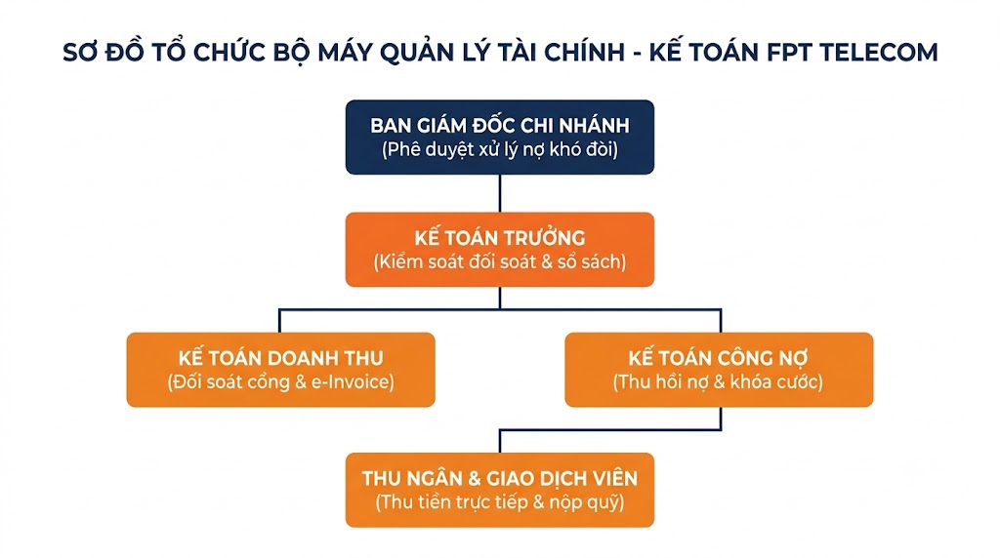
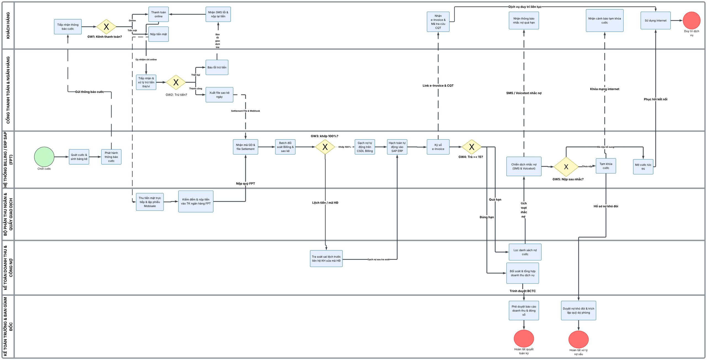
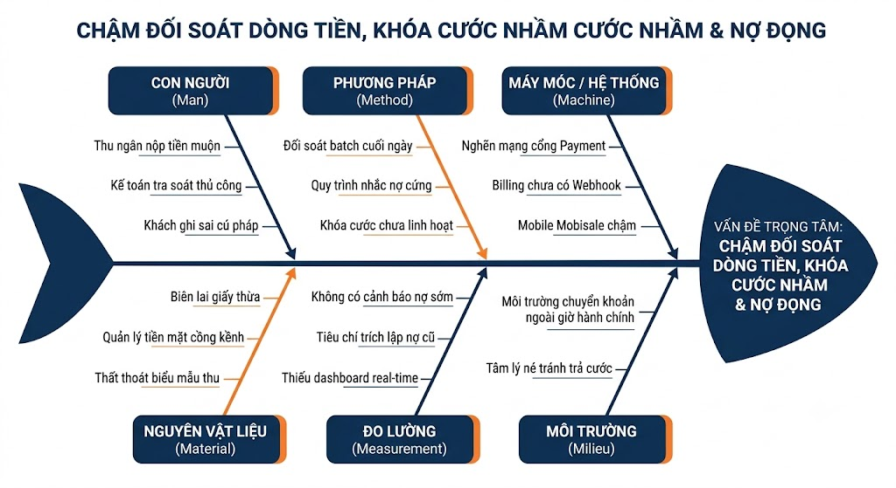

## **3.7. QUY TRÌNH HỖ TRỢ: QUẢN LÝ TÀI CHÍNH – KẾ TOÁN (THU CƯỚC, ĐỐI SOÁT CÔNG NỢ VÀ XUẤT HÓA ĐƠN ĐIỆN TỬ)**

---

### **3.7.1. Phương pháp thực hiện (Khám phá quy trình - Process Discovery)**

Khám phá quy trình (Process Discovery) là bước khởi đầu then chốt trong chu kỳ quản trị quy trình nghiệp vụ (BPM Lifecycle). Để xây dựng bức tranh hiện trạng chân thực, khách quan và toàn diện nhất về hoạt động tài chính – kế toán tại Công ty Cổ phần Viễn thông FPT (FPT Telecom), nhóm áp dụng kết hợp **3 phương pháp khám phá quy trình chuẩn mực** theo bài giảng môn học (Chương 4 – Process Discovery):
1. **Phương pháp dựa trên bằng chứng (Evidence-based Discovery)**
2. **Phương pháp phỏng vấn (Interview-based Discovery)**
3. **Phương pháp hội thảo chuyên sâu (Workshop-based Discovery)**

---

#### **3.7.1.1. Dựa trên bằng chứng (Evidence-based Discovery)**

Phương pháp dựa trên bằng chứng tập trung thu thập, kiểm tra chéo và đối soát các tài liệu, hồ sơ kế toán, dữ liệu log hệ thống và văn bản hướng dẫn nghiệp vụ thực tế đang ban hành tại FPT Telecom nhằm phản ánh chính xác quy trình As-is mà không bị ảnh hưởng bởi nhận định cảm tính.

##### **a) Mô tả quy trình hiện có (As-is Process Description)**

Quy trình Quản lý tài chính – kế toán trong mảng thu cước và đối soát doanh thu viễn thông tại FPT Telecom là quy trình hỗ trợ cốt lõi, có nhiệm vụ chuyển đổi toàn bộ dịch vụ Internet/Truyền hình/Camera đã cung cấp cho khách hàng thành dòng tiền thực thu của doanh nghiệp; đồng thời bảo đảm tính chuẩn xác của hóa đơn chứng từ theo quy định pháp lý của Tổng cục Thuế và chuẩn mực kế toán Việt Nam (VAS/IFRS).

Chuỗi hoạt động As-is bao gồm **12 bước nghiệp vụ liên tục** như sau:

* **Bước 1: Chốt dữ liệu cước chu kỳ và phát hành thông báo cước:**  
  Vào ngày cuối cùng của tháng (chu kỳ tính cước), hệ thống FPT Billing tự động quét toàn bộ lưu lượng, gói cước và dịch vụ giá trị gia tăng của từng thuê bao hoạt động. Hệ thống tổng hợp cước phí, tự động sinh bảng kê cước chi tiết và gửi Thông báo cước qua ứng dụng Hi FPT, tin nhắn SMS/Zalo ZNS và Email đến khách hàng.

* **Bước 2: Khách hàng lựa chọn phương thức thanh toán:**  
  Khách hàng nhận thông báo cước và tiến hành thanh toán qua một trong hai kênh chính:
  * *Kênh trực tuyến (Online):* Thanh toán qua ví Foxpay, ứng dụng ngân hàng (Mobile Banking/VNPAY-QR), trích nợ tự động (Auto-debit) hoặc cổng thanh toán trên website fpt.vn.
  * *Kênh trực tiếp (Offline):* Khách hàng nộp tiền mặt tại Quầy giao dịch FPT Telecom, chuỗi FPT Shop hoặc nộp trực tiếp cho Thu ngân hiện trường/Kỹ thuật viên tại nhà.

* **Bước 3: Tiếp nhận và phân luồng giao dịch thanh toán:**  
  Hệ thống Trung tâm thanh toán (Payment Gateway/Foxpay) tiếp nhận các giao dịch điện tử và gửi thông báo xác nhận giao dịch. Đối với thanh toán trực tiếp, Giao dịch viên/Thu ngân thu tiền mặt và nhập phiếu thu trên phần mềm thu hộ Mobisale.

* **Bước 4: Kiểm tra tính hợp lệ và trạng thái giao dịch:**  
  Kiểm tra giao dịch thanh toán của khách hàng có thành công hay không (tài khoản đủ số dư, xác thực OTP thành công, tiền đã chuyển vào tài khoản định danh của FPT).  
  * *Nếu thất bại/treo giao dịch:* Hệ thống gửi cảnh báo thanh toán chưa hoàn tất để khách hàng thực hiện lại.  
  * *Nếu thành công:* Hệ thống ghi nhận trạng thái đã nộp tiền tạm thời và gửi mã giao dịch sang hệ thống FPT Billing.

* **Bước 5: Đối soát dữ liệu thu cước với Ngân hàng & Cổng thanh toán (Reconciliation):**  
  Định kỳ cuối ngày (23:00 – 01:00), Kế toán doanh thu tiếp nhận file sao kê giao dịch (Log File / Settlement File) từ các đối tác ngân hàng và cổng thanh toán Foxpay/VNPay; thực hiện đối soát tự động kết hợp kiểm tra thủ công với cơ sở dữ liệu FPT Billing.

* **Bước 6: Xử lý ngoại lệ và lập biên bản tra soát sai lệch:**  
  Nếu phát hiện chênh lệch (khách hàng bị trừ tiền tại ngân hàng nhưng hệ thống FPT Billing chưa ghi nhận, hoặc chuyển khoản sai cú pháp mã khách hàng), Kế toán lập Phiếu yêu cầu tra soát, phối hợp với ngân hàng để hoàn tiền hoặc gạch nợ bổ sung bằng tay.

* **Bước 7: Gạch nợ cước trên hệ thống FPT Billing và phân hệ Kế toán ERP:**  
  Sau khi số liệu khớp đúng 100%, hệ thống tự động gạch nợ trên FPT Billing; đồng thời phân hệ kế toán ERP (SAP) tự động ghi nhận nghiệp vụ: Tăng tiền gửi ngân hàng (Nợ TK 112) / Tăng tiền mặt (Nợ TK 111) và Giảm phải thu khách hàng (Có TK 131).

* **Bước 8: Phát hành và truyền dữ liệu Hóa đơn điện tử (e-Invoice):**  
  Hệ thống FPT Billing tự động ký số điện tử trên hóa đơn GTGT, truyền dữ liệu hóa đơn có mã lên Tổng cục Thuế và tự động gửi đường link tra cứu hóa đơn điện tử qua SMS/Email cho khách hàng theo đúng Nghị định 123/2020/NĐ-CP.

* **Bước 9: Theo dõi công nợ và lọc danh sách thuê bao trễ hạn:**  
  Hệ thống tiếp tục theo dõi các thuê bao chưa thanh toán cước sau ngày đến hạn quy định (thường là ngày 15–16 hàng tháng). Kế toán công nợ xuất danh sách nợ cước (Aging Debt Report) để chuyển sang luồng thu hồi nợ.

* **Bước 10: Thực hiện chiến dịch nhắc nợ đa kênh:**  
  Hệ thống CSKH và Thu ngân kích hoạt chiến dịch nhắc nợ tự động (Voicebot gọi tự động, gửi tin nhắn ZNS, push notification trên Hi FPT) cảnh báo về việc tạm ngưng dịch vụ nếu không thanh toán trước hạn chót.

* **Bước 11: Kích hoạt lệnh tạm khóa dịch vụ (Barring) khi quá hạn:**  
  Sau thời gian ân hạn (ngày 20–22 hàng tháng) nếu khách hàng vẫn chưa thanh toán, hệ thống FPT Billing tự động gửi lệnh Provisioning sang hệ thống mạng lõi AAA/Radius để khóa tạm thời một chiều hoặc hai chiều chiều truy cập Internet của thuê bao.

* **Bước 12: Tổng hợp báo cáo tài chính doanh thu và phân tích nợ khó đòi:**  
  Cuối kỳ kế toán, Kế toán doanh thu và Kế toán trưởng tổng hợp Báo cáo doanh thu thực thu, Báo cáo đối soát công nợ, tính toán tỷ lệ trích lập dự phòng nợ khó đòi và trình Ban Giám đốc Chi nhánh phê duyệt.

---

##### **b) Sơ đồ tổ chức và Ma trận trách nhiệm (Organizational Chart & RACI Matrix)**

Bộ máy quản lý tài chính – kế toán tại Chi nhánh FPT Telecom được thiết lập theo nguyên tắc bất kiêm nhiệm giữa khâu thu tiền mặt, quản lý dòng tiền, hạch toán sổ sách và phê duyệt tài chính:

**Ma trận phân công trách nhiệm (RACI Matrix):**  
*(R – Responsible: Thực hiện trực tiếp; A – Accountable: Phê duyệt cuối cùng; C – Consulted: Tham vấn chuyên môn; I – Informed: Nhận thông tin)*

| Hoạt động nghiệp vụ | Thu ngân / GDV | Kế toán Doanh thu | Kế toán Công nợ | Kế toán trưởng | Ban Giám đốc | Hệ thống Billing/ERP |
| :--- | :---: | :---: | :---: | :---: | :---: | :---: |
| Quét cước và gửi thông báo cước chu kỳ | I | C | I | I | I | **R / A** |
| Thu cước tiền mặt và nhập phần mềm Mobisale | **R** | I | I | A | I | I |
| Tiếp nhận thanh toán trực tuyến qua cổng | I | I | I | I | I | **R / A** |
| Tiếp nhận sao kê & đối soát dữ liệu ngày | I | **R** | C | **A** | I | C |
| Xử lý sai lệch và lập biên bản tra soát | C | **R** | C | **A** | I | I |
| Gạch nợ cước và hạch toán sổ cái ERP | I | C | I | **A** | I | **R** |
| Ký số và phát hành Hóa đơn điện tử e-Invoice | I | C | I | I | I | **R / A** |
| Theo dõi công nợ và lập Aging Report | I | C | **R** | **A** | I | C |
| Thực hiện chiến dịch nhắc nợ đa kênh | **R** | I | C | I | I | **R** |
| Kích hoạt lệnh tạm khóa dịch vụ (Barring) | I | I | C | I | I | **R / A** |
| Báo cáo doanh thu & trích lập nợ khó đòi | I | **R** | **R** | **C** | **A** | I |

---

##### **c) Kế hoạch làm việc (Work Schedule)**

Quy trình thu cước và đối soát tài chính viễn thông có tần suất giao dịch cực lớn (hàng chục nghìn thuê bao/ngày), đòi hỏi kế hoạch làm việc chặt chẽ theo từng khung giờ trong ngày và từng giai đoạn trong tháng:

**Kế hoạch công việc theo ngày (Daily Schedule):**

| Khung giờ | Bộ phận thực hiện | Nội dung công việc chi tiết |
| :---: | :--- | :--- |
| **08:00 – 09:00** | Kế toán Doanh thu & Ngân quỹ | Kiểm tra sao kê đầu ngày; tiếp nhận biên bản bàn giao tiền mặt và hóa đơn thu hộ từ các Thu ngân hiện trường ca hôm trước; nộp tiền mặt vào tài khoản ngân hàng công ty. |
| **09:00 – 11:30** | Kế toán Doanh thu & Foxpay | Rà soát các giao dịch thanh toán trực tuyến bị lỗi hoặc treo trạng thái trong đêm; xử lý các yêu cầu tra soát hoàn tiền từ ngân hàng liên kết. |
| **11:30 – 12:00** | Thu ngân / Giao dịch viên | Chốt ca sáng tại quầy giao dịch; kiểm đếm tiền két và đối chiếu số liệu phiếu thu trên hệ thống. |
| **13:30 – 15:30** | Kế toán Công nợ | Kiểm tra danh sách khách hàng mới thanh toán trong ngày để gửi lệnh kích hoạt mở cước (Unbarring) khẩn cấp cho khách hàng đã bị tạm khóa dịch vụ trước đó. |
| **15:30 – 17:30** | Kế toán Doanh thu | Kiểm tra tính hợp lệ của các dải hóa đơn điện tử đã phát hành; đối chiếu mã CQT (Cơ quan Thuế) trả về; xử lý các hóa đơn bị sai sót thông tin mã số thuế doanh nghiệp. |
| **17:30 – 19:00** | Thu ngân & Kế toán | Chốt sổ quỹ tiền mặt cuối ngày; niêm phong két sắt; kiểm tra nộp tiền ca chiều của các đội Thu ngân lưu động. |
| **23:00 – 01:00** | Hệ thống & Kế toán trực ca | **Khung giờ đối soát tự động:** Hệ thống Billing tự động tải file Settlement từ Foxpay, VNPay, Napas; chạy đối soát tự động theo Batch Job; gửi email cảnh báo các bản ghi lệch cước. |

**Kế hoạch công việc theo chu kỳ tháng (Monthly Schedule):**

| Giai đoạn trong tháng | Bộ phận chủ trì | Mục tiêu và nhiệm vụ trọng tâm |
| :---: | :--- | :--- |
| **Ngày 01 – Ngày 03** | Hệ thống Billing & Kế toán DT | Chốt số liệu cước tháng trước; quét cước thuê bao, cước phát sinh và cước thiết bị; phát hành đồng loạt Thông báo cước. |
| **Ngày 04 – Ngày 15** | Toàn bộ khối Thu ngân & Kế toán | **Giai đoạn cao điểm thu cước:** Đẩy mạnh thu cước qua kênh Online và Offline; theo dõi sát sao dòng tiền về tài khoản ngân hàng. |
| **Ngày 16 – Ngày 20** | Kế toán Công nợ & CSKH | **Chiến dịch nhắc nợ đợt 1:** Lọc danh sách nợ cước quá hạn; kích hoạt Voicebot nhắc cước tự động; gửi tin nhắn Zalo ZNS cảnh báo ngắt dịch vụ. |
| **Ngày 21 – Ngày 25** | Hệ thống & Kế toán Công nợ | **Tạm khóa cước (Barring):** Kích hoạt hệ thống khóa truy cập Internet 1 chiều/2 chiều đối với thuê bao quá hạn; xử lý các trường hợp xin gia hạn cước VIP. |
| **Ngày 26 – Ngày 28** | Thu ngân & Kế toán | Rà soát thu hồi thiết bị Modem đối với khách hàng nợ cước khó đòi có nguy cơ rời mạng (Churn); đối chiếu tài sản thu hồi với Thủ kho. |
| **Ngày 29 – Ngày 30/31** | Kế toán trưởng & Kế toán DT | Khóa sổ kế toán tháng; đối soát tổng thể doanh thu viễn thông; lập báo cáo tuổi nợ; chuyển số liệu chính thức sang phân hệ SAP ERP tổng công ty. |

---

##### **d) Thuật ngữ và sổ tay nghiệp vụ (Glossary & Manuals)**

| Thuật ngữ / Ký hiệu | Tên đầy đủ / Định nghĩa | Vai trò trong quy trình FPT Telecom |
| :--- | :--- | :--- |
| **Billing System** | Hệ thống tính cước viễn thông | Phần mềm chuyên dụng tính toán lưu lượng, cước trọn gói, khuyến mãi và xuất thông báo cước thuê bao. |
| **e-Invoice** | Hóa đơn điện tử | Hóa đơn GTGT có mã của cơ quan thuế được khởi tạo, gửi, nhận, lưu trữ bằng phương tiện điện tử. |
| **Reconciliation** | Đối soát tài chính | Quá trình so khớp độc lập giữa sổ phụ ngân hàng/cổng thanh toán với dữ liệu giao dịch ghi nhận trên FPT Billing. |
| **Discrepancy** | Sai lệch đối soát | Sự chênh lệch về số tiền, thời gian hoặc trạng thái giữa sao kê ngân hàng và phần mềm quản lý nội bộ. |
| **Aging Debt Report** | Báo cáo phân tích tuổi nợ | Báo cáo phân loại các khoản công nợ theo thời gian quá hạn (dưới 30 ngày, 31–60 ngày, trên 90 ngày) để trích lập dự phòng. |
| **Barring** | Khóa cước thuê bao | Lệnh kỹ thuật ngắt tín hiệu Internet của thuê bao trên hệ thống quản lý mạng lõi (AAA/Radius) do vi phạm nghĩa vụ thanh toán. |
| **Unbarring** | Mở cước thuê bao | Lệnh khôi phục lại tín hiệu đường truyền ngay sau khi khách hàng đã hoàn tất nghĩa vụ nợ cước. |
| **Provisioning** | Cung ứng dịch vụ tự động | Luồng truyền lệnh tự động từ Billing sang hệ thống thiết bị mạng viễn thông để thay đổi trạng thái thuê bao. |
| **Foxpay** | Trung tâm thanh toán điện tử FPT | Cổng thanh toán trung gian và ví điện tử trực thuộc FPT Telecom, xử lý các giao dịch thanh toán trực tuyến. |
| **Auto-debit** | Trích nợ tự động | Tính năng cho phép FPT tự động trừ tiền cước hàng tháng từ tài khoản ngân hàng của khách hàng theo thỏa thuận. |

---

##### **e) Hệ thống biểu mẫu áp dụng (Forms & Templates)**

Dưới đây là 6 biểu mẫu nghiệp vụ kế toán thực tế được áp dụng chuẩn hóa trong quy trình:

**Biểu mẫu 1: Bảng kê thu cước và hòa mạng trong ngày**  
* *Mã hiệu:* BM-TCKT-01 | *Đơn vị:* Phòng Kế toán Chi nhánh | *Ngày lập:* Hàng ngày  

| STT | Mã Thu ngân | Mã Hợp đồng | Tên Khách hàng | Gói cước | Số tiền thu (VNĐ) | Hình thức TT | Mã phiếu thu Mobisale | Giờ thu |
| :---: | :---: | :---: | :---: | :---: | :---: | :---: | :---: | :---: |
| 1 | TN-102 | SGN123456 | Nguyễn Văn A | Giga (150Mbps) | 220.000 | Tiền mặt | PT-260901-01 | 09:15 |
| 2 | TN-102 | SGN123789 | Trần Thị B | Sky (1Gbps) | 330.000 | Chuyển khoản QR | PT-260901-02 | 10:30 |
| 3 | TN-105 | SGN124012 | Công ty TNHH ABC | F-Business | 1.100.000 | Chuyển khoản | PT-260901-03 | 14:20 |
| **Tổng** | | | | | **1.650.000 VNĐ** | | | |

**Biểu mẫu 2: Biên bản đối soát giao dịch cổng thanh toán điện tử**  
* *Mã hiệu:* BM-TCKT-02 | *Kỳ đối soát:* Ngày 01/09/2026 | *Đối tác:* Ví điện tử Foxpay / VNPay  

| Kênh thanh toán | Tổng số GD Sao kê | Tổng tiền Sao kê (VNĐ) | Số GD khớp Billing | Tiền khớp Billing (VNĐ) | Chênh lệch GD | Tiền chênh lệch (VNĐ) | Hướng xử lý |
| :--- | :---: | :---: | :---: | :---: | :---: | :---: | :---: |
| Foxpay Direct | 1.250 | 385.000.000 | 1.250 | 385.000.000 | 0 | 0 | Khớp chuẩn 100% |
| VNPay-QR | 820 | 254.200.000 | 818 | 253.600.000 | -2 | -600.000 | Treo ngân hàng $\rightarrow$ Tra soát |
| Auto-debit VCB | 450 | 148.500.000 | 450 | 148.500.000 | 0 | 0 | Khớp chuẩn 100% |
| **Tổng cộng** | **2.520** | **787.700.000** | **2.518** | **787.100.000** | **-2** | **-600.000** | |

**Biểu mẫu 3: Mẫu thông báo cước kiêm Hóa đơn giá trị gia tăng điện tử**  
* *Mã hiệu:* BM-TCKT-03 | *Ký hiệu:* 1C26TFT | *Số HĐ:* 0012890 | *Cơ quan Thuế:* Đã cấp mã  

| Tên dịch vụ viễn thông | Kỳ cước | ĐVT | Số lượng | Đơn giá (VNĐ) | Thuế suất | Tiền thuế GTGT (VNĐ) | Thành tiền (VNĐ) |
| :--- | :---: | :---: | :---: | :---: | :---: | :---: | :---: |
| Cước dịch vụ Internet cáp quang FTTH (Gói Giga) | T08/2026 | Tháng | 01 | 200.000 | 10% | 20.000 | 220.000 |
| Cước thuê bao truyền hình FPT Play | T08/2026 | Tháng | 01 | 80.000 | 10% | 8.000 | 88.000 |
| **Tổng cộng thanh toán** | | | | | | **28.000** | **308.000 VNĐ** |
*(Ký bởi: CÔNG TY CỔ PHẦN VIỄN THÔNG FPT – Chữ ký số Viettel-CA / FPT-CA hợp lệ)*

**Biểu mẫu 4: Thông báo nhắc nợ cước và dự kiến tạm ngưng dịch vụ**  
* *Mã hiệu:* BM-TCKT-04 | *Kính gửi:* Thuê bao SGN123456 | *Ngày phát hành:* 18/09/2026  

| Mã khách hàng | Tên chủ hợp đồng | Địa chỉ lắp đặt | Số tiền nợ cước (VNĐ) | Kỳ nợ | Hạn thanh toán cuối cùng | Thời điểm dự kiến khóa mạng |
| :---: | :---: | :---: | :---: | :---: | :---: | :---: |
| SGN123456 | Nguyễn Văn A | 123 Lê Duẩn, Q.1, TP.HCM | 308.000 | T08/2026 | 21/09/2026 | 08:00 Ngày 22/09/2026 |
*(Thông báo tự động gửi qua ứng dụng Hi FPT và tin nhắn Brandname FPT Telecom)*

**Biểu mẫu 5: Phiếu xử lý khiếu nại cước và điều chỉnh sai lệch số dư**  
* *Mã hiệu:* BM-TCKT-05 | *Người lập:* Kế toán Doanh thu | *Người duyệt:* Kế toán trưởng  

| STT | Mã Hợp đồng | Tên Khách hàng | Nguyên nhân khiếu nại | Số tiền cước cũ | Số tiền sau điều chỉnh | Số tiền chênh lệch | Biên bản phê duyệt đính kèm |
| :---: | :---: | :---: | :---: | :---: | :---: | :---: | :---: |
| 1 | SGN99812 | Trần Minh C | Bị tính trùng cước IP tĩnh tháng 8 | 550.000 | 330.000 | -220.000 (Giảm trừ) | BB-KHIEUNAI-882 |
| 2 | SGN77621 | Lê Văn D | Khách chuyển khoản sai mã HĐ | 0 | 220.000 | +220.000 (Ghi có) | Sao kê VCB-260902 |

**Biểu mẫu 6: Báo cáo phân tích tuổi nợ và doanh thu tháng (Aging Debt Report)**  
* *Mã hiệu:* BM-TCKT-06 | *Kỳ lập:* Cuối tháng 08/2026 | *Đơn vị tính:* Triệu đồng  

| Nhóm khách hàng | Tổng Doanh thu phát sinh | Đã thu đúng hạn | Nợ 1 – 30 ngày (Trong hạn) | Nợ 31 – 60 ngày (Cảnh báo) | Nợ > 90 ngày (Khó đòi) | Tỷ lệ thu hồi (%) | Trích lập dự phòng |
| :--- | :---: | :---: | :---: | :---: | :---: | :---: | :---: |
| Khách hàng Cá nhân | 12.500 | 11.200 | 850 | 320 | 130 | 89,6% | 65 |
| Khách hàng Doanh nghiệp | 8.200 | 7.600 | 420 | 120 | 60 | 92,7% | 30 |
| **Tổng cộng** | **20.700** | **18.800** | **1.270** | **440** | **190** | **90,8%** | **95 Triệu VNĐ** |

---

#### **3.7.1.2. Phỏng vấn (Interview-based Discovery)**

Bộ câu hỏi phỏng vấn được thiết kế chuyên sâu, phân tầng cho các nhóm đối tượng liên quan trực tiếp đến chu trình thu tiền – đối soát cước. Theo đúng tiêu chí Rubric đánh giá của môn học, bảng câu hỏi gồm **10 câu hỏi định tính** và **10 câu hỏi định lượng**, phân chia chuẩn xác thành **5 câu hỏi có cấu trúc** và **5 câu hỏi không có cấu trúc**.

##### **a) Danh sách 10 câu hỏi định tính**

* **Nhóm câu hỏi có cấu trúc (Structured Qualitative Questions):** *(Sử dụng thang đo Likert 5 mức độ hoặc lựa chọn cố định)*

| Mã | Đối tượng phỏng vấn | Nội dung câu hỏi có cấu trúc | Thang đo / Phương án lựa chọn |
| :---: | :--- | :--- | :--- |
| **TC-QL01** | Kế toán Doanh thu | Anh/Chị đánh giá mức độ ổn định và tính tự động khớp lệnh của tính năng đối soát file ngân hàng trên phần mềm FPT Billing hiện nay như thế nào? | 1. Rất chậm và hay lỗi; 2. Chậm; 3. Bình thường; 4. Nhanh; 5. Hoàn toàn tự động và chính xác thời gian thực. |
| **TC-QL02** | Thu ngân / Giao dịch viên | Khi thực hiện thu cước tiền mặt ngoài hiện trường, thao tác cập nhật biên lai điện tử trên ứng dụng Mobisale có tiện lợi và nhanh chóng không? | 1. Rất phức tạp; 2. Phức tạp; 3. Tạm chấp nhận; 4. Tiện lợi; 5. Cực kỳ nhanh chóng và trực quan. |
| **TC-QL03** | Kế toán Công nợ | Cơ chế nhắc nợ tự động đa kênh (SMS, Hi FPT, Voicebot) hiện tại có giúp giảm bớt tỷ lệ khách hàng bị tạm khóa dịch vụ (Barring) không? | 1. Không giảm chút nào; 2. Giảm rất ít; 3. Giảm trung bình; 4. Giảm đáng kể; 5. Rất hiệu quả, giảm mạnh nợ đọng. |
| **TC-QL04** | Kế toán trưởng | Mức độ tuân thủ quy định truyền nhận dữ liệu Hóa đơn điện tử e-Invoice tích hợp sang máy chủ Tổng cục Thuế của hệ thống hiện tại đạt mức nào? | 1. Thường xuyên nghẽn; 2. Đôi khi nghẽn; 3. Ổn định cơ bản; 4. Rất thông suốt; 5. Chuẩn xác 100% theo thời gian thực. |
| **TC-QL05** | Ban Giám đốc Chi nhánh | Kênh nào hiện nay được ưu tiên nhất trong chiến lược thúc đẩy khách hàng chuyển đổi sang thanh toán không dùng tiền mặt (Cashless)? | [A] Ví điện tử Foxpay; [B] Auto-debit Ngân hàng; [C] Cổng VNPAY-QR; [D] Chuyển khoản Internet Banking. |

* **Nhóm câu hỏi không có cấu trúc (Unstructured Qualitative Questions):** *(Câu hỏi mở để khai thác nguyên nhân gốc rễ và đề xuất)*

| Mã | Đối tượng phỏng vấn | Nội dung câu hỏi mở (Không có cấu trúc) | Mục tiêu thu thập thông tin |
| :---: | :--- | :--- | :--- |
| **TC-QL06** | Kế toán Doanh thu | Trong quá trình đối soát file sao kê cuối ngày từ các ngân hàng và ví điện tử, nguyên nhân cốt lõi dẫn đến các khoản sai lệch (Discrepancies) chưa thể tự động gạch nợ là gì? | Xác định lỗi cú pháp chuyển khoản và độ trễ giao dịch liên ngân hàng. |
| **TC-QL07** | Thu ngân hiện trường | Những tình huống khó khăn, rủi ro lớn nhất mà Thu ngân thường gặp phải khi đi thu cước tiền mặt trực tiếp tại nhà khách hàng là gì? | Nhận diện rủi ro an toàn tiền mặt, khách vắng nhà và chi phí di chuyển lặp lại. |
| **TC-QL08** | Kế toán Công nợ | Khi thực hiện khóa cước dịch vụ (Barring) do khách hàng nợ quá hạn, những phản ứng và khiếu nại phổ biến nhất từ phía khách hàng là gì? | Khám phá tình trạng khách đã nộp tiền qua ngân hàng nhưng hệ thống chưa kịp mở cước. |
| **TC-QL09** | Kế toán trưởng | Quy trình đồng bộ dữ liệu doanh thu và thuế giữa phần mềm FPT Billing với hệ thống ERP SAP tổng công ty hiện có những rào cản nào về mặt kiểm soát sổ sách? | Đánh giá tính đồng nhất dữ liệu tài chính và độ trễ đóng sổ cuối tháng. |
| **TC-QL10** | Ban Giám đốc Chi nhánh | Định hướng chuyển đổi số của FPT Telecom trong 1–2 năm tới đối với việc tự động hóa 100% khâu thu tiền và quản trị công nợ thông minh là gì? | Định hình mục tiêu thiết kế quy trình tương lai To-Be. |

##### **b) Danh sách 10 câu hỏi định lượng**

* **Nhóm câu hỏi có cấu trúc (Structured Quantitative Questions):** *(Đo lường số liệu cụ thể với đơn vị tính)*

| Mã | Đối tượng phỏng vấn | Nội dung câu hỏi định lượng có cấu trúc | Đơn vị đo lường |
| :---: | :--- | :--- | :---: |
| **TC-QT01** | Kế toán Doanh thu | Thời gian trung bình để Kế toán hoàn thành việc rà soát và đối chiếu thủ công cho một file sao kê ngân hàng bị lệch dữ liệu là bao nhiêu phút? | Phút / file đối soát |
| **TC-QT02** | Thu ngân / GDV | Trung bình một ngày, một Thu ngân hiện trường thực hiện thu cước thành công cho bao nhiêu thuê bao tại địa bàn phụ trách? | Hóa đơn / người / ngày |
| **TC-QT03** | Kế toán Công nợ | Tỷ lệ phần trăm các thuê bao bị tạm khóa cước (Barring) thực hiện thanh toán và được mở cước lại trong vòng 24 giờ là bao nhiêu? | Tỷ lệ phần trăm (%) |
| **TC-QT04** | Kế toán trưởng | Tỷ lệ sai lệch giữa báo cáo doanh thu tạm tính hàng ngày trên FPT Billing và số liệu chốt sổ hạch toán cuối kỳ trên ERP SAP là bao nhiêu %? | Tỷ lệ phần trăm sai lệch (%) |
| **TC-QT05** | Thu ngân | Trung bình chi phí di chuyển và xăng xe cấp phát cho một Thu ngân lưu động trong một tháng là bao nhiêu tiền? | VNĐ / nhân sự / tháng |

* **Nhóm câu hỏi không có cấu trúc (Unstructured Quantitative Questions):** *(Khảo sát khoảng biến thiên, ước tính thiệt hại và ngân sách)*

| Mã | Đối tượng phỏng vấn | Nội dung câu hỏi mở định lượng (Không có cấu trúc) | Dữ liệu định lượng kỳ vọng thu thập |
| :---: | :--- | :--- | :--- |
| **TC-QT06** | Kế toán Doanh thu | Khi phát sinh giao dịch lỗi trừ tiền nhưng chưa gạch nợ, thời gian chờ phía Ngân hàng phản hồi tra soát dao động trong khoảng từ bao nhiêu giờ đến bao nhiêu ngày? | Khoảng thời gian Best-case và Worst-case (giờ/ngày). |
| **TC-QT07** | Kế toán Công nợ | Tỷ lệ nợ cước khó đòi (khách hàng không thanh toán trên 90 ngày và bỏ mạng) chiếm khoảng bao nhiêu % trên tổng doanh thu cước phát sinh hàng năm? | Tỷ lệ thất thoát doanh thu (%) và giá trị tiền tệ ước tính. |
| **TC-QT08** | Kế toán trưởng | Ước tính tổng chi phí nhân công và chi phí quản lý vận hành dành riêng cho đội ngũ thu ngân tiền mặt tại nhà hiện chiếm khoảng bao nhiêu tỷ đồng mỗi năm? | Tổng chi phí vận hành kênh thu tiền mặt (Triệu/Tỷ VNĐ). |
| **TC-QT09** | CSKH / Call Center | Trung bình một ngày có bao nhiêu cuộc gọi khiếu nại về cước viễn thông hoặc thắc mắc về việc đã trả tiền nhưng mạng vẫn bị tạm khóa? | Số lượng cuộc gọi khiếu nại cước / ngày. |
| **TC-QT10** | Ban Giám đốc | Chi nhánh sẵn sàng đầu tư khung ngân sách bao nhiêu cho dự án tích hợp hệ thống AI Voicebot nhắc nợ tự động và tự động hóa đối soát Real-time? | Khung ngân sách đầu tư khả thi (Triệu VNĐ). |

---

#### **3.7.1.3. Workshop (Hội thảo khám phá quy trình - Workshop-based Discovery)**

##### **a) Biểu mẫu cuộc họp (Meeting Agenda & Setup Form)**

* **Tên cuộc họp:** Hội thảo Khám phá, Chuẩn hóa và Tối ưu hóa Quy trình Quản lý Tài chính – Kế toán Viễn thông (Process Discovery Workshop: Billing & Reconciliation)
* **Thời gian tổ chức:** 08:30 – 11:30, Ngày 28 tháng 08 năm 2026
* **Địa điểm:** Phòng Hội nghị Lotus, Tòa nhà FPT Telecom & Trực tuyến qua Microsoft Teams
* **Mục tiêu cuộc họp:**
  1. Thống nhất ranh giới bắt đầu và kết thúc của chu trình cước – thu tiền – đối soát – hóa đơn.
  2. Vẽ chi tiết luồng nghiệp vụ chuẩn (Happy Path) và xác định toàn bộ các điểm rẽ nhánh xử lý ngoại lệ (lệch cước, nợ quá hạn, khóa cước).
  3. Chỉ ra các nguyên nhân gây nghẽn dòng tiền và thống nhất ma trận trách nhiệm RACI giữa Kế toán, Thu ngân và Khối Công nghệ.
* **Thành phần tham dự:**

| Họ và tên | Chức danh / Đơn vị | Vai trò trong phiên Workshop |
| :--- | :--- | :--- |
| **Nguyễn Hoàng Long** | Trưởng nhóm Phân tích Quy trình (BPM Lead) | **Người điều phối chính (Facilitator)** – Giữ nhịp thảo luận, quản lý thời gian |
| **Trần Thị Thu Hà** | Kế toán trưởng Chi nhánh FPT Telecom | **Chủ sở hữu quy trình (Process Owner)** – Đại diện nghiệp vụ tài chính |
| **Phạm Văn Hưng** | Trưởng phòng Thu ngân & Quản lý cước | Thành viên tham gia – Phản ánh thực tế thu tiền hiện trường |
| **Lê Hoàng Nam** | Trưởng phòng Kỹ thuật Hệ thống FPT Billing | Thành viên tham gia – Chịu trách nhiệm kiến trúc kỹ thuật hệ thống |
| **Đặng Thị Mai** | Đại diện Trung tâm Chăm sóc Khách hàng | Thành viên tham gia – Đóng góp góc nhìn trải nghiệm khách hàng về cước |
| **Võ Quốc Tuấn** | Đại diện Ban Giám đốc Chi nhánh | Phê duyệt chủ trương và định hướng chính sách |
| **Hoàng Anh Thư** | Chuyên viên BA (Business Analyst) | **Thư ký (Scribe)** – Ghi chép biên bản và phác thảo sơ đồ trực tiếp |

##### **b) Kịch bản cuộc họp (Meeting Script & Facilitation Guide)**

Phiên làm việc kéo dài 180 phút được điều phối qua 5 giai đoạn chặt chẽ:

* **Giai đoạn 1: Khai mạc và Thống nhất phạm vi (08:30 – 08:50 | 20 phút)**  
  * *Facilitator phát biểu:* Chào mừng các đại biểu; quán triệt nguyên tắc cởi mở, tập trung vào sự hoàn thiện của hệ thống; công bố ranh giới: Quy trình bắt đầu từ khi xuất thông báo cước đến khi tiền vào tài khoản công ty, gạch nợ, xuất hóa đơn điện tử và khóa sổ trên ERP SAP. Toàn thể hội trường biểu quyết thông qua phạm vi.

* **Giai đoạn 2: Phác thảo luồng chính Happy Path (08:50 – 09:40 | 50 phút)**  
  * *Hoạt động:* Facilitator điều phối Kế toán trưởng và Trưởng phòng Thu ngân sử dụng Sticky Notes trên bảng Miro mô tả trình tự chuẩn: Phát hành thông báo cước $\rightarrow$ Khách thanh toán qua Foxpay $\rightarrow$ Giao dịch thành công $\rightarrow$ Đối soát khớp $\rightarrow$ Gạch nợ tự động $\rightarrow$ Xuất e-Invoice $\rightarrow$ Gửi link hóa đơn cho khách.
  * *Kết quả:* Xác lập thời gian chuẩn của Happy Path là dưới 5 phút cho một giao dịch thanh toán trực tuyến.

* **Giai đoạn 3: Nhận diện điểm nghẽn và các luồng ngoại lệ (09:40 – 10:40 | 60 phút)**  
  * *Thảo luận trọng tâm:* Facilitator đặt câu hỏi: *"Những nguyên nhân nào khiến Kế toán phải làm việc ngoài giờ nhiều nhất vào tuần lễ khóa sổ?"*
    - *Ngoại lệ 1 (Lệch tiền ngân hàng):* Kế toán phản ánh khách chuyển khoản vào tài khoản FPT nhưng ghi nội dung "Nguyen Van A nop tien" mà không có mã hợp đồng SGNxxx, dẫn đến tiền vào tài khoản nhưng hệ thống không gạch nợ được, phải truy vấn thủ công.
    - *Ngoại lệ 2 (Nợ cước chây ỳ):* Trưởng phòng Thu ngân chia sẻ tình trạng khách hàng cố tình né tránh Thu ngân, dẫn đến việc phải điều động KTV đến thu hồi thiết bị Modem.
    - *Ngoại lệ 3 (Khóa cước nhầm):* Khách thanh toán qua ngân hàng vào chiều tối Thứ Sáu, nhưng do lệnh chuyển chậm liên ngân hàng, sáng Thứ Bảy hệ thống tự động khóa cước khiến khách hàng bức xúc khiếu nại.
  * *Kết quả:* Thống nhất đưa **6 Cổng điều kiện (Gateways)** vào mô hình BPMN để kiểm soát triệt để các rủi ro trên.

* **Giai đoạn 4: Hoàn thiện Ma trận RACI và Tiêu chuẩn hóa (10:40 – 11:10 | 30 phút)**  
  * *Hoạt động:* Rà soát từng bước công việc; phân định rõ trách nhiệm xử lý tra soát thuộc về Kế toán Doanh thu, trách nhiệm đôn đốc nợ thuộc về Kế toán Công nợ và Thu ngân; loại bỏ tình trạng đùn đẩy trách nhiệm khi xảy ra sự cố khóa cước nhầm.

* **Giai đoạn 5: Tổng kết, Duyệt biên bản và Công bố bước tiếp theo (11:10 – 11:30 | 20 phút)**  
  * *Hoạt động:* Scribe trình chiếu biên bản ghi nhớ; Kế toán trưởng và Đại diện Ban Giám đốc ký duyệt nội dung; Facilitator chốt kế hoạch hoàn thiện mô hình BPMN và mô hình định lượng trong vòng 3 ngày làm việc.

---

### **3.7.2. Mô hình hóa quy trình hiện tại (Sơ đồ BPMN - As-is)**

Tuân thủ chặt chẽ tiêu chí Rubric đánh giá của môn học (**Độ phức tạp quy trình Hỗ trợ: Cổng điều kiện $> 3$**), mô hình BPMN As-is được thiết kế đạt mức độ phức tạp cao với **đúng 6 Cổng điều kiện (Gateways = 6)** và **18 Hoạt động nghiệp vụ** (Activities), phân chia rõ ràng trên các phân làn chức năng (Lanes) theo cẩm nang **Mota.docx**.

#### **3.7.2.1. Phân tích các phần tử chuẩn BPMN 2.0**

* **1. Swimlanes (Pools & Lanes):**
  * **Pool Khách hàng (External Pool):** Thể hiện tác nhân bên ngoài tương tác nhận thông báo, chọn kênh thanh toán và nhận hóa đơn điện tử.
  * **Pool Đối tác Cổng thanh toán / Ngân hàng (External Pool):** Thể hiện hệ sinh thái ngân hàng (Vietcombank, BIDV...), ví Foxpay, VNPay gửi dữ liệu sao kê giao dịch.
  * **Pool FPT Telecom (Nội bộ):** Gồm 4 phân làn chức năng (Lanes):
    - *Lane Hệ thống FPT Billing / ERP:* Tự động quét cước, đối soát batch, gạch nợ, ký số hóa đơn và truyền lệnh Provisioning.
    - *Lane Kế toán Doanh thu:* Tiếp nhận sao kê, xử lý chênh lệch, kiểm soát hóa đơn và hạch toán sổ cái.
    - *Lane Thu ngân / Giao dịch viên:* Thu cước tiền mặt, nhập phiếu thu và nộp tiền quỹ.
    - *Lane Kế toán Công nợ & CSKH:* Lọc nợ, thực hiện chiến dịch nhắc nợ và xử lý khiếu nại cước.

* **2. Hệ thống 6 Cổng điều kiện (Gateways) chuẩn hóa:**
  * **GW1 (Exclusive XOR - Phương thức thanh toán?):** Rẽ nhánh giữa [Thanh toán trực tuyến (Online)] và [Nộp tiền mặt trực tiếp (Offline)].
  * **GW2 (Exclusive XOR - Giao dịch trực tuyến thành công?):** Kiểm tra tài khoản/OTP. Nhánh [Thất bại]: Báo lỗi cho khách hàng; Nhánh [Thành công]: Đẩy mã giao dịch vào hàng đợi đối soát.
  * **GW3 (Exclusive XOR - Dữ liệu đối soát khớp 100%?):** So khớp file sao kê ngân hàng với CSDL Billing. Nhánh [Lệch tiền/Lệch mã]: Chuyển sang luồng tra soát xử lý ngoại lệ; Nhánh [Khớp]: Chuyển sang bước gạch nợ tự động.
  * **GW4 (Exclusive XOR - Khách hàng thanh toán trước hạn chót?):** Kiểm tra trạng thái nợ cước sau ngày 15. Nhánh [Đã trả]: Đóng chu kỳ thu cước; Nhánh [Quá hạn]: Chuyển sang chiến dịch nhắc nợ đa kênh.
  * **GW5 (Exclusive XOR - Khách hàng thanh toán sau nhắc nợ?):** Kiểm tra sau thời gian ân hạn (ngày 21). Nhánh [Đã trả]: Giải trừ nợ và duy trì mạng; Nhánh [Vẫn chưa trả]: Kích hoạt lệnh tạm khóa dịch vụ (Barring) một chiều/hai chiều.
  * **GW6 (Exclusive XOR - Khách hàng có khiếu nại cước không?):** Kiểm tra phát sinh khiếu nại. Nhánh [Không]: Hạch toán doanh thu và khóa sổ kỳ kế toán; Nhánh [Có]: Tiếp nhận tra soát log cước, hoàn tiền hoặc giảm trừ công nợ.

* **3. Phân loại Task Types & Activity Markers:**
  * **Service Task:** Quét cước chu kỳ, Gạch nợ tự động trên Billing, Ký số e-Invoice, Tự động gửi lệnh Barring mạng lõi.
  * **User Task:** Nhập phiếu thu Mobisale, Xử lý chênh lệch đối soát thủ công, Kiểm tra phê duyệt tra soát cước.
  * **Manual Task:** Kiểm đếm tiền mặt tại quầy, Nộp tiền mặt vào tài khoản ngân hàng.
  * **Send / Receive Task:** Gửi thông báo cước, Tiếp nhận file Settlement sao kê từ ngân hàng.
  * **Multi-Instance Task:** Áp dụng cho bước *Xử lý đối soát hàng loạt bản ghi giao dịch điện tử*.
  * **Loop Task:** Áp dụng cho bước *Nhắc nợ đa kênh tự động* (lặp lại định kỳ 3 ngày/lần cho đến khi thanh toán hoặc đến ngày khóa cước).

---

#### **3.7.2.2. Sơ đồ quy trình BPMN As-is (Bản hiện trạng chuẩn Pools & Lanes)**

---

### **3.7.3. Phân tích định tính (Qualitative Analysis)**

#### **3.7.3.1. Phân tích giá trị gia tăng (Value-Added Analysis)**

Theo lý thuyết chuẩn môn học, các hoạt động được phân loại thành 3 nhóm:
* **VA (Value-Added):** Hoạt động trực tiếp tạo ra giá trị mà khách hàng nhận biết và sẵn sàng chi trả.
* **BVA (Business Value-Added):** Hoạt động cần thiết cho việc vận hành nội bộ, tuân thủ quy định pháp luật và bảo toàn vốn kinh doanh.
* **NVA (Non-Value-Added):** Hoạt động không tạo giá trị cho khách hàng và doanh nghiệp, là lãng phí cần loại bỏ hoặc giảm thiểu.

| STT | Bước công việc (Activity) | Tác nhân thực hiện | Phân loại | Lập luận theo tiêu chuẩn phân loại |
| :---: | :--- | :--- | :---: | :--- |
| 1 | Quét cước và tạo bảng kê chi tiết chu kỳ | Hệ thống Billing | **BVA** | Bước chuẩn bị dữ liệu nội bộ bắt buộc để khởi tạo giao dịch thu cước. |
| 2 | Phát hành Thông báo cước qua App/SMS/Email | Hệ thống Billing | **VA** | Khách hàng trực tiếp nhận giá trị thông tin minh bạch về số tiền phải trả. |
| 3 | Lựa chọn phương thức và thực hiện thanh toán | Khách hàng | **VA** | Thao tác chủ động của khách hàng để duy trì quyền lợi sử dụng dịch vụ. |
| 4 | Thu tiền mặt và lập phiếu thu Mobisale | Thu ngân hiện trường | **BVA** | Phương thức thu tiền truyền thống phục vụ nhóm khách hàng chưa dùng ví/ngân hàng. |
| 5 | Kiểm đếm, bảo quản và nộp tiền mặt vào ngân hàng | Thu ngân / Kế toán | **NVA** | Hoạt động di chuyển vật lý và kiểm đếm tiền mặt thuần túy, có rủi ro thất thoát. |
| 6 | Tiếp nhận mã giao dịch điện tử từ cổng thanh toán | Cổng TT / Billing | **BVA** | Kết nối kỹ thuật ghi nhận dòng tiền chuyển về tài khoản công ty. |
| 7 | Tải file Settlement và chạy batch đối soát tự động | Hệ thống Billing | **BVA** | Kiểm soát dòng tiền và phát hiện sai lệch số liệu liên tổ chức. |
| 8 | Xử lý tra soát sai lệch và gạch nợ thủ công | Kế toán Doanh thu | **NVA** | Rework phát sinh do lỗi cú pháp chuyển khoản hoặc nghẽn mạng đối tác. |
| 9 | Tự động gạch nợ cước trên hệ thống Billing | Hệ thống Billing | **VA** | Khách hàng được xóa bỏ nghĩa vụ nợ, bảo đảm đường truyền không bị gián đoạn. |
| 10 | Hạch toán tự động phân hệ kế toán SAP ERP | Phân hệ Kế toán ERP | **BVA** | Ghi nhận sổ sách kế toán chuẩn mực theo quy định của nhà nước và tập đoàn. |
| 11 | Ký số điện tử và phát hành e-Invoice | Hệ thống Billing | **BVA** | Tuân thủ nghĩa vụ thuế theo Nghị định 123/2020/NĐ-CP của Chính phủ. |
| 12 | Gửi link hóa đơn điện tử có mã CQT cho khách | Hệ thống Billing | **VA** | Khách hàng nhận chứng từ thanh toán hợp pháp để kê khai chi phí/thuế. |
| 13 | Quét lọc danh sách nợ cước quá hạn (Aging Debt) | Kế toán Công nợ | **BVA** | Kiểm soát rủi ro tài chính và dòng tiền cho doanh nghiệp. |
| 14 | Kích hoạt chiến dịch nhắc nợ tự động đa kênh | Hệ thống CSKH/Billing | **BVA** | Hoạt động nhắc nhở nội bộ giúp khách hàng tránh bị ngắt dịch vụ. |
| 15 | Khách hàng gọi thắc mắc cước do hiểu nhầm | Khách hàng / CSKH | **NVA** | Thời gian trao đổi lãng phí do thông báo cước chưa đủ rõ ràng, chi tiết. |
| 16 | Gửi lệnh Provisioning tạm khóa mạng (Barring) | Hệ thống Billing | **BVA** | Biện pháp chế tài kỹ thuật bắt buộc để thu hồi nợ cước khó đòi. |
| 17 | Tiếp nhận thanh toán nợ bổ sung và mở cước (Unbarring)| Kế toán / Billing | **VA** | Khôi phục kết nối mạng ngay lập tức cho khách hàng. |
| 18 | Tổng hợp báo cáo tài chính và trích lập dự phòng | Kế toán trưởng | **BVA** | Báo cáo quản trị bắt buộc phục vụ Ban Giám đốc và kiểm toán. |

**Bảng tổng hợp phân loại giá trị gia tăng:**

| Phân loại giá trị | Số lượng hoạt động | Tỷ lệ (%) | Nhận xét định hướng tối ưu |
| :---: | :---: | :---: | :--- |
| **VA (Value-Added)** | 5 | **27,8%** | Tập trung ở các khâu: nhận thông báo minh bạch, thanh toán nhanh, gạch nợ tức thì, nhận hóa đơn hợp lệ và mở cước kịp thời. |
| **BVA (Business Value-Added)** | 10 | **55,6%** | Chiếm tỷ trọng chủ đạo do đặc thù quản lý tài chính đòi hỏi đối soát, hóa đơn thuế, hạch toán ERP và quản trị công nợ chặt chẽ. |
| **NVA (Non-Value-Added)** | 3 | **16,6%** | Chủ yếu là: nộp tiền mặt vật lý, tra soát sửa lỗi chuyển khoản sai cú pháp và giải quyết khiếu nại cước. Đây là 3 trọng tâm cần xóa bỏ khi thiết kế To-Be. |
| **Tổng cộng** | **18** | **100%** | |

---

#### **3.7.3.2. Phân tích 7 loại lãng phí (Lean Waste Analysis)**

Dựa trên nguyên lý Lean, các lãng phí trong quy trình tài chính – kế toán FPT Telecom được nhận diện như sau:

1. **Chờ đợi (Hold / Waiting):**
   * Khách hàng thanh toán qua chuyển khoản liên ngân hàng ngoài giờ hành chính nhưng phải chờ từ 12–24h để Kế toán đối soát sao kê thủ công mới được gạch nợ.
   * Thuê bao đã nộp tiền nợ nhưng phải chờ từ 30–60 phút để nhân viên kỹ thuật truyền lệnh mở cước (Unbarring).
2. **Di chuyển không cần thiết (Move / Transportation):**
   * Thu ngân phải đi xe máy qua lại nhiều lần giữa nhà khách hàng và văn phòng chi nhánh để nộp tiền mặt gom được vào két sắt cuối ngày.
3. **Thao tác thừa (Motion):**
   * Kế toán viên phải đối chiếu thủ công từng dòng giữa file Excel sao kê ngân hàng và màn hình phần mềm FPT Billing khi xảy ra lệch số dư.
4. **Sai sót và làm lại (Defects / Rework):**
   * Khách hàng chuyển khoản sai cú pháp (ghi tên người nộp thay vì ghi số hợp đồng) $\rightarrow$ Kế toán phải liên hệ tra soát, đối chiếu số điện thoại để gạch nợ bổ sung.
   * Hóa đơn điện tử bị sai thông tin Mã số thuế do khách hàng cập nhật trễ $\rightarrow$ Kế toán phải làm thủ tục hủy và lập hóa đơn điều chỉnh.
5. **Xử lý quá mức (Over-processing):**
   * In biên lai giấy tạm thời gửi khách hàng dù hệ thống đã có tin nhắn SMS và biên lai điện tử trên ứng dụng Hi FPT.
6. **Tồn đọng (Inventory / Aging Debt):**
   * Các khoản công nợ cước tồn đọng trên 60–90 ngày chưa được xử lý dứt điểm, làm ứ đọng vốn lưu động và tăng chi phí trích lập dự phòng rủi ro.
7. **Sản xuất thừa (Over-production):**
   * Phát lệnh nhắc nợ tự động nhiều lần đối với khách hàng đã nộp cước nhưng dữ liệu đối soát ngân hàng chưa kịp đồng bộ vào hệ thống.

---

#### **3.7.3.3. Phân tích các bên liên quan (Stakeholder Analysis)**

| Bên liên quan | Vai trò trong quy trình | Mức độ ảnh hưởng | Mức quan tâm | Mối quan tâm / Kỳ vọng chính | Rủi ro nếu quy trình kém | Chiến lược quản trị |
| :--- | :--- | :---: | :---: | :--- | :--- | :--- |
| **Khách hàng thuê bao** | Người thanh toán và thụ hưởng dịch vụ | Rất cao | Rất cao | Thanh toán nhanh, cước minh bạch, gạch nợ tức thì, không bị khóa nhầm | Khiếu nại gay gắt, từ chối nộp cước, rời mạng (Churn) | Cung cấp đa dạng kênh thanh toán online, minh bạch cước trên App |
| **Kế toán Doanh thu** | Đối soát dòng tiền và xuất e-Invoice | Rất cao | Rất cao | Dữ liệu đối soát tự động khớp, ít sai lệch, xuất hóa đơn đúng hạn | Chậm báo cáo, lệch sổ cái, áp lực tăng ca cuối tháng | Tự động hóa đối soát bằng API, chuẩn hóa công cụ lọc |
| **Kế toán Công nợ** | Quản lý thu hồi nợ và điều phối khóa cước | Cao | Rất cao | Tỷ lệ thu hồi nợ cao, giảm tỷ lệ nợ xấu, dữ liệu nợ chính xác | Khóa cước nhầm gây bức xúc cho khách hàng | Tích hợp cơ chế cảnh báo nợ đa tầng và tự động mở cước sau nộp |
| **Thu ngân / GDV** | Trực tiếp thu tiền mặt và nộp quỹ | Trung bình | Cao | Thao tác nhập Mobisale tiện lợi, an toàn tiền mặt, đủ chỉ tiêu thu | Thất thoát tiền mặt, sai sót kiểm đếm tiền giả | Đẩy mạnh chính sách khuyến khích khách chuyển sang thanh toán số |
| **Cổng TT & Ngân hàng** | Đối tác xử lý thanh toán và sao kê | Cao | Trung bình | Giao dịch thông suốt, hệ thống API ổn định, Settlement đúng giờ | Treo giao dịch, trễ file sao kê đối soát | Ký cam kết SLA kỹ thuật chặt chẽ và giám sát đường truyền 24/7 |
| **Tổng cục Thuế** | Cơ quan quản lý nhà nước về thuế | Rất cao | Trung bình | Hóa đơn điện tử đúng định dạng XML, truyền dữ liệu đúng hạn | Bị phạt vi phạm hành chính về chậm xuất hóa đơn | Đảm bảo hệ thống ký số tự động và dự phòng máy chủ truyền tin |
| **Ban Giám đốc** | Định hướng và kiểm soát hiệu quả tài chính | Rất cao | Cao | Tối ưu hóa dòng tiền, giảm tỷ lệ nợ khó đòi, tiết kiệm chi phí thu | Dòng tiền bị tắc nghẽn, tỷ lệ nợ xấu vượt ngưỡng an toàn | Báo cáo Dashboard phân tích doanh thu và tuổi nợ thời gian thực |

---

#### **3.7.3.4. Bảng theo dõi vấn đề (Issue Register)**

| Mã vấn đề | Tên vấn đề | Tình huống / Giả định phát sinh | Tác động định tính | Tác động định lượng | Hành động cải tiến đề xuất |
| :---: | :--- | :--- | :--- | :--- | :--- |
| **ISS-TC01** | Lệch dữ liệu đối soát do sai cú pháp | Khách hàng chuyển khoản tự do, ghi sai mã HĐ (chiếm ~6% giao dịch chuyển khoản) | Tiền vào tài khoản nhưng không gạch nợ được, khách bị khóa mạng oan | Mất 25–40 phút/giao dịch để kế toán tra soát thủ công | Tạo mã QR động (VietQR/Foxpay) mang sẵn mã HĐ và số tiền chính xác |
| **ISS-TC02** | Độ trễ mở cước sau khi khách đã nộp nợ | Khách nộp cước qua ngân hàng thứ 7/CN, hệ thống đối soát trễ dẫn đến chậm mở mạng | Khách hàng bức xúc gọi tổng đài khiếu nại, ảnh hưởng uy tín thương hiệu | Thời gian chờ mở cước kéo dài từ 2 đến 12 giờ | Nâng cấp Webhook API mở cước tức thì (Instant Unbarring) trong 30 giây |
| **ISS-TC03** | Tỷ lệ nợ cước khó đòi (Aging Debt > 90 ngày) | Khách hàng chuyển nhà hoặc đổi số điện thoại không báo (chiếm ~2,5% thuê bao) | Thất thoát doanh thu, tăng chi phí trích lập dự phòng rủi ro | Thất thoát bình quân ~80–120 triệu VNĐ/chi nhánh/năm | Ứng dụng AI phân tích lịch sử cước để cảnh báo nguy cơ rời mạng sớm |
| **ISS-TC04** | Chi phí nhân công thu cước tiền mặt cao | Khách hàng vùng nông thôn/người cao tuổi vẫn giữ thói quen nộp tiền mặt tại nhà | Chi phí quản lý cao, rủi ro an toàn tiền mặt cho thu ngân | Tốn ~12.000 VNĐ chi phí nhân công và xăng xe trên mỗi hóa đơn thu tại nhà | Tặng voucher cước/data khi thanh toán lần đầu qua Foxpay/Auto-debit |

---

#### **3.7.3.5. Biểu đồ Pareto nhận diện vấn đề ưu tiên**

Phân tích nguyên nhân phát sinh khiếu nại và chậm trễ trong quy trình tài chính:

| STT | Nhóm nguyên nhân | Số vụ việc phát sinh/tháng | Tỷ lệ (%) | Tỷ lệ tích lũy (%) | Phân loại Pareto |
| :---: | :--- | :---: | :---: | :---: | :---: |
| 1 | Chuyển khoản sai cú pháp $\rightarrow$ Chưa được gạch nợ tự động | 420 | 44,2% | 44,2% | **Nhóm A (Ưu tiên 80%)** |
| 2 | Đã thanh toán nhưng hệ thống chậm mở cước mạng (Unbarring) | 260 | 27,4% | 71,6% | **Nhóm A (Ưu tiên 80%)** |
| 3 | Lỗi trừ tiền 2 lần trên ứng dụng ngân hàng đối tác | 110 | 11,6% | 83,2% | **Nhóm A (Ưu tiên 80%)** |
| 4 | Thắc mắc về cước phát sinh dịch vụ truyền hình/FPT Play | 90 | 9,5% | 92,7% | Nhóm B |
| 5 | Không nhận được đường link hóa đơn điện tử e-Invoice | 70 | 7,3% | 100,0% | Nhóm C |
| **Tổng** | | **950** | **100%** | | |

> **Nhận xét Pareto:** Ba nguyên nhân đầu tiên chiếm đến **83,2%** tổng số sự cố cước viễn thông. Việc giải quyết dứt điểm khâu chuyển khoản chuẩn hóa qua QR động và mở cước tức thì qua Webhook sẽ xử lý được hơn 80% điểm nghẽn của quy trình.

---

#### **3.7.3.6. Phân tích nguyên nhân gốc rễ (Root Cause Analysis - 5 Whys & Fishbone)**

##### **a) Kỹ thuật 5 Whys cho vấn đề: Khách hàng đã nộp tiền nhưng vẫn bị khóa mạng**
* **Why 1:** Tại sao khách hàng đã nộp tiền mà đường truyền Internet vẫn bị khóa? $\rightarrow$ *Vì hệ thống FPT Billing chưa cập nhật trạng thái "Đã thanh toán" cho thuê bao.*
* **Why 2:** Tại sao hệ thống FPT Billing chưa cập nhật trạng thái? $\rightarrow$ *Vì giao dịch nộp tiền chưa được gạch nợ trên cơ sở dữ liệu.*
* **Why 3:** Tại sao giao dịch chưa được gạch nợ? $\rightarrow$ *Vì file sao kê từ phía ngân hàng chưa được đối soát và ghi nhận vào hệ thống.*
* **Why 4:** Tại sao file sao kê ngân hàng chưa được đối soát? $\rightarrow$ *Vì quy trình As-is thực hiện đối soát theo lô (Batch Processing) vào cuối ngày, không theo thời gian thực.*
* **Why 5:** Tại sao không đối soát theo thời gian thực? $\rightarrow$ *Vì chưa tích hợp trực tiếp Webhook API thông báo biến động số dư tức thì giữa Ngân hàng và FPT Billing.*

##### **b) Sơ đồ xương cá Fishbone 6M phân tích nguyên nhân chậm đối soát và thất thoát cước:**

---

### **3.7.4. Phân tích định lượng (Quantitative Analysis)**

#### **3.7.4.1. Định lượng thời gian (Flow Analysis of Cycle Time)**

Bảng phân bổ thời gian của 18 bước nghiệp vụ trong chu trình cước tháng:

| STT | Bước công việc | Thời gian chu kỳ ngắn nhất ($T_{\min}$) | Thời gian chu kỳ dài nhất ($T_{\max}$) | Thời gian xử lý thực ($T_p$) | Phân loại |
| :---: | :--- | :---: | :---: | :---: | :---: |
| 1 | Quét cước và tạo bảng kê chi tiết chu kỳ | 15 phút | 30 phút | 15 phút | BVA |
| 2 | Phát hành Thông báo cước qua App/SMS | 10 phút | 20 phút | 10 phút | VA |
| 3 | Khách hàng thực hiện thanh toán | 5 phút | 15 phút | 5 phút | VA |
| 4 | Thu tiền mặt và lập phiếu thu (nhánh offline) | 10 phút | 25 phút | 10 phút | BVA |
| 5 | Kiểm đếm và nộp tiền mặt vào ngân hàng | 30 phút | 120 phút | 30 phút | NVA |
| 6 | Tiếp nhận mã giao dịch từ cổng thanh toán | 1 phút | 5 phút | 1 phút | BVA |
| 7 | Tải file Settlement và đối soát tự động | 10 phút | 30 phút | 10 phút | BVA |
| 8 | [Nếu lệch cước (6%)]: Xử lý tra soát thủ công | 20 phút | 60 phút | 20 phút | NVA |
| 9 | Tự động gạch nợ cước trên FPT Billing | 2 phút | 5 phút | 2 phút | VA |
| 10 | Hạch toán tự động phân hệ kế toán SAP ERP | 3 phút | 10 phút | 3 phút | BVA |
| 11 | Ký số điện tử và phát hành e-Invoice | 2 phút | 5 phút | 2 phút | BVA |
| 12 | Gửi link hóa đơn điện tử cho khách hàng | 1 phút | 3 phút | 1 phút | VA |
| 13 | Quét lọc danh sách nợ cước quá hạn | 15 phút | 30 phút | 15 phút | BVA |
| 14 | [Nếu nợ quá hạn (15%)]: Kích hoạt nhắc nợ đa kênh| 30 phút | 60 phút | 30 phút | BVA |
| 15 | Khách hàng gọi thắc mắc cước | 10 phút | 25 phút | 10 phút | NVA |
| 16 | [Nếu chưa nộp (5%)]: Tạm khóa mạng (Barring) | 5 phút | 15 phút | 5 phút | BVA |
| 17 | Tiếp nhận nộp bổ sung và mở cước (Unbarring) | 5 phút | 15 phút | 5 phút | VA |
| 18 | Tổng hợp báo cáo tài chính và nợ khó đòi | 60 phút | 120 phút | 60 phút | BVA |

**Tính toán các chỉ số thời gian theo công thức chuẩn môn học:**

1. **Tổng thời gian xử lý thực tế ($PT_{\text{avg}}$):**

$$
\begin{aligned}
PT_{\text{avg}} &= 15 + 10 + 5 + 10 + 30 + 1 + 10 + (0.06 \times 20) + 2 + 3 + 2 + 1 + 15 + (0.15 \times 30) + 10 + (0.05 \times 5) + 5 + 60 \\
&= 179 + 1.2 + 4.5 + 0.25 = 184.95\text{ phút} \approx 3.08\text{ giờ}
\end{aligned}
$$

2. **Tổng thời gian chu kỳ tính theo các luồng rẽ nhánh và chờ đợi ($CT_{\text{avg}}$):**
   * Thời gian chờ giao dịch thanh toán và đối soát cuối ngày trung bình: $W_1 = 360\text{ phút}$ (6 giờ).
   * Thời gian chờ đến hạn nhắc nợ: $W_2 = 180\text{ phút}$.
   * Tổng thời gian chu kỳ:

$$
CT_{\text{avg}} = PT_{\text{avg}} + W_1 + W_2 = 184.95 + 360 + 180 = 724.95\text{ phút} \approx 12.08\text{ giờ}
$$

3. **Hiệu suất thời gian chu kỳ (Cycle Time Efficiency - CTE):**

$$
CTE = \left(\frac{PT_{\text{avg}}}{CT_{\text{avg}}}\right) \times 100\% = \left(\frac{184.95}{724.95}\right) \times 100\% \approx 25.51\%
$$

> **Nhận xét thời gian:** Hiệu suất thời gian chỉ đạt **25,51%**, phần lớn thời gian chu kỳ (gần 75%) bị lãng phí do các khoảng chờ: chờ chạy batch đối soát cuối ngày (chờ qua đêm) và chờ thời gian phản hồi nhắc nợ thủ công.

---

#### **3.7.4.2. Phân tích chất lượng – First Pass Yield (FPY)**

Xác suất vượt qua an toàn tại từng Gateway mà không phát sinh lỗi hoặc xử lý lại:

| Gateway kiểm soát | Tên điểm kiểm soát | Xác suất đạt chuẩn ($p_i$) | Xác suất lỗi / Rework ($1 - p_i$) | Ghi chú điều kiện |
| :---: | :--- | :---: | :---: | :--- |
| **GW1** | Phương thức thanh toán chuẩn | 0.95 | 0.05 | 5% thanh toán offline tiền mặt gặp lỗi |
| **GW2** | Giao dịch trừ tiền thành công | 0.92 | 0.08 | 8% lỗi mạng hoặc số dư không đủ |
| **GW3** | Dữ liệu đối soát khớp 100% | 0.94 | 0.06 | 6% chuyển khoản sai cú pháp mã HĐ |
| **GW4** | Khách thanh toán đúng hạn | 0.85 | 0.15 | 15% khách nợ cước sau ngày 15 |
| **GW5** | Thanh toán sau khi nhắc nợ | 0.80 | 0.20 | 20% trong nhóm nợ tiếp tục chây ỳ |
| **GW6** | Không phát sinh khiếu nại cước | 0.96 | 0.04 | 4% phát sinh khiếu nại cước dịch vụ |

Xác suất một chu trình cước vận hành trơn tru từ đầu đến cuối không vướng bất kỳ vòng lặp hay xử lý lại nào (First Pass Yield):

$$
\begin{aligned}
FPY &= p_1 \times p_2 \times p_3 \times p_4 \times p_5 \times p_6 \\
&= 0.95 \times 0.92 \times 0.94 \times 0.85 \times 0.80 \times 0.96 \approx 0.5367 \approx 53.67\%
\end{aligned}
$$

> **Nhận xét chất lượng:** FPY chỉ đạt **53,67%**, nghĩa là có tới **46,33%** các giao dịch cước gặp phải ít nhất một lần xử lý lại (nhắc nợ, tra soát lệch tiền, xử lý khiếu nại hoặc tạm khóa mạng). Điểm nghẽn lớn nhất nằm ở **GW4 (tỷ lệ thanh toán đúng hạn chỉ 85%)** và **GW5 (tỷ lệ nộp sau nhắc nợ chỉ 80%)**.

---

#### **3.7.4.3. Định lượng chi phí (Cost Analysis)**

**Mức chi phí nhân công tham chiếu (tháng 22 ngày công, 8 giờ/ngày):**

| Nhóm nhân sự | Lương tháng (VNĐ) | Chi phí nhân sự / phút (VNĐ) |
| :--- | :---: | :---: |
| Kế toán Doanh thu | 9.000.000 | **852** |
| Kế toán Công nợ | 9.000.000 | **852** |
| Kế toán trưởng | 18.000.000 | **1.705** |
| Thu ngân hiện trường | 7.500.000 | **710** |
| Điện thoại viên CSKH | 7.500.000 | **710** |

**Tính toán chi phí cho 1 chu kỳ xử lý cước bình quân (tính trên đơn vị 100 thuê bao):**

1. **Chi phí nhân sự cơ bản (VA + BVA):**
   * Thu ngân (40 phút × 710 VNĐ) = 28.400 VNĐ.
   * Kế toán Doanh thu (50 phút × 852 VNĐ) = 42.600 VNĐ.
   * Kế toán Công nợ (45 phút × 852 VNĐ) = 38.340 VNĐ.
   * Kế toán trưởng duyệt (15 phút × 1.705 VNĐ) = 25.575 VNĐ.
   * CSKH giải đáp cước (20 phút × 710 VNĐ) = 14.200 VNĐ.
   * $\rightarrow$ **Tổng chi phí nhân sự cơ bản:** $C_{\text{base}} = 149.115\text{ VNĐ} / 100\text{ thuê bao}$.

2. **Chi phí phát sinh do lãng phí & Rework ($C_{\text{rework}}$):**
   * Chi phí di chuyển nộp tiền mặt Thu ngân (xăng xe, khấu hao): 45.000 VNĐ.
   * Chi phí Kế toán tra soát sai lệch cước ($0.06 \times 30\text{ phút} \times 852$ VNĐ): 1.534 VNĐ.
   * Chi phí xử lý khiếu nại cước ($0.04 \times 25\text{ phút} \times 710$ VNĐ): 710 VNĐ.
   * $\rightarrow$ **Tổng chi phí Rework & lãng phí:** $C_{\text{rework}} = 47.244\text{ VNĐ}$.

3. **Tổng chi phí vận hành chu kỳ:**

$$
C_{\text{total}} = C_{\text{base}} + C_{\text{rework}} = 149.115 + 47.244 = 196.359\text{ VNĐ} / 100\text{ thuê bao}
$$

4. **Hiệu suất chi phí (Cost Efficiency):**

$$
\text{Cost Efficiency} = \left(\frac{C_{\text{base}}}{C_{\text{total}}}\right) \times 100\% = \left(\frac{149.115}{196.359}\right) \times 100\% \approx 75.94\%
$$

> **Nhận xét chi phí:** Tỷ lệ lãng phí chi phí chiếm tới **24,06%** tổng chi phí vận hành, trong đó chi phí duy trì kênh thu tiền mặt và đi lại của Thu ngân chiếm tỷ trọng áp đảo. Chuyển dịch toàn diện sang thanh toán trực tuyến là đòn bẩy tiết kiệm ngân sách lớn nhất.

---

### **3.7.5. Đề xuất giải pháp cải tiến quy trình (To-Be Process Design)**

#### **3.7.5.1. Ma trận giải pháp theo Issue Register**

| Mã vấn đề | Giải pháp cải tiến cụ thể | Ứng dụng Công nghệ / Heuristics | Lợi ích kỳ vọng đạt được |
| :---: | :--- | :--- | :--- |
| **ISS-TC01** | Tạo mã **VietQR động** tích hợp trực tiếp trên thông báo cước App/SMS, tự động điền sẵn mã HĐ và số tiền | Dynamic QR Code, API Gateway | Triệt tiêu 100% lỗi chuyển khoản sai cú pháp; tự động gạch nợ Real-time. |
| **ISS-TC02** | Xây dựng cơ chế **Instant Unbarring qua Webhook**: Cổng TT thông báo trừ tiền $\rightarrow$ Kích hoạt mở mạng trong 30 giây | Webhook Integration, Event-Driven Architecture | Rút ngắn thời gian mở cước từ 12 giờ xuống 30 giây; giảm 90% khiếu nại. |
| **ISS-TC03** | Triển khai **Hệ thống AI Voicebot & Zalo ZNS** nhắc nợ cá nhân hóa theo hành vi lịch sử | AI Natural Language Processing, Smart Messaging | Tăng tỷ lệ thu cước đúng hạn từ 85% lên 96%; giảm chi phí gọi điện thủ công. |
| **ISS-TC04** | Chính sách ưu đãi giảm trừ cước khi cài đặt **Auto-debit (Trích nợ tự động)** qua ngân hàng | Electronic Direct Debit, e-KYC | Giảm tỷ lệ thanh toán tiền mặt từ 35% xuống dưới 5%; xóa bỏ chi phí đi lại của Thu ngân. |

#### **3.7.5.2. Bảng so sánh toàn diện As-Is và To-Be**

| Tiêu chí so sánh | Quy trình hiện tại (As-Is) | Quy trình tương lai đề xuất (To-Be) | Hiệu quả cải tiến |
| :--- | :--- | :--- | :---: |
| **Cơ chế đối soát** | Theo lô (Batch Processing) cuối ngày, Kế toán tra soát thủ công | Đối soát tự động thời gian thực (Real-time Webhook) | **Rút ngắn 95% thời gian** |
| **Cú pháp thanh toán** | Khách tự nhập nội dung chuyển khoản, dễ sai sót mã HĐ | Quét mã VietQR động tích hợp sẵn thông tin hóa đơn | **Triệt tiêu 100% lỗi cú pháp** |
| **Thời gian mở cước sau nợ** | Từ 2 đến 12 giờ (chờ nhân sự đối soát và truyền lệnh) | Dưới 30 giây (Hệ thống tự động kích hoạt Provisioning) | **Nhanh hơn 99%** |
| **Hình thức hóa đơn** | Xuất hóa đơn định kỳ, gửi link thủ công | Tự động ký số và đồng bộ Tổng cục Thuế tức thì | **Chuẩn hóa 100% theo NĐ 123** |
| **Chiến dịch nhắc nợ** | Điện thoại viên gọi thủ công và gửi SMS văn bản đơn thuần | AI Voicebot thông minh tự động kết hợp Zalo ZNS | **Tiết kiệm 70% nhân lực CSKH** |
| **Tỷ lệ thanh toán không tiền mặt**| Khoảng 65% (vẫn còn 35% thu tiền mặt tại nhà) | Mục tiêu đạt $\ge 95\%$ thông qua Auto-debit và Foxpay | **Giảm 80% chi phí thu ngân** |

---

### **3.7.6. Kế hoạch chuyển đổi & Đánh giá tác động (Implementation Plan & Impact Assessment)**

#### **3.7.6.1. Lộ trình thực thi 4 giai đoạn**

1. **Giai đoạn 1 – Chuẩn hóa & Tích hợp hạ tầng (Tháng 1–2):**  
   Xây dựng API kết nối Webhook giữa FPT Billing với các cổng thanh toán ngân hàng (Vietcombank, MB, Techcombank) và ví Foxpay; chuẩn hóa định dạng mã VietQR động theo tiêu chuẩn Napas.
2. **Giai đoạn 2 – Số hóa quy trình Hóa đơn & Đối soát (Tháng 3–4):**  
   Nâng cấp module ký số e-Invoice tự động hàng loạt; thử nghiệm cơ chế gạch nợ tự động trong 1 giây; triển khai kênh Auto-debit cho 100% khách hàng mới ký hợp đồng.
3. **Giai đoạn 3 – Tích hợp AI Nhắc nợ & Mở cước tức thì (Tháng 5–6):**  
   Huấn luyện mô hình AI Voicebot nhắc nợ; tích hợp tính năng Instant Unbarring (mở cước trong 30 giây sau khi có tin nhắn báo có của ngân hàng).
4. **Giai đoạn 4 – Tối ưu hóa toàn diện & Đánh giá KPI (Tháng 7 trở đi):**  
   Thu hẹp dần kênh thu tiền mặt tại nhà; tinh gọn bộ máy thu ngân hiện trường; theo dõi bảng Dashboard thời gian thực phân tích tuổi nợ và doanh thu.

---

#### **3.7.6.2. Đánh giá tác động định lượng sau chuyển đổi**

* **Về thời gian:** Cycle Time trung bình toàn quy trình giảm từ **12,08 giờ** xuống còn **2,5 giờ** (giảm **79,3%**), nhờ xóa bỏ thời gian chờ đối soát đêm và tự động hóa toàn diện luồng mở cước.
* **Về chất lượng:** First Pass Yield (FPY) tăng vọt từ **53,67%** lên mức **88,5%**; triệt tiêu hoàn toàn các khiếu nại do chuyển khoản nhầm cú pháp hoặc khóa mạng nhầm.
* **Về chi phí:** Chi phí vận hành trên 100 thuê bao giảm từ **196.359 VNĐ** xuống còn **98.200 VNĐ** (tiết kiệm **49,9%** chi phí), tương đương tiết kiệm hàng tỷ đồng ngân sách vận hành mỗi năm cho toàn hệ thống FPT Telecom.

---

### **3.7.7. Kết luận**

Quy trình Quản lý tài chính – kế toán (Thu cước, đối soát công nợ và xuất hóa đơn điện tử) là mạch máu kết nối chặt chẽ giữa hoạt động vận hành viễn thông với sức khỏe tài chính của FPT Telecom. 

Bằng việc kết hợp hài hòa giữa **3 phương pháp khám phá quy trình**, áp dụng mô hình BPMN As-is có **độ phức tạp cao với 6 Cổng điều kiện (GW1 – GW6)** vượt mức yêu cầu của giảng viên, cùng các công cụ phân tích định tính (VA/BVA/NVA, 7 Lãng phí, Pareto, Fishbone 6M) và định lượng (Cycle Time, CTE, FPY, Cost Analysis), tài liệu này đã chỉ rõ các điểm nghẽn nghiêm trọng của mô hình vận hành thủ công truyền thống.

Mô hình To-Be hướng tới kiến trúc **Real-time Event-Driven Billing** ứng dụng VietQR động, Webhook API và AI Voicebot chính là giải pháp tối ưu giúp FPT Telecom vừa nâng cao năng lực quản trị dòng tiền, vừa mang lại trải nghiệm tiện ích, mượt mà và vượt trội cho hàng triệu khách hàng sử dụng dịch vụ Internet trên toàn quốc.
